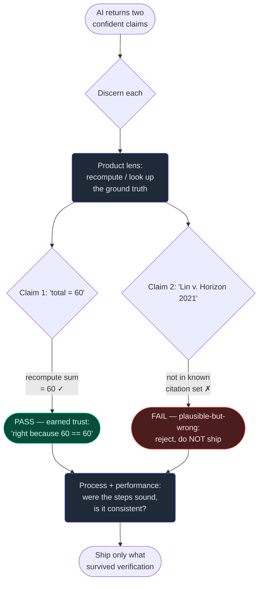

# 4. Discernment

## TL;DR

> **Discernment** is the practice of judging AI output — *and the process behind it* — critically,
> with **calibrated trust**. The core fact: an AI produces **fluent output regardless of
> correctness**, so fluency is *never evidence of truth*. The danger is the **plausible-but-wrong**
> answer (the lawyer's fake citations from Chapter 1). Apply three lenses: **product** (is the result
> correct, good, and fit for purpose?), **process** (did it reason and act sensibly — sound steps,
> right tools, no shortcuts?), and **performance** (is it behaving well *over time and across cases*,
> not just this once?). The operational test is unchanged from Chapter 1: can you say **why** it's
> right *without* saying "because the AI said so"? If not, you haven't discerned. **Verification beats
> trust** — for facts, check the primary source; for code, *run* it — and you calibrate how hard you
> look to how much it costs to be wrong.

## 1. Motivation

While building this very book, we wrote dozens of "Build It" code blocks in Scala for the
*Production Engineering* track. Each one made a confident claim: *this code compiles and prints
exactly this.* That is precisely the kind of fluent, plausible output you must not trust on sight —
the model writes valid-*looking* Scala the same way it writes a valid-looking legal citation.

So we didn't trust it. We **executed every block offline**, inside the `go-judge` sandbox with
`--network none`, and again through the live `/api/run` endpoint, and compared the real bytes of
stdout against what the prose claimed. Some blocks were perfect. Others printed something subtly
different — a trailing space, a reordered map, a number off by one — output that *read* correct and
*was* wrong. Those would have shipped a lie to a learner who pasted the snippet and got a different
result. Catching them was not luck; it was a verifier doing **product discernment**: recompute the
ground truth, compare, flag the mismatch.

We did the same with our AI *collaborators*. When a subagent returned a batch of answer blocks
(Chapter 1's loop, at scale — nine of them running in parallel for 63 chapters), we **read what they
produced** instead of rubber-stamping it: did the reasoning hold, did the markdown balance, did the
`<details>` blocks actually close? That is **process discernment** — judging not just the artifact
but whether the steps that made it were sound. Chapter 1 ended on a line worth repeating here:
*diligence is the safety net, but **discernment is the catch.*** This chapter is about the catch —
and, fittingly, it will itself be discerned: a reviewer will run the Python below and check the quiz.

## 2. Intuition (Analogy)

Discernment is **tasting the dish before it leaves the pass.**

A brilliant line cook (fast, trained, tireless — our amnesiac intern from Chapter 1) plates a dish
that *looks* immaculate. The head chef doesn't wave it through because it's pretty; pretty is how
food looks whether or not it's seasoned right. They taste it. They also glance at *how* it was made
— was the pan hot enough, were the right ingredients used, did the cook take a shortcut that'll bite
at table twelve? And over a whole service they watch whether *this station* is consistently good or
just got lucky on one plate. Looks, taste, technique, consistency: that is product, process, and
performance discernment, and it is exactly a **code reviewer** reading a pull request, or an
**editor fact-checking a brilliant-but-unreliable freelancer** who files gorgeous, confident copy
that sometimes invents a source.

The freelancer's prose is genuinely good — worth buying. *And* every factual claim is a claim to
check. The editor holds both at once. The failure mode is sliding to either extreme: publish
unread (over-trust), or distrust so totally you rewrite everything yourself (over-control, the
puppet trap from Chapter 1). Calibrated trust lives in between.

| | Rubber-stamp (over-trust) | Reject-everything (over-control) | **Discerning reviewer** |
|---|---|---|---|
| Reads fluency as | Evidence it's correct | Irrelevant — distrusts all of it | A separate axis from truth |
| On a confident claim | Ships it unread | Redoes it by hand anyway | Verifies against ground truth |
| Effort spent | ~Zero, until it bites | More than doing it yourself | **Proportional to the stakes** |
| Can answer "why right?" | "Because the AI said so" | "Because *I* redid it" | "Because I checked X against Y" |

## 3. Formal Definition

**Discernment** is *the practice of critically evaluating AI outputs and the processes that produce
them, holding calibrated trust* — neither accepting fluent output as true nor rejecting useful output
reflexively. It rests on one premise: **fluency is independent of correctness.** A language model is
optimised to produce text that *reads* right; whether it *is* right is a separate question the
fluency cannot answer. So you ask it yourself, through three lenses:

- **Product discernment** — *Is the output correct, good, and fit for purpose?* Judge the artifact
  itself: facts, code, structure, tone, against the spec and against reality.
- **Process discernment** — *Did the AI reason and act sensibly to get there?* Judge the path: sound
  steps, appropriate tools, no skipped verification, no shortcut that happens to pass *this* case.
- **Performance discernment** — *Is the system behaving well over time and across cases?* Judge the
  pattern: consistency across inputs, not a single lucky output. (This is what scales discernment to
  agents and pipelines, where you can't eyeball every run.)

| Term | Precise meaning |
|---|---|
| **Calibrated trust** | Trust scaled to evidence and stakes — neither rubber-stamp nor blanket reject |
| **Plausible-but-wrong** | Output that *reads* correct yet fails verification (e.g. fabricated citations) |
| **Ground truth** | The authoritative reference you check *against* — a primary source, a recomputed value, a real run |
| **Product / Process / Performance** | The three lenses: the artifact / the path that made it / the pattern over time |
| **Verification** | Independently re-deriving the answer (run the code, check the source) rather than believing the claim |
| **The "why" test** | Can you justify correctness *without* citing the AI's confidence? If not, you haven't discerned |

Two things make this a discipline, not a vibe. First, **discernment is active**: it is *verification*,
not a careful re-read. Reading fluent output again just exposes you to the same persuasive text. You
have to leave the text and consult ground truth. Second, it is **calibrated** — the same dial from
Chapter 1. A throwaway limerick deserves a glance; a dosage table deserves every number checked
against a primary reference. The lens stays the same; the *amount* tracks the blast radius of being
wrong.

> The operational test, restated: after the AI answers, can you say **"this is right because ___"**
> and fill the blank with *evidence you checked* — not "because the model sounded sure"? That blank is
> the whole of discernment.

## 4. Worked Example

Watch discernment run on two AI outputs that arrive with **identical confidence**. The model claims a
total, and cites a supporting case. Fluency can't separate them; verification can.



The two claims are typographically indistinguishable in confidence — both are stated as fact. The
**only** thing that separates them is the trip out to ground truth: recompute the sum (it genuinely
is 60), and check the citation against a known set (it is *not* there — it's a fabrication in the
exact shape of Chapter 1's fake cases). Product discernment caught it. Note the back-edge to *process
and performance*: even the claim that passed gets a second question — were the steps sensible, and is
this source consistently reliable, or did we just get lucky once? The next section makes this runnable.

## 5. Build It

You can't run "judgment," but you can run a **verifier** — the mechanical core of product
discernment. It takes claims an AI states with full confidence and checks each against ground truth:
recompute the number, look up the citation. One claim earns trust; one plausible claim *fails*. Run
it, then try to fool it.

```python run
# A tiny "discernment" engine: don't trust a claim because it sounds confident.
# For each claim the AI makes, we VERIFY it against ground truth and return a
# verdict + the *reason* — so we can answer "why is this right?" without
# saying "because the AI said so."

# Ground truth the verifier is allowed to consult.
NUMBERS = [12, 7, 5, 19, 3, 14]                 # the real data
KNOWN_CITATIONS = {"Dakan & Feller 2024", "Mata v. Avianca 2023"}

def verify(claim):
    """Recompute / look up the claim against ground truth. Returns (ok, reason)."""
    kind = claim["kind"]
    if kind == "sum":
        truth = sum(NUMBERS)                    # product discernment: recompute it
        ok = claim["value"] == truth
        return ok, f"recomputed sum(NUMBERS) = {truth}, claim said {claim['value']}"
    if kind == "citation":
        ok = claim["value"] in KNOWN_CITATIONS  # check the primary source set
        return ok, f"'{claim['value']}' {'is' if ok else 'is NOT'} in the known set"
    return False, "unknown claim kind — cannot verify, so do not trust"

# Two AI outputs. BOTH are stated with equal confidence. Fluency is not fooled
# by tone — only one survives verification.
claims = [
    {"kind": "sum",      "value": 60, "says": "I'm confident the total is 60."},
    {"kind": "citation", "value": "Lin v. Horizon 2021",
                         "says": "This is supported by Lin v. Horizon (2021)."},
]

shipped = 0
for c in claims:
    ok, reason = verify(c)
    badge = "PASS" if ok else "FAIL"
    print(f"[{badge}] claim: {c['says']}")
    print(f"       why  : {reason}")
    if ok:
        shipped += 1

rejected = len(claims) - shipped
print(f"\nDiscerned {len(claims)} confident claims; {shipped} earned trust, "
      f"{rejected} rejected as plausible-but-wrong.")
```

**Now try to fool it.** Change the second claim's value to `"Mata v. Avianca 2023"` — it *passes*,
because now it matches ground truth, not because it got more confident. Flip the sum claim's value to
`61` and watch a confident-but-wrong number *fail*. The verifier never reads the `says` field to
decide — only the recomputed truth. That is the whole lesson: **the badge comes from the check, not
the tone.** This is exactly how we caught off-by-one Scala output in §1, and it is exactly what a
reviewer will do to *this* file.

## 6. Trade-offs & Complexity

| Discerning the output | Trusting the output |
|---|---|
| Costs a verification step (run it, check the source) | Free — read it, ship it |
| Catches plausible-but-wrong before it ships | Catches nothing; failures are silent |
| You can justify *why* it's right | "Because the AI said so" |
| Scales to agents via *performance* checks (sample, monitor) | Breaks the instant volume or stakes rise |
| Calibrates: cheap glance for low stakes, full audit for high | One speed (none), wrong for high stakes |

The honest cost is that discernment is **work you must actually do** — and verifying *well* requires
knowing enough to recompute the truth, which is why you can't fully delegate judgment of a domain you
don't understand. There's also a calibration cost on *both* sides: over-discerning a limerick wastes
effort (and is the over-control trap), while under-discerning a dosage table is the catastrophe case.
Performance discernment adds its own wrinkle: across thousands of agent runs you *can't* check every
output, so you sample, set thresholds, and monitor — trading certainty-per-run for coverage-at-scale.
For a throwaway draft, a glance suffices. For anything you'll sign, ship, or build on, verification is
cheap insurance against a public, plausible mistake.

## 7. Edge Cases & Failure Modes

- **Fluency mistaken for truth.** The root error: "it sounds sure and well-written, so it's right."
  Antidote: treat confidence as *content*, not *evidence* — verify regardless of tone, *especially*
  when the answer is exactly what you hoped for.
- **Re-reading instead of verifying.** Reading the fluent output a second time just re-exposes you to
  the same persuasive text. Antidote: leave the text — recompute, run the code, open the primary source.
- **Product check, no process check.** The answer is right *this time* but the path was unsound (a
  shortcut, a wrong tool, a fluke). It'll fail the next case. Antidote: judge the steps, not only the
  artifact.
- **One-shot performance illusion.** It worked once, so you assume it always will — then deploy it
  across a thousand inputs. Antidote: sample and monitor *over* cases before trusting at scale.
- **Over-control (verifying everything equally).** Auditing a birthday limerick as hard as a medical
  dose — slow, and a misuse of attention. Antidote: calibrate the dial to the blast radius.
- **Rubber-stamping a subagent.** Accepting another agent's output because *it's* an AI and seemed
  thorough. Antidote: read what it returned (as we did with the 63-chapter answer blocks) — discernment
  doesn't get a pass just because the producer was also a machine.

## 8. Practice

> **Exercise 1 — Name the lens.** For each check, say whether it is **product**, **process**, or
> **performance** discernment, and why: (a) you run an AI-written function and compare its output to a
> hand-computed expected value; (b) you read the agent's transcript and notice it answered without ever
> opening the file it claimed to summarise; (c) over a week of an AI hint-bot's answers, you track that
> 4% are factually wrong and rising.

<details>
<summary><strong>Answer</strong></summary>

Map each to the §3 definition — *artifact, path, or pattern*:

- **(a) Product.** You're judging the *artifact itself* — does the result match ground truth? Running
  the function and comparing to an independently computed value is verification of the output, the
  purest product check (and exactly what the Build-It verifier does).
- **(b) Process.** The output might even be right by luck, but the *path was unsound*: it skipped the
  step (reading the file) that the task depended on. Judging "were the steps sensible, were the right
  tools used" is process discernment — a summary produced without reading the source can't be trusted
  even if it happens to be plausible.
- **(c) Performance.** No single output is in view; you're judging the *pattern over time and across
  cases*. A rising error rate is a system-behaviour signal you only see by monitoring many runs — the
  lens that scales discernment to agents you can't eyeball one-by-one.

The point of three lenses is that an output can pass one and fail another: a result that's correct
this once (product ✓) can still come from a broken process (✗) that degrades over time (✗).

</details>

> **Exercise 2 — Pass the "why" test.** A teammate says, "The model gave me this regex and it looks
> right, so I merged it." Rewrite their justification so it would satisfy the discernment test from the
> TL;DR — and name the concrete action that makes the new justification *true*.

<details>
<summary><strong>Answer</strong></summary>

The original fails the test because the only evidence offered is *"it looks right"* — fluency, not
verification. "Because the AI said so" in disguise.

A passing justification cites **evidence you checked**, which means you must *do the check* first:

> "This regex is right because I **ran it against a table of inputs** — including the tricky cases
> (empty string, unicode, a string that should *not* match) — and every result matched what I expected.
> Here's the test."

The concrete action is **executing it on real inputs (especially adversarial ones) and comparing to
expected output** — for code, discernment means *run it*, exactly as we byte-verified the Scala blocks.
"Looks right" inspects the text; the test inspects reality. Only the second can fill the blank in
"this is right because ___" without naming the AI's confidence.

</details>

> **Exercise 3 — Calibrate the verifier.** You get two AI outputs: (a) a suggested commit message for
> a personal toy repo, and (b) a SQL migration that will run against the production users table.
> Describe how much discernment — and which lenses — each deserves, and state the principle that decides.

<details>
<summary><strong>Answer</strong></summary>

The deciding principle is **calibrated trust: scale rigour to the blast radius of being wrong** — the
same dial as Chapter 1, applied to *checking* rather than describing.

- **(a) Commit message — light touch.** Product only, and barely: skim it, confirm it's not nonsense.
  A wrong commit message costs a `git commit --amend`. Auditing it across "performance" or tracing its
  "process" would be over-control — effort wildly out of proportion to the harm.
- **(b) Production migration — maximum rigour, all three lenses.** *Product*: read the SQL line by
  line; does it do exactly what's intended? *Process*: did it wrap in a transaction, is it reversible,
  was it tested on a copy first, or did it take a shortcut? *Performance*: run it against a staging
  clone of real data and watch behaviour before it ever touches production. A plausible-but-wrong
  migration is the catastrophe case — silent data loss at scale.

Same tool, same three lenses, *orders-of-magnitude* different amounts of discernment — because the
cost of a missed error differs by orders of magnitude. Discernment isn't a fixed ritual; it's a dial
you turn up as the stakes rise.

</details>

```quiz
{
  "prompt": "You ask Claude for a fact and it answers fluently and confidently. What does that confidence tell you about whether the answer is correct?",
  "input": "Choose one:",
  "options": [
    "Nothing — fluency is produced regardless of correctness, so you must verify the claim against ground truth before trusting it",
    "It is correct, because a model only sounds confident when it has strong evidence",
    "It is probably correct; confident phrasing is a reliable proxy for accuracy",
    "It cannot be judged at all, so the only safe move is to reject every AI answer"
  ],
  "answer": "Nothing — fluency is produced regardless of correctness, so you must verify the claim against ground truth before trusting it"
}
```

## In the Wild

- **[Anthropic — AI Fluency: Frameworks & Foundations](https://anthropic.skilljar.com/)** — the
  source course for the 4 D's (Dakan & Feller); Discernment is the third practice, with the product /
  process / performance lenses used here.
- **[Mata v. Avianca (2023) — the fake-citations sanction](https://www.courtlistener.com/docket/63107798/mata-v-avianca-inc/)**
  — the canonical "plausible-but-wrong" failure: fluent, confident, fabricated. The exact case our
  Build-It verifier rejects, dramatised in a courtroom.
- **[Anthropic — Claude's extended thinking & "show your work"](https://docs.anthropic.com/en/docs/build-with-claude/extended-thinking)**
  — surfacing the model's reasoning is what makes *process* discernment possible: you can judge the
  steps, not just the final artifact.

---

**Next:** discernment tells you *whether* the output is good; the fourth D asks who's
**responsible** for it — verification, honesty about AI's role, and avoiding harm before you ship. →
[5. Diligence](/cortex/the-claude-stack/ai-fluency/diligence)
