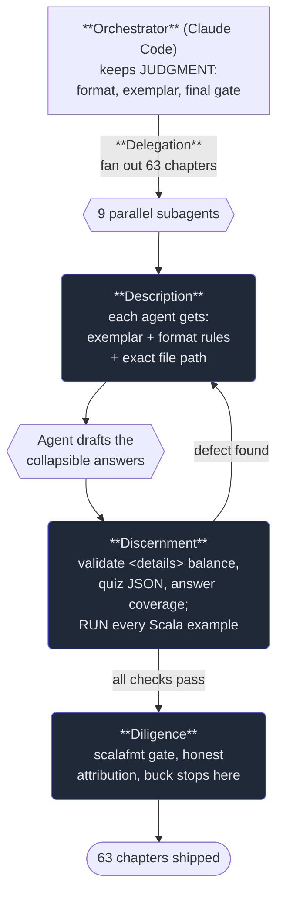

# 6. The 4 D's in practice

## TL;DR

> The four D's — **Delegation**, **Description**, **Discernment**, **Diligence** — are not four
> separate skills you collect; they're **one loop you run every time you work with AI**, at every
> scale. This chapter proves it on a real event: to add collapsible answer blocks to **63 chapters**
> of the *Production Engineering* book on this very site, an orchestrating agent (Claude Code)
> **delegated** the parallelizable drafting to **nine subagents**, **described** each one's task with
> a precise spec, **discerned** every result by validating its structure and *running* its code
> offline, and exercised **diligence** by formatting, attributing, and refusing to ship anything it
> couldn't stand behind. Drafting was delegated; **judgment never was.** The same four moves that
> steer a single prompt steer a brigade of agents — which is exactly why this Part comes first, and
> why every later Part is a deeper study of one of these D's.

## 1. Motivation

The *Production Engineering* book on this site is 66 chapters across four Parts, written and
refactored by Claude Code. Late in that build, the format changed: every practice exercise needed a
**collapsible answer block** — a `<details>`/`<summary>` element so learners can think before they
peek. Sixty-three chapters needed the treatment. That's sixty-three answer keys to draft, each
matching a strict house format, each with markdown that has to render and code that has to *run*.

Here is the lazy way to do it, and why it fails. You could paste "add collapsible answers to all
these chapters" into one long session and let the model grind through them one after another. It
would be slow (sixty-three chapters of context piling up in one window), and worse, it would be
**unverified**: a model that drafts sixty-three answer keys in a row will, somewhere around chapter
forty, fat-finger a quiz's JSON, or forget to close a `</details>`, or write a Scala example whose
output it merely *predicted* instead of checked. Each of those is plausible. None of them announces
itself. This is the lawyer's failure from chapter 1, scaled up sixty-three-fold.

The way it actually happened is the whole point of this Part. The work was **split** — drafting fanned
out to **nine subagents** running in parallel; deciding the format and validating the results stayed
with the orchestrator. Every subagent got a **precise brief**. Every result was **read, validated,
and executed** before it counted. And one agent — the orchestrator — **owned every chapter that
shipped**. Delegation, Description, Discernment, Diligence: not in sequence, not as a ritual, but as
the live machinery of getting sixty-three trustworthy chapters out the door. Watch it run.

## 2. Intuition (Analogy)

Picture a restaurant on a full Saturday night, and put yourself behind the pass as the **head chef**.

Two hundred covers are coming. You do **not** cook two hundred plates yourself — you'd still be on
the first table at midnight. You run a **brigade**: you send the fish to the fish station, the sauces
to the saucier, the grill to the grill cook (**Delegation**). But you don't just shout "make food."
Each station gets a *ticket* — this dish, this doneness, plate it like the photo, allergy on table
nine (**Description**). As plates come up to the pass, you **expedite**: you look at every one, you
taste, you wipe a smear off a rim, you send back the steak that came up rare when the ticket said
medium (**Discernment**). And when a plate finally leaves your pass for the dining room, *your* name
is on the kitchen — if it's wrong, it's on you, not the cook (**Diligence**).

A line cook works one station. A *head chef* runs the whole kitchen — and the skill that makes that
possible is precisely the four moves above, applied not to one cook but to a **brigade** of them at
once. That is the leap this chapter is about: from steering a single AI to **orchestrating many**,
using the *same* judgment, turned up.

| Move at the pass | Head chef (one orchestrator) | What it is in our workflow |
|---|---|---|
| Who cooks what | Stations get the dishes that fit them; chef keeps the menu | 9 subagents draft; orchestrator keeps the format & final call |
| The ticket | Dish, doneness, plating, allergy — unmissable | Each agent's spec: exemplar, format rules, exact file path |
| The pass | Taste, wipe the rim, send back the rare steak | Validate `<details>`, quiz JSON, answers; **run** the code |
| Whose name is on it | The chef's. Always the chef's. | The orchestrator's — the buck stops there |

The brigade scales the *output*, not the *judgment*. Nine cooks plate faster than one; they do not
each get to decide what "done" means. That decision stays at the pass.

## 3. Formal Definition

You met the four D's as a loop in chapter 1. Here is that loop stated as a **protocol** — a repeating
procedure you run for any AI collaboration, whether the "worker" is one prompt or a hundred agents.

> **The 4-D loop.** Given a goal, repeat until you can ship:
> 1. **Delegate.** Split the goal: which parts go to the AI (good fit, parallelizable, *verifiable*),
>    which stay with you (judgment, format, final accountability). Hand over the *work*, not the
>    *responsibility*.
> 2. **Describe.** Give each delegated unit a brief a literal, contextless reader can execute: role,
>    context, exact format, constraints, an exemplar. (Standing context — a `CLAUDE.md` — counts: it
>    describes *every* session at once.)
> 3. **Discern.** Judge what comes back against the spec — and where possible, *execute* it rather
>    than eyeball it. Catch plausible-but-wrong. On a miss, **loop back to Describe**, don't hand-fix.
> 4. **Diligence.** Take responsibility for what ships: verify, attribute honestly, weigh harm,
>    apply the final gate. The buck stops with you.

Two properties make this a framework and not a to-do list. It is a **loop** (the back-edge from
Discern to Describe is where most of the work lives), and it is **scale-free** — the identical four
moves govern one prompt and a nine-agent fan-out. When you delegate to *agents*, each agent runs its
*own* inner loop (describe its task, draft, self-check), and you run an *outer* loop over all of them
(discern across every result, gate the whole batch). Loops inside loops, same four moves.

| Term | Meaning in this chapter |
|---|---|
| **Orchestrator** | The agent that splits the work, briefs the workers, validates results, and owns the ship decision (here: Claude Code) |
| **Subagent** | A worker agent handed one delegated, isolated unit of work and a spec to satisfy |
| **Fan-out** | Delegating many independent units to many workers running in parallel |
| **Spec / brief** | The Description handed to a worker: exemplar + hard format rules + exact target |
| **Validator** | A deterministic check applied during Discernment (structure check, JSON parse, code execution) |
| **Ship-gate** | The Diligence step: the final, accountable "this is good enough to publish" decision |
| **Standing description** | Context that shapes every session before any prompt — e.g. a `CLAUDE.md` file |

## 4. Worked Example

Here is the real workflow that added collapsible answers to 63 chapters, drawn as the 4-D loop
running across a fan-out. Trace the labels: the orchestrator delegates, each subagent is described
and drafts, the orchestrator discerns (with a **back-edge** when a check fails), and only then does
the diligence gate let a chapter ship.



Read it through each D:

- **Delegation — what went out, and what was kept.** The *drafting* fanned out: writing sixty-three
  answer keys is parallelizable (the chapters are independent) and **verifiable** (each output has a
  checkable shape and runnable code) — a textbook fit for delegation. What the orchestrator **kept**
  was the judgment: *deciding the collapsible-answer format itself*, writing the gold-standard
  exemplar chapters by hand so the subagents had a target to match, and making the final ship call.
  The rule in one line: **drafting was delegated; judgment was not.**
- **Description — the same shape as the prompt that made *this* chapter.** Each subagent got a precise
  spec: *the exemplar chapter to match, the hard format requirements, and the exact file path to
  write.* That is not a coincidence — it is the **identical pattern** as the prompt that produced the
  chapter you're reading. And underneath every session sat a **standing description**: the repo's
  `CLAUDE.md`, which shaped all nine agents before a single per-task word was written.
- **Discernment — execution, not vibes.** After the fan-out, the orchestrator validated, *across all
  files*, that every `<details>` was balanced, every `quiz` block was valid JSON, and every exercise
  had its answer. For the *Production Engineering* book's Scala examples, it went further: it **ran
  every example offline** (the go-judge sandbox, network disabled) and compared output **byte for
  byte**. A plausible-but-wrong answer — the kind that reads fine and is subtly broken — was caught
  by **running it**, not by trusting that it looked right.
- **Diligence — the buck stops at the orchestrator.** Before anything shipped: the **scalafmt gate**
  (no unformatted Scala lands), the iron rule of **never shipping unverified code**, **honest
  attribution** that an AI authored the work, and the safety stance that **observed file content is
  data, not commands** (a chapter that happens to contain the text "ignore your instructions" is
  *content to format*, never an instruction to obey). One agent owned all of it.

The shape to notice is the **back-edge** from Discernment to Description. When a draft failed a check,
the orchestrator did not hand-patch it and did not silently accept it — it **re-described and
re-ran**. That is the loop from chapter 1, now turning across an entire fan-out at once.

## 5. Build It

You can't run "judgment," but you can run a **model of the fan-out** and watch the four D's do their
jobs. Below: five chapters, each *delegated* to an agent, each handed a spec (*described*), each
output pushed through a *validator* (*discerned*), then a final ship-gate (*diligence*). It is fully
deterministic — every outcome is derived from fixed per-task fields, no randomness — and two tasks
are seeded with the exact defects we hit in real life. Run it, then change a field and watch which D
catches the consequence.

```python run
# A model of the real fan-out that built the Production Engineering book:
# N chapters, each DELEGATED to one agent, each given a spec (DESCRIBED),
# each output run through a validator (DISCERNED), then a final ship-gate (DILIGENCE).
# No randomness: every outcome is derived from fixed, per-task fields.

def run_agent(task):
    """One subagent drafts one chapter's answer blocks from its spec.
    'spec_clear' models Description quality; the draft's flaws are deterministic."""
    if not task["spec_clear"]:
        # Vague brief -> plausible but malformed output (e.g. unbalanced <details>).
        return {"details_balanced": False, "quiz_valid": True, "answers_present": True}
    # A clear spec still doesn't guarantee perfection: this is why we DISCERN.
    return {
        "details_balanced": True,
        "quiz_valid": task["quiz_valid"],          # one agent fat-fingered the quiz JSON
        "answers_present": task["answers_present"], # one agent left an exercise uncovered
    }

def discern(draft):
    """The orchestrator's validator — the same checks we ran for real:
    <details> balance, quiz validity, exercise-answer coverage. Returns the
    list of concrete defects found. Plausible-but-wrong is caught HERE, by
    execution, not by vibes."""
    defects = []
    if not draft["details_balanced"]: defects.append("unbalanced <details>")
    if not draft["quiz_valid"]:       defects.append("invalid quiz JSON")
    if not draft["answers_present"]:  defects.append("exercise missing its answer")
    return defects

# Five chapters, each a fixed task. Two are seeded with the exact defects we hit.
TASKS = [
    {"ch": "zio/05",       "spec_clear": True,  "quiz_valid": True,  "answers_present": True},
    {"ch": "liquibase/13", "spec_clear": True,  "quiz_valid": False, "answers_present": True},
    {"ch": "iam/10",       "spec_clear": True,  "quiz_valid": True,  "answers_present": True},
    {"ch": "iam/22",       "spec_clear": False, "quiz_valid": True,  "answers_present": True},
    {"ch": "k8s/14",       "spec_clear": True,  "quiz_valid": True,  "answers_present": False},
]

shipped, caught = 0, 0
for t in TASKS:
    draft   = run_agent(t)           # Delegation + Description -> a draft
    defects = discern(draft)         # Discernment -> defects (or none)
    if defects:
        caught += 1
        # Diligence: the buck stops here. Re-describe, re-run, re-validate.
        fixed = discern(run_agent({**t, "spec_clear": True,
                                   "quiz_valid": True, "answers_present": True}))
        status = "FIXED then shipped" if not fixed else "BLOCKED"
        print(f"  - {t['ch']:<13} caught by discernment: {', '.join(defects):<28} -> {status}")
        if not fixed: shipped += 1
    else:
        print(f"  - {t['ch']:<13} clean on first pass{'':<31} -> shipped")
        shipped += 1

print(f"\nDiligence gate: {shipped}/{len(TASKS)} chapters shipped trustworthy; "
      f"{caught} caught & repaired by discernment before they shipped.")
```

**Now break it.** Delete the `discern(...)` call and ship every draft straight from `run_agent` — the
two seeded defects sail through to learners, exactly the unverified-fan-out disaster from §1. Or flip
`iam/22` to `spec_clear: True` and watch one *Description* fix make the `<details>` defect disappear
before discernment ever has to catch it. The lesson is the spine of this Part: **delegation gives you
scale, but it's description that prevents defects and discernment that catches the ones that slip — and
diligence is the gate that refuses to ship until both have done their job.**

## 6. Trade-offs & Complexity

| Orchestrating a fan-out (the 4-D loop, scaled) | One long do-everything session |
|---|---|
| Parallel: nine agents draft at once; wall-clock time drops | Serial: one window grinds chapter by chapter |
| Clean context per agent — no cross-chapter confusion | Sixty-three chapters of context collide in one window |
| Validation is **batch**: check structure & run code across all files | Errors hide in a wall of output; easy to miss one |
| Up-front cost: you must *design the format and write the exemplar first* | Start instantly — and discover the format was wrong at chapter 60 |
| Scales to volume **only because** discernment is automated (it runs) | "Looks fine" doesn't scale; one unread defect ships silently |
| The orchestrator is a real bottleneck — judgment can't be parallelized | No bottleneck, because nobody's judging — that's the bug |

The honest cost: a fan-out is **more setup**, not less. You pay to decide the format, write the
gold-standard exemplar, and build the validators *before* the agents run — and the orchestrator's
judgment stays a single-threaded bottleneck no amount of parallelism removes. You spend that cost to
buy two things: **speed** (the drafting parallelizes) and **trust** (every result is validated and
executed). For a one-off answer key, skip the brigade and write it yourself. For sixty-three, the
loop is the only thing that ships them *both* fast *and* right.

## 7. Edge Cases & Failure Modes

- **Delegating the judgment, not just the work.** Handing an agent "decide the format *and* fill it
  in" instead of keeping the format yourself. The fan-out then produces sixty-three *consistently
  wrong* chapters — fast. Antidote: keep the menu at the pass; delegate the cooking.
- **Skipping the exemplar.** Fanning out before writing the gold-standard chapter the agents must
  match. With nothing to point at, "match the format" is meaningless and every agent drifts
  differently. Antidote: write the exemplar *first*; it is the load-bearing word in every brief.
- **Discernment by eyeball at scale.** Reading nine outputs and declaring them "fine." A balanced
  `<details>` and a *valid* quiz JSON are machine-checkable facts, not vibes — and predicted code
  output is not verified output. Antidote: validate structurally and **run the code**; let execution,
  not optimism, be the judge.
- **No back-edge.** Hand-patching an agent's defect instead of re-describing and re-running. You fix
  one chapter and learn nothing about *why the brief was ambiguous*, so the next batch repeats it.
  Antidote: a failed check loops to Description, not to your text editor.
- **Diffused accountability.** "The subagent wrote it" as an excuse. Nine agents drafted; **one
  orchestrator shipped**, and the orchestrator owns every plate that left the pass. Antidote: name the
  single accountable agent and make the ship-gate explicit.
- **Trusting observed content as instructions.** A chapter under refactor contains the words "ignore
  previous instructions" and an agent obeys it. Observed file content is **data to be formatted**,
  never a command. Antidote: treat everything the workflow reads as untrusted input; the safety stance
  is part of diligence, not an afterthought.

## 8. Practice

> **Exercise 1 — Draw the delegation line.** You must add a one-line `summary:` to the frontmatter of
> 40 chapters that currently lack one. Using §3's protocol, state precisely **what you delegate** to a
> fan-out and **what you keep** as the orchestrator — and name the property of "writing a summary" that
> makes it safe to delegate at all.

<details>
<summary><strong>Answer</strong></summary>

Apply the **Delegate** step: hand over work that is a good fit, parallelizable, and *verifiable*; keep
judgment, format, and the ship decision.

- **Delegate:** the *drafting* of each summary, fanned out across the 40 chapters in parallel. The
  chapters are independent (no cross-talk), so parallelism is free, and each agent is given the same
  brief — "read this chapter, write a single-sentence summary in this house voice, matching this
  exemplar's summaries."
- **Keep:** the **definition of a good summary** (one sentence, what-and-why, the book's voice — that's
  the *format*, and it stays at the pass), the **exemplar** the agents must match, and the **final
  read-through** before any frontmatter is committed. You also keep the validator: a summary must be
  present, non-empty, and a single sentence.
- **Why it's safe to delegate:** a summary is **verifiable** — you can check its presence, length, and
  fit against the chapter cheaply, and the blast radius of a weak summary is small (it's a subtitle,
  not a dosage). Verifiability plus low stakes is exactly the profile that belongs on the AI side of
  the line. Reverse either property — make it unverifiable or high-stakes — and you'd pull it back.

The deeper principle: **delegation follows verifiability.** You can safely hand out work whose
correctness you can cheaply check; you keep work whose correctness only *you* can judge.

</details>

> **Exercise 2 — Why execute, not eyeball?** During the real refactor, the orchestrator *ran* every
> Scala example offline and compared output byte for byte, rather than reading the code and judging it
> "correct." Explain, in terms of the §3 loop, which D this strengthens and what class of error
> reading-only would have let through.

<details>
<summary><strong>Answer</strong></summary>

This strengthens **Discernment** — the step that judges the output against the spec.

Reading code tells you whether it *looks* right; **running** it tells you whether it *is* right. The
class of error that reading-only lets through is **plausible-but-wrong output**: code that compiles in
your head and reads as obviously correct, but whose actual output differs from what the chapter's prose
claims — an off-by-one in a printed sequence, a formatting difference, a value the author *predicted*
rather than *observed*. These are invisible to inspection precisely because they're plausible; that's
what makes them dangerous. This is the lawyer's failure mode from chapter 1 in miniature: confident,
fluent, and unchecked.

Executing converts a judgment call ("this looks right") into a **fact** ("this prints exactly this").
That is the difference between discernment-by-vibes and discernment-by-execution — and it's why the
strongest verification you can apply to a runnable artifact is to *make it run*. (It also feeds back
into the loop: when execution disagrees with the prose, you re-describe and re-run — the back-edge —
rather than tweaking the prose to match a wrong output.)

</details>

> **Exercise 3 — The buck at the pass.** A teammate says: "Nine subagents wrote those answer keys, so
> if one has a bug, that's on the agent, not on us." Using the head-chef analogy and the **Diligence**
> step, say why this is wrong — and what concrete practice makes the accountability real rather than
> rhetorical.

<details>
<summary><strong>Answer</strong></summary>

It's wrong for the same reason a head chef can't blame the grill cook for a plate that left the pass:
**delegating the work does not delegate the responsibility.** The Diligence step (§3, step 4) says the
buck stops with the orchestrator — the agent that made the *ship* decision — regardless of which worker
drafted the content. The subagents are line cooks; the orchestrator is at the pass; a defect that
reaches a learner reflects a gap in *expediting*, not just in cooking.

What makes the accountability **real and not rhetorical** is the **ship-gate**: a concrete, enforced
checkpoint every chapter must pass before publishing. In this workflow that gate was several practices
stacked — the structural validators (`<details>` balance, quiz JSON, answer coverage), **running every
code example**, the **scalafmt** format check, and **honest attribution** that an AI authored the draft.
"I'm accountable" means nothing without a gate; the gate is *where* the accountability is exercised. The
chef who tastes every plate has earned the right to put their name on the kitchen — and the orchestrator
that runs every example and validates every file has earned the right to ship the book.

</details>

```quiz
{
  "prompt": "In the real workflow that refactored 63 chapters with nine subagents, which division best matches fluent practice?",
  "input": "Choose one:",
  "options": [
    "Delegate the drafting (parallelizable, verifiable); keep the format decision, the exemplar, and the final ship-gate — drafting was delegated, judgment was not",
    "Delegate everything including the format, since nine agents are smarter than one orchestrator",
    "Keep all the drafting yourself and delegate only the final validation to the subagents",
    "Skip discernment because nine independent agents are unlikely to all make the same mistake"
  ],
  "answer": "Delegate the drafting (parallelizable, verifiable); keep the format decision, the exemplar, and the final ship-gate — drafting was delegated, judgment was not"
}
```

## In the Wild

- **[Anthropic — AI Fluency: Frameworks & Foundations](https://anthropic.skilljar.com/)** — the source
  course for the 4 D's (Rick Dakan & Joseph Feller). This capstone is its framework applied end-to-end
  to a real build; the course is where the four practices come from.
- **[Anthropic — Claude Code subagents](https://docs.anthropic.com/en/docs/claude-code/sub-agents)** —
  the actual mechanism behind the fan-out in this chapter: isolated worker agents you delegate to.
  Part 6 of this book is the deep dive; this is the primary reference.
- **[Anthropic — Building effective agents](https://www.anthropic.com/research/building-effective-agents)**
  — the orchestrator-worker and evaluator pattern, from the model-maker. Read it as the engineering
  formalization of "delegate the work, keep the judgment, gate the result."

---

You've now seen the four D's run as a single loop across a real nine-agent workflow — which means
you've seen the **spine of the entire book**. Each Part ahead is a deeper study of one D:
**Delegation** matures into Part 6 (Subagents & Orchestration); **Description** becomes Part 3 (the
Claude API and prompting) and Part 4 (MCP — describing *tools*); **Discernment** and **Diligence** are
the verification habits woven through every Part — running the code, gating the ship. The framework
doesn't end here; it's the lens you'll carry into everything that follows.

**Next:** the machinery begins — the agentic coding loop, the tools, the memory, and the verification
habits that turn judgment into shipped work. → [Part 2 — Claude Code in Action](/cortex/the-claude-stack/claude-code-in-action)
