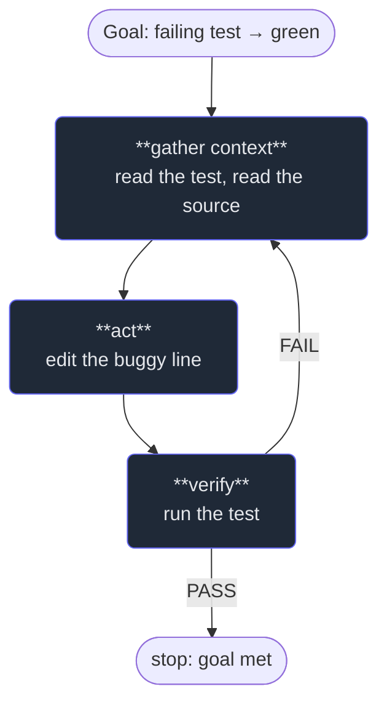

# 1. What Claude Code is

## TL;DR

> **Claude Code is a language model put in a loop, with tools, inside your project.** That's the
> whole idea. A plain chatbot can only *talk*; Claude Code can *act* — read a file, run a command,
> edit code — then look at what happened and decide the next action, over and over, until the job
> is done. The repeating cycle is **gather context → act → verify**, and the model choosing its own
> next step each turn is what makes it an *agent* rather than autocomplete. Everything else in this
> Part — memory, permissions, hooks, skills — is machinery bolted onto that one loop to make it
> safe, repeatable, and powerful.

## 1. Motivation

Last week, on this very site, someone needed ten code examples translated from Python to Scala —
not just translated, but *proven correct*: each had to compile and print byte-for-byte the right
output in a locked-down sandbox. Autocomplete can't do that. It can suggest the next line; it cannot
read a chapter, understand the concept, write idiomatic Scala, run it in a sandbox, compare the
output to what the prose claims, fix it if it's wrong, splice the working code back into the file,
and then validate the whole document — *ten times, mostly unattended.*

But an **agent** can, because an agent works in a loop. It read the first chapter (gather context),
wrote a Scala version and executed it (act), saw the output didn't match (verify), adjusted, ran it
again (loop), and only when the sandbox said *Accepted* did it move on. Then it did the same for
chapter two. The human set the goal and checked the result; the agent did the dozens of small
read-act-verify steps in between.

That is the entire difference between a chatbot and Claude Code, and it's worth stating plainly
because the marketing obscures it: **the magic isn't a smarter model — it's the loop.** A model that
can act, observe the consequences, and decide what to do next is categorically more useful than one
that can only produce text, even if the underlying intelligence is identical. (How do we know the
story is true? It's in this repo's history. The agent that did it is the one that wrote this
chapter.)

## 2. Intuition (Analogy)

Remember the **brilliant amnesiac intern** from Part 1? Until now they could only *advise* — you'd
describe a problem and they'd tell you what they'd do. Claude Code is the same intern, but now
**they have hands and a workbench**: a terminal, your files, your test runner. You still set the
task and sign off on the result, but they can actually go and *do* it — and crucially, they can
**check their own work** by running the tests, instead of handing you something untested and hoping.

Contrast three things people lazily lump together:

| | Plain chatbot | Autocomplete (e.g. tab-suggest) | **Coding agent (Claude Code)** |
|---|---|---|---|
| What it produces | Text in a chat | The next few tokens, inline | **Actions**: reads, edits, commands |
| Scope | One reply | One line/block | A whole **task** |
| Multi-step? | No | No | **Yes — it loops** |
| Can it run things? | No | No | **Yes** (tools) |
| Checks its own work? | No | No | **Yes** (runs tests, re-reads) |
| You stay responsible? | Yes | Yes | **Yes** (Part 1's diligence) |

Autocomplete finishes your sentence. An agent takes your *ticket*. Both are useful; they are not the
same tool, and confusing them is why people are either underwhelmed ("it's just fancy autocomplete")
or reckless ("it can do anything, ship it"). It is neither.

## 3. Formal Definition

An **agent**, in this precise sense, is three things wired together:

1. A **language model** — the reasoning core that, given everything it currently knows, proposes a
   next step in words.
2. A set of **tools** — concrete actions it can request: *read this file*, *run this command*,
   *edit these lines*, *search for this pattern*. Each tool has a name and inputs.
3. A **loop** (run by the **harness**, not the model) — the model proposes a tool call; the harness
   *executes* it; the result is appended to the model's context; the model proposes again; repeat
   until the model declares the task done or a limit is hit.

| Term | Meaning |
|---|---|
| **Context** | Everything the model can currently "see" — your prompt, files it has read, prior tool results. Its working memory. |
| **Tool** | A named action with inputs/outputs the model can invoke (Read, Edit, Bash, Grep, …). |
| **Tool call** | The model's request to run a tool, e.g. `Read{file: "Main.scala"}`. |
| **Harness** | The program (Claude Code) that runs the loop: it executes tool calls and feeds results back. The model never touches your disk directly — the harness does, under rules. |
| **Turn** | One pass of the loop: model proposes → harness executes → result returns to the model. |
| **Agentic** | The defining property: *the model chooses the next action itself*, rather than following a fixed script. |

> The one sentence to keep: **an agent is a model that can take actions and see their results, in a
> loop, until a goal is met.** Claude Code is that, specialised for software, living in your terminal.

The loop is also why the model's two oldest weaknesses matter less here. It can't *know* your
codebase — so it **reads** it (gather context). It can't be *sure* its edit is right — so it **runs**
it (verify). Acting and observing turn a static predictor into something that can ground itself in
your actual project, file by file, command by command.

## 4. Worked Example — one task, one loop

Take the smallest honest task: *"make the failing test pass."* Watch the loop turn.



Three things to notice. **The back-edge** (FAIL → gather again) is the loop — the agent doesn't
give up or guess blindly; it re-reads and tries again, exactly like the discern→re-describe edge
from Part 1. **Verification is a node, not an afterthought** — "run the test" is a step the agent
*takes*, which is why an agent can be trusted with things autocomplete can't. And **the human is the
bookends**: you set the goal and accept the result; the agent owns the middle. That shape — human
goal, agent loop, human sign-off — is the template for everything in this Part.

## 5. Build It

You can't run a real LLM here, but the loop isn't the LLM — it's the *structure around* it. Run this
miniature agent: a fixed "policy" stands in for the model, real "tools" change a tiny world, and the
loop runs until a planted bug is fixed and the test goes green.

```python run
def model(seen, fixed):
    """Policy: pick the next tool from what we've observed. A real agent puts an LLM here."""
    if "TEST" not in seen:   return "read_test"
    if "SOURCE" not in seen: return "read_source"
    if not fixed:            return "edit"
    return "run_test"

def harness(action, world):
    """Execute the chosen tool; return an observation and the (maybe changed) world."""
    if action == "read_test":   return "TEST: add(2,3) must equal 5", world
    if action == "read_source": return f"SOURCE: return a {world['op']} b", world
    if action == "edit":        return "edited: '-' -> '+'", {**world, "op": "+"}
    return ("run_test: PASS" if world["op"] == "+" else "run_test: FAIL"), world

world = {"op": "-"}    # a planted bug: add() subtracts instead of adds
seen = []
for step in range(1, 7):
    fixed = world["op"] == "+"
    action = model(" ".join(seen), fixed)
    obs, world = harness(action, world)
    seen.append(obs)
    print(f"step {step}: {action:11} -> {obs}")
    if obs == "run_test: PASS":
        print("goal met: the test is green. The agent stops.")
        break
```

**Now break it.** Start with `world = {"op": "+"}` (no bug): the agent reads, sees the test already
passes on the first `run_test`, and stops in fewer steps — it doesn't edit code that's already
correct, because the *policy reacts to observations*, it doesn't follow a fixed script. That
reactivity is the whole point of "agentic": swap the fixed `model` for a real language model and you
have Claude Code. The loop is identical; only the policy got smarter.

## 6. Trade-offs & Complexity

| Coding agent | Autocomplete | Doing it by hand |
|---|---|---|
| Whole tasks, multi-step, self-checking | Fast, safe, tiny scope | Full control, full effort |
| Can act wrongly — needs guardrails | Can't really hurt anything | Slow at scale, but you learn it |
| Best for well-specified, verifiable work | Best for in-the-flow typing | Best for the irreversible/subtle |
| You must *verify* (it can be confidently wrong) | Low stakes | You are the verification |

The cost of an agent is exactly its power: because it *acts*, a bad action has consequences a
chatbot's bad sentence never could. That's why the rest of this Part exists — permissions, hooks,
plan mode, the verify loop are all answers to "the agent can act, so how do we make that safe?" The
benefit is leverage: a fluent operator can hand an agent a verifiable task and get a correct,
checked result while they think about the next thing.

## 7. Edge Cases & Failure Modes

- **Acting without verifying.** The single most common failure: the agent edits, declares victory,
  and never runs anything. Antidote: the verify node must actually fire (Chapter 7).
- **Context rot.** Too much irrelevant material in the window crowds out what matters; the agent
  "forgets" the goal. Antidote: focused context, subagents (Chapter 8, Part 6).
- **Runaway loops.** The agent retries the same failing action forever. Antidote: step limits, and a
  policy that *changes* approach on repeated failure.
- **Hallucinated paths/APIs.** It references a file or function that doesn't exist. Antidote: it
  should *read* before it writes — gather context is step one for a reason.
- **Over-broad permission.** An agent allowed to run anything can do real damage from one bad call.
  Antidote: the permission model (Chapter 3).
- **Trusting the demo.** It worked once on a clean repo; that's not evidence it's reliable. Antidote:
  Part 1's discernment — judge the *process*, not just the lucky outcome.

## 8. Practice

> **Exercise 1 — Name the loop.** A colleague says "Claude Code is just autocomplete with extra
> steps." Using the §3 definition, give the one capability that makes the comparison wrong, and name
> the three phases of the loop that capability enables.

<details>
<summary><strong>Answer</strong></summary>

The missing capability is **acting and observing**: autocomplete only *emits text*, whereas an agent
can *invoke tools, see their results, and choose the next action* (§3). That single difference —
a model in a loop with tools — is categorical, not "extra steps."

The three phases it enables (§1, §4):

1. **Gather context** — read the files/tests/output relevant to the goal (an agent grounds itself in
   your actual repo instead of guessing).
2. **Act** — make a change or run a command via a tool.
3. **Verify** — run the test/build and observe whether the goal is met; if not, loop back.

Autocomplete has none of these — it can't read your test, can't run it, can't react to a failure. So
"autocomplete with extra steps" gets it backwards: the steps *are* the thing; autocomplete is the
degenerate case with the loop removed.

</details>

> **Exercise 2 — Where does the disk live?** In the §3 model, the language model never writes to your
> files directly — the *harness* does. Why is that separation the foundation of everything in the
> rest of this Part?

<details>
<summary><strong>Answer</strong></summary>

Because the model only ever *proposes* a tool call (e.g. `Edit{…}`); the **harness** decides whether
and how to execute it against your real disk (§3). That seam is the control point.

If the model wrote to disk directly, there'd be nowhere to stand between intent and effect — no way
to ask permission, log, or block. Because the harness is in the middle, you can insert:

- **Permissions** (Chapter 3): the harness can refuse or ask before running a proposed action.
- **Hooks** (Chapter 4): the harness can run *your* deterministic code before/after an action.
- **Plan mode** (Chapter 6): the harness can let the model think while forbidding all writes.

All of those are only possible because *the model never touches the disk; the harness does, under
rules.* The separation is exactly what makes an acting agent safe to keep around — it turns "the AI
did something" into "the AI requested something and the harness, under your rules, allowed it."

</details>

> **Exercise 3 — Reactive vs scripted.** In the Build It model, why does starting with `op = "+"`
> (no bug) make the agent stop in fewer steps without changing a single line of the loop? What
> property of real agents does that illustrate?

<details>
<summary><strong>Answer</strong></summary>

Because the `model` policy is **reactive** — it chooses the next action from the *observations so
far*, not from a fixed list of steps (§5). With `op = "+"`, the very first `run_test` observes
`PASS`, the stop-condition fires, and the agent halts — it never reaches the `edit` branch, because
`edit` is only chosen when the code isn't already fixed.

The property this illustrates is **agency** (§3): the loop is the same, but behaviour adapts to what
the world actually says. A *scripted* automation ("read, edit, test") would blindly edit correct
code; the agent doesn't, because each step is a decision conditioned on reality. Swap the toy policy
for a real language model and you have Claude Code: same reactive loop, a vastly smarter policy
choosing the actions.

</details>

```quiz
{
  "prompt": "What single property most distinguishes a coding agent like Claude Code from autocomplete?",
  "input": "Choose one:",
  "options": [
    "It runs a loop where it can take actions (read/edit/run), observe the results, and choose the next action until the goal is met",
    "It uses a larger language model with more parameters",
    "It produces longer and more detailed text responses",
    "It memorizes your entire codebase before answering"
  ],
  "answer": "It runs a loop where it can take actions (read/edit/run), observe the results, and choose the next action until the goal is met"
}
```

## In the Wild

- **[Anthropic — Building effective agents](https://www.anthropic.com/engineering/building-effective-agents)**
  — the foundational essay on what an "agent" is (a model using tools in a loop) and when you do and
  don't need one. The conceptual backbone of this chapter.
- **[Claude Code documentation](https://docs.claude.com/en/docs/claude-code/overview)** — the actual
  tool: install it, run it, and watch the loop you just modelled run for real.
- **[Claude Code — common workflows](https://docs.claude.com/en/docs/claude-code/common-workflows)**
  — concrete tasks (fix a bug, add a feature, refactor) that show the gather→act→verify loop in
  practice.

---

**Next:** the intern still wakes up with no memory of yesterday. How does an agent remember your
project — its conventions, its quirks, the things you'd otherwise repeat every session? →
[2. The CLAUDE.md memory](/cortex/the-claude-stack/claude-code-in-action/the-claude-md-memory)
