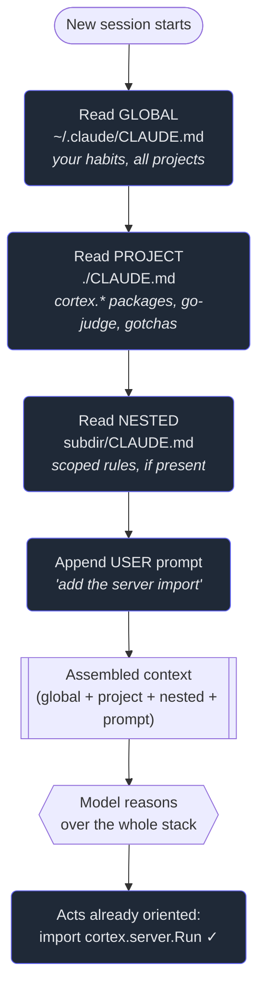

# 2. The CLAUDE.md memory

## TL;DR

> A language model is **stateless**: when a session ends, its working memory is gone, and the next
> session starts blank — the *brilliant amnesiac intern* from Part 1, awake again with no memory of
> your project. **`CLAUDE.md` is the cure.** It's an ordinary, version-controlled Markdown file that
> Claude Code **auto-loads into context at the start of every session**, so your conventions, build
> commands, architecture map, and "always do X / never do Y" rules are *known* without you
> re-explaining them. It layers: a **global** file for your personal habits across all projects, a
> **project** file committed for the whole team, and **nested** files deeper in the tree. It isn't
> magic — it's just text **prepended to the model's context**, so it competes for space with
> everything else. Keep it tight, keep it true, and the intern starts every morning already
> onboarded.

## 1. Motivation

Open this repo's root `CLAUDE.md` and you'll find a line that has shaped *every* chapter of this
book. The project was renamed: its Scala packages moved from `codefolio.*` to `cortex.*`. Nothing in
a language model's training "knows" that — it's a fact local to this repo, decided last month. So the
file says it plainly, alongside the rule that the code runner is **go-judge** (not an LLM), that URLs
are prefix-free, and a whole table of "gotchas future-me will trip on."

Here is why that one file matters. The agent that wrote this book ran across **dozens of sessions**,
each a fresh process: the model wakes up with zero memory of the last one. If the conventions lived
only in a past conversation, every single morning the agent would guess `import codefolio.server.Run`
— the *old, wrong* package — and a human would have to catch it and re-explain. Multiply that by every
quirk in a real codebase (the build command, the formatting gate, "don't reintroduce `meta.json`") and
"just tell it again" collapses under its own weight.

Instead, those facts live in `CLAUDE.md`, and the agent reads them at the *start* of each session,
before it touches a thing. The rename is known, the runner is known, the gotchas are known; the human
sets a goal and the agent is already oriented. That is the entire point of this chapter: **statelessness
is the disease, and an external, auto-loaded memory file is the cure.**

## 2. Intuition (Analogy)

Picture a workshop staffed by interns who are brilliant with their hands but **forget everything
overnight**. Tomorrow a different shift arrives — sharp, capable, and completely new to your bench.
How do you make sure every shift cuts to the same tolerances, uses the right glue, and never touches
the one jig that's calibrated?

You don't re-train them each morning. You tape an **operating-notes card to the wall**: *"Stock is
metric. Always dry-fit before glue. Never run the saw without the guard."* Every shift reads the card
first, so every shift works to the same conventions — even though no one remembers writing it.
`CLAUDE.md` is that card. It's also a **new-employee onboarding handbook** that the amnesiac re-reads
each morning, because for them every morning *is* their first day.

| | Human teammate | **Amnesiac intern + CLAUDE.md** |
|---|---|---|
| Carries memory between days? | Yes — learns the codebase over weeks | **No** — every session starts blank |
| How conventions persist | In their head, accumulated | **In the file**, re-read each session |
| Cost of a new convention | Mention it once, they remember | **Write it down**, or it's forgotten |
| Where the knowledge lives | Inside a person (walks out the door) | **In the repo** (versioned, shared, survives) |
| Onboarding a teammate | Weeks of pairing | **`git pull`** — they get the same handbook |

The twist that makes the file *better* than a human's memory: it's **version-controlled and shared**.
A human's hard-won knowledge of your project lives in one skull and leaves when they do. The
handbook lives in the repo — every teammate, and every fresh session of the agent, opens the *same*
card. Forgetting overnight sounds like a weakness; pushed into a committed file, it becomes a single,
auditable source of truth.

## 3. Formal Definition

A language model is a **pure function of its context**: same context in, same behaviour out. It keeps
nothing between calls — there is no hidden variable that survives a session. So any fact you want it
to *act on tomorrow* must be **re-supplied** as part of tomorrow's context. `CLAUDE.md` is the
mechanism that does the re-supplying automatically.

> **`CLAUDE.md`** is a Markdown file that the Claude Code **harness reads from disk and prepends to
> the model's context at the start of a session**, turning standing, project-specific instructions
> into part of the model's working memory — every time, with no human re-typing.

| Term | Meaning |
|---|---|
| **Stateless** | The model retains nothing between sessions; each starts from a blank slate. Statelessness is *why* an external memory is needed. |
| **Context window** | The finite space holding everything the model can see this session: system rules, `CLAUDE.md`, files read, the conversation. A budget, not infinite. |
| **Memory file** | A file the harness loads *for* you each session (`CLAUDE.md`), versus content you must paste in by hand. |
| **Global memory** | `~/.claude/CLAUDE.md` — *your* preferences across **all** projects (not committed to any repo). |
| **Project memory** | `./CLAUDE.md` at the repo root — conventions for **this** project, **committed and shared** by the team. |
| **Nested memory** | A `CLAUDE.md` inside a subdirectory — scoped rules for that part of the tree, layered on top. |
| **Layering** | The files combine: global → project → nested, all prepended. More specific files refine more general ones. |

Three properties follow from "it's just prepended text," and each is load-bearing:

1. **It's automatic, not magic.** The harness *reads a file and pastes it in* — no special reasoning
   engine, which is exactly why it's reliable: it's the plainest possible mechanism.
2. **It competes for space.** Sharing the finite context window with everything else, a bloated file
   *crowds out* the code the agent actually needs to read. Tight beats exhaustive (§6).
3. **It must stay true.** The model *trusts* it, so a stale instruction ("the package is `codefolio.*`"
   after a rename) doesn't just fail to help — it actively **misleads** the agent, confidently.

One related layer worth naming: this project also keeps an **evolving auto-memory index** (a
`MEMORY.md` under the project's memory directory) where durable, hard-won facts accumulate across
sessions — "scalafmt before commit," "the go-judge runner," the state of this very book. `CLAUDE.md`
is the *curated, committed* memory the team agrees on; the memory index is the *growing notebook* the
agent maintains for itself. Both fight the same enemy — forgetting — from different angles.

## 4. Worked Example

What actually happens when you type a request? The harness assembles your session's context by
**layering** the memory files, then appending your prompt, then handing the whole stack to the model.



Trace it. Each layer is **read from disk** and stacked: global first (your personal defaults),
project next (this repo's committed conventions — including the `cortex.*` rename), nested last (any
subdirectory rules). Your prompt rides on top. The model never sees a "memory" abstraction — it sees
**one assembled block of text** and reasons over all of it at once.

The payoff is in the last node. Because the project layer already told it the package is `cortex.*`,
the agent writes `import cortex.server.Run` — correct on the *first* try, with no human in the loop to
catch a wrong guess. Same model, same prompt; the difference is entirely in what got prepended. That
is the mechanism the next section makes runnable.

## 5. Build It

You can't run a real LLM here, but the *mechanism* isn't the LLM — it's the **layering of context
that the harness performs before the model ever runs.** This program models exactly that: an
`assemble_context` function stacks the layers the way Claude Code does, then a toy "agent" reads its
assembled context and acts. Run it once **without** the project memory and once **with** it. Same
prompt, same toy model — only the memory layer changes, and the wrong-package mistake disappears.

```python run
def assemble_context(global_md, project_md, user_prompt):
    """Build the session's effective instructions the way the harness does:
    layer global memory, then project memory, then the user's request.
    Later layers are appended AFTER earlier ones, so they refine them."""
    layers = []
    if global_md:  layers.append(("GLOBAL  ~/.claude/CLAUDE.md", global_md))
    if project_md: layers.append(("PROJECT ./CLAUDE.md",        project_md))
    layers.append(("USER    this session's prompt",            user_prompt))
    return layers


def agent(layers):
    """A toy 'model': it scans its assembled context for a naming rule.
    Real Claude Code reasons over the same prepended text; we just look it up."""
    rules = "\n".join(text for _, text in layers)
    if "package is cortex.*" in rules:
        return "import cortex.server.Run   # followed the project convention"
    return "import codefolio.server.Run    # GUESSED from the old repo name"


GLOBAL  = "Prefer absolute paths. Never push without asking."
PROJECT = "Server package is cortex.* (renamed from codefolio). Run runs via go-judge."
PROMPT  = "Add an import for the server Run entrypoint."

print("=== WITHOUT project memory (intern woke up amnesiac) ===")
no_mem = assemble_context(GLOBAL, None, PROMPT)
for name, text in no_mem:
    print(f"  [{name}] {text}")
print("  AGENT ->", agent(no_mem))

print()
print("=== WITH project memory (CLAUDE.md auto-loaded) ===")
with_mem = assemble_context(GLOBAL, PROJECT, PROMPT)
for name, text in with_mem:
    print(f"  [{name}] {text}")
print("  AGENT ->", agent(with_mem))

print()
print("Same prompt, same model. The only change is one layer of context.")
```

**Now poke at it.** Notice the global layer (`Prefer absolute paths…`) rides along in *both* runs —
that's the personal-preferences layer, present regardless of project. The only thing that flipped the
import from the wrong `codefolio.*` to the right `cortex.*` was **one line of project memory.** That's
the whole chapter in eight printed lines: statelessness means the agent has no idea about the rename
on its own; `CLAUDE.md` is the layer that supplies the fact, every session, automatically. Swap the
toy `agent` for a real language model reasoning over the same assembled text, and you have Claude Code
reading this repo's `CLAUDE.md`.

## 6. Trade-offs & Complexity

| Put it in `CLAUDE.md` | Leave it out (paste per session) | Over-stuff `CLAUDE.md` |
|---|---|---|
| Loaded **every** session, **free** to you | You re-explain it each time, or it's forgotten | Bloats every session's context |
| Shared via git — whole team + the agent | Lives in one chat, dies with it | Crowds out the files the agent needs to read |
| Stable, slow-changing facts shine here | Fine for genuinely one-off, throwaway context | Important rules get **diluted** in noise |
| Cost: must be **kept true** (stale = harmful) | Cost: constant repetition, drift between people | Cost: you pay context budget on every turn, forever |

The core tension is **completeness versus context budget.** Every line is prepended to *every* session,
spending from the same finite window the agent needs for reading your actual code (§3). So the
discipline is the opposite of documentation instinct: **don't write everything; write the high-leverage
few** — the conventions, commands, and gotchas that change the agent's behaviour. A 2,000-line
`CLAUDE.md` is worse than a 200-line one, because the signal drowns. Aim for "what I'd tell a sharp new
hire on day one, on a single card," and **link out** to deeper docs (an ADR, a `CONTEXT.md`) rather
than inlining them.

## 7. Edge Cases & Failure Modes

- **Staleness — the worst one.** A rule that *was* true and isn't anymore (the package rename, a
  command that changed) doesn't merely fail to help; it **actively misleads** the agent, confidently.
  An out-of-date `CLAUDE.md` is more dangerous than none. Treat it like code: update it in the same
  commit as the change it describes.
- **Secrets.** `CLAUDE.md` is committed and shared. **Never** put API keys, tokens, or passwords in
  it — they'd land in git history and in every session's context. Memory is for *conventions*, not
  *credentials*.
- **Transient task state.** "Currently debugging the cache; ignore the failing test" is true for an
  hour, then rots. Standing memory is for durable facts; per-task context belongs in the prompt.
- **Bloat / dilution.** The 2,000-line file (§6): so exhaustive that the agent can't tell the
  load-bearing rules from the trivia — and it eats context every turn. Prune ruthlessly.
- **Contradiction across layers.** A nested file that conflicts with the project file (or with your
  prompt) yields ambiguous behaviour. Keep layers complementary: more specific should *refine*, not
  *fight*, more general.
- **Treating it as enforcement.** `CLAUDE.md` is *instruction*, not a *guarantee* — it's text the
  model is asked to follow, and a model can slip. Things that must be **mechanically** guaranteed
  (formatting, blocking a bad command) belong in **hooks** and **permissions** (Chapters 3–4), which
  the harness enforces deterministically. Memory persuades; hooks enforce.
- **Drift from reality.** The file claims a structure the repo no longer has. Periodically re-read it
  *as if you were new* and delete anything that's no longer true.

## 8. Practice

> **Exercise 1 — Why a file at all?** Your colleague says: "Just tell Claude the conventions at the
> start of each session — why commit a whole file?" Using the §1/§3 idea of statelessness, give the
> precise reason the file beats re-explaining, and name one thing the file gives you that a per-session
> explanation never can.

<details>
<summary><strong>Answer</strong></summary>

Because the model is **stateless** (§3): it keeps nothing between sessions, so "telling it at the
start" is something you'd do *every single session, forever* — and the moment you forget, the agent
reverts to guessing (§1, the `codefolio.*` vs `cortex.*` mistake). `CLAUDE.md` makes the harness do
that re-supplying **automatically**, every session, with zero human effort.

The thing a per-session explanation can never give you: it's **version-controlled and shared** (§2) —
one source of truth the whole team *and* every fresh session of the agent pull from via `git`. A
spoken explanation lives in one chat and dies with it. So the file isn't just "less typing"; it turns
scattered, perishable knowledge into a single auditable artifact that survives.

</details>

> **Exercise 2 — Triage four facts.** For each, say whether it belongs in `CLAUDE.md`, and why:
> (a) "the server package is `cortex.*`"; (b) the production database password; (c) "I'm mid-refactor,
> the `cache` module is temporarily broken"; (d) "format with `scalafmt` before every commit."

<details>
<summary><strong>Answer</strong></summary>

Use the test from §3/§7 — *is it a durable, shareable, non-secret convention, or does it go stale /
leak / belong in the prompt?*

- **(a) `cortex.*` package → YES.** A stable, project-specific convention the agent must act on every
  session — the canonical good case: a fact training can't know, that prevents a repeated mistake (§1).
- **(b) DB password → NO, never.** `CLAUDE.md` is committed and prepended to every session, so a secret
  here lands in git history and in context (§7, Secrets). Memory holds *conventions*, not *credentials*.
- **(c) mid-refactor / temporarily broken → NO.** **Transient task state** (§7): true for an hour, then
  it rots into a stale, misleading line. Put it in the *prompt* for the session that needs it.
- **(d) `scalafmt` before commit → YES, with a caveat.** A durable convention, so it belongs — but if
  it must be *guaranteed*, back it with a **hook** (Chapter 4): `CLAUDE.md` *asks* the model and a
  model can slip (§7, "instruction, not guarantee"); a hook makes the harness enforce it.

The throughline: durable + shareable + non-secret → memory; perishable → prompt; secret → neither;
must-be-guaranteed → also a hook.

</details>

> **Exercise 3 — Two layers, one prompt.** Your global `~/.claude/CLAUDE.md` says "prefer absolute
> paths." This repo's `./CLAUDE.md` says nothing about paths but does say the package is `cortex.*`.
> In a session here, which rules is the agent operating under, and what does that tell you about how
> the layers combine (§3, §4)?

<details>
<summary><strong>Answer</strong></summary>

**Both.** The harness **layers** the memory files (§3, §4): it prepends the global file *and* the
project file (*and* any nested one) into one assembled context, then your prompt on top. So inside
this repo the agent simultaneously follows "prefer absolute paths" (global — your habit across all
projects) **and** "the package is `cortex.*`" (project — this repo's committed convention) — exactly
as the Build It shows, where the global line rides along in *both* runs while the project line flips
the import (§5).

What it tells you: the layers are **additive and complementary, not exclusive** — general (global) and
specific (project, then nested) stack, with specific layers meant to *refine* general ones, not
replace them. That's why global is for *you across all projects* and project is for *the team on this
one*: they answer different questions, so they coexist instead of colliding. (Genuine contradiction
yields ambiguity — §7 — which is why specific layers should refine, not fight, the general ones.)

</details>

```quiz
{
  "prompt": "A teammate puts the line 'the server package is codefolio.*' in CLAUDE.md. Months later the repo is renamed and packages move to cortex.*, but nobody updates CLAUDE.md. What is the effect on the agent?",
  "input": "Choose one:",
  "options": [
    "The stale line actively misleads the agent into writing the wrong codefolio.* import, confidently — a stale memory is worse than none",
    "Nothing — the model ignores CLAUDE.md and uses its training knowledge instead",
    "The agent automatically detects the rename and corrects the file",
    "Claude Code refuses to start the session until the file is fixed"
  ],
  "answer": "The stale line actively misleads the agent into writing the wrong codefolio.* import, confidently — a stale memory is worse than none"
}
```

## Your Turn

Before you move on, check your understanding with the coach — explain the idea, apply it, weigh the trade-offs, then defend your reasoning.

<div class="concept-coach"></div>

## In the Wild

- **[Claude Code — Memory (`CLAUDE.md`)](https://docs.claude.com/en/docs/claude-code/memory)** — the
  official guide to the memory files: global vs project vs nested, how they're loaded, and how to edit
  them. The authoritative source for everything in this chapter.
- **[Claude Code settings & configuration](https://docs.claude.com/en/docs/claude-code/settings)** —
  where `CLAUDE.md` sits among the other ways you steer the agent (settings, permissions), so you can
  see what belongs in memory versus what belongs elsewhere.
- **[Anthropic — Claude Code best practices](https://www.anthropic.com/engineering/claude-code-best-practices)**
  — field-tested advice on writing a `CLAUDE.md` that earns its place: keep it tight, keep it true,
  link out to deeper docs. The §6 discipline, from the people who build the tool.

---

**Next:** memory tells the agent *what your project is*; now we need to control *what it's allowed to
do* to it. How does Claude Code decide which actions are safe to run and which need your sign-off? →
[3. Tools & permissions](/cortex/the-claude-stack/claude-code-in-action/tools-and-permissions)
