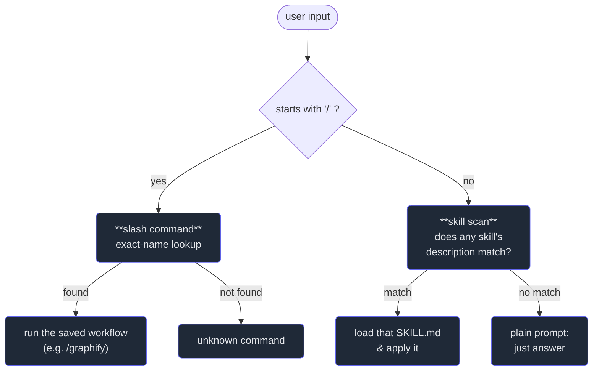

# 5. Slash commands & skills

## TL;DR

> A **slash command** and a **skill** are both *packaged know-how* you give an agent once so you
> never re-explain it — the difference is **who triggers it**. A **slash command** (`/review`,
> `/graphify`) is an explicit entry point: *you* type its name, and a saved prompt or workflow runs.
> A **skill** is packaged expertise in a folder with a `SKILL.md`; the *model* notices the task
> matches the skill's one-line description and loads the full instructions **on its own**. Commands
> are the speed-dial you press; skills are the reference binder the expert pulls off the shelf the
> moment the topic comes up. One is user-triggered and imperative; the other is model-triggered and
> contextual. This chapter is the bridge — **Part 5** is the deep dive on Skills.

## 1. Motivation

This repository wires up a skill called **graphify**. Its `SKILL.md` lives at
`~/.claude/skills/graphify/SKILL.md`, and the root `CLAUDE.md` carries one extra line: *"When the
user types `/graphify`, invoke the graphify skill before doing anything else."* That single
sentence is the whole chapter in miniature — it shows the two trigger styles side by side, pointed
at the *same* capability.

Picture the alternative. Every time you wanted a knowledge graph of a folder, you'd paste the same
half-page of instructions: detect file types, run AST extraction on code, fan out subagents for the
docs, cluster, label communities, emit the HTML and report. That half-page is *expertise* — and
re-typing expertise is exactly the waste these two features exist to kill.

So the repo packages it **twice over**. The expertise lives in `SKILL.md` (a skill the model
*discovers* when you describe a graphing task). And `/graphify` is a **command-style trigger** for
it: type four characters and the same workflow fires deterministically. Same know-how, two front
doors — one you open by *asking for it by name*, one the agent opens *because it recognised the job*.
Learn the difference and you stop re-explaining yourself to your tools.

## 2. Intuition (Analogy)

Think about how a seasoned chef works a kitchen.

Some things they do **because you ordered them** — you point at the menu, say "the risotto," and
that exact dish gets made. That's a **slash command**: a named item you select deliberately. You
press it; it runs. `/review`, `/graphify`, `/test` — speed-dial buttons, keyboard shortcuts, the
menu you order from.

Other things the chef does **without being asked**, because the dish calls for it. You never say
"deglaze the pan with white wine"; they just *know* to reach for that technique the instant the
recipe needs it. That's a **skill**: a specialist method on the shelf, pulled down the moment a
relevant topic appears. You describe the goal; the expert supplies the technique.

| | **Slash command** (`/name`) | **Skill** (a `SKILL.md` folder) |
|---|---|---|
| Who triggers it | **You** — you type the name | **The model** — it matches the task |
| Trigger style | **Explicit / deterministic** (exact name) | **Discovered / contextual** (description matches) |
| Mental model | Speed-dial, keyboard shortcut, menu order | Reference binder pulled off the shelf |
| In context until used | The command's full text | Only a one-line description (then it loads) |
| Best for | Repeated workflows *you* initiate | Expertise the agent should apply *on its own* |
| Mood | Imperative ("do this now") | Conditional ("when X comes up, do Y") |

Both package know-how so you don't re-explain it. Both extend the agent **without changing the
model**. They differ only in *who reaches for them* — and that one difference decides which to build.

## 3. Formal Definition

A **slash command** is a named, user-invoked entry point: a saved prompt or workflow bound to a
short name. Typing `/name [args]` injects that saved text (with your arguments) into the
conversation, so the agent runs a known routine instead of you re-typing it. The trigger is
**deterministic** — the name either matches or it doesn't.

A **skill** is a packaged, model-invoked capability: a folder whose `SKILL.md` begins with
frontmatter — crucially a **`description`** — followed by full instructions and (optionally) bundled
scripts and references. The agent keeps only the *description* in context. When your request matches
that description, it **loads the rest on its own** and follows it. The trigger is **contextual** —
the model decides.

The mechanism that makes skills scale is **progressive disclosure**: don't pay for what you're not
using. Only the short description sits in the model's context window; the heavy instructions load
*lazily*, the moment they become relevant — like a `graphify-out/graph.json` the agent loads only
when you actually ask a graph question.

| Term | Meaning |
|---|---|
| **Slash command** | A `/name`-triggered saved prompt/workflow. **You** fire it, by name. |
| **Skill** | A `SKILL.md` folder of expertise the **model** loads when the task matches its description. |
| **`SKILL.md`** | The skill's entry file: frontmatter (`name`, `description`, optional `trigger`) + instructions. |
| **`description`** | The one-line "when to use me" that sits in context and acts as the skill's **trigger**. |
| **Progressive disclosure** | Keep only the short description loaded; load the full body lazily when relevant. |
| **Plugin** | A distributable bundle that *ships* skills (and often commands/MCP servers) to others. |
| **Dispatch** | Choosing what fires for an input: exact-name for commands, description-match for skills. |

> The one sentence to keep: **commands are explicit and user-triggered; skills are discovered and
> model-triggered — and both are first-class ways to give an agent reusable expertise without
> touching the model itself.**

Note the `graphify` `SKILL.md` carries *both*: a `description` (its skill trigger) **and** a
`trigger: /graphify` line plus the `CLAUDE.md` instruction (its command trigger). One capability,
deliberately reachable by either door.

## 4. Worked Example — one input, two doors

Watch a single dispatcher route three inputs. The question it asks first is always the same: *does
this start with `/`?* That one check splits the two worlds.



Three things to notice. **The fork is the whole idea**: the leading `/` is a deterministic signal
that *you* chose a command, so no guessing is needed — exact-name lookup, done. **The skill branch is
where the model exercises judgment**: with no `/`, it *scans descriptions* and decides whether
anything fits — that's the "discovered, on its own" property. And **"plain prompt" is a real
outcome**: most inputs fire neither — they're just answered. Commands and skills are the *exceptions*
you've pre-packaged, not a tax on every message.

## 5. Build It

Here's that dispatcher as a tiny, deterministic **capability router**. It holds a registry of
slash-commands (exact-name dispatch) and skills (each with trigger keywords standing in for a
`description`). Given an input it either runs the matching `/command` **or** scans skills and "loads"
the one whose trigger appears in the text — and prints exactly what fired.

```python run
def make_router():
    # SLASH COMMANDS: exact-name entry points the USER fires deliberately.
    commands = {
        "review": "Run the saved code-review checklist on the current diff.",
        "graphify": "Build a knowledge graph of the given folder.",
    }
    # SKILLS: packaged expertise the MODEL reaches for when the task matches
    # the skill's trigger words. Only the short description sits in context
    # until one of these keywords appears — that's progressive disclosure.
    skills = {
        "graphify":  ["knowledge graph", "graph of", "navigable map"],
        "workbench": ["testcases", "quiz fence", "workbench", "problem page"],
    }

    def dispatch(text):
        t = text.strip()
        if t.startswith("/"):                      # explicit, user-triggered
            name = t[1:].split()[0]
            if name in commands:
                return ("command", name, commands[name])
            return ("command", name, "UNKNOWN COMMAND")
        low = t.lower()                            # discovered, model-triggered
        for name, triggers in skills.items():
            if any(k in low for k in triggers):
                return ("skill", name, "matched trigger -> load full SKILL.md")
        return ("none", "-", "plain prompt: answer directly, nothing fires")

    return dispatch


dispatch = make_router()
inputs = [
    "/review",
    "/graphify ./docs",
    "build a knowledge graph of these design docs",
    "scaffold a workbench problem page with a quiz fence",
    "what time is it in Tokyo?",
]
for text in inputs:
    kind, name, note = dispatch(text)
    print(f"{text:<48} -> {kind:<8} {name:<10} | {note}")
```

Run it and the contrast prints itself:

```
/review                                          -> command  review     | Run the saved code-review checklist on the current diff.
/graphify ./docs                                 -> command  graphify   | Build a knowledge graph of the given folder.
build a knowledge graph of these design docs     -> skill    graphify   | matched trigger -> load full SKILL.md
scaffold a workbench problem page with a quiz fence -> skill    workbench  | matched trigger -> load full SKILL.md
what time is it in Tokyo?                        -> none     -          | plain prompt: answer directly, nothing fires
```

Notice the same capability, two routes: `/graphify ./docs` fires the **command** (you named it),
while *"build a knowledge graph…"* fires the **skill** (the model recognised it) — neither input
mentions the other's trigger. **Now change it.** Add `"build a graph of these docs"`: the substring
`graph of` is in graphify's trigger list, so the skill fires *without* the exact word "knowledge."
That's the fuzziness of description-matching — powerful, and exactly why skills can misfire (a
risk a `/command` never has, because its trigger is an exact name). The real Claude Code puts a
language model where our keyword scan sits; the *routing shape* is identical.

## 6. Trade-offs & Complexity

| | **Slash command** | **Skill** | **Just re-explaining each time** |
|---|---|---|---|
| Trigger | You type `/name` (exact, reliable) | Model matches a description (fuzzy) | You, every single time |
| Discovery | You must know it exists | Agent finds it for you | Nothing to find |
| Context cost | The command's text when invoked | One line until loaded (progressive disclosure) | The whole explanation, every time |
| Misfire risk | ~None (name matches or not) | Can over- or under-trigger on wording | Human error / drift |
| Best when | A workflow *you* repeatedly start | Expertise the agent should apply unprompted | One-off, never-repeated tasks |
| Shareable? | Yes (in the project/plugin) | Yes (folder; often via a **plugin**) | No — it lives in your head |

The deciding question is **who should pull the trigger.** If *you* always know when you want it,
make it a command — deterministic and obvious. If the *agent* should recognise the moment and act
without being told, make it a skill — but accept that description-matching is probabilistic, so the
`description` has to be written with care (Part 5's craft). Cost scales the same way for both:
near-zero until fired. The expensive option is the third column — paying the full explanation on
every turn.

## 7. Edge Cases & Failure Modes

- **Skill never fires.** The `description` is too narrow or off-vocabulary, so the model never
  matches your request. Antidote: write the description around *what the user would say*, not
  internal jargon (Part 5).
- **Skill over-fires.** A description so broad it triggers on unrelated tasks, wasting context and
  derailing the answer. Antidote: tighten the trigger; reserve it for genuinely matching work.
- **Command name collision / typo.** `/reveiw` matches nothing; two plugins both define `/review`.
  Antidote: discoverable names, namespacing (`plugin:command`), a help listing.
- **Forgetting a command exists.** Commands don't self-advertise — unused ones are invisible.
  Antidote: this is precisely where a *skill* wins, by surfacing itself.
- **Stale packaged know-how.** The workflow drifts but the command/skill text doesn't, so it
  confidently does the wrong (old) thing. Antidote: version it; treat `SKILL.md` like code.
- **Trusting a fired skill blindly.** "A skill ran" is not "the right thing happened." Antidote:
  Part 1's discernment — judge the *output*, not the fact that something triggered.

## 8. Practice

> **Exercise 1 — Pick the door.** You keep pasting the same five-line "summarise this PR and flag
> risky changes" prompt at the start of reviews. Should this be a slash command or a skill — and
> what single property of your own behaviour decides it?

<details>
<summary><strong>Answer</strong></summary>

A **slash command** (e.g. `/review`). The deciding property is **who reliably knows when to fire it:
you do.** You *always* start a review deliberately, at a moment you recognise — so an explicit,
user-triggered, exact-name entry point is the perfect fit (§2, §6). Press it; the saved prompt runs;
no guessing.

A skill would be the wrong tool: it's built for cases where the *agent* should notice the moment and
act unprompted. Reviewing isn't ambient — it's something *you* initiate on purpose. Reach for a skill
when you'd rather the agent recognise "this looks like a review task" itself; reach for a command when
you'll always be the one saying "go." Same packaged know-how either way — the trigger is the only
thing you're choosing.

</details>

> **Exercise 2 — Why only the description?** A skill's full `SKILL.md` might be hundreds of lines, yet
> only its one-line `description` sits in the model's context until the skill is needed. Name the
> principle, and explain why loading everything up front would defeat the whole point of having many
> skills.

<details>
<summary><strong>Answer</strong></summary>

The principle is **progressive disclosure**: keep only the short description loaded, and pull in the
full instructions *lazily*, the moment the task matches (§3).

If every skill's full body were always in context, the cost would scale with *how many skills exist*,
not with how many you use. Ten skills at a few hundred lines each would crowd the window with
instructions for tasks you're not doing — the "context rot" failure from Chapter 1, where irrelevant
material drowns the goal. Progressive disclosure breaks that link: a description is cheap, so you can
have *dozens* of skills installed and pay almost nothing until one is relevant. That's exactly what
lets a skill library grow without each new skill taxing every unrelated turn.

</details>

> **Exercise 3 — One capability, two triggers.** This repo's graphify `SKILL.md` has a `description`
> (a skill trigger) *and* a `trigger: /graphify` plus a `CLAUDE.md` line saying "when the user types
> `/graphify`, invoke the skill." Why wire the *same* capability to fire both ways instead of picking
> one?

<details>
<summary><strong>Answer</strong></summary>

Because the two triggers cover **different moments**, and you want graphify reachable in both (§1,
§3).

The **skill** path (`description`) handles the case where *you describe the goal* — "build a
navigable map of these docs" — and the agent reaches for graphify *on its own*, without you knowing
the tool by name. The **command** path (`/graphify`) handles the case where *you already know exactly
what you want* and prefer a deterministic, exact-name trigger that can't mis-fire.

Wiring both is belt-and-suspenders: the agent can surface the capability when you didn't think to ask
(skill), and you can summon it precisely when you did (command). One body of expertise, two front
doors — the whole lesson of this chapter, made concrete in the repo you're reading.

</details>

```quiz
{
  "prompt": "A slash command and a skill can wrap the very same workflow. What is the essential difference between them?",
  "input": "Choose one:",
  "options": [
    "WHO triggers it: a slash command is explicitly invoked by the user typing its name; a skill is discovered and loaded by the model when the task matches the skill's description",
    "A slash command can run code while a skill can only return text",
    "A skill requires a larger language model than a slash command does",
    "A slash command is stored on disk while a skill is hard-coded into the model's weights"
  ],
  "answer": "WHO triggers it: a slash command is explicitly invoked by the user typing its name; a skill is discovered and loaded by the model when the task matches the skill's description"
}
```

## In the Wild

- **[Claude Code — slash commands](https://docs.claude.com/en/docs/claude-code/slash-commands)** —
  the built-in commands and how to define your own project/personal `/commands`: the deterministic,
  user-triggered door from this chapter.
- **[Claude Code — Skills](https://docs.claude.com/en/docs/claude-code/skills)** — how Claude Code
  discovers and loads skills from a `SKILL.md`, the model-triggered door (and the on-ramp to Part 5).
- **[Anthropic Engineering — Equipping agents for the real world with Agent Skills](https://www.anthropic.com/engineering/equipping-agents-for-the-real-world-with-agent-skills)**
  — the design story behind skills and progressive disclosure: *why* expertise loads lazily.

---

**Next:** commands and skills decide *what* an agent can reach for — but how do you make it **think
before it touches your files**, and keep risky work quarantined on its own branch? →
[6. Plan mode & worktrees](/cortex/the-claude-stack/claude-code-in-action/plan-mode-and-worktrees)
