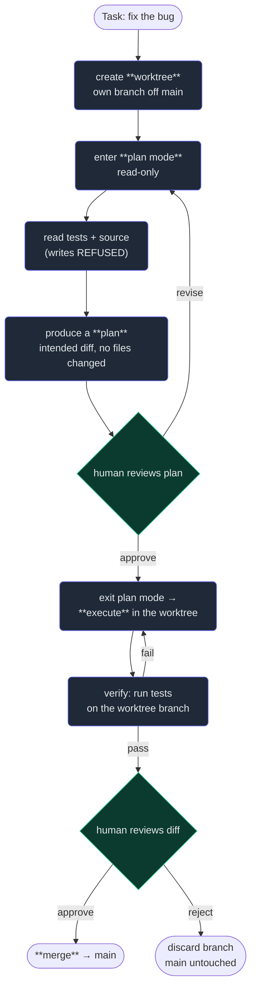

# 6. Plan mode & worktrees

## TL;DR

> An agent that *acts* is powerful and dangerous for the same reason: its mistakes have
> consequences a chatbot's never could. Two tools defuse that. **Plan mode** is a permission mode
> where the agent may **read and think but is forbidden from writing** — it must hand you a *plan*
> you approve **before** any change happens, because a plan is cheap to revise and an applied edit is
> expensive to undo. **Git worktrees** give the agent its **own checkout on its own branch**,
> physically separate from your main tree, so big or risky or *parallel* work happens in isolation and
> your main branch is untouched until you choose to merge. Both rest on one principle: **separate the
> reversible from the irreversible, and put a human checkpoint on the seam.** This very book was built
> by an agent running inside such a worktree.

## 1. Motivation

This book is 58 files. Picture handing that job to an agent the naïve way: it starts editing files
directly on your `main` branch, in your working tree, the one you also have open in your editor.
Twenty files in, you notice it misread the chapter template and every file has the heading levels
wrong. Now your main branch is a half-finished mess tangled with your own uncommitted work, and
"undo" means untangling forty edits by hand. The agent's power — *it edits real files* — has become
the problem.

Here's how it *actually* happened, and you can verify it from the path this chapter was authored in.
Before the big build started, the agent worked in **plan mode**: it read the template and the
manifest, thought hard, and produced a written plan — *which files, in what order, matching what
structure* — and a human approved that plan **before a single file was written**. (Those plans are
real artifacts; they live under `~/.claude/plans/` on this machine.) Then the actual writing happened
not on `main` but inside a dedicated **git worktree** named `adoring-blackburn-ac2dd1`, branched off
`main` — a completely separate checkout on its own branch. A 58-file book build could go wrong in
every possible way and the `main` tree would never feel it. Only when the work was reviewed would it
be merged back.

That is the whole lesson of this chapter, and it's just **reversibility** applied twice. The
expensive, irreversible thing is *an edit landing on your real branch*. Plan mode pushes the decision
**before** that moment (deciding is free); worktrees push the work **beside** that moment (isolated is
safe). Neither makes the agent smarter. Both make an *acting* agent safe to unleash — which, after
five chapters of giving it tools and permissions, is exactly the problem we now have to solve.

## 2. Intuition (Analogy)

**Plan mode is the architect's blueprint.** Nobody lets a construction crew start pouring concrete
and *then* find out where the rooms go. You draw the blueprint, everyone reviews it, it gets signed
off — and *only then* does anyone lay a brick. A blueprint is cheap to redraw; a poured foundation is
not. "Measure twice, cut once." Plan mode forces the agent to draw the blueprint (a plan) and get
your signature before it touches the material (your files).

**Worktrees are separate workbenches.** Imagine two editors improving the same manuscript. If they
both scribble on the *one* master copy, they overwrite each other and you get chaos. So each takes a
**photocopy** to their own desk, marks it up in isolation, and a coordinator merges the marked
copies back into the master only when they're ready. The master is pristine until merge time; the two
desks never collide because each has its *own* copy.

| | No safety tool | **Plan mode** | **Git worktree** |
|---|---|---|---|
| When you find out what it'll do | After it's done | **Before** — you read the plan | After, but safely (separate branch) |
| What can it touch right now | Your live files | **Nothing** (read-only) | Its **own** checkout only |
| Cost to back out | Undo real edits by hand | Free — just edit the plan | `git branch -D` / don't merge |
| Good for | (it isn't) | Risky/ambiguous tasks, big refactors | Large, long, or **parallel** work |
| Human checkpoint | None | **Approve the plan** | **Approve the merge** |

The two compose: an agent can be *in plan mode, inside a worktree* — think first, then act in
isolation. Defence in depth.

## 3. Formal Definition

**Plan mode** is a **permission mode** (recall the permission model from Chapter 3 — plan mode is one
of its modes). While active, the harness **allows read/search tools and disallows every write/execute
tool**. The model can `Read`, `Grep`, `Glob`, reason — but any `Edit`, `Write`, or state-changing
`Bash` is refused *by the harness*, not by the model's good intentions. The model's deliverable is a
**plan**: a written description of the changes it *intends*. You review and refine it; on **approval**
the harness switches out of plan mode and the agent executes the plan as normal. The enforcement lives
in the harness, exactly like every other permission — the model proposes, the harness is the gate.

A **git worktree** is a native Git feature: one repository can have **multiple working trees**, each a
separate directory checked out to its **own branch**, all sharing the same underlying object store.
`git worktree add ../wt my-branch` creates a second checkout. Edits in one worktree are *local to its
branch*; they become visible to `main` only through an explicit **merge**. So an agent given its own
worktree operates on an isolated branch — its changes cannot affect your `main` working tree until you
merge, and several agents can each take a worktree and work **in parallel** without colliding.

| Term | Meaning |
|---|---|
| **Plan mode** | A permission mode: read/think allowed, all writes/actions refused by the harness. |
| **Plan** | The agent's written proposal of intended changes, produced *instead of* making them. |
| **Approve** | The human checkpoint that ends plan mode and lets the agent execute the plan. |
| **Working tree** | The actual directory of checked-out files you edit (vs the `.git` object store). |
| **Worktree** | An *additional* working tree on its own branch, sharing one repo's object store. |
| **Branch** | A movable pointer to a line of commits; isolation happens *per branch*. |
| **Merge** | Combining a branch's commits into another (e.g. worktree branch → `main`). |
| **Conflict** | When two branches change the *same* lines incompatibly; a clean merge has none. |

> The one sentence: **plan mode separates *deciding* (reversible, free) from *doing* (consequential),
> and worktrees separate *where the agent works* from *your main branch* — both inserting a human
> checkpoint on the boundary between safe and irreversible.**

## 4. Worked Example

One feature, the safe way. The agent is asked to fix a bug. Watch how plan mode and a worktree gate
the irreversible step — *landing on `main`* — at two checkpoints.



Notice **two human gates, both before anything irreversible**. The first (approve the *plan*) is the
cheapest possible place to catch a misunderstanding — nothing has been written, so "revise" just edits
text. The second (approve the *diff*) sits on the merge, the one truly irreversible step; reject it and
the worktree branch is simply discarded — `main` never knew. Everything risky happened in the
worktree; everything decided happened before the write. The agent owned the middle; the human owns the
two boundaries. That is the same *human-goal → agent-loop → human-sign-off* shape from Chapter 1, now
hardened with two reversibility checkpoints.

## 5. Build It

You can't run the real harness here, but the *ideas* are just data structures. This model has two
parts. First a `Workspace` in **plan mode**: a `write` is **refused** and instead **records the
intended diff**; only `approve()` flips it to execute and applies everything — proving the disk is
untouched until you sign off. Second, two `Worktree`s editing the **same** base file on disjoint
lines; they stay isolated and **merge with zero conflicts**. Deterministic — run it and read along.

```python run
class Workspace:
    """A tiny model of plan mode. In 'plan' mode, writes are REFUSED and only
    RECORDED as an intended diff. approve() is the seam that finally applies them."""
    def __init__(self, files):
        self.files = dict(files)   # the real, on-disk content
        self.mode = "plan"         # "plan" = read/think only; "execute" = may write
        self.pending = []          # the proposed diff, gathered while planning

    def read(self, name):          # reading is always allowed
        return self.files[name]

    def write(self, name, new):
        if self.mode == "plan":
            # refuse the action; record the INTENT instead -> nothing on disk changes
            self.pending.append((name, self.files[name], new))
            return "REFUSED (plan mode): recorded intent, disk unchanged"
        self.files[name] = new     # only reachable after approve()
        return "WROTE " + name

    def plan(self):
        return [f"  {n}: {old!r} -> {new!r}" for (n, old, _), new in
                ((p, p[2]) for p in self.pending)]

    def approve(self):
        """The human signed off. Flip to execute and apply every recorded edit."""
        self.mode = "execute"
        for name, _old, new in self.pending:
            self.write(name, new)
        self.pending = []
        return "APPROVED: plan applied"


# --- Plan mode: propose, review, approve --------------------------------------
ws = Workspace({"add.py": "return a - b"})   # a planted bug: add() subtracts
print("attempt while planning:", ws.write("add.py", "return a + b"))
print("disk during planning :", repr(ws.read("add.py")), "(untouched)")
print("the proposed plan:")
for line in ws.plan():
    print(line)
print(ws.approve())
print("disk after approval  :", repr(ws.read("add.py")), "(now applied)")

print("-" * 52)

# --- Worktrees: two isolated checkouts of the SAME file -----------------------
class Worktree:
    """Each worktree is its own checkout on its own branch: edits stay local
    until an explicit merge. No coordination needed while working."""
    def __init__(self, name, base):
        self.name, self.base, self.edits = name, base, {}
    def edit(self, lineno, text):
        self.edits[lineno] = text            # local only; main is untouched
    def view(self):
        merged = dict(self.base)
        merged.update(self.edits)
        return merged

base = {1: "title", 2: "intro", 3: "outro"}   # the shared main branch
docs = Worktree("docs",  base)
code = Worktree("code",  base)
docs.edit(2, "INTRO (rewritten by docs agent)")   # different line...
code.edit(3, "OUTRO (rewritten by code agent)")   # ...than the other agent

print("docs worktree sees:", docs.view())
print("code worktree sees:", code.view())

# Merge: disjoint line edits -> no conflict. Last-writer never clobbers a peer.
main = dict(base)
conflicts = []
for wt in (docs, code):
    for ln, text in wt.edits.items():
        if ln in main and main[ln] != base[ln] and main[ln] != text:
            conflicts.append(ln)
        main[ln] = text
print("merged main branch:", main)
print("conflicts:", conflicts, "(disjoint edits merge cleanly)")
```

It prints, in order: `attempt while planning: REFUSED (plan mode): recorded intent, disk unchanged`,
then `disk during planning : 'return a - b' (untouched)` — the bug is *still there*, because the write
was only recorded. The plan shows `add.py: 'return a - b' -> 'return a + b'`. After `APPROVED: plan
applied`, the disk finally reads `'return a + b'`. Then the two worktrees each see only *their own*
edit, and the merge yields `{1: 'title', 2: 'INTRO (rewritten by docs agent)', 3: 'OUTRO (rewritten by
code agent)'}` with `conflicts: []`. **Now break it:** make both worktrees `edit(2, ...)` the *same*
line with different text and re-run the conflict check — that line lands in `conflicts`. Editing the
*same* line is exactly where isolation stops being free, which is why parallel agents are happiest on
disjoint files (Chapter on parallel subagents, Part 6).

## 6. Trade-offs & Complexity

| | Plan mode | Git worktree | Just let it act on `main` |
|---|---|---|---|
| Safety before the fact | **High** — see the plan first | Medium — isolated, reviewed at merge | None |
| Speed / friction | Adds a review step | Setup + a merge later | Fastest… until it's wrong |
| Reversibility | Total (nothing written yet) | Total before merge (`branch -D`) | Manual undo, error-prone |
| Disk / mental overhead | ~zero | Extra checkout dir; track branches | zero |
| Parallelism | n/a | **Enables it** (one worktree each) | Agents collide on one tree |
| Best for | Ambiguous or high-stakes changes | Big/long/parallel work | Tiny, obvious, throwaway edits |

The honest costs: plan mode trades a little latency for a lot of safety — overkill for a one-line typo,
essential for a sprawling refactor where a wrong assumption multiplies. Worktrees cost an extra
directory and the discipline of merging; in return they buy isolation and *parallelism* — the only way
several agents work at once without trampling each other. Both are cheap insurance against the one
expensive event: a bad change landing on your real branch. As always, **you must still verify** — plan
mode guarantees you *saw* the plan, not that the plan was *correct* (that's Chapter 7).

## 7. Edge Cases & Failure Modes

- **Rubber-stamping the plan.** Plan mode only helps if you *read* the plan. Approving without
  scrutiny re-creates the danger it was meant to remove — the checkpoint is a human, not a formality.
- **A plan that drifts on contact with reality.** The agent planned against files it then misread, so
  execution diverges. Antidote: plan from *actually-read* context, and re-verify after executing.
- **"Read-only" actions that aren't.** A `Bash` command in plan mode that mutates state (deletes a
  file, hits a network API) breaks the guarantee. The harness must classify such tools as writes, not
  reads — read-only means *no side effects*.
- **Forgetting which worktree you're in.** Running the app, or committing, from the wrong checkout
  wastes effort or pollutes the wrong branch. Antidote: name worktrees clearly; check `git worktree
  list` (this very session's worktree shows up there).
- **Merge conflicts from overlapping edits.** Two worktrees editing the *same* lines don't merge
  cleanly (the Build It "break it"). Antidote: partition parallel work along **disjoint files**.
- **Stale worktrees pile up.** Abandoned worktrees and dead branches accumulate. Antidote: prune after
  merging (`git worktree remove`, delete the branch).
- **Plan mode is not a sandbox.** It restricts the *agent's* tools; it is not OS-level isolation. A
  truly hostile or buggy tool is a separate concern (permissions, Chapter 3).

## 8. Practice

> **Exercise 1 — Why before, not after?** Plan mode makes the agent produce a plan *before* it edits
> anything, instead of letting it edit and then showing you a diff to approve. From first principles,
> why is "approve the plan first" strictly safer and cheaper than "act, then review"?

<details>
<summary><strong>Answer</strong></summary>

Because of **reversibility and cost asymmetry**. A plan is *text*: revising it is free and leaves no
trace. An applied edit is a *state change*: backing it out means undoing real modifications, and if the
agent made many interlocking edits, the cost compounds and errors creep in (§1).

"Act, then review" still produces a diff you can reject — but the work is already *done*, and a wrong
*premise* (the agent misunderstood the task) may have spawned a dozen edits you must now untangle.
"Approve the plan first" catches the misunderstanding at the **cheapest possible moment**, before a
single byte changed, when fixing it is just editing a sentence (§3, §4). You move the human checkpoint
to *before* the irreversible step instead of *after* it. Same principle as a blueprint signed off
before any brick is laid: measure twice, cut once.

</details>

> **Exercise 2 — Two agents, one repo.** You want two agents working at the same time: one rewriting
> the docs, one fixing a bug. Why does giving each its **own worktree** let them run in parallel
> safely, and what single condition keeps the eventual merge conflict-free?

<details>
<summary><strong>Answer</strong></summary>

Each worktree is a **separate checkout on its own branch** (§3). The agents' edits are local to their
branches, so while they work, neither can see or clobber the other's files — there is no shared mutable
state to race on. That isolation is *exactly* what makes safe parallelism possible: without it, two
agents writing the one working tree would overwrite each other (the "two editors, one master copy"
chaos from §2).

The condition for a clean merge is **disjoint edits** — they must change *different* lines/files. The
Build It shows it: docs touches line 2, code touches line 3, so the merge yields `conflicts: []`. Make
them both edit line 2 and the merge conflicts (the "break it"). So the recipe for parallel agents is:
isolate with worktrees, and **partition the work along non-overlapping files** (Part 6). Isolation buys
parallelism; disjointness buys a painless merge.

</details>

> **Exercise 3 — Where is the rule enforced?** In §3 we say plan mode's read-only constraint is
> enforced *by the harness*, "not by the model's good intentions." Tie this back to Chapter 1's
> model/harness split: why must enforcement live there, and what would go wrong if we merely *told* the
> model "please don't write anything"?

<details>
<summary><strong>Answer</strong></summary>

Because the **model only ever *proposes* a tool call; the harness decides whether to execute it**
(Chapter 1). Plan mode is a *permission mode* (Chapter 3): it configures the harness to **refuse**
every write/execute tool while allowing reads. The guarantee is therefore mechanical — a refused
`Edit` cannot touch your disk no matter what the model "wants" (§3).

If we only *instructed* the model ("please don't write"), the constraint would be a *request to a
probabilistic system*, not a rule. The model might misread, get confused, or be steered by a prompt
injection (Chapter on MCP security) into writing anyway — and nothing would stop it, because the model
would still be holding the pen. Putting the gate in the harness is the same seam that makes permissions
and hooks possible: **the model never touches the disk; the harness does, under rules.** Safety you can
*rely* on has to be enforced where the action actually happens, not promised by the thing you're trying
to constrain.

</details>

```quiz
{
  "prompt": "An agent is in plan mode and you ask it to refactor a module. It reasons, then proposes an Edit. What happens, and why is this the safe design?",
  "input": "Choose the best answer:",
  "options": [
    "The harness refuses the Edit and the agent instead records the intended change as a plan for you to approve — so nothing is written until you sign off, putting the human checkpoint before the irreversible step",
    "The Edit applies immediately but is logged, so you can review and undo it afterward",
    "The model decides on its own whether to honor plan mode based on how risky the edit looks",
    "Plan mode prevents the agent from reading files, so it cannot gather enough context to edit"
  ],
  "answer": "The harness refuses the Edit and the agent instead records the intended change as a plan for you to approve — so nothing is written until you sign off, putting the human checkpoint before the irreversible step"
}
```

## In the Wild

- **[Claude Code — common workflows (plan mode & extended thinking)](https://docs.claude.com/en/docs/claude-code/common-workflows)**
  — the official guide to using plan mode (often paired with Shift+Tab) to have the agent think and
  propose before it acts. The real tool behind §3.
- **[git-worktree documentation](https://git-scm.com/docs/git-worktree)** — the canonical reference for
  the Git feature that gives an agent its own isolated checkout. Try `git worktree add` and watch a
  second branch appear in its own directory, exactly like the one this book was built in.
- **[Anthropic — Claude Code best practices](https://www.anthropic.com/engineering/claude-code-best-practices)**
  — Anthropic's own engineers on plan-first workflows and running multiple Claude Code instances in
  parallel worktrees, the production version of §2's two workbenches.

---

**Next:** the agent can now plan before it acts and work in isolation — but how do we *close the loop*
and prove a change is actually correct, not just confidently asserted? →
[7. The verification loop](/cortex/the-claude-stack/claude-code-in-action/the-verification-loop)
