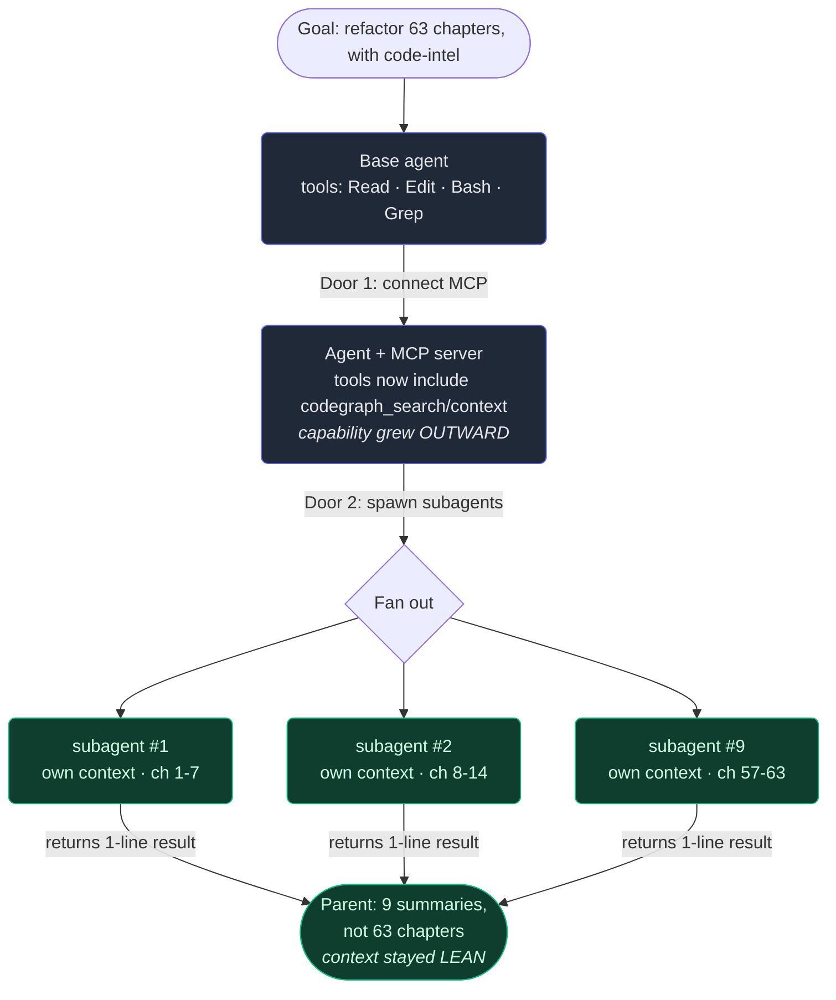

# 8. MCP & subagents in Claude Code

## TL;DR

> A lone agent runs into **two walls**. The first is **capability**: it can only do what its tools
> let it do. The second is **context**: it can only hold so much in its working memory before the
> goal drowns in noise. Claude Code has **two doors** through these walls. **Door 1 — MCP (Model
> Context Protocol)** lets you plug an external **server** into the agent; its tools appear right
> alongside the built-in Read/Edit/Bash, so the agent can *do more* — this is the door to Part 4.
> **Door 2 — subagents** let the agent spawn a fresh, **isolated** helper that does one scoped job
> in its *own* clean context and hands back only a short result, so the parent's context *stays
> focused* — this is the door to Part 6. One grows what the agent can do; the other protects what it
> can hold. When there are too many tools to keep in view, a third trick — **dynamic discovery** —
> lets the agent fetch a tool's schema on demand instead of holding them all at once.

## 1. Motivation

This book has a sibling on the same site: the **Production Engineering** book, 63 chapters long. At
one point every chapter needed the same mechanical change — wrap each exercise answer in a
collapsible block. One agent reading all 63 chapters into a single context would have been hopeless:
by chapter 20 the window is so stuffed with other chapters' prose that it starts mangling the
formatting it did at chapter 3. That is the **context wall**, hit head-on.

So the agent didn't do it alone. It **spawned 9 subagents in parallel**, handed each a slice of the
chapters, and each one worked in its *own* clean context — read its files, made its edits, and
returned a one-line summary like *"7 chapters done, all blocks balanced."* The parent collected nine
short summaries instead of sixty-three full chapters. The job got done *because* the work was
isolated, not in spite of it.

The very same session hit the **other** wall too. To understand this codebase it needed code
intelligence — but Claude Code doesn't ship with a "search the symbol graph" tool. So the repo
plugged one in: `.claude/mcp.json` registers a server called **`codegraph`**, and suddenly tools like
`codegraph_search` and `codegraph_context` sat in the agent's toolbox next to `Read`. New capability,
no new agent — just a server in a port. Two walls, two doors. This chapter is about both.

## 2. Intuition (Analogy)

Picture your **laptop**. It can do a lot on its own, but it has **USB-C ports**: plug in a camera, a
microphone, an external GPU, and the machine can suddenly *do* things it couldn't a second ago. You
didn't buy a new laptop — you extended the one you have, **outward**, through a standard port that
any compliant peripheral fits. **That is MCP.** A server is the peripheral; the port is the
protocol; the new tools are the new capabilities. (You'll meet this same "USB-C for AI" image again
in Part 4 — it's the canonical way to think about MCP.)

Now picture a **big push at work** — far more than you can hold in your head. You **hire temps**. Each
gets *a single task* and *a clean desk*, goes off and does it, and hands you back *a one-page result*
— not the mountain of papers they read to produce it. Your own desk never drowns. **That is
subagents** (the *Delegation* idea from Part 1, made literal): the win isn't only extra hands, it's
that **each researcher gets their own notebook**. Context isolation is the whole trick.

| | One agent, alone | **MCP** (Door 1) | **Subagents** (Door 2) |
|---|---|---|---|
| Which wall does it lift? | hits both | **capability** | **context** |
| Direction | — | grows **outward** | multiplies **sideways** |
| What you add | nothing | a **server** (new tools) | a **child agent** (a clean context) |
| Effect on the agent | fixed | it can **do more** | the parent **holds less** |
| Everyday image | a laptop | **USB-C port** | **hiring a temp** |
| Door to… | this Part | **Part 4** | **Part 6** |

## 3. Formal Definition

**MCP (Model Context Protocol)** is an open standard for connecting an agent to external **servers**
that expose extra **tools** and **context**. The agent (the *host*) speaks the protocol to each
server over a **transport** (this repo uses **stdio** — the server is a local process the agent talks
to over standard input/output). The server's tools are then offered to the model **exactly like the
built-ins**: same shape (a name + inputs), same loop. MCP widens the set of actions the agent can
take — it grows the **capability** axis.

A **subagent** is a *fresh agent instance* the parent launches via an **Agent / Task tool** to do one
scoped job. Its defining property is **context isolation**: the child starts with its *own* empty
context, does the heavy reading and acting there, and returns **only a short result** to the parent.
The parent's context grows by one item (the result), not by everything the child saw. Subagents
protect the **context** axis.

| Term | Meaning |
|---|---|
| **MCP** | Open protocol letting an agent gain tools/context from external servers. The "USB-C" standard. |
| **MCP server** | A separate program exposing tools (e.g. `codegraph`); registered in `.claude/mcp.json`. |
| **Transport** | How host and server talk. Here: **stdio** (a local subprocess); the alternative is HTTP/SSE (Part 4). |
| **Subagent** | A child agent spawned to do one job in its **own** context, returning only a result. |
| **Context isolation** | The child's reads stay in the child; the parent receives just the summary. The reason subagents help. |
| **Capability vs context** | The two ceilings: what the agent can **do** vs how much it can **hold**. MCP lifts the first; subagents the second. |
| **Dynamic discovery** | Fetching a tool's *schema* on demand (via a tool-search) instead of holding every tool's definition at once. |

> One sentence to keep: **MCP grows what the agent can DO; subagents protect what the agent can
> HOLD.** Same loop from Chapter 1 — these just add tools to it, or run a clean copy of it next door.

A note on the **third trick**. Each tool a server exposes costs context just to *describe* — name,
inputs, docs — so connect enough servers and the descriptions alone crowd the window. **Dynamic
discovery** fixes this: tools can be **deferred** — the agent sees only their *names* until it needs
one, then fetches the full **schema** on demand via a tool-search, and only then can call it. The
agent that wrote this book did exactly that — a `ToolSearch` step pulling deferred MCP schemas *live*.
You hold the index, not the encyclopedia.

## 4. Worked Example

Trace the two doors on the loop from Chapter 1. The goal: *refactor 63 chapters, using code
intelligence the base agent doesn't have.* Door 1 supplies the missing tool; Door 2 keeps the
context from drowning.



Three things to read off it. **Door 1 is horizontal growth** — the toolbox got *wider* (codegraph
tools next to the built-ins), but it's still one agent, one context. **Door 2 is vertical isolation**
— each subagent is a separate clean context that does its slice and reports back; the arrows *into*
the parent carry one-line summaries, not the chapters. And **the join is the payoff**: the parent
ends holding 9 short results, about as light as when it started — even though 63 chapters' worth of
work happened. Outward for capability, sideways for context.

## 5. Build It

You can't run a real MCP server or a real subagent here, but the *shape* is simple enough to model.
Below, `connect_mcp` **merges** a server's tools into an agent's toolset (capabilities grow), and
`spawn_subagent` runs a child with its **own** context that returns only a short string (the parent
barely grows). Watch the two counters: the toolset size goes **up** on Door 1; the parent's
context size stays **flat** on Door 2 even though the child held dozens of items.

```python run
def make_agent(name):
    """A minimal agent: a name, a clock of context items, and a base toolset."""
    return {
        "name": name,
        "tools": {"Read", "Edit", "Bash", "Grep"},  # the built-ins
        "context": ["system_prompt", "user_goal"],   # what the agent currently holds
    }


def connect_mcp(agent, server_name, server_tools):
    """DOOR 1 - MCP: merge an external server's tools into the toolset.
    Capabilities grow OUTWARD; the agent can now DO more."""
    namespaced = {f"{server_name}__{t}" for t in server_tools}
    agent["tools"] |= namespaced
    return agent


def spawn_subagent(parent, task, work_items, result):
    """DOOR 2 - subagents: run a child with its OWN clean context.
    The child reads `work_items` files; the parent receives ONLY `result`.
    Capabilities multiply SIDEWAYS; the parent's context stays lean."""
    child = {
        "name": parent["name"] + ">subagent",
        "tools": set(parent["tools"]),         # inherits tools
        "context": ["system_prompt", task],    # but a FRESH, isolated context
    }
    for f in work_items:                       # heavy reading happens over HERE...
        child["context"].append("read:" + f)
    parent["context"].append("subagent_result:" + result)  # ...only this returns
    return child["context"], parent


claude = make_agent("claude")
print("DOOR 1 - MCP (grow capabilities outward)")
print("  tools before connect: " + str(len(claude["tools"])) + "  " + str(sorted(claude["tools"])))
connect_mcp(claude, "codegraph", {"search", "context", "node"})
print("  tools after  connect: " + str(len(claude["tools"])) + "  " + str(sorted(claude["tools"])))

print()
print("DOOR 2 - subagents (protect context sideways)")
before = len(claude["context"])
files = ["chapter_" + str(i) + ".md" for i in range(1, 64)]  # 63 chapters, like the real refactor
child_ctx, claude = spawn_subagent(
    claude, "add answer blocks to 63 chapters", files,
    result="done: 63 chapters edited, all <details> balanced",
)
after = len(claude["context"])
print("  child held   " + str(len(child_ctx)).rjust(3) + " context items (did the heavy reading)")
print("  parent grew  " + str(before) + " -> " + str(after) + " items (+" + str(after - before) + ": just the summary)")
print("  parent context: " + str(claude["context"]))
```

Output: the toolset jumps **4 → 7** when the codegraph server connects (Door 1, capability up), and
the child holds **65** context items while the parent grows only **2 → 3**, a single `+1` for the
summary (Door 2, context protected). **Now tweak it.** Connect a *second* server and watch the
toolset grow again — that's M servers stacking capability. Or spawn three subagents over 21 chapters
each: the parent ends at `+3`, *not* `+63`, no matter how much the children read. The flat parent
counter *is* context isolation, made visible.

## 6. Trade-offs & Complexity

| | **MCP** (Door 1) | **Subagents** (Door 2) | Stuffing it all into one agent |
|---|---|---|---|
| Lifts which ceiling | capability — new tools | context — isolated work | neither |
| Cost it adds | every tool's schema eats context; a 3rd-party server is **code you now trust** | spawning + the round-trip; the parent loses the child's *details* | window fills, goal rots |
| Best when | the agent needs an action it lacks (DB, graph, API) | the job is big, parallel, or read-heavy | tiny, single-context tasks |
| Main risk | tool sprawl; a malicious server (Part 4 §security) | over-delegating; lossy summaries hide a bad step | context rot, mangled output |
| Mitigation | auto-allow only read-only tools; **dynamic discovery** to defer schemas | tight specs + clear return contracts (Part 6) | — split the work |

The deep point: both doors **spend** something to **buy** headroom. MCP spends context (and trust) to
buy capability; subagents spend a round-trip (and fine detail) to buy a clean context. Neither is
free, and reaching for them on a two-line task is overkill — the loop from Chapter 1 already handles
that. You open a door when you've actually hit its wall.

## 7. Edge Cases & Failure Modes

- **Tool overload.** Connect five servers and the tool *descriptions* alone can crowd out your goal —
  capability bought at the cost of context. Antidote: **dynamic discovery** — keep most tools
  *deferred* (names only) and fetch a schema via tool-search only when needed.
- **A malicious or buggy MCP server.** Its tools run with the agent's reach; a hostile one can carry
  prompt-injection in its tool *outputs*. Antidote: trust servers like dependencies; auto-allow only
  **read-only** tools (as this repo does for `codegraph_*`). Full treatment in Part 4's security
  chapter.
- **Over-delegation.** Spawning a subagent for a one-line edit costs more than doing it inline — the
  spawn and round-trip aren't free. Antidote: delegate *scoped, heavy, or parallel* work, not trivia.
- **Lossy summaries.** A subagent returns "all 7 done" but quietly botched chapter 4; the parent can't
  see the detail it isolated away. Antidote: precise **return contracts** + an independent verify pass
  (Part 6) — isolation hides the work, so check the result.
- **The child can't see the parent's context.** Isolation cuts both ways: a subagent doesn't know what
  the parent learned unless you *put it in the spawn prompt*. Antidote: the prompt must be
  self-contained — give the child every fact it needs.
- **Calling a deferred tool before fetching its schema.** With dynamic discovery, a tool's name is
  visible but it **can't be invoked** until its schema is loaded. Antidote: tool-search *first*, call
  *second* — the name is a pointer, not the tool.

## 8. Practice

> **Exercise 1 — Two walls, two doors.** Name the *two* hard limits a single agent runs into, and say
> which door lifts each — and in which *direction* (outward vs sideways).

<details>
<summary><strong>Answer</strong></summary>

The two limits are **capability** (what the agent can *do* — bounded by its tools) and **context**
(how much it can *hold* — bounded by its working memory) (§3).

- **MCP — Door 1** lifts the **capability** wall, growing the agent **outward**: a server plugs in,
  its tools sit beside the built-ins, and the agent can take actions it couldn't before. (Part 4.)
- **Subagents — Door 2** lift the **context** wall, multiplying **sideways**: a fresh child does a
  scoped job in its *own* isolated context and returns only a short result, so the parent stays
  focused. (Part 6.)

Why the framing matters: they are *not* interchangeable. If the agent lacks a tool, more subagents
won't help — you need MCP. If it's drowning in context, a new tool won't help — you need isolation.
Diagnose the wall, then pick the door.

</details>

> **Exercise 2 — Why isolation, not just extra hands.** A subagent's win is often stated as "more
> workers." But the §2 analogy stresses *each temp gets their own desk*. Using the Build It counters,
> explain why **isolation** — not parallelism — is the property that actually protects the parent.

<details>
<summary><strong>Answer</strong></summary>

In the Build It model the child accumulates **65** context items (63 files plus its prompt), yet the
parent grows only **2 → 3** — a single `+1` for the returned summary (§5). That gap *is* the point:
the child's heavy reading lives in the **child's** context and never lands in the parent's.

Even with **one** subagent and **zero** parallelism the parent stays lean — because the helper returns
a *result*, not its raw materials. Parallelism makes the job *faster* (9 slices at once);
**isolation** keeps the orchestrator's context clear regardless of how much the helpers read. That's
why the analogy gives each temp their own notebook: *your* desk doesn't drown in *their* papers,
whether you run them one-by-one or all at once.

</details>

> **Exercise 3 — When do you defer a tool?** You connect three MCP servers exposing 40 tools total,
> but a given task uses only two of them. Why does **dynamic discovery** help here, and what's the one
> rule you must respect when calling a deferred tool?

<details>
<summary><strong>Answer</strong></summary>

Each tool costs context merely to *describe* — name, inputs, docs (§3, §6). Forty descriptions can
crowd out the goal: capability bought at the price of context. **Dynamic discovery** keeps most tools
**deferred** — the agent holds only their *names* — and fetches a tool's full **schema** on demand
(via a tool-search) only when it needs it. You carry the index, not the encyclopedia.

The rule: a deferred tool **can't be invoked until its schema is loaded**. The name is a *pointer*,
not the callable tool — so **tool-search first, call second**. Skip the fetch and the call fails,
because the agent doesn't yet know the tool's inputs. (Exactly what the book's authoring agent did:
`ToolSearch` to pull deferred MCP schemas live, then call.)

</details>

```quiz
{
  "prompt": "In Claude Code, what is the key difference between connecting an MCP server and spawning a subagent?",
  "input": "Choose one:",
  "options": [
    "MCP adds new tools so the agent can DO more (grows capability outward); a subagent runs an isolated child with its own context that returns only a result, keeping the parent's context lean (protects context sideways)",
    "MCP makes the underlying model larger, while a subagent makes it respond faster",
    "MCP and a subagent are two names for the same thing — both just add tools to the agent",
    "A subagent adds new tools from an external server, while MCP runs a child agent in an isolated context"
  ],
  "answer": "MCP adds new tools so the agent can DO more (grows capability outward); a subagent runs an isolated child with its own context that returns only a result, keeping the parent's context lean (protects context sideways)"
}
```

## In the Wild

- **[Model Context Protocol — official site](https://modelcontextprotocol.io/)** — the open standard
  behind Door 1: the spec, the "USB-C for AI" framing, and how hosts, clients, and servers fit
  together. Part 4 lives here.
- **[Claude Code — connect to MCP servers](https://docs.claude.com/en/docs/claude-code/mcp)** — the
  practical side of this repo's `.claude/mcp.json`: how to register a stdio server like `codegraph`
  and see its tools appear next to the built-ins.
- **[Claude Code — subagents](https://docs.claude.com/en/docs/claude-code/sub-agents)** — Door 2 for
  real: how to define and spawn isolated helper agents with their own context, the mechanism behind
  the 9-subagent refactor in §1. Part 6 lives here.

---

**Next:** you've met every piece — the loop, memory, permissions, hooks, skills, plan mode,
verification, and now the two doors to the wider stack. Time to watch them all fire on one real job,
from empty prompt to verified result. → [9. A real task, end to end](/cortex/the-claude-stack/claude-code-in-action/a-real-task-end-to-end)
