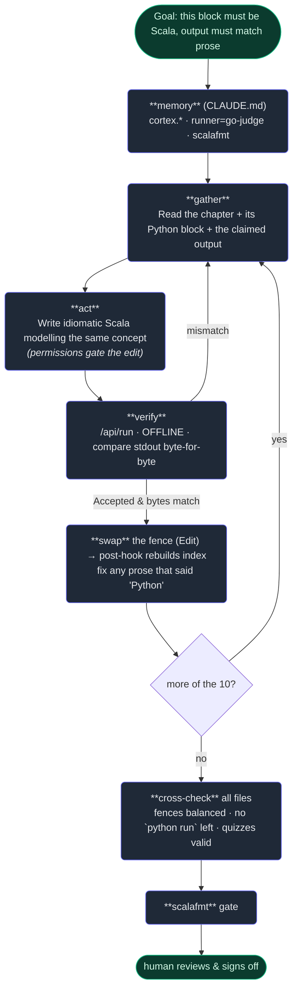

# 9. A real task, end to end

## TL;DR

> You've met the parts one chapter at a time. Now watch them work **together** on a single real
> change to *this* codebase: the Production Engineering book had **ten ZIO "Build It" examples
> written in Python**, but ZIO is a *Scala* framework — so the examples were *wrong*. The fix was to
> rewrite each in idiomatic Scala and **prove** it: compile and run it in the locked-down sandbox,
> compare the output **byte-for-byte** to what the prose claimed, fix-and-rerun on any mismatch, then
> splice the verified Scala back in. The human set the goal in one sentence; the agent ran the dozens
> of loop turns. And every machine from this Part showed up at its station — **memory** supplied the
> conventions, a **worktree** kept the live site safe, **permissions** gated the edits, the **verify
> loop** ran the code, the **hook** rebuilt the index after each write, and a **scalafmt** gate stood
> at the door. One task; the whole Part.

## 1. Motivation

Here is a true story from this repo, and it is the spine of this chapter. The Production Engineering
book opens with a unit on **ZIO** — a Scala library for writing effects as values. Each section ends
with a runnable **Build It** block. But ten of those blocks were written in **Python**: they
*modelled* the ZIO idea correctly, yet a reader learning a *Scala* framework was staring at Python.
The goal, from the human, was one sentence: **"ZIO is a Scala framework — the examples must be
Scala, not Python."**

That sounds like a chore until you notice what "must be Scala" actually demands. You cannot just
machine-translate the syntax. Each block has to **compile**, has to **run** in the same locked-down
sandbox readers use, and has to print **exactly** what the surrounding prose claims it prints —
because a learner will type it and expect that output. A wrong byte is a broken lesson. Multiply by
**ten chapters**, and you have a task no single edit can finish: read, rewrite, run, compare, fix,
re-run, splice, then check the whole document still holds together.

This is the capstone because it is *ordinary* — not a demo. It is the gather → act → verify loop from
Chapter 1, run for real dozens of times, each piece of Part 2 quietly doing its job — and underneath,
Part 1's four D's: the agent did the **drafting**, the human gave the **description**, **discernment**
came from running the code, the gates supplied **diligence**. (How do we know it's true? It's in this
repo's history. The agent that did it wrote this chapter.)

## 2. Intuition (Analogy)

Picture a **restaurant dinner service**, the moment the first order hits the pass. No single act is
hard — chop, sear, plate. What makes it *work* is that every station and every tool fires in the
right order, over and over, for hours. The **recipe cards** on the wall mean the line cooks don't
re-learn the menu each night (that's `CLAUDE.md`, your **memory**). The cooks work at a **prep
station**, not on the plates going to diners, so a dropped pan never reaches a table (that's the
**git worktree**). The **expediter** decides which ticket gets fired and which gets held (that's the
**permission** model). And nothing leaves the pass until it's **tasted** — every plate, every time
(that's the **verify** loop). The dinner isn't one heroic dish; it's the same disciplined cycle,
run unattended, producing a verified result.

A surgical procedure is the colder version of the same picture: a **checklist** read aloud, every
instrument counted **before and after**, every step confirmed. The discipline is the point.

| | Doing it ad-hoc (one big prompt) | **The end-to-end agent loop** |
|---|---|---|
| Conventions | Re-explained each time | **Standing memory** (`CLAUDE.md`) |
| Safety of the live thing | Editing the real files directly | **Worktree** off `main` — can't break the site |
| What may run | Whatever it decides | **Gated by permissions / plan mode** |
| Correctness | "Looks right," shipped | **Byte-verified** in the sandbox, every block |
| After each write | Nothing | **Hook** rebuilds the index automatically |
| Before commit | Hope | **Format gate** (scalafmt) must pass |
| Who owns the ends | — | **Human** sets goal + signs off; **agent** runs the middle |

The ad-hoc way *can* produce one good plate. It cannot reliably produce two hundred. The difference,
again, is the loop with its stations — not a smarter cook.

## 3. Formal Definition

The end-to-end workflow is the **Chapter-1 loop** (`gather → act → verify`, back-edge on failure)
**run once per unit of work**, each turn backed by specific Part-2 machinery. For a task split into
items $i = 1 \dots N$:

```
for each item i:
    GATHER  — read item i and the claim it must satisfy        [Read · memory for conventions]
    repeat:
        ACT    — make the change                                [Write/Edit · permissions gate it]
        VERIFY — run it; compare output to the claim            [/api/run sandbox · the verify node]
    until VERIFY passes                                         [the back-edge = the loop]
    SHIP   — splice the verified result in; fix stale prose     [Edit · post-hook rebuilds index]
CROSS-CHECK across all items, then a format gate, then human sign-off
```

The **bookends** are human (goal in, sign-off out); the **middle** is the agent. Mapping each step to
the Part you met it in:

| Loop step (this task) | Part-2 machinery | Chapter |
|---|---|---|
| Conventions known before touching anything | **`CLAUDE.md` memory** (`cortex.*` packages, runner is go-judge, scalafmt rule) | 2 |
| Work isolated from the live site | **git worktree** off `main` | 6 |
| Which actions are allowed to run | **tools + permission model** (allow-list; ask on the rest) | 3 |
| Read chapter → write Scala → run it | the **gather/act/verify** tools (Read, Write/Edit, Bash→`/api/run`) | 1, 7 |
| Run code, compare to the claim, loop on mismatch | the **verification loop** (go-judge, **offline**) | 7 |
| Index rebuilt automatically after each write | the **PostToolUse hook** | 4 |
| Cross-file invariants in one named, reusable step | a **command/skill**-shaped check | 5 |
| (Where the task is big) split the work cleanly | **subagents** / clean-context delegation | 8 |

> The one sentence: **a real task is the Chapter-1 loop run once per item, each turn backed by a
> different piece of Part 2 — and the human owns only the two ends.** Each Part-2 chapter taught one
> station; this chapter is the whole line at dinner service.

One detail makes the verify step *real*: the sandbox has **no network**. Cortex runs Scala with
`scala-cli run main.scala --server=false --jvm system` against a pre-seeded offline cache, so the
agent verifies the way a reader will — network cut (the moral `--network none`). A block that
secretly needs the internet fails, which is exactly what a verifier should catch.

## 4. Worked Example

Take **one** of the ten chapters — *"Your first program: `ZIOAppDefault`"* — and watch the loop turn.
The prose claims the program ends by printing `listening` (it serves HTTP after migrating). The old
block was Python. Here is the cycle the agent ran for that single chapter:



The Scala the agent shipped builds an "app" from smaller effect values and runs them once — its
real, verified Build-It block, in essence:

```scala
@main def run(): Unit =
  val migrate = () => "schema v3"
  val serve   = () => "listening"
  val program = () => { migrate(); serve() }   // ONE value; run point fires the effects
  println(s"exit: ${program()}")               // -> exit: listening
```

Three things to notice, each a Part-2 idea in the wild. **The back-edge is the work** — where the
first Scala draft printed the wrong line, *verify* failed and the agent looped back to *gather/act*;
it did not declare victory on red. **Verification is a node, not a vibe** — "run it in the sandbox
and diff the bytes" is a step the agent *takes*, the only reason ten swaps can be trusted. And
**`SHIP` is two edits, not one**: swap the fence *and* repair stale prose — one converted chapter
even had a leftover Python-flavoured "now break it" hint (`lambda: (_ for _ in ()).throw(...)`) to
rewrite for Scala, because the goal was a *correct chapter*, not just a green code block.

## 5. Build It

You can't run a real LLM here, but the end-to-end *pipeline* isn't the LLM — it's the structure
around it. This simulates the whole task over `N` mini-chapters: each runs `gather → act → verify`,
**loops once** if the first draft's output doesn't match the claim, then ships. A deterministic
**post-hook** counts index rebuilds (one per swap); a final **cross-check** confirms no Python blocks
remain. Outcomes come from fixed per-chapter fields — no randomness, identical every run (the whole
point of a *verifier*).

```python run
# gather -> act -> verify -> (loop) -> ship, over N mini "chapters". Deterministic.
# Each chapter: concept, what the PROSE claims it prints, the FIRST Scala draft, the FIXED draft.
chapters = [
    # name,                 claims,        first_draft,   fixed_draft
    ("your-first-zio",      "listening",   "listening",   "listening"),
    ("failures-vs-defects", "recovered",   "boom",        "recovered"),   # 1st draft wrong -> fix
    ("the-r-channel",       "config v3",   "config v3",   "config v3"),
    ("fibers",              "both done",   "both done",   "both done"),
    ("racing-timeouts",     "fast wins",   "slow wins",   "fast wins"),   # 1st draft wrong -> fix
    ("http-with-tapir",     "200 OK",      "200 OK",      "200 OK"),
]

POST_HOOK_REBUILDS = 0   # the PostToolUse hook rebuilds the index on every Edit

def gather(ch):  return ch[1]                       # read the claimed output
def act(ch, attempt):  return ch[2] if attempt == 1 else ch[3]   # draft, then the fix
def verify(out, claimed):  return out == claimed     # run offline, compare BYTE-FOR-BYTE

def ship(name):                                      # swap fence (an Edit) -> fires the hook
    global POST_HOOK_REBUILDS
    POST_HOOK_REBUILDS += 1
    return name

converted, needed_fix = 0, 0
for ch in chapters:
    name, claimed = ch[0], gather(ch)
    attempt = 1
    out = act(ch, attempt)
    if not verify(out, claimed):        # mismatch -> loop back, re-act, re-verify
        needed_fix += 1
        attempt = 2
        out = act(ch, attempt)
    assert verify(out, claimed), f"{name} still wrong after fix"
    ship(name)
    converted += 1
    flag = "" if attempt == 1 else "  (fix-loop)"
    print(f"PASS  {name:20} got={out!r:14} == claims{flag}")

# Cross-file VERIFY: every fixed draft matches its claim => no leftover Python blocks.
leftover_python = sum(1 for c in chapters if act(c, 2) != gather(c))
all_verified = converted == len(chapters)
print()
print(f"summary: {converted} converted, {needed_fix} needed a fix-loop, "
      f"index rebuilt {POST_HOOK_REBUILDS} times")
print(f"cross-check: leftover python blocks = {leftover_python}, "
      f"all byte-verified = {all_verified}")
print("DONE: end-to-end, every example Accepted." if all_verified else "INCOMPLETE")
```

This prints **six PASS lines** (two flagged `(fix-loop)`), then `6 converted, 2 needed a fix-loop,
index rebuilt 6 times`, a clean cross-check, and `DONE`. **Now break it.** Change a chapter's
`fixed_draft` so it *still* mismatches its `claims` — the `assert` fires and the pipeline halts on
that chapter. That's the point: a real end-to-end task **refuses to ship on red**. The loop, the
fix-edge, the post-hook count, and the cross-check are exactly the shape the agent ran for the ten
ZIO chapters — only the policy choosing the actions (here, fixed fields) was a real model there.

## 6. Trade-offs & Complexity

| End-to-end agent loop | One giant prompt ("convert all 10 now") | Doing all ten by hand |
|---|---|---|
| Each item gathered, acted, **verified**, looped on failure | One shot, no per-item check | Full control, full effort |
| Catches a wrong byte *before* it ships | Wrong output slips through silently | You are the verifier (slow, error-prone at 10×) |
| Stations (memory, hook, gate) amortise across all items | No reuse; quality varies per item | No automation; every check is manual |
| Human owns the **two ends**; agent owns dozens of turns | Human must re-verify *everything* after | Human owns everything, learns the most |
| Overhead: worktree, sandbox round-trips, the gates | Cheapest to *start*, costliest to *trust* | No setup; doesn't scale |

The cost of the end-to-end loop is its ceremony: a worktree to make, a sandbox round-trip per block,
a format gate to satisfy. The benefit is that **trust scales**. One giant prompt is cheapest to
launch and most expensive to *believe*, because nothing checked each block. The loop front-loads the
discipline so the result is verified by construction — which is precisely what lets a human review
ten conversions by skimming, not by re-running all ten.

## 7. Edge Cases & Failure Modes

- **Shipping on "looks right."** Translating the syntax and moving on, without running it. Antidote:
  the verify node must *fire* and diff the **bytes** — the sandbox is the judge, not the eye (Ch 7).
- **Verifying online by accident.** A block that quietly reaches the network "passes" locally but
  breaks for readers. Antidote: verify **offline** (no network), as Cortex's runner does, so the
  agent's environment matches the reader's.
- **Fixing the code, forgetting the prose.** The Scala compiles, but a sentence still says "Python"
  (the real leftover-`lambda` hint). Antidote: `SHIP` is *two* edits — swap **and** repair prose.
- **Editing the live site.** Doing this on `main` risks breaking the published book mid-task.
  Antidote: a **worktree** (Ch 6) — the prep station, not the plate.
- **Skipping the cross-file check.** Per-chapter green doesn't prove the *document* is sound (a stray
  unbalanced fence, a now-invalid quiz). Antidote: a final **cross-check** pass over all files (Ch 5).
- **Bypassing the gate.** Committing unformatted Scala fails CI later. Antidote: run **scalafmt**
  before commit — diligence at the door, not after the fact.
- **Runaway fix-loops.** If a block can never match the claim, the agent must *stop and surface it*,
  not retry forever. Antidote: a turn budget plus a changed approach on repeated failure (Ch 1).

## 8. Practice

> **Exercise 1 — Place the machine.** For three of these moments in the task, name the Part-2 piece
> doing the work: (a) the agent knew `cortex.*` is the package prefix without being told this session;
> (b) the book index was up to date right after each swap, with no manual step; (c) the work couldn't
> break the live site even mid-edit.

<details>
<summary><strong>Answer</strong></summary>

- **(a) `CLAUDE.md` memory (Ch 2).** Conventions (`cortex.*`, runner is go-judge, the scalafmt rule)
  are auto-loaded at session start, so the agent is oriented before it touches a file — the fact
  lives in the repo, not in a past conversation.
- **(b) The PostToolUse hook (Ch 4).** A `Write|Edit` matcher runs `gen_cortex_index.py` on any
  `content/cortex/` change — **deterministic automation the harness runs**, not something the model
  must remember, which is why it never gets skipped.
- **(c) The git worktree (Ch 6).** The task ran on a branch in a separate worktree off `main`, so
  every edit was isolated from the published site until reviewed and merged.

None of these were heroics by the model — they were *stations*, standing machinery that made the loop
safe and repeatable. The model's job was to run the loop well; Part 2 made running it well *cheap*.

</details>

> **Exercise 2 — Why byte-for-byte, offline?** The agent didn't just check that each Scala block
> *compiled* — it ran it and compared stdout to the prose **exactly**, with the network cut. Argue
> from first principles why both "byte-for-byte" and "offline" are non-negotiable for *this* task.

<details>
<summary><strong>Answer</strong></summary>

**Byte-for-byte**, because the deliverable is a *lesson*. A reader copies the block and expects the
exact output the prose promised. "Compiles" is too weak: a program can compile yet print `Listening`
when the prose says `listening`, and the learner, trusting the text, concludes *they* erred. The
claim in the prose **is** the spec; character-equality is the only honest check.

**Offline**, because the verifier must match the reader's environment — Cortex's sandbox has **no
network** (`scala-cli ... --server=false`, a pre-seeded cache; the moral `--network none`). Verified
with the internet available, a block that secretly fetches a dependency at runtime would pass for the
agent and **fail for every reader**. Together: byte-equality makes "correct" precise; offline makes
"correct *for the reader*" true.

</details>

> **Exercise 3 — Where were the four D's?** This is a Part-2 task, but Part 1's four D's
> (Delegation, Description, Discernment, Diligence) ran underneath the whole time. Map each D to a
> concrete moment in the ZIO conversion.

<details>
<summary><strong>Answer</strong></summary>

- **Delegation** — the human handed the *drafting* (read each chapter, write Scala, run the loop
  dozens of times) to the agent and kept *goal-setting and sign-off*: a verifiable, well-specified,
  repetitive job is exactly what delegates well.
- **Description** — launched by one precise sentence: *"ZIO is a Scala framework — the examples must
  be Scala."* It names the goal and the success criterion (Scala, not Python).
- **Discernment** — supplied *mechanically* by the verify loop: running each block and diffing bytes
  is the agent judging its output against reality, and looping when it's wrong.
- **Diligence** — the gates: offline verification, the index-rebuild hook, the scalafmt check, and the
  human review. Responsibility for the published result stayed with the human — trustable *because*
  the process was checkable.

Part 2's tooling didn't *replace* Part 1 — it **operationalised** it. The four D's are the *why*; the
memory, hook, sandbox, and gate are the *how*.

</details>

```quiz
{
  "prompt": "In the ZIO Python→Scala conversion, what made it an end-to-end agent task rather than a one-shot translation?",
  "input": "Choose one:",
  "options": [
    "For each chapter the agent ran gather→act→verify, looping on any byte-mismatch and only swapping the code once the sandbox confirmed it — with memory, a worktree, permissions, a hook, and a format gate each doing their job",
    "A larger language model rewrote all ten blocks in a single response",
    "The Python was converted to Scala by find-and-replace on the syntax",
    "A human manually rewrote each block and the agent only reformatted them"
  ],
  "answer": "For each chapter the agent ran gather→act→verify, looping on any byte-mismatch and only swapping the code once the sandbox confirmed it — with memory, a worktree, permissions, a hook, and a format gate each doing their job"
}
```

## In the Wild

- **[Anthropic — Building effective agents](https://www.anthropic.com/engineering/building-effective-agents)**
  — the model-in-a-loop framing this whole task instantiates; read it again now that you've seen the
  loop run, with stations, on a real change.
- **[Claude Code — common workflows](https://docs.claude.com/en/docs/claude-code/common-workflows)**
  — concrete end-to-end tasks (fix a bug, refactor across files) that exercise gather → act → verify
  exactly as this chapter did.
- **[Cortex `01-zio/.../your-first-zio-program`](https://github.com/ani2fun/cortex/tree/main/content/cortex/production-engineering/01-zio)**
  — the actual ZIO unit whose Build-It blocks were converted to verified Scala; the chapter dissected
  in §4 lives here.

---

**Next:** you've seen the agent *use* the loop, the tools, and the machinery — but what is the engine
underneath it all? Time to go under the hood: the Claude API that powers every turn. →
[Part 3 — Building with the Claude API](/cortex/the-claude-stack/building-with-the-claude-api)
