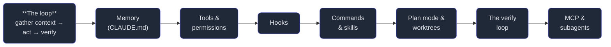

# Part 2 — Claude Code in Action

> **The friendliest place to *watch* an AI agent do real work is a coding agent in a terminal.**
> Claude Code reads your files, runs your commands, edits your code, and checks its own work — in a
> loop, with you in the chair. This Part takes it apart from first principles: what an "agent" even
> is, the loop at its heart, and then each piece of machinery that turns a clever chatbot into a
> dependable collaborator you can trust with your repository.

## Why this Part, here

Part 1 taught the *judgment* (the 4 D's). This Part is where that judgment first meets a real tool —
and it is the gentlest on-ramp in the whole stack, because you can **see every step**. When Claude
Code reads a file, you see the read. When it edits, you see the diff. When it runs your tests, you
see them pass or fail. The abstractions that feel mystical in the raw API — context, tools,
agency — are right here in plain sight. Learn them where they're visible, and they'll make sense
later where they're not.

And, fittingly, **this book was written by the subject of this Part.** Claude Code, running in this
repository, authored these chapters. So when we explain memory, we read the `CLAUDE.md` it actually
loads. When we explain hooks, we read the hook that fires every time it saves one of these files.
When we explain worktrees, we're *standing in one*. The tool and the textbook are the same object.

## What you'll learn

The agentic loop first, then the machinery that makes it trustworthy:

## Chapters

1. **[What Claude Code is](/cortex/the-claude-stack/claude-code-in-action/what-claude-code-is)** —
   agentic coding from first principles, and the gather-context → act → verify loop.
2. **[The CLAUDE.md memory](/cortex/the-claude-stack/claude-code-in-action/the-claude-md-memory)** —
   how an amnesiac agent remembers your project: persistent, version-controlled instructions.
3. **[Tools & permissions](/cortex/the-claude-stack/claude-code-in-action/tools-and-permissions)** —
   the agent's hands, and the guardrails that decide what it may touch.
4. **[Hooks](/cortex/the-claude-stack/claude-code-in-action/hooks)** — deterministic automation that
   fires around the agent's actions (we read the real one in this repo).
5. **[Slash commands & skills](/cortex/the-claude-stack/claude-code-in-action/slash-commands-and-skills)** —
   reusable, named capabilities you (and the team) can invoke.
6. **[Plan mode & worktrees](/cortex/the-claude-stack/claude-code-in-action/plan-mode-and-worktrees)** —
   think before you touch; isolate risky work on its own branch.
7. **[The verification loop](/cortex/the-claude-stack/claude-code-in-action/the-verification-loop)** —
   the habit that separates a demo from a dependable agent: never trust, always verify.
8. **[MCP & subagents in Claude Code](/cortex/the-claude-stack/claude-code-in-action/mcp-and-subagents-in-claude-code)** —
   two doors to the rest of the stack: extending the agent, and multiplying it.
9. **[A real task, end to end](/cortex/the-claude-stack/claude-code-in-action/a-real-task-end-to-end)** —
   capstone: an actual change to this codebase, start to verified finish.

---

**Begin:** strip away the buzzwords — what *is* a coding agent, really, and what is the single loop
that makes it more than autocomplete? → [1. What Claude Code is](/cortex/the-claude-stack/claude-code-in-action/what-claude-code-is)
