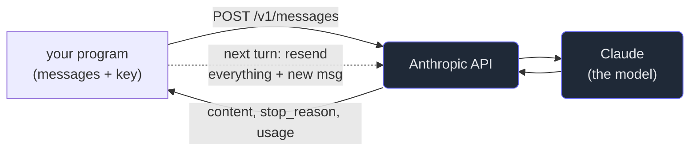

# 1. The Messages API

## TL;DR

> Talking to Claude programmatically is **one HTTP request** to **`POST /v1/messages`**. You send a
> `model`, a `max_tokens` cap, and a list of **`messages`** (each a `{role, content}` where role is
> `"user"` or `"assistant"`); you get back a response whose **`content`** is a list of blocks (text,
> and later tool-use or thinking) plus a `stop_reason` and a token `usage` count. The defining
> property — the one that shapes everything else — is that the API is **stateless**: it remembers
> *nothing* between calls. To hold a conversation, *you* resend the entire history every turn. Tools,
> streaming, structured output, caching: all of them are features of this single endpoint.

## 1. Motivation

This website has no AI in it. Not a single call to a language model — Cortex runs your code in a
sandbox and serves Markdown, full stop. So suppose we want to add the obvious feature: an **"explain
this error" button** next to the code runner, that takes your failing program and the error and
writes a beginner-friendly explanation.

Where does that explanation *come from*? Not from a database — every error is different. Not from a
rule engine — natural-language explanation is exactly what rules are bad at. It comes from a language
model, and the way our ZIO server would reach that model is by making an HTTP request to one
endpoint: `POST /v1/messages`. We'd put the code and the error into a `messages` array, send it with
an API key, and read the explanation out of the response.

That's the whole interface. Every fancy thing you've seen Claude do — hold a conversation, call
tools, stream a slow answer token by token, read an image — is *that one endpoint* with a richer
request. So before any of the features, we learn the request and the response, and the one surprising
property that trips up everyone who skips it: **the endpoint has no memory.**

## 2. Intuition (Analogy)

Remember the **brilliant amnesiac intern** from Part 1? The Messages API is your only way to talk to
them, and they have taken their amnesia to the extreme: **they forget everything the instant they
finish answering.** Not "by tomorrow" — *immediately.*

So imagine corresponding with them entirely by **postcard**. Each postcard you send must contain the
*whole* conversation so far — every previous question and every previous reply — because the intern
kept no copy and remembers nothing. You write down the history, add your new question, mail it; they
read the entire postcard, write a reply at the bottom, mail it back, and forget it all. Your next
postcard must again include everything, plus the new turn.

That sounds wasteful, and in a sense it is — but it buys something precious: **you** are the single
source of truth for the conversation. Nothing can drift on a server you can't see. You decide exactly
what the model sees each turn. Most of this Part is, one way or another, about managing that postcard
well.

| | A stateful chat (server remembers) | **The Messages API (stateless)** |
|---|---|---|
| Who stores the conversation | The server, behind a session ID | **You**, in your own code |
| What you send each turn | Just the new message | **The whole history** + the new message |
| Who controls what the model sees | The server's hidden logic | **You, exactly** |
| If you send nothing extra | It recalls the past | **It knows nothing** |
| Failure mode | Hidden server state drifts | You forget to resend → it "forgets" |

## 3. Formal Definition

A call to the Messages API is an HTTP `POST` to `https://api.anthropic.com/v1/messages` with three
required headers — `x-api-key` (your secret key), `anthropic-version: 2023-06-01`, and
`content-type: application/json` — and a JSON body:

| Field | Meaning |
|---|---|
| `model` | Which Claude to use, e.g. `"claude-opus-4-8"` (most capable), `"claude-sonnet-4-6"` (balanced), `"claude-haiku-4-5"` (fastest/cheapest). Exact ID strings — no guessing. |
| `max_tokens` | A hard ceiling on the *output* length, in tokens. The model stops here even mid-sentence. |
| `messages` | The conversation: a list of `{"role": "user" | "assistant", "content": ...}`. Must start with `user`; turns generally alternate. |
| `system` *(optional)* | Standing instructions for the model — its persona and rules (Chapter 2). Not a message; a separate top-level field. |

The **response** is JSON too. The parts that matter now:

| Field | Meaning |
|---|---|
| `content` | A **list of blocks**, not a string. The common one is `{"type": "text", "text": "..."}`; later you'll meet `tool_use` and `thinking` blocks. Always check `block.type`. |
| `stop_reason` | *Why* it stopped: `end_turn` (finished naturally), `max_tokens` (hit your cap — output is cut off), `tool_use` (it wants to call a tool, Chapter 5), `refusal` (declined for safety). |
| `usage` | Token counts: `input_tokens` and `output_tokens` — what you pay for (Chapter 9). |

And the load-bearing property: **statelessness.** The server keeps no conversation for you. Two calls
with the same body are independent; the model in call two has no idea call one happened unless call
two's `messages` array *contains* it.

> The mental model in one line: **the API is a pure function.** `response = f(model, system, messages)`.
> Same inputs, same kind of output; no hidden memory on either side. Everything you want the model to
> "know" must be an *argument* — which is why you resend the history every turn.

## 4. Worked Example — one real call

Here is the actual request, in the simplest possible form. (This snippet makes a real network call,
so it needs an API key and the `anthropic` package — it does **not** run in our sandbox; it's here so
you've seen the real thing.)

```python
import anthropic

client = anthropic.Anthropic()  # reads your key from the ANTHROPIC_API_KEY env var

response = client.messages.create(
    model="claude-opus-4-8",
    max_tokens=1024,
    messages=[
        {"role": "user", "content": "What is the capital of France?"},
    ],
)

# response.content is a LIST of blocks — find the text one, don't assume content[0]
text = next(b.text for b in response.content if b.type == "text")
print(text)          # -> "Paris."
print(response.stop_reason)   # -> "end_turn"
print(response.usage.output_tokens)  # -> a small number
```



The dotted line is the whole lesson: there is **no arrow inside the API that remembers** — the memory
arrow loops back through *you*. Notice too that `content` is a *list*: even this trivial reply is
`[TextBlock(text="Paris.")]`, because in general one response can interleave text, tool calls, and
reasoning. Pull the text out by type; never assume position.

## 5. Build It

We can't hit the network here, so we'll **model** the endpoint: a local `messages_create` stands in
for the real one, and a tiny canned "model" that can only use what's in the `messages` you pass it.
Run it and watch statelessness bite.

```python run
def messages_create(messages):
    """A stand-in for client.messages.create(). It can see ONLY `messages` — nothing else."""
    last_user = next((m["content"] for m in reversed(messages) if m["role"] == "user"), "")
    low = last_user.lower()
    if "my name is" in low:
        name = low.split("my name is")[1].strip().split()[0].rstrip(".").title()
        return {"role": "assistant", "content": f"Nice to meet you, {name}."}
    if "my name" in low and ("what" in low):
        seen = " ".join(m["content"] for m in messages).lower()   # everything YOU resent
        if "my name is" in seen:
            name = seen.split("my name is")[1].strip().split()[0].rstrip(".").title()
            return {"role": "assistant", "content": f"Your name is {name}."}
        return {"role": "assistant", "content": "I don't know your name — you haven't told me."}
    return {"role": "assistant", "content": "(no answer)"}

# Turn 1 — introduce yourself. Keep the reply in your own history list.
history = [{"role": "user", "content": "My name is Ada."}]
r1 = messages_create(history)
history.append(r1)
print("turn 1:", r1["content"])

# Turn 2 DONE RIGHT — resend the whole history, then ask the new question.
history.append({"role": "user", "content": "What is my name?"})
print("turn 2 (history resent):", messages_create(history)["content"])

# Turn 2 DONE WRONG — a fresh call with NO history. The API has amnesia.
print("turn 2 (no history):  ", messages_create([{"role": "user", "content": "What is my name?"}])["content"])
```

**Now break it.** Comment out the two `history.append(...)` lines so you stop accumulating the
conversation, then ask "What is my name?" again — you'll get the *amnesia* answer even though you
"told it" a moment ago, because the telling never made it into the `messages` you sent. That is the
number-one bug of everyone new to the API: they expect the server to remember. It doesn't. **You** do.

## 6. Trade-offs & Complexity

| Stateless Messages API | A stateful, server-remembers chat |
|---|---|
| You fully control what the model sees each turn | The server's hidden rules decide |
| Trivially scalable — any server can handle any turn | Sessions pin to state, harder to scale |
| Reproducible & debuggable (same input → same shape) | "Why did it say that?" hides in server state |
| You must resend history (bandwidth, tokens, Chapter 9) | Cheaper per call to send |
| You must manage the context window (Chapter 3) | The server manages it for you |

Statelessness is a deliberate trade: a little repetition and bookkeeping on your side, in exchange
for total control and easy scaling on the API's side. (Anthropic *does* offer higher-level surfaces —
Managed Agents — that keep state for you, but they're built on this same endpoint. Learn the
stateless core first; it's underneath everything.)

## 7. Edge Cases & Failure Modes

- **Forgetting to resend history.** The classic. The model "forgets" because the past wasn't in
  `messages`. Fix: keep a list, append every user and assistant turn, send the whole list.
- **Assuming `content` is a string.** It's a list of blocks. `response.content[0].text` breaks the
  moment a thinking or tool block comes first. Filter by `type`.
- **`max_tokens` too low.** Output is silently cut off and `stop_reason == "max_tokens"`. Raise the
  cap (or stream, Chapter 6). Check the stop reason.
- **First message isn't `user`.** A 400 error — the conversation must start with a user turn.
- **Wrong/guessed model ID.** `claude-sonnet-4.6` or a made-up date suffix → 404. Use exact IDs.
- **Hardcoding the API key.** A leaked secret. Read it from the environment; never commit it
  (Part 1's Diligence is not optional here).

## 8. Practice

> **Exercise 1 — Why resend?** A beginner writes a chat loop that sends only the newest user message
> each turn and is baffled that Claude "has dementia." Using the §3 model, explain in one or two
> sentences exactly why, and the one-line fix.

<details>
<summary><strong>Answer</strong></summary>

Because the Messages API is **stateless** (§3): the server keeps no conversation, so each call's model
sees *only* the `messages` array in that call. If you send just the newest user message, the prior
turns simply don't exist from the model's point of view — there is no hidden memory to fall back on
(the §2 postcard with nothing copied onto it).

The fix is one line of bookkeeping: **keep a running `messages` list, append every user message *and*
every assistant reply to it, and send the whole list every turn.** The "memory" is your list; the API
is the pure function `f(model, system, messages)` that you feed it to.

</details>

> **Exercise 2 — Read the response.** You call the API and do `print(response.content)` and get
> something like `[TextBlock(text='Paris.', type='text')]` instead of `Paris.`. Why is `content` a
> list, and what's the robust way to get the text?

<details>
<summary><strong>Answer</strong></summary>

`content` is a **list of content blocks** (§3) because a single response can contain more than just
text — it may interleave a `thinking` block, one or more `tool_use` blocks (Chapter 5), and text. A
string couldn't represent that; a typed list can.

The robust extraction is to **filter by `block.type`**, never by position:

```python
text = next(b.text for b in response.content if b.type == "text")
```

`response.content[0].text` happens to work for a plain text reply but breaks the instant a non-text
block comes first (e.g. when thinking or tool use is enabled) — which is exactly the kind of
"works in the demo, fails in production" trap Part 1's discernment warns about.

</details>

> **Exercise 3 — Design the call.** For Cortex's "explain this error" button, sketch the `messages`
> array you'd send (roles and what goes in each), and name which response field carries the
> explanation and which tells you if it got cut off.

<details>
<summary><strong>Answer</strong></summary>

A single user turn is enough — there's no prior conversation, just one request. Put the *context*
(the code and the error) and the *ask* into one user message (a `system` prompt would carry the
"you are a patient tutor" persona — Chapter 2):

```python
messages = [
    {"role": "user", "content":
        "A learner ran this Python and got an error. Explain the cause in plain language "
        "for a beginner, then the fix.\n\n"
        f"CODE:\n{source}\n\nERROR:\n{stderr}"},
]
```

- The explanation comes back in the response's **`content`** list — the `text` block(s).
- Whether it was cut off is in **`stop_reason`**: `end_turn` means it finished; `max_tokens` means
  your cap truncated it (raise `max_tokens` or stream).

This is the seed of the Chapter 10 capstone — the same call, hardened with a system prompt, token
limits, error handling, and a cost estimate.

</details>

```quiz
{
  "prompt": "What does it mean that the Claude Messages API is \"stateless\"?",
  "input": "Choose one:",
  "options": [
    "It keeps no memory between calls — to continue a conversation you must resend the entire history in the `messages` array each turn",
    "It can only handle one message before you must start a new API key",
    "It never stores your API key, so you must send it twice",
    "It remembers your last 10 conversations automatically on the server"
  ],
  "answer": "It keeps no memory between calls — to continue a conversation you must resend the entire history in the `messages` array each turn"
}
```

## Your Turn

Before you move on, check your understanding with the coach — explain the idea, apply it, weigh the trade-offs, then defend your reasoning.

<div class="concept-coach"></div>

## In the Wild

- **[Anthropic — Messages API reference](https://docs.claude.com/en/api/messages)** — the exact
  request/response schema, every field, every header. The primary source for this chapter.
- **[Anthropic — Models overview](https://docs.claude.com/en/docs/about-claude/models/overview)** —
  the current model IDs, context windows, and prices you plug into `model=`.
- **[Anthropic SDKs](https://docs.claude.com/en/api/client-sdks)** — the official `anthropic`
  libraries (Python, TypeScript, and more) that wrap this endpoint so you rarely write the raw HTTP.

---

**Next:** the `messages` array is *what* you ask. But *who is Claude* while it answers — its persona,
its rules, its format? That's the `system` prompt, and it's the highest-leverage field in the whole
request. → [2. System prompts & prompting](/cortex/the-claude-stack/building-with-the-claude-api/system-prompts-and-prompting)
