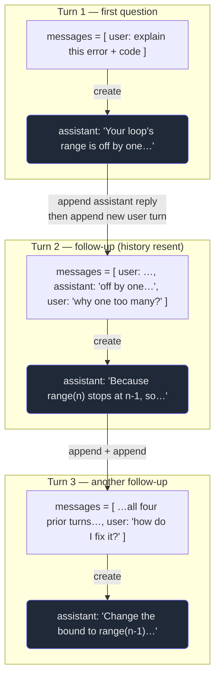

# 3. Multi-turn & context

## TL;DR

> The Messages API has no memory (Chapter 1), so a "conversation" is something **you** build:
> keep a `messages` list, and after each reply **append the assistant's message *and* the next
> user message**, then resend the *whole list* on the next `create` call. That list — plus the
> `system` prompt — is the model's **entire** memory; nothing else carries over. The list can't grow
> forever: every model has a **context window** (max input tokens) — Opus 4.8 and Sonnet 4.6 hold
> **1,000,000** tokens, Haiku 4.5 holds **200,000** — and the conversation must fit inside it. As
> history piles up, `input_tokens` climbs every turn (you *pay* for the whole thing, Chapter 9) and
> eventually nears the ceiling. The fix is **history management**: drop old turns (truncation) or
> fold them into a short summary (**compaction**) so the resent list stays small enough.

## 1. Motivation

In Chapter 1 we built the "explain this error" button as a **single** call: one user message in, one
explanation out, done. That's most of what Cortex would actually need — its AI tutor (the Chapter 10
gap) is fundamentally *single-turn*: one failing program produces one explanation, and there's no
"conversation" to remember. Not every use of the API is a chatbot, and pretending otherwise is a
common way to over-engineer.

But now suppose we add the obvious next feature: a **"follow-up" box** under that explanation. The
learner reads it and types *"why does the loop run one time too many?"* — and they expect Claude to
answer **in the context of the code and the explanation it just gave.** That is a *conversation*, and
here the statelessness from Chapter 1 stops being a footnote and becomes the whole problem: the model
that wrote the explanation **forgot it instantly.** If our follow-up call sends only *"why does the
loop run one time too many?"*, Claude has no idea what loop, what code, what we're even talking about.

So this chapter answers two questions that every real Claude program eventually hits. **First:** how
do you actually *hold* a conversation on an API that remembers nothing? (Answer: you accumulate the
history and resend it — the "postcard" from Chapter 1, which you now keep rewriting, longer each
time.) **Second:** that postcard can't grow without limit — there's a ceiling called the **context
window**. What is it, why is it finite, and what do you do when a long conversation starts to approach
it? Those two ideas — *accumulate-and-resend* and *the window* — are the spine of every multi-turn
system you'll build.

## 2. Intuition (Analogy)

Stay with the **brilliant amnesiac intern** and the **postcards** from Chapter 1. To hold a
conversation, you keep a **growing stack of postcards** — but the intern still reads only *one*
postcard per turn, and still forgets it the instant they reply. So each turn you must **recopy the
entire conversation so far** onto a fresh postcard — every past question, every past answer — add the
new question, and mail that. Turn five's postcard contains turns one through four *verbatim* plus the
new line. The "memory" isn't in the intern; it's in **what you recopy.** Leave a turn off the
postcard and, to the intern, it simply never happened.

Here's the new constraint this chapter adds: **the intern will only read a postcard up to a certain
size.** Past that, they stop — the rest of the card is invisible. That maximum readable size is the
**context window.** For a while it's no problem; the conversation is short and fits easily. But every
turn the card gets longer, and eventually you're about to write past the edge. Now you have a choice.
You can **tear off the oldest cards and throw them away** (truncation — cheap, but you lose that
history forever). Or you can **read the old cards, write a few-line summary of them onto a small new
card, and staple that in their place** (**compaction** — you keep the gist, drop the detail, and the
card shrinks back under the limit). Either way, the goal is the same: keep the postcard small enough
that the intern reads all of it.

| | A stateful chatbot (server holds the thread) | **Multi-turn on the Messages API** |
|---|---|---|
| Where the conversation lives | On the server, behind a session ID | **In your `messages` list**, in your code |
| What you send each turn | Just the new message | **The whole history** + the new message |
| The model's memory is… | Whatever the server kept | **Exactly the `messages` you resend** — nothing more |
| Growth over time | Hidden; server prunes it | **Visible: `input_tokens` climbs every turn** (you pay for it) |
| The ceiling | The server enforces it for you | **The context window — *you* must stay under it** |
| When it's full | Server silently summarizes/drops | **You** truncate or compact, or the call errors |

## 3. Formal Definition

A **multi-turn conversation** is a sequence of calls to the same stateless endpoint where each call's
`messages` array contains the **entire prior exchange** plus the newest user turn. You maintain that
array; the API does not.

The loop, precisely:

1. Start a list: `messages = [{"role": "user", "content": <first question>}]`. (The first message
   **must** be `user`.)
2. Call `client.messages.create(model=…, messages=messages, …)`.
3. **Append the assistant's reply** to your list: `messages.append({"role": "assistant", "content": <reply text>})`.
4. When the user speaks again, **append their turn**: `messages.append({"role": "user", "content": <next question>})`.
5. Go to step 2 — resending the *whole* grown list.

The **context window** is the maximum number of **input tokens** a model will accept in one call —
its entire `messages` array plus the `system` prompt, measured in tokens (≈ ¾ of a word each). The
*input* must fit; the output is capped separately by `max_tokens`.

| Term | Meaning |
|---|---|
| **Turn** | One message — a single `{"role", "content"}`. A user turn and the assistant turn it elicits are two turns. |
| **History / transcript** | Your accumulated `messages` list: every turn so far, in order. The model's complete memory. |
| **Context window** | A model's max **input** tokens per call (history + system). Opus 4.8 & Sonnet 4.6: **1,000,000**; Haiku 4.5: **200,000**. |
| **`input_tokens`** | How many tokens *this* call's request used (reported in `usage`). Grows as the history grows — and is what you pay for (Chapter 9). |
| **Truncation** | Dropping old turns from the list to shrink it. Cheap; permanently loses that history. |
| **Compaction / summarization** | Replacing old turns with a short summary of them. Keeps the gist; costs a summarizing step. Anthropic offers a server-side **compaction** beta (and context editing) that does this for you. |

Two rules from the wire that matter here. **First message must be `user`** — a conversation can't open
with an assistant turn. **Consecutive same-role messages are allowed** — if you append two `user`
messages in a row (say, context then question), the API simply merges them; roles needn't strictly
alternate, though they usually do. (You'll lean on the merge rule for caching in Chapter 7.)

> The one-line model: **the model's memory == the `messages` you resend, and the context window is
> the ceiling on that memory.** Everything in this chapter follows from those two facts — resend to
> remember, and manage the list so "everything" still fits under the ceiling.

## 4. Worked Example

Picture three turns of the Cortex follow-up feature. The learner asks about their code, gets an
answer, then asks a follow-up — and the *second* call must carry the *first* exchange so "it" and
"the loop" resolve. Watch how the `messages` list grows, and how the model's view each turn is
exactly that list:



The arrows between turns are the whole job: **append the reply, append the next question, resend.**
Nothing on the server connects Turn 2 to Turn 1 — *your list* does.

Here is the **real SDK shape** for that loop. This snippet makes live network calls (it needs a key
and the `anthropic` package), so it does **not** run in our sandbox — it's here so you've seen the
genuine multi-turn pattern:

```python
import anthropic

client = anthropic.Anthropic()  # reads ANTHROPIC_API_KEY from the environment

# Your history list — the single source of truth for the conversation.
messages = [
    {"role": "user", "content": "Explain this error.\n\nCODE:\n" + source + "\n\nERROR:\n" + stderr},
]

def ask(messages):
    resp = client.messages.create(
        model="claude-opus-4-8",
        max_tokens=1024,
        messages=messages,                 # <-- the WHOLE list, every turn
    )
    reply = next(b.text for b in resp.content if b.type == "text")
    messages.append({"role": "assistant", "content": reply})  # <-- remember the reply
    print("input_tokens this turn:", resp.usage.input_tokens)  # grows each turn
    return reply

print(ask(messages))                       # turn 1

messages.append({"role": "user", "content": "Why does it run one time too many?"})
print(ask(messages))                       # turn 2 — turn 1 is still in `messages`

messages.append({"role": "user", "content": "How do I fix it?"})
print(ask(messages))                       # turn 3 — turns 1 and 2 are still in `messages`
```

Two things to notice. The list is the *only* thing tying the turns together — drop the
`messages.append(...)` after a reply and the next turn forgets it. And `resp.usage.input_tokens`
**climbs every call**, because each request re-sends a longer history; that rising number is both your
bill (Chapter 9) and your distance to the context-window ceiling.

## 5. Build It

We can't hit the network, so we'll **model** the mechanic: a `Conversation` that accumulates messages
and tracks a deterministic token budget (tokens ≈ length, so the numbers are identical every run).
Give it a deliberately tiny **window** of 80 tokens. As the exchange grows, watch `input_tokens` climb
turn by turn — and when adding a turn would breach the window, watch it **compact**: fold the oldest
turns into a short bounded summary so the resent list drops back under the ceiling.

```python run
def count_tokens(msg):
    # A fake-but-deterministic tokenizer: ~1 token per 4 chars of content,
    # plus a small fixed overhead per message for its role/structure.
    return 4 + (len(msg["content"]) + 3) // 4

def total_tokens(messages):
    return sum(count_tokens(m) for m in messages)

class Conversation:
    """Holds your own history (the postcard) and keeps it under a token ceiling."""
    def __init__(self, window, system=""):
        self.window = window          # ceiling: max input tokens we will ever send
        self.system = system
        self.messages = []            # YOUR source of truth -- resent in full each turn
        self.dropped = 0              # how many old turns we folded away
        self.topics = []              # a bounded digest of what those turns were about

    def _system_tokens(self):
        return count_tokens({"content": self.system}) if self.system else 0

    def _summary_msg(self):
        # One fixed-shape card stands in for everything we dropped. It is BOUNDED:
        # at most a few topic keywords, no matter how much we folded away.
        kept = ", ".join(self.topics[-3:])
        text = "[earlier " + str(self.dropped) + " turns summarized; topics: " + kept + "]"
        return {"role": "user", "content": text}

    def payload(self):
        # Exactly what we'd put in messages=[...] this turn: summary (if any) + live turns.
        head = [self._summary_msg()] if self.dropped else []
        return head + self.messages

    def size(self):
        return self._system_tokens() + total_tokens(self.payload())

    def add(self, role, content):
        self.messages.append({"role": role, "content": content})
        # If we'd blow the window, compact the oldest turns until we fit again.
        while self.size() > self.window and len(self.messages) > 1:
            self._compact()

    def _topic_of(self, msg):
        # The single most "contentful" word -- a stand-in for a real summary model.
        stop = {"the", "and", "what", "was", "very", "name", "a", "of", "is", "in",
                "my", "you", "asked", "for", "one", "an", "large", "second"}
        words = [w.strip("?.,").lower() for w in msg["content"].split()]
        words = [w for w in words if w and w not in stop]
        return words[-1] if words else msg["role"]

    def _compact(self):
        # Drop the OLDEST turn; remember it only as a bounded topic digest.
        dropped = self.messages.pop(0)
        before = self.size()
        self.dropped += 1
        topic = self._topic_of(dropped)
        if topic not in self.topics:
            self.topics.append(topic)
        print("  [COMPACT] folded oldest (" + dropped["role"] + "/" + topic + "), size "
              + str(before) + " -> " + str(self.size()) + " (window " + str(self.window) + ")")

def show(tag, conv):
    print(tag + ": " + str(len(conv.payload())) + " msgs sent, " + str(conv.size())
          + " tokens" + (" [+summary]" if conv.dropped else ""))

print("=== A growing conversation under a small window ===")
print("window = 80 tokens; the system prompt counts against it too.\n")
conv = Conversation(window=80, system="You are a terse assistant.")
print("system costs " + str(conv._system_tokens()) + " tokens before any message.\n")

# A scripted exchange. Each user line is paired with its assistant reply, so the
# history grows two messages at a time -- just like real accumulate-and-resend.
exchange = [
    ("user", "What is the capital of France?"), ("assistant", "Paris."),
    ("user", "And the capital of Japan?"),      ("assistant", "Tokyo."),
    ("user", "Name a large river in Egypt."),   ("assistant", "The Nile."),
    ("user", "Which planet is the red one?"),   ("assistant", "Mars."),
]
for i, (role, content) in enumerate(exchange, start=1):
    conv.add(role, content)
    show("turn " + str(i).rjust(2) + " (" + role.ljust(9) + ")", conv)

print("\n=== Final state of YOUR history ===")
print("turns folded into the summary: " + str(conv.dropped))
print("summary card the model now sees: " + conv._summary_msg()["content"])
print("live turns kept verbatim:")
for m in conv.messages:
    print("  - " + m["role"] + ": " + m["content"])

print("\n=== Invariant check ===")
fits = conv.size() <= conv.window
print("final size " + str(conv.size()) + " <= window " + str(conv.window) + ": " + str(fits))
france_verbatim = any("France" in m["content"] for m in conv.messages)
print("oldest turn ('France') still verbatim in live history: " + str(france_verbatim))
print("but its topic survives in the summary card: " + str("france" in conv.topics))
```

Run it and read the story in the numbers. Tokens climb monotonically as history accumulates —
**23 → 29 → 40 → 46 → 57 → 64 → 75** — pure accumulate-and-resend, the cost rising every turn. Then at
**turn 8** (the assistant's `"Mars."`) the payload would reach 84, over the 80 ceiling, so the loop
**compacts twice**, folding the two oldest turns (`france`, `paris`) into a bounded summary card and
settling at exactly **80**. The invariant holds: `final size 80 <= window 80` is `True`. And the
moral is in the last two lines — the France turn is **gone verbatim** from the live history, yet its
*topic survives* in the summary. That's the whole trade compaction makes: **detail for footprint.**

**Now break it** two ways. (1) Set `window=1000` and the `[COMPACT]` lines vanish — a big enough
window means you *never* manage history; this is exactly why a **1M**-token model lets Cortex's tutor
stuff a whole chapter into context as grounding and never worry. (2) Delete the `while` loop body in
`add` (just `self.messages.append(...)`) and the size sails past 80 unchecked — that's an
unmanaged conversation overflowing its window, which on the real API is a hard error, not a silent
prune. Memory is the list; the window is the ceiling; the loop is how you live under it.

## 6. Trade-offs & Complexity

You're trading three things against each other: **how much the model remembers**, **how many tokens
you spend**, and **how much bookkeeping you do.** Here's the menu:

| Strategy for a long conversation | Memory kept | Token cost | Complexity / risk |
|---|---|---|---|
| **Keep full history, never prune** | Perfect | Grows every turn — `input_tokens` climbs; you re-pay for the whole transcript each call | Simple, but **eventually hits the window** and 400s; bill balloons (Chapter 9) |
| **Truncate (drop oldest turns)** | Loses the dropped turns entirely | Bounded — caps the resent size | Simple; risks dropping something the user later refers back to |
| **Compaction / summarize old turns** | Keeps the *gist* of old turns | Bounded, plus a summarizing call now and then | More moving parts; the summary can lose nuance or introduce errors |
| **Bigger model window (Opus/Sonnet 1M)** | Perfect, for far longer | Highest — you *can* send up to ~1M tokens, and you pay for all of them | Simplest of all *until* you hit even that ceiling; cost is the real limit |
| **Server-side compaction (Anthropic beta)** | Gist, managed for you | Bounded; Anthropic does the summarizing | Least code on your side; you cede control of *what* gets summarized |

The headline: **a stateless API makes history *your* line item.** Each turn re-sends everything, so
cost scales with conversation length, and the context window is the hard wall. The first-principles
move is always yours — *truncate or summarize* — even though Anthropic now offers server-side
**compaction** and **context editing** to automate it. And the cheapest fix of all is often *not*
having a conversation: a single-turn design (like Cortex's core tutor) has no history to manage at all.

## 7. Edge Cases & Failure Modes

- **Forgetting to append the assistant reply.** You append user turns but not the model's answers, so
  each turn the model can't see what it *said* — it repeats itself or contradicts itself. Append
  **both** roles every turn.
- **Overflowing the context window.** Let history grow unbounded and a call exceeds the model's max
  input tokens → a **400 error**, not a silent trim. Truncate or compact *before* you breach it; track
  `input_tokens`.
- **Truncating the system prompt or the first user turn.** Naively "drop the oldest message" can throw
  away your standing instructions or the original question the whole thread hinges on. Pin the
  `system` prompt and (often) the first turn; prune from the *middle/old* of the body.
- **A truncation that starts the list with `assistant`.** Drop turns carelessly and your list may now
  begin with an assistant message → **400** (first message must be `user`). Keep the first turn a user
  turn after pruning.
- **Compaction that loses a load-bearing detail.** The summary drops the one fact (a variable name, a
  constraint) the user references three turns later. Summaries are lossy — keep recent turns verbatim,
  only fold *old* ones.
- **An unbounded summary.** If each compaction *appends* to the summary, the summary itself eventually
  blows the window. Keep it **bounded** (a fixed budget), as the Build-It does — re-summarize the
  summary if needed.
- **Paying for history you don't need.** A single-turn task (one error → one explanation) needs *no*
  prior turns; sending a long history "just in case" is wasted tokens. Match the shape to the task.

## 8. Practice

> **Exercise 1 — Where does memory live?** A learner asks Cortex's tutor a follow-up, *"and why is
> that off-by-one?"*, but your code sends **only** that sentence to `create`. Claude replies that it
> has no idea what "that" refers to. Using the Chapter 1 statelessness rule, explain why, and give the
> exact two-line fix.

<details>
<summary><strong>Answer</strong></summary>

The API is **stateless** (Chapter 1): each call's model sees *only* the `messages` array in *that*
call. If you send just `"and why is that off-by-one?"`, the prior explanation and the code simply
don't exist from the model's point of view — there is no server-side thread linking this call to the
last. "That" has no referent because the turn it referred to was never in the postcard you mailed.

The fix is to **resend the history**: keep one `messages` list, and each turn append both the
assistant's reply and the new user turn before calling `create` again.

```python
messages.append({"role": "assistant", "content": previous_reply})   # remember what it said
messages.append({"role": "user", "content": "and why is that off-by-one?"})  # then ask
# now: client.messages.create(model=..., messages=messages, ...)  -- the WHOLE list
```

</details>

> **Exercise 2 — Window math.** Opus 4.8 has a 1,000,000-token context window. A chatbot averages
> about 500 tokens of *new* content per turn (user + assistant combined) and you keep the full history
> with no pruning. Roughly how many turns until you approach the window, and name two distinct problems
> that show up *well before* you hit it.

<details>
<summary><strong>Answer</strong></summary>

History is cumulative, so total input ≈ (turns) × 500. You approach 1,000,000 at roughly
**1,000,000 / 500 ≈ 2,000 turns** — a very long conversation. (For Haiku 4.5's 200,000-token window
it's ~400 turns.)

Two problems that bite long before the ceiling:

1. **Cost.** Every turn re-sends the *entire* growing history, so `input_tokens` rises each call and
   you re-pay for the whole transcript every time. By turn 1,000 you're sending ~500,000 input tokens
   *per message* — the bill grows roughly quadratically over the conversation (Chapter 9), long before
   any error.
2. **Latency / focus.** Bigger inputs take longer to process, and a huge wall of old turns can dilute
   the model's attention on what matters now. Pruning or compacting old turns helps speed *and*
   quality, not just the token limit.

So you'd manage history (truncate/compact) for **cost and latency** reasons far sooner than the window
itself would ever force you to.

</details>

> **Exercise 3 — Design the pruning.** You're adding history management to a long Cortex tutoring
> chat. You decide to keep only the most recent N turns and drop the rest. List two things you must
> **not** blindly drop, and one piece of older context worth preserving (and how).

<details>
<summary><strong>Answer</strong></summary>

Two things you must **not** blindly drop:

1. **The `system` prompt** — it isn't even in `messages` (it's a separate top-level field, Chapter 2),
   so pin it; it should ride along on *every* call regardless of pruning.
2. **The first user turn (the original problem/code).** The whole thread usually hinges on it, and
   dropping it can also leave your list illegally starting with an `assistant` message (a 400). Keep
   it pinned, or fold it into a summary — don't just delete it.

One older piece worth preserving: **the key facts established earlier** — the learner's actual code,
the error, the diagnosis. Rather than keep all those turns verbatim, **compact** them into a short
summary message ("Earlier: learner's loop used `range(n)` causing an off-by-one; we diagnosed X") and
keep that one bounded card plus the most recent N turns. That's truncation for the bulk, compaction for
the gist — exactly the trade the Build-It models.

</details>

```quiz
{
  "prompt": "On the stateless Messages API, what is a multi-turn conversation, and what limits how long it can run?",
  "input": "Choose the most accurate statement:",
  "options": [
    "You keep a `messages` list, appending every assistant reply and user turn and resending the whole list each call; the context window (max input tokens) caps how big that list can get, so long conversations must truncate or compact old turns",
    "You send a session ID and the server appends each new turn to a thread it stores for you; there is no size limit",
    "Each call automatically remembers the last 10 messages, and older ones are dropped by the API for free",
    "You send only the newest user message each turn, and the model recalls earlier turns from your API key's history"
  ],
  "answer": "You keep a `messages` list, appending every assistant reply and user turn and resending the whole list each call; the context window (max input tokens) caps how big that list can get, so long conversations must truncate or compact old turns"
}
```

## In the Wild

- **[Anthropic — Context windows](https://docs.claude.com/en/docs/build-with-claude/context-windows)** —
  what the window is, how `messages` and the `system` prompt fill it, and how input vs. output tokens
  are counted. The primary source for this chapter's ceiling.
- **[Anthropic — Context editing & compaction](https://docs.claude.com/en/docs/build-with-claude/context-editing)** —
  the server-side beta that summarizes earlier turns and clears old context for you, so you don't have
  to hand-roll the truncation/compaction loop.
- **[Anthropic — Models overview](https://docs.claude.com/en/docs/about-claude/models/overview)** — the
  exact context-window sizes per model (Opus 4.8 / Sonnet 4.6 = 1M, Haiku 4.5 = 200K) you plan capacity
  against.

---

**Next:** you can now hold a conversation — but so far the model answers in *prose* you have to read.
What if you need a **machine-parseable** answer — JSON with exactly the fields your code expects, every
time? That's structured output. → [4. Structured output](/cortex/the-claude-stack/building-with-the-claude-api/structured-output)
