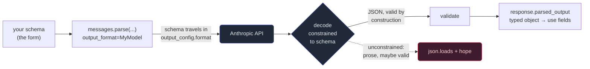

# 4. Structured output

## TL;DR

> When your program needs to *use* Claude's answer — store a field, branch on a value, render a badge —
> you don't want a paragraph you have to regex; you want **JSON you can trust.** Two mechanisms get it.
> **(1)** Pass `output_config={"format": {"type": "json_schema", "schema": {...}}}` to
> `messages.create()` and the reply is **constrained to valid JSON matching your schema** — valid *by
> construction*, not by luck. **(2)** Set `strict: true` on a tool to guarantee its parameter JSON.
> The recommended path is the helper **`client.messages.parse(..., output_format=MyModel)`**, which
> sends the schema *and* validates the reply into a typed object at `response.parsed_output`. The
> schema is a **form with labeled boxes**; the model fills the boxes instead of writing an essay. Mind
> the limits: objects must set `additionalProperties: false`, and recursive schemas, numeric bounds,
> and string-length bounds are **not** supported. (The old top-level `output_format` on
> `messages.create()` is **deprecated** — use `output_config.format`.)

## 1. Motivation

Back in Chapter 1 we sketched Cortex's "explain this error" button: send the failing code and the
stderr, get a beginner-friendly explanation. That returns **prose for a human to read**, and prose is
the right shape there — a paragraph goes straight onto the screen.

Now turn the dial one notch. Suppose we want the **AI tutor** of Chapter 10 to do more than print a
blob. We want the hint to drive a *UI*: a colored **difficulty badge**, a one-line **fix** in its own
box, a **concept** tag we can log to see which ideas trip learners up most. For that, the answer can't
be a paragraph — it has to be **fields**:

```json
{ "explanation": "...", "fix": "...", "concept": "type coercion", "difficulty": "easy" }
```

Here's the trap, and it's a Part 1 discernment trap wearing an engineering costume. The lazy move is:
ask the model nicely — *"reply as JSON with keys explanation, fix, concept, difficulty"* — and then
`json.loads` whatever comes back. It works in the demo. Then in production the model gets *helpful*:
it prepends "Sure! Here's your hint:", or wraps the JSON in a Markdown code fence, or adds a friendly
`"confidence": 0.92` you never asked for, or writes `"difficulty": 1` instead of `"easy"`. Now
`json.loads` throws, or it parses but `hint["difficulty"]` is the wrong type, and your render code
explodes — on *some* inputs, intermittently, in a way your one happy-path test never caught.

You already know the principle from Part 1: **don't trust the shape — constrain and validate it.** The
fix isn't a sterner prompt and a prayer. It's to **constrain the decoding** so the output is valid
JSON matching your schema *by construction*, and to **validate** it into a typed object before your
code touches it. That's structured output, and this chapter is how.

## 2. Intuition (Analogy)

Imagine you need a colleague to give you information about a new hire. You can do it two ways.

**Free prose.** You say, *"Tell me about this person."* They write you a warm paragraph:
"Priya's great — sharp, joined from a fintech, I think she's around thirty, super reachable." Lovely
to read. Now try to **file** it. What's her exact age? Her email? Is "around thirty" a `30`? You're
back to scanning sentences and guessing — and the *next* colleague's paragraph is shaped completely
differently. This is `json.loads` on a hope.

**A form.** Instead you hand them a sheet with **labeled boxes**: `Name: ___  Age: ___  Email: ___`.
They can't ramble; the form only has the boxes you drew. Every answer comes back in the same slots, so
you can file it without reading prose at all — and if someone writes "thirtyish" in the `Age` box, the
form is *wrong on its face*, caught at the door instead of three functions deep.

**A JSON schema is that form.** It names the boxes (`properties`), says which are mandatory
(`required`), what type goes in each (`"type": "string"`), and — the killer rule — that **no extra
boxes are allowed** (`additionalProperties: false`). Constrained output means the model fills the
form; it cannot scribble in the margins.

| | "Tell me about them" (free prose) | **A form with labeled boxes** (JSON schema) |
|---|---|---|
| What you get back | A paragraph, shaped however they like | The same labeled fields, every time |
| Getting a value out | Read it, regex it, guess | Read the box: `value["email"]` |
| A surprise addition ("confidence: 0.9") | Slips in unnoticed, breaks code later | Rejected — there's no box for it |
| Wrong type ("thirtyish" for age) | You discover it downstream, maybe | Caught at the door, by the form |
| New responder, different style | Re-parse everything | Identical shape — code unchanged |

We have lived this in *this very book*. A Cortex workbench `quiz` block is **not prose** — it is a tiny
form: `{prompt?, input, options, answer}` JSON that the renderer parses and **validates** (`options`
must have ≥2 entries; `answer` must be one of them). Hand it a malformed quiz and the reviewer rejects
it at the door — you have watched that rejection happen in this book's own build. The renderer needs
*fields it can trust*, not a paragraph it must interpret. That is exactly the contract a JSON schema
gives you against Claude.

## 3. Formal Definition

**Structured output** is constraining the model's decoding so its reply is **valid JSON conforming to
a schema you supply** — making the output correct *by construction* rather than by instruction. The
Claude API offers two mechanisms.

**(1) JSON outputs via `output_config.format`.** You attach a format to the request:

```json
{
  "output_config": {
    "format": {
      "type": "json_schema",
      "schema": { "type": "object", "additionalProperties": false,
                  "required": ["concept", "difficulty"],
                  "properties": { "concept": {"type": "string"},
                                  "difficulty": {"type": "string",
                                                 "enum": ["easy","medium","hard"]} } }
    }
  }
}
```

The response's first text block is now guaranteed to be JSON matching that schema. **(2) Strict tool
parameters via `strict: true`** does the same for a *tool's* input — guaranteeing the model's
tool-call arguments are valid against the tool's `input_schema` (Chapter 5). Mechanism (1) shapes the
*answer*; mechanism (2) shapes a *tool call*.

| Term | Meaning |
|---|---|
| `output_config.format` | The top-level request field carrying your output format. Set `type: "json_schema"` and a `schema`. **Replaces the deprecated top-level `output_format`.** |
| JSON schema | The "form": a JSON object describing allowed keys, types, required fields, and enums. The decoder is constrained to satisfy it. |
| `additionalProperties: false` | **Required on every object** in your schema. Forbids keys you didn't declare — this is what keeps surprise fields out. |
| `enum` | Restricts a field to a fixed set of values, e.g. `["easy","medium","hard"]`. The form's drop-down. |
| `strict: true` (on a tool) | Mechanism (2): guarantees the model's **tool-parameter** JSON is valid against that tool's `input_schema`. |
| `client.messages.parse(...)` | The recommended **helper**: send a schema *and* validate the reply for you. Takes `output_format=` (a convenience) and returns a typed object. |
| `response.parsed_output` | What `.parse()` gives back: a **validated instance** of your type — already the right shape, no manual `json.loads`. |

Two facts the docs are firm about. **The schema has limits:** objects must set
`additionalProperties: false`, and **not supported** are recursive schemas, numeric bounds (min/max),
and string-length bounds — express those as plain validation in your own code *after* the call.
**There's a one-time compile cost:** the first request with a *new* schema pays to compile it, then the
compiled schema is cached for ~24h, so repeated calls with the same schema are fast.

> One line to hold onto: **a prompt asks; a schema constrains.** "Please reply as JSON" is a polite
> request the model may fumble. `output_config.format` is a constraint on *decoding* — the only tokens
> it can emit are ones that keep the JSON valid against your schema.

## 4. Worked Example

The flow has two layers: at request time you ship a **schema**; at decode time the model is **boxed**
into emitting JSON that satisfies it; then `.parse()` **validates** it into a typed object your code
indexes freely.



The solid path is structured output; the dotted path is the trap from §1. Here is the **real SDK
call** for the Chapter 10 tutor hint. It makes a network request and needs the `anthropic` package and
a key, so it does **not** run in our sandbox — it's here so you've seen the genuine article.

```python
from anthropic import Anthropic
from pydantic import BaseModel
from typing import Literal

client = Anthropic()  # reads ANTHROPIC_API_KEY from the environment

# The "form" as a typed model. Pydantic generates the JSON schema from this;
# additionalProperties:false and the enum come along automatically.
class TutorHint(BaseModel):
    explanation: str
    fix: str
    concept: str
    difficulty: Literal["easy", "medium", "hard"]

# .parse() sends the schema in output_config.format AND validates the reply for you.
response = client.messages.parse(
    model="claude-opus-4-8",
    max_tokens=512,
    messages=[
        {"role": "user", "content":
            "A learner wrote `age = input(); print(age + 1)` and got a TypeError. "
            "Return a hint for our UI."},
    ],
    output_format=TutorHint,        # the schema travels with the request
)

hint = response.parsed_output        # a validated TutorHint — not a raw string
print(hint.concept)                  # -> "type coercion"   (already typed)
print(hint.difficulty)               # -> "easy"            (guaranteed in the enum)
# No json.loads, no defensive regex, no try/except around parsing — that's the point.
```

If you'd rather not use Pydantic, the lower-level form is identical in spirit: pass
`output_config={"format": {"type": "json_schema", "schema": {...}}}` to `messages.create()`, then read
the JSON off the first text block. The schema is the same; `.parse()` just spares you writing it by
hand and validating the result yourself.

## 5. Build It

We can't hit the network, so we'll model the **part that actually bites**: given a candidate reply and
a schema, does it (1) parse as JSON at all, and (2) match the form — right keys, no extras, right
types, enum respected? We feed `validate()` three *unconstrained* candidates (a paragraph, JSON buried
in chatter, and valid-but-wrong-shape JSON) and one *constrained*, schema-shaped object, and watch
**FAIL vs PASS** with reasons. Stdlib `json` only — no `anthropic`, no `pydantic`, no network.

```python run
import json

# --- The "form": a JSON schema for an AI-tutor hint (ch10's STRUCTURED hint) ---
# Note the load-bearing rule the real API also enforces: additionalProperties: false.
HINT_SCHEMA = {
    "type": "object",
    "additionalProperties": False,
    "required": ["explanation", "fix", "concept", "difficulty"],
    "properties": {
        "explanation": {"type": "string"},
        "fix": {"type": "string"},
        "concept": {"type": "string"},
        "difficulty": {"type": "string", "enum": ["easy", "medium", "hard"]},
    },
}

# Map our schema's type names to Python types for the tiny checker below.
_PY = {"string": str, "object": dict, "array": list, "boolean": bool}


def validate(output, schema):
    """Return (ok, reason). A miniature of what the renderer / SDK does for you.

    Two gates, in order:
      1) Does the text even PARSE as JSON? (free prose dies here)
      2) Does the parsed value MATCH the schema? (right keys, right types,
         no extras when additionalProperties is False, enum respected)
    """
    # Gate 1 -- parse. A string is "ask nicely and hope"; a dict is already parsed.
    if isinstance(output, (str, bytes)):
        try:
            value = json.loads(output)
        except json.JSONDecodeError as e:
            return False, f"not JSON at all (json.loads failed: {e.msg})"
    else:
        value = output

    # Gate 2 -- shape. Only object schemas, which is all we need here.
    if schema.get("type") == "object":
        if not isinstance(value, dict):
            return False, f"expected an object, got {type(value).__name__}"

        props = schema.get("properties", {})

        # No surprise keys, because additionalProperties is False.
        if schema.get("additionalProperties") is False:
            extra = set(value) - set(props)
            if extra:
                return False, f"unexpected key(s): {sorted(extra)}"

        # Every required key present.
        for key in schema.get("required", []):
            if key not in value:
                return False, f"missing required key: {key!r}"

        # Each present key the right type, and enums respected.
        for key, spec in props.items():
            if key not in value:
                continue
            want = _PY.get(spec["type"])
            if want is not None and not isinstance(value[key], want):
                got = type(value[key]).__name__
                return False, f"key {key!r} should be {spec['type']}, got {got}"
            if "enum" in spec and value[key] not in spec["enum"]:
                return False, f"key {key!r}={value[key]!r} not in enum {spec['enum']}"

    return True, "valid by construction"


def report(label, candidate):
    ok, reason = validate(candidate, HINT_SCHEMA)
    verdict = "PASS" if ok else "FAIL"
    print(f"{verdict}  {label}: {reason}")
    return ok


print("=== Unconstrained: ask nicely for JSON and hope ===")

# (a) The model ignored the format and wrote a paragraph. Downstream code that
# does response['fix'] explodes; even json.loads can't get started.
prose = (
    "Sure! The bug is that you compared a string to an int on line 3. "
    "Just wrap the input in int() and it'll work. Hope that helps!"
)
a_ok = report("free prose", prose)

# (b) The model TRIED to help and wrapped the JSON in prose. The classic
# 'almost JSON' failure: a human reads it fine; json.loads does not.
chatty = 'Here is your hint:\n{"explanation": "...", "fix": "...", ' \
         '"concept": "coercion", "difficulty": "easy"}'
b_ok = report("JSON buried in chatter", chatty)

# (c) Valid JSON, but the WRONG shape: a stray key sneaks in and difficulty is a
# number, not one of the allowed strings. It parses, yet still can't be filed.
wrong_shape = json.dumps({
    "explanation": "You compared a str to an int.",
    "fix": "Wrap the input in int().",
    "concept": "type coercion",
    "difficulty": 1,          # should be "easy" | "medium" | "hard"
    "confidence": 0.9,        # not in the schema; additionalProperties is False
})
c_ok = report("valid JSON, wrong shape", wrong_shape)

print()
print("=== Constrained: the schema is the form; the answer fits the boxes ===")

# (d) Decoding was constrained to the schema, so the result is valid BY CONSTRUCTION:
# right keys, no extras, difficulty inside the enum. This is what .parse() hands you.
constrained = json.dumps({
    "explanation": "You compared a string to an int on line 3, so Python refused.",
    "fix": "Convert the input first: age = int(input()).",
    "concept": "type coercion",
    "difficulty": "easy",
})
d_ok = report("schema-shaped object", constrained)

print()
# Because (d) is trustworthy, downstream code can index fields with no defensive
# regex, no try/except around the parse -- exactly the point of structured output.
hint = json.loads(constrained)
print(f"UI renders -> concept badge: [{hint['concept']}]  difficulty: [{hint['difficulty']}]")
print(f"           -> fix box: {hint['fix']}")

print()
# Summary line the prose asserts: 3 unconstrained candidates FAIL, 1 constrained PASSES.
fails = [a_ok, b_ok, c_ok].count(False)
passes = [d_ok].count(True)
print(f"SUMMARY: {fails} unconstrained candidates FAILED, {passes} constrained candidate PASSED.")
```

Running it prints three `FAIL`s then one `PASS`:

```
=== Unconstrained: ask nicely for JSON and hope ===
FAIL  free prose: not JSON at all (json.loads failed: Expecting value)
FAIL  JSON buried in chatter: not JSON at all (json.loads failed: Expecting value)
FAIL  valid JSON, wrong shape: unexpected key(s): ['confidence']

=== Constrained: the schema is the form; the answer fits the boxes ===
PASS  schema-shaped object: valid by construction

UI renders -> concept badge: [type coercion]  difficulty: [easy]
           -> fix box: Convert the input first: age = int(input()).

SUMMARY: 3 unconstrained candidates FAILED, 1 constrained candidate PASSED.
```

Read the failures. The paragraph and the chatty reply die at **gate 1** — `json.loads` can't even
begin, because there's prose before the brace. The third dies at **gate 2** for *two* reasons at once:
a `confidence` key the form has no box for, and a numeric `difficulty` outside the enum. Only the
constrained object sails through, and only then does the last block dare to do `hint["fix"]` with no
defensive code around it. The real API runs gate 1 and gate 2 for you *at decode time* — the model is
never allowed to produce (a), (b), or (c) in the first place. **Now break it:** add `"difficulty"` to
the `required` list and delete it from `constrained`, and watch the lone `PASS` flip to `FAIL  missing
required key: 'difficulty'` — the form noticing an empty box, exactly as the renderer does to a
malformed `quiz`.

## 6. Trade-offs & Complexity

| Constrained (schema / `.parse()`) | Unconstrained ("reply as JSON", then `json.loads`) |
|---|---|
| Valid **by construction** — bad shapes can't be emitted | Valid *by hope* — depends on the model behaving |
| No defensive parsing: index fields directly | Every read needs try/except, regex, fallbacks |
| Errors caught **at the door** (decode / validate) | Errors surface deep in downstream code, intermittently |
| Stable contract; UI/logging code unchanged across calls | Shape drifts; one chatty reply breaks the pipeline |
| One-time schema **compile cost**, then cached ~24h | No compile step — but you pay in fragility forever |
| Bound by schema limits (no recursion, no min/max/length) | Schema-free, so *anything* goes — including garbage |
| A few extra output tokens spent on JSON punctuation | Slightly leaner tokens, far heavier failure cost |

The trade is a sharp one: a one-time compile cost and the discipline of writing a schema, in exchange
for deleting a whole *class* of "it parsed in the demo, threw in prod" bugs. For anything a program
will *consume*, that trade is almost always worth it. For anything a human will simply *read* (the
"explain this error" paragraph), skip the schema — prose is the right output there, and a schema would
just be ceremony.

## 7. Edge Cases & Failure Modes

- **Using the deprecated `output_format` on `messages.create()`.** The *old* top-level parameter is
  deprecated — set the format under **`output_config.format`** instead. (`.parse()` still accepts
  `output_format=` as a convenience; that's the helper, not the raw `create` parameter.)
- **Forgetting `additionalProperties: false`.** Without it the model may add stray keys and the schema
  won't reject them — the very leak the form was meant to plug. Put it on **every** object.
- **Reaching for an unsupported constraint.** Recursive schemas, numeric bounds (min/max), and
  string-length bounds are **not supported**. Don't encode "rating 1–5" or "tweet ≤ 280 chars" in the
  schema; accept the field and check the range/length in your own code after the call.
- **Surprise at the first-call latency.** A brand-new schema pays a one-time **compile cost**, then is
  cached ~24h. The first request feels slow; steady-state is fast. Don't mistake the warm-up for a bug.
- **`max_tokens` too low for the JSON.** If the cap truncates mid-object you get invalid JSON and
  `stop_reason == "max_tokens"`. Structured output constrains *shape*, not *length* — size the cap for
  the whole object and check the stop reason (Chapter 1).
- **Schema valid, values still nonsense.** Constraint guarantees the *form* is filled, not that the
  *content* is correct — `difficulty` will be one of the enum values, but the model could still pick
  the wrong one. Structured output is a Part-1 *discernment* aid, not a substitute for it.
- **Assuming prose can't sneak in.** With raw `output_config.format`, read the JSON off the **first
  text block**; don't hand the model room to chatter around it. `.parse()` sidesteps this by validating
  for you.

## 8. Practice

> **Exercise 1 — Prompt vs. schema.** A teammate "fixes" flaky JSON by making the *prompt* sterner:
> "You MUST reply with ONLY valid JSON, no markdown, no preamble — I mean it." It's better, but it
> still breaks once a week. Why is a stern prompt fundamentally weaker than `output_config.format`, and
> what does the schema do that the sentence cannot?

<details>
<summary><strong>Answer</strong></summary>

A prompt is a **request the model interprets**; a schema is a **constraint on decoding**. The sterner
sentence raises the *probability* of clean JSON, but the model is still free to emit any token — so on
some inputs it relapses into a preamble or a stray field, and "better odds" is not "guaranteed." Worse,
even when it *is* valid JSON, the prompt does nothing to enforce the **shape**: wrong keys, extra keys,
or `"difficulty": 1` still slip through.

`output_config.format` works at a different layer: decoding is constrained so the *only* tokens the
model can produce are ones that keep the JSON **valid against your schema** — right keys, no extras
(`additionalProperties: false`), values in the enum. It moves correctness from *by instruction* (hope)
to *by construction* (guarantee). That's the §3 line: a prompt asks; a schema constrains.

</details>

> **Exercise 2 — Where the schema runs out.** You want the tutor hint to carry a `rating` from 1 to 5
> and keep `explanation` under 200 characters. You add `"minimum": 1, "maximum": 5` and `"maxLength":
> 200` to the schema. What happens, and what's the right way to enforce these bounds?

<details>
<summary><strong>Answer</strong></summary>

Those constraints are **not supported** — numeric bounds (`minimum`/`maximum`) and string-length
bounds (`maxLength`) are exactly the things a Claude JSON schema can't express (§3). At best they're
ignored; you can't rely on the model to honor them just because they're in the schema.

The right split: let the **schema** guarantee the *shape* — `rating` is an integer field, `explanation`
is a string — and enforce the **bounds in your own code after the call**: `assert 1 <= hint.rating <=
5` and truncate or reject if `len(hint.explanation) > 200`. Constrained decoding handles "is it the
right kind of value"; your validation handles "is it in the right range." (An `enum` of `[1,2,3,4,5]`
*is* supported and would pin the rating — but that trick doesn't generalize to long or continuous
ranges, and it can't bound a string's length at all.)

</details>

> **Exercise 3 — Design the contract.** Cortex wants the tutor to return, for one failed run, a
> structured hint the UI can render and the system can log. Sketch the JSON schema (keys, types,
> which are required, any enum), and name the one rule that keeps surprise fields out and the one
> helper that validates the reply into a typed object.

<details>
<summary><strong>Answer</strong></summary>

A four-box form — explanation and fix for the UI, concept and difficulty for logging and badges:

```json
{
  "type": "object",
  "additionalProperties": false,
  "required": ["explanation", "fix", "concept", "difficulty"],
  "properties": {
    "explanation": { "type": "string" },
    "fix":         { "type": "string" },
    "concept":     { "type": "string" },
    "difficulty":  { "type": "string", "enum": ["easy", "medium", "hard"] }
  }
}
```

- The rule that keeps surprise fields out is **`additionalProperties: false`** — a stray
  `"confidence": 0.9` is rejected because the form has no box for it (the very case the §5 run caught).
- The helper that sends this schema *and* returns a validated, typed object is
  **`client.messages.parse(..., output_format=TutorHint)`**, read off **`response.parsed_output`**.

This is the same `{explanation, fix, concept, difficulty}` contract from §1 — and structurally the
twin of this book's `quiz` block (`{prompt?, input, options, answer}`): a small, validated form a
renderer can trust. It's the data spine of the Chapter 10 capstone.

</details>

```quiz
{
  "prompt": "Your code does `hint = response.parsed_output; render(hint.difficulty)` and you need `difficulty` to always be one of \"easy\", \"medium\", or \"hard\" — never a number, never a missing key, never a surprise field. Which approach guarantees that?",
  "input": "Choose one:",
  "options": [
    "Constrain the output with a JSON schema (additionalProperties:false, a difficulty enum) via output_config.format, and use messages.parse() to validate it into a typed object",
    "Add 'reply with ONLY valid JSON, difficulty must be easy/medium/hard' to the prompt and json.loads() the response",
    "Raise max_tokens so the model has enough room to format the JSON correctly",
    "Wrap the json.loads() call in a try/except and retry the request until it parses"
  ],
  "answer": "Constrain the output with a JSON schema (additionalProperties:false, a difficulty enum) via output_config.format, and use messages.parse() to validate it into a typed object"
}
```

## Your Turn

Before you move on, check your understanding with the coach — explain the idea, apply it, weigh the trade-offs, then defend your reasoning.

<div class="concept-coach"></div>

## In the Wild

- **[Anthropic — Structured outputs](https://docs.claude.com/en/docs/build-with-claude/structured-outputs)** —
  the primary source: `output_config.format` with a JSON schema, `strict: true` on tools, the schema
  limits (no recursion / numeric bounds / length bounds), and the one-time compile-then-cache behavior.
- **[Anthropic — Tool use overview](https://docs.claude.com/en/docs/agents-and-tools/tool-use/overview)** —
  how a tool's `input_schema` plus `strict: true` (mechanism 2) guarantees the model's tool-parameter
  JSON, the bridge into Chapter 5.
- **[JSON Schema — the specification](https://json-schema.org/)** — the standard your schema is written
  in: `type`, `properties`, `required`, `enum`, and `additionalProperties` defined precisely.

---

**Next:** a schema makes the model's *answer* trustworthy JSON. But often you don't want an answer —
you want the model to *do* something: look up a price, run a query, call your code. That's the same
JSON-arguments idea pointed at your functions, and it turns Claude from a writer into an agent. →
[5. Tool use](/cortex/the-claude-stack/building-with-the-claude-api/tool-use)
