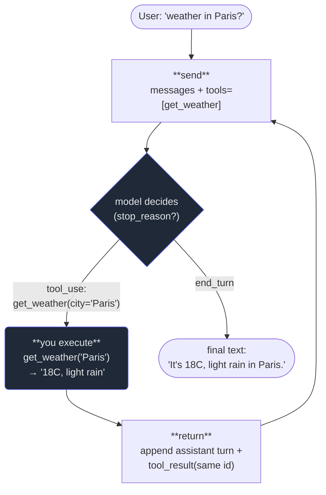

# 5. Tool use

## TL;DR

> **Tool use (a.k.a. function calling) lets the *model* call *your* functions.** Claude never runs code
> itself — it *asks*. You send `tools=[{"name", "description", "input_schema"}]` alongside your
> `messages`; if the model decides it needs one, the response comes back with `stop_reason ==
> "tool_use"` and a **`tool_use` block** in `content` carrying an `.id`, a `.name`, and a parsed
> `.input` dict. **You** execute the matching function, then re-call the API with the assistant turn
> appended *and* a `tool_result` block (same `tool_use_id`) carrying the output. Repeat until
> `stop_reason == "end_turn"`. Every `tool_use` id **must** get a matching `tool_result`. That loop —
> *model asks → you execute → you return → model continues* — is **literally the gather→act→verify
> agent loop from Part 2, Chapter 1, seen at the message level.** Claude Code's Read / Edit / Bash are
> tools defined exactly this way and sent to `/v1/messages`. This is the single most important feature
> for building agents.

## 1. Motivation

Chapter 4 made the model's *answer* trustworthy: a JSON schema turns the reply into a form you can
file. But often you don't want an answer at all — you want the model to **do something**. Look up
today's price. Run a query. Execute the learner's code and read the real output. None of that lives in
the model's frozen weights; it lives in *your* systems.

Make it concrete with this book's running example — the **Chapter 10 AI tutor** (the headline GAP:
Cortex's code-runner is **go-judge**, not an LLM; the app makes *no* Claude calls today). A learner
pastes a Python snippet and asks "why is this slow?" The honest answer depends on what the code
*actually does when run* — its real stdout, its real error, its real timing. The model can guess from
reading the source, but guessing is exactly what Part 1 told us not to trust. What we *want* is for the
model to say: *"before I answer, run this code and tell me what happened"* — and then explain the real
result.

Here's the thing: **we already have the hands.** Cortex exposes `POST /api/run`, which executes code in
the locked-down go-judge sandbox and returns stdout/stderr — the very endpoint this whole site is built
around. Tool use is the wire that connects the model's *decision* ("I should run this") to that
*existing* capability. We'd define a `run_code` tool, hand it to Claude, and when the model asks for it,
our harness calls `/api/run`, gets the real output, and feeds it back so the model can explain what
truly happened instead of hallucinating. (It is unbuilt — that's the GAP — but every piece exists; this
chapter is the missing wire.)

And here is the insight that makes the whole Part click: **this is the agent loop from Part 2.** There,
Claude Code did *gather context → act → verify* with Read/Edit/Bash. Those are not magic. They are
tool-use definitions sent to this same `/v1/messages` endpoint. The agent you watched in Part 2 *is*
this loop. We're now seeing it one level down — at the message level — and learning to build it
ourselves.

## 2. Intuition (Analogy)

Picture a **brilliant consultant advising you over the phone.** They know an enormous amount, but they
are *not in the room* — they cannot touch your computer. So when the problem needs a fact only your
machine holds, they can't go get it. What they *can* do is tell you exactly which button to press:
*"Run that query and read me the row count."* You run it; you read the number back; they continue
advising with that number in hand. Then maybe: *"Now open the log and tell me the last error."* You do
it, you read it back, they finish their advice.

Notice the division of labor. **The consultant decides *what* to do and *why*; you are the hands that
actually do it and report back.** They never touch the keyboard; you never make the strategic call.
Neither could solve the problem alone — the consultant lacks access, you lack the expertise — but
together, through that ask-do-report rhythm, you get there.

That is tool use exactly. **The model is the consultant; your harness is the hands.** The model emits
"please call `run_code(snippet)`" (it cannot run anything itself); your code executes it and reads the
result back; the model continues. And — the part beginners miss — **the model is still blind to your
computer.** It only ever *knows* what you read back to it. If you don't return the result, it's as if
the button was never pressed.

| | A plain chat reply | A coding agent (Part 2) | **Tool use (this chapter)** |
|---|---|---|---|
| Model can run code itself? | No | No | **No — it asks; you run** |
| Who decides *what* to do | The model (just talks) | The model | **The model** (emits `tool_use`) |
| Who *executes* the action | Nobody — it's text | The harness (Claude Code) | **You / your harness** |
| How the result gets back | n/a | Appended to context | **A `tool_result` you send** |
| The shape | one request → one reply | gather→act→verify loop | **the *same* loop, at the message level** |
| If you skip the result | n/a | agent "forgets" the action | model never learns it ran |

The middle and right columns are the same loop. Part 2 was this loop wrapped in a finished product
(Claude Code); this chapter is the loop in your own hands.

## 3. Formal Definition

**Tool use** is a protocol on the Messages API by which the model requests that *your* code run a named
function with arguments it chooses, and you return the result for it to use. You define each tool and
pass them alongside `messages`:

```json
{
  "tools": [
    {
      "name": "get_weather",
      "description": "Get the current weather for a city. Call this whenever the user asks about current weather, temperature, or conditions in a named place.",
      "input_schema": {
        "type": "object",
        "additionalProperties": false,
        "required": ["city"],
        "properties": { "city": { "type": "string", "description": "City name, e.g. \"Paris\"" } }
      }
    }
  ]
}
```

The `input_schema` is the *same kind of JSON schema* from Chapter 4 — here it constrains the **tool's
arguments** rather than the final answer (and `strict: true` on a tool makes that argument JSON valid by
construction, mechanism 2 from §3 of the last chapter). A `description` should be **prescriptive** —
tell the model *when* to call it ("Call this when the user asks about current weather"), not merely what
it does. The description is the model's only manual for the tool; a vague one gets the tool called at
the wrong times or not at all.

**The loop, precisely:**

1. **Send** `messages` + `tools`.
2. **Inspect `stop_reason`.** If it's `"tool_use"`, the response `content` contains one or more
   `tool_use` blocks, each with `.id` (a unique call id), `.name` (which tool), and `.input` (the
   arguments, already a parsed dict). It may also contain a `text` block — the model thinking out loud.
3. **You execute** the named function(s) with `.input`. The API never runs your code; it only asks.
4. **Append two turns:** first the assistant turn verbatim — `{"role": "assistant", "content":
   response.content}` (the API *requires* the `tool_use` turn be in the history) — then a user turn
   whose `content` is a **list** of `{"type": "tool_result", "tool_use_id": <the id>, "content": <result
   string>}`, one per call.
5. **Re-call** the API with the extended `messages`. Repeat from step 2 until `stop_reason ==
   "end_turn"` (the model is done and the final `text` is your answer).

The iron rule: **every `tool_use` id must get exactly one matching `tool_result`.** Miss one and the
API errors — the conversation has a dangling request.

| Term | Meaning |
|---|---|
| `tools` | The list you send with the request: each a `{name, description, input_schema}`. The model's menu of actions. |
| `input_schema` | A JSON schema (Chapter 4) constraining the tool's **arguments**. `strict: true` guarantees them valid by construction. |
| **prescriptive `description`** | Tells the model *when* to call the tool ("Call this when…"), not just what it does. The model's only manual. |
| `stop_reason == "tool_use"` | The model wants a tool. The response `content` holds the request block(s). (Contrast `end_turn` = finished.) |
| `tool_use` block | The request: `.id` (unique), `.name`, `.input` (parsed dict of args). One per requested call. |
| `tool_result` block | Your reply: `{"type":"tool_result", "tool_use_id": <id>, "content": <string>}`. `"is_error": true` flags a failed tool. |
| `tool_choice` | Steers tool use: `{"type":"auto"}` (default — model decides), `{"type":"any"}` (must use *some* tool), `{"type":"tool","name":"X"}` (force one), `{"type":"none"}` (forbid). |
| harness | *Your* code that runs the loop: inspects `stop_reason`, executes tools, posts `tool_result`s, re-calls. In Part 2 this was Claude Code. |

> The one sentence to keep: **tool use is the model proposing a function call; your harness disposing of
> it and reporting back — the *same* propose/execute/observe split as the Part 2 agent, now at the
> message level.** The model never touches your machine; it only knows what your `tool_result` tells it.

## 4. Worked Example

Take a question the model **can't** answer from its weights: *"What's the weather in Paris?"* The model
asks for a tool; we run it; we feed the result back; it answers. Watch the loop turn.



Three things to notice. **The back-edge** (`tool_use` → execute → return → *send again*) is the loop —
identical in shape to FAIL→gather in Part 2's diagram; the model keeps asking until it has what it
needs, then stops. **You are the hands**: the `you execute` node is *your* code, not the API's — the
model only ever *asked*. And **the result re-enters as a message**: the model learns the weather not by
magic but because your `tool_result` put it into the conversation. No `tool_result`, no knowledge.

Here is the **real SDK call**. It makes a network request and needs the `anthropic` package and a key,
so it does **not** run in our sandbox — it's here so you've seen the genuine article. This is the manual
loop the diagram describes:

```python
from anthropic import Anthropic

client = Anthropic()  # reads ANTHROPIC_API_KEY from the environment

# 1) DEFINE the tool. Note the PRESCRIPTIVE description -- it tells the model WHEN.
tools = [{
    "name": "get_weather",
    "description": "Get the current weather for a city. Call this whenever the user "
                   "asks about current weather, temperature, or conditions in a place.",
    "input_schema": {
        "type": "object",
        "additionalProperties": False,
        "required": ["city"],
        "properties": {"city": {"type": "string", "description": "City name, e.g. 'Paris'"}},
    },
}]

# Your real function -- in Cortex this could POST to go-judge's /api/run instead.
def get_weather(city):
    return {"Paris": "18C, light rain", "Tokyo": "26C, clear"}.get(city, "unknown")

messages = [{"role": "user", "content": "What's the weather in Paris?"}]

# 2) THE LOOP: re-call until the model stops asking for tools.
while True:
    response = client.messages.create(
        model="claude-opus-4-8", max_tokens=512, tools=tools, messages=messages,
        # tool_choice defaults to {"type": "auto"} -- the model decides whether to use a tool.
    )

    if response.stop_reason != "tool_use":
        text = next(b.text for b in response.content if b.type == "text")
        print(text)                       # -> "It's 18C, light rain in Paris right now."
        break

    # 3) The model asked. Append its turn VERBATIM, then run each requested tool.
    messages.append({"role": "assistant", "content": response.content})
    results = []
    for block in response.content:
        if block.type != "tool_use":
            continue
        output = get_weather(**block.input)        # block.input is a parsed dict
        results.append({
            "type": "tool_result",
            "tool_use_id": block.id,                # MUST match the request's id
            "content": str(output),
            # "is_error": True,                     # set this if the tool raised
        })

    # 4) Feed every result back in ONE user turn, then loop (re-call at the top).
    messages.append({"role": "user", "content": results})
```

That `while` loop *is* the harness. The SDK also ships a beta **tool runner** (the `@beta_tool`
decorator in Python, `betaZodTool` in TypeScript) that runs this loop *for you* — you write the
functions, it handles the round-trips. Use it in real code. But we teach the manual loop here because
once you've written it by hand, the runner holds no mysteries: it's doing exactly steps 2–4, over and
over, until `end_turn`.

## 5. Build It

We can't hit the network, so we'll **model** the loop — and the loop is the lesson, not the LLM. A
`fake_model(messages)` decides (deterministically) whether to *ask for a tool* or *give a final answer*,
returning the **real API shape** (a list of content blocks + a `stop_reason`). A `TOOLS` registry holds
real local Python functions (`add`, `get_weather`). The `run()` harness drives the loop, printing each
move: **model wants → executed → model final.** Stdlib only — no `anthropic`, no network. Three tasks:
two that need a tool, one that doesn't.

```python run
# ---------------------------------------------------------------------------
# The TOOLS: ordinary local Python functions the model is allowed to ask for.
# In a real app these would hit a database, an API, or -- in Cortex's case --
# the go-judge /api/run sandbox. Here they just return canned, deterministic
# data so the whole loop is reproducible with no network.
# ---------------------------------------------------------------------------
def add(a, b):
    return a + b

def get_weather(city):
    canned = {"Paris": "18C, light rain", "Tokyo": "26C, clear"}
    return canned.get(city, "unknown city")

# The registry the HARNESS dispatches on -- name -> function. This mirrors the
# tools=[...] list you send to the API, except here we also hold the code.
TOOLS = {
    "add": add,
    "get_weather": get_weather,
}

# ---------------------------------------------------------------------------
# The MODEL stand-in. The real Claude decides, from the conversation so far,
# whether to (a) ask for a tool or (b) give a final answer. We fake that
# decision deterministically by scanning the messages -- but the SHAPE of what
# we return is exactly the real API's shape: a list of content blocks, each a
# {"type": "tool_use"|"text", ...}, plus a stop_reason.
# ---------------------------------------------------------------------------
def fake_model(messages):
    # What did the user originally ask?
    first_user = next(m["content"] for m in messages if m["role"] == "user")

    # Have we already fed a tool_result back in? If so, the model has what it
    # needs and can finish (stop_reason == "end_turn").
    have_results = {
        block["name"]
        for m in messages if m["role"] == "user" and isinstance(m["content"], list)
        for block in m["content"] if block.get("type") == "tool_result"
    }

    # --- Task A: "what is 2 + 3?" -> ask for add(2,3), then answer. ---
    if "2 + 3" in first_user:
        if "add" not in have_results:
            return {
                "stop_reason": "tool_use",
                "content": [{
                    "type": "tool_use", "id": "call_1",
                    "name": "add", "input": {"a": 2, "b": 3},
                }],
            }
        result = _result_for("add", messages)
        return {"stop_reason": "end_turn",
                "content": [{"type": "text", "text": f"The answer is {result}."}]}

    # --- Task B: "weather in Paris?" -> ask for get_weather, then answer. ---
    if "weather" in first_user.lower():
        if "get_weather" not in have_results:
            return {
                "stop_reason": "tool_use",
                "content": [{
                    "type": "tool_use", "id": "call_1",
                    "name": "get_weather", "input": {"city": "Paris"},
                }],
            }
        result = _result_for("get_weather", messages)
        return {"stop_reason": "end_turn",
                "content": [{"type": "text", "text": f"It's {result} in Paris right now."}]}

    # --- No tool needed: answer straight away (stop_reason == "end_turn"). ---
    return {"stop_reason": "end_turn",
            "content": [{"type": "text", "text": "I can help with math or weather."}]}


def _result_for(tool_name, messages):
    """Find the result string we earlier fed back for a given tool name."""
    for m in messages:
        if m["role"] == "user" and isinstance(m["content"], list):
            for block in m["content"]:
                if block.get("type") == "tool_result" and block["name"] == tool_name:
                    return block["content"]
    return None


# ---------------------------------------------------------------------------
# The HARNESS loop. This is the whole chapter in ~15 lines. It is structurally
# IDENTICAL to client.messages.create() in a while-loop:
#   1. send messages -> get a response
#   2. if stop_reason != "tool_use", we're done -> print the final text
#   3. otherwise, for EACH tool_use block: run the tool, build a tool_result
#   4. append the assistant turn, then a user turn carrying the tool_result(s)
#   5. loop. Every tool_use id gets exactly one matching tool_result.
# ---------------------------------------------------------------------------
def run(user_text, max_turns=6):
    messages = [{"role": "user", "content": user_text}]
    print(f"USER: {user_text}")

    for turn in range(1, max_turns + 1):
        response = fake_model(messages)

        if response["stop_reason"] != "tool_use":
            final = next(b["text"] for b in response["content"] if b["type"] == "text")
            print(f"  model final: {final}")
            return final

        # The model wants one or more tools. Append its turn verbatim first --
        # the API requires the assistant tool_use turn to be in the history.
        messages.append({"role": "assistant", "content": response["content"]})

        tool_results = []
        for block in response["content"]:
            if block["type"] != "tool_use":
                continue
            name, args, call_id = block["name"], block["input"], block["id"]
            arglist = ", ".join(f"{v!r}" for v in args.values())
            print(f"  model wants: {name}({arglist})  [id={call_id}]")

            # YOU execute the tool. Errors -> is_error: True (shown below).
            try:
                output = TOOLS[name](**args)
                is_error = False
            except Exception as exc:                 # noqa: BLE001
                output, is_error = f"error: {exc}", True

            print(f"  executed  -> {output}")
            tool_results.append({
                "type": "tool_result",
                "tool_use_id": call_id,
                "name": name,                 # (for our lookup; real API keys off the id)
                "content": str(output),
                "is_error": is_error,
            })

        # Feed every result back in ONE user turn, then loop.
        messages.append({"role": "user", "content": tool_results})

    raise RuntimeError("hit max_turns without finishing")


print("=== Task A: a tool is needed (math) ===")
a = run("What is 2 + 3?")
assert a == "The answer is 5.", a

print()
print("=== Task B: a different tool is needed (weather) ===")
b = run("What's the weather in Paris?")
assert b == "It's 18C, light rain in Paris right now.", b

print()
print("=== Task C: no tool is needed (model answers directly) ===")
c = run("Hello there!")
assert c == "I can help with math or weather.", c

print()
print("SUMMARY: 2 tasks used a tool (add, get_weather); 1 answered with no tool.")
```

Running it prints the loop turning for each task:

```
=== Task A: a tool is needed (math) ===
USER: What is 2 + 3?
  model wants: add(2, 3)  [id=call_1]
  executed  -> 5
  model final: The answer is 5.

=== Task B: a different tool is needed (weather) ===
USER: What's the weather in Paris?
  model wants: get_weather('Paris')  [id=call_1]
  executed  -> 18C, light rain
  model final: It's 18C, light rain in Paris right now.

=== Task C: no tool is needed (model answers directly) ===
USER: Hello there!
  model final: I can help with math or weather.

SUMMARY: 2 tasks used a tool (add, get_weather); 1 answered with no tool.
```

Read the three runs. In A and B the model **asks** (a `tool_use` block), the harness **runs** the real
Python and **returns** the result, and only *then* does the model give its final answer — the answer
depends on a value it could not have known without the tool. In C the model needs nothing external, so
`stop_reason` is `end_turn` on the first pass and the loop exits immediately — the model **chose** not
to call a tool, exactly as `tool_choice: "auto"` allows. That choice-per-turn is the agency from Part 2.
**Now break it:** in the harness, comment out the line that appends `tool_results` back into `messages`.
The model never sees the result, so on the next turn it asks for the *same* tool again — and `run()`
spins until it hits `max_turns` and raises. That is the message-level form of the Part 2 lesson: skip
the feedback and the agent loops forever, knowing nothing. The `tool_result` *is* the loop's memory.

## 6. Trade-offs & Complexity

| With tool use | Plain text-only generation |
|---|---|
| The model can act on the world: fetch live data, run code, query your DB | Limited to what's in its weights + your prompt |
| Answers grounded in **real** results (e.g. go-judge's actual stdout) | Answers from memory — may confidently hallucinate |
| You control exactly which capabilities exist (the `tools` list) | No capabilities; it can only talk |
| Multi-step: chain tools until the goal is met (the loop) | One reply, done |
| You must **run the loop** and post a `tool_result` for every call | No loop, no bookkeeping — just request→reply |
| Each round-trip is another API call (latency + tokens, Chapter 9) | One call, cheapest path |
| New attack surface: the model triggers *your* code on its inputs | Output is inert text; far smaller blast radius |

The trade is the same one Part 2 named: **acting is more powerful and more dangerous than talking.** A
text reply can be wrong; a tool call can *do* something wrong — delete a row, spend money, run untrusted
code. So tool use buys capability at the price of a loop to run and a surface to defend. The discipline
is to expose *only* the tools a task needs, give each a tight `input_schema`, and treat every `.input`
as untrusted (it was chosen by a model, possibly steered by a malicious user). Powerful, but it's the
sharp end of the API — handle accordingly.

## 7. Edge Cases & Failure Modes

- **Forgetting a `tool_result` (or mismatching the id).** Every `tool_use` id needs exactly one
  `tool_result` with the same `tool_use_id`. Miss one, or use the wrong id, and the next call errors on
  a dangling request. In the Build It, dropping the result entirely made the model re-ask forever.
- **Not appending the assistant turn.** You must put `{"role":"assistant","content": response.content}`
  (the `tool_use` turn) into history *before* the `tool_result`. Skip it and the conversation is
  malformed — a result with no request to answer.
- **Vague tool descriptions.** A `description` that says only *what* the tool does, not *when* to use
  it, gets it called at wrong times or ignored. Be prescriptive: "Call this when the user asks about
  current weather." The description is the model's whole manual.
- **Assuming a tool *will* be called.** With `tool_choice: "auto"` the model may answer directly (Task C)
  — correct behavior, not a bug. If your flow *requires* a tool, set `{"type":"any"}` or force a
  specific one with `{"type":"tool","name":"X"}`.
- **Letting a tool error crash the loop.** When your function raises, don't blow up the harness — return
  the `tool_result` with `"is_error": true` and an error string. The model can read it and recover (try
  another city, fix the args, or apologize) instead of the whole request dying.
- **Trusting `.input` blindly.** The arguments were chosen by the model and may reflect a user trying to
  misuse the tool (e.g. `run_code` with malicious code, a path-traversal filename). Validate and sandbox
  exactly as you would any untrusted input — go-judge's `--network none` sandbox is precisely this kind
  of guardrail.
- **Runaway tool loops.** A model can get stuck calling the same tool repeatedly. Cap the iterations
  (the `max_turns` in our harness) and break out, just as Claude Code bounds its agent loop in Part 2.
- **Parallel tool calls.** One response can contain *several* `tool_use` blocks at once. Handle them
  *all* — run each, return one `tool_result` per id in a single user turn — not just the first.

## 8. Practice

> **Exercise 1 — Trace the loop.** A learner asks the AI tutor, "what does this print?" and the tutor
> has a `run_code` tool wired to `/api/run`. Walk through the exact sequence of API calls and message
> appends from the user's question to the final explanation. How many times is `messages.create()`
> called, and what's in `messages` just before the *second* call?

<details>
<summary><strong>Answer</strong></summary>

Two calls (§3 loop):

1. **Call 1** — you send `messages = [{"role":"user","content":"what does this print? <code>"}]` plus
   `tools=[run_code]`. The model can't know the output without running it, so it returns `stop_reason ==
   "tool_use"` with a `tool_use` block, e.g. `run_code(source=<code>)`, id `call_1`.
2. **You execute** — your harness POSTs the code to `/api/run`, gets the real stdout back, and builds a
   `tool_result` with `tool_use_id: "call_1"` carrying that stdout. You append **two** turns: the
   assistant `tool_use` turn verbatim, then the user `tool_result` turn.
3. **Call 2** — you re-call with the extended history. Just before it, `messages` holds **three** turns:
   the original user question, the assistant `tool_use` turn, and the user `tool_result` (the real
   output). Now the model has the actual stdout and returns `stop_reason == "end_turn"` with the
   explanation.

The explanation is trustworthy because it's grounded in go-judge's *real* output, not a guess — the
whole point of wiring the tool to the runner this site already has.

</details>

> **Exercise 2 — Where does the code run?** A teammate says, "so when I add a `run_code` tool, *Claude*
> executes the learner's Python." Correct them precisely using the §2 analogy, and name the one field
> in the response that signals "I want a tool" and the one you send back to report the result.

<details>
<summary><strong>Answer</strong></summary>

Claude **never** runs anything — it only *asks*. Like the consultant on the phone (§2), the model
decides a tool is needed and emits a request; **your harness** is the hands that actually call
`/api/run` and execute the code. The model stays blind to your machine and learns the result *only*
from what you send back.

- The signal that the model wants a tool is **`stop_reason == "tool_use"`** (the response `content` then
  holds the `tool_use` block(s) with `.id`, `.name`, `.input`).
- The thing you send back to report the result is a **`tool_result`** block — `{"type":"tool_result",
  "tool_use_id": <the same id>, "content": <output>}` — in a user turn, after appending the assistant
  `tool_use` turn.

This separation is exactly the Part 2 model→harness seam: the model proposes, the harness disposes. It's
also why tool use is safe to bound — *you* control whether and how a proposed call actually runs.

</details>

> **Exercise 3 — Design the tool.** Sketch the `run_code` tool definition for the Cortex AI tutor: its
> `name`, a *prescriptive* `description`, and an `input_schema`. Then name the safety measure that makes
> exposing it to a model sane.

<details>
<summary><strong>Answer</strong></summary>

```json
{
  "name": "run_code",
  "description": "Execute a code snippet in the Cortex sandbox and return its stdout and stderr. Call this whenever answering the user requires knowing what their code actually prints, outputs, or errors with — never guess the output, run it.",
  "input_schema": {
    "type": "object",
    "additionalProperties": false,
    "required": ["language", "source"],
    "properties": {
      "language": { "type": "string", "enum": ["python", "java", "scala"] },
      "source":   { "type": "string", "description": "The complete program to run" }
    }
  }
}
```

The `description` is **prescriptive** — it tells the model *when* to reach for the tool ("never guess
the output, run it"), which is what gets it called at the right moments (§3). `additionalProperties:
false` and the `enum` keep the arguments clean (Chapter 4); `strict: true` on the tool would make them
valid by construction.

The safety measure: the tool runs the model-chosen `source` inside go-judge's **locked-down sandbox**
(`--network none`, resource caps) — the same isolation this site already uses for `/api/run`. Because
`.input` is untrusted (a model, possibly steered by a malicious learner, chose it), the sandbox is what
makes handing a model a code-execution tool sane rather than reckless (§7). It's also why this is a
*designed* GAP, not a built feature — the wiring is straightforward; doing it safely is the work.

</details>

```quiz
{
  "prompt": "In the tool-use loop, the API returns a response with `stop_reason == \"tool_use\"` and a `tool_use` block for `get_weather(city=\"Paris\")`. What happens next, and who runs `get_weather`?",
  "input": "Choose one:",
  "options": [
    "YOUR harness runs get_weather('Paris'), then you re-call the API with the assistant turn appended plus a tool_result block carrying the same tool_use_id and the output — repeating until stop_reason is end_turn",
    "The Anthropic API runs get_weather itself on its servers and returns the weather in the next field of the same response",
    "The model already knows the weather from its training data, so you just read it from the text block and ignore the tool_use block",
    "You must start a brand-new conversation because tool_use ends the current one"
  ],
  "answer": "YOUR harness runs get_weather('Paris'), then you re-call the API with the assistant turn appended plus a tool_result block carrying the same tool_use_id and the output — repeating until stop_reason is end_turn"
}
```

## In the Wild

- **[Anthropic — Tool use (function calling) overview](https://docs.claude.com/en/docs/agents-and-tools/tool-use/overview)**
  — the primary source: the `tools` schema, the `tool_use` / `tool_result` round-trip, `tool_choice`,
  `is_error`, and parallel tool calls. Everything in this chapter, from the spec.
- **[Anthropic — Building effective agents](https://www.anthropic.com/engineering/building-effective-agents)**
  — the essay behind Part 2: an agent is a model using tools in a loop. This chapter is that loop's
  mechanics; the essay is when and why to build it.
- **[Claude Code documentation](https://docs.claude.com/en/docs/claude-code/overview)** — Claude Code's
  Read / Edit / Bash are tool-use definitions sent to this same endpoint. The agent you used in Part 2
  is this loop, productized.

---

**Next:** the tutor now *acts* — it can run the learner's code and answer from the real result. But a
long explanation still arrives all at once, after a frozen pause. Delivering it word-by-word as the
model writes it — and why that's not just nicer but sometimes necessary — is streaming. →
[6. Streaming](/cortex/the-claude-stack/building-with-the-claude-api/streaming)
