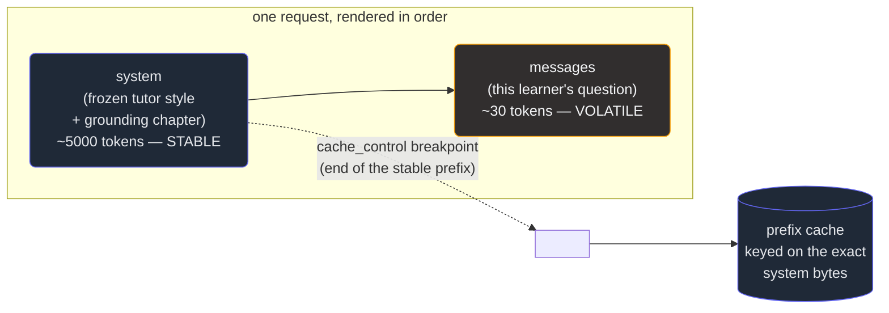

# 7. Prompt caching

## TL;DR

> If thousands of requests start with the *same* large chunk — a frozen system prompt, a big shared
> document — you're paying to re-read those identical tokens on every call. **Prompt caching** lets
> you pay full price for that chunk **once** and roughly **0.1×** on every reuse, with a latency win
> on top. The mechanism is exactly one rule: **the cache is a *prefix match*.** The cache key is the
> exact bytes from the start of the request up to a `cache_control` breakpoint, so put **stable
> content first, volatile content last**, and know that **one byte changed anywhere in the prefix
> invalidates everything from that byte on**. The whole discipline: stable-first, mark the end of the
> stable part, and — Part 1's discernment — **verify the hit** via `usage.cache_read_input_tokens`
> instead of *assuming* it cached. Render order is `tools` → `system` → `messages`.

## 1. Motivation

Picture the AI tutor Cortex doesn't have yet (it's the Chapter 10 gap — our app code never calls
Claude). To answer a learner's question well, that tutor needs a *lot* of standing context in every
single call: the house tutoring style ("be Socratic, never just hand over the answer"), plus the
**relevant chapter** pasted in as grounding so it answers from *our* material, not its own guesses.
Call that 5,000 tokens of preamble. Then the learner's actual question — "why is my BST lookup
slow?" — is maybe 30 tokens.

Now multiply. A thousand learners ask a thousand different questions about that same chapter today.
The 30-token questions are all different. But the 5,000-token preamble is **byte-for-byte identical**
across all thousand calls. With a plain Messages API request, you send and pay for those 5,000 tokens
a thousand times — five million tokens of pure repetition — and the model re-reads them from scratch
every time, which costs *latency* too.

That's the waste prompt caching removes. The preamble is a perfect **shared prefix**: cache it once,
and every learner's question (the cheap, varying *suffix*) rides on top of the cached preamble for a
tenth of the price. This chapter is about how that cache works — and it all reduces to a single rule
about prefixes.

## 2. Intuition (Analogy)

Think of a brilliant tutor preparing to take questions on one chapter. The slow way: for *every*
student who walks up, they re-read the entire chapter front to back, *then* answer the question. A
thousand students, a thousand full re-reads. Accurate, but absurdly wasteful.

The fast way: they **memorize the chapter once** — that's the expensive part, the *cache write*. Now
when a student asks something, they answer straight from memory and only have to *think about the new
question* — that's the cheap *cache read*. The big fixed cost was paid a single time; each student
after that is nearly free.

Here's the catch that makes it a *prefix* and not just "a cache": their memory is sequential, built
from the first word forward. **Change one word near the start of the chapter and they must
re-memorize from that word on** — everything downstream of the edit is now untrusted. Append a new
paragraph at the *end*? Fine, the memorized part still holds. Insert a sentence on *page one*? The
whole rest is invalidated. That asymmetry — front-edits are expensive, end-additions are cheap — is
the entire reason we put **stable content first and volatile content last.**

| | Re-read every time (no cache) | **Memorize once (prompt cache)** |
|---|---|---|
| The big fixed chunk (chapter / system prompt) | Re-read & re-paid every request | **Paid once (write ~1.25×), then ~0.1× per reuse** |
| The new question (the suffix) | Read fresh each time (unavoidable) | Read fresh each time (still full price) |
| Edit *one word at the front* | Costs nothing extra (re-read anyway) | **Re-memorize from there on — cache invalidated** |
| Add a paragraph at the *end* | Re-read anyway | **Cheap — earlier memory still valid** |
| Who pays for repetition | You, every single call | **Nobody, after the first call** |

## 3. Formal Definition

**Prompt caching stores the result of processing a *prefix* of your request, keyed on the exact bytes
of that prefix, so identical prefixes on later requests are billed at a steep discount instead of
reprocessed.**

The request is rendered in a fixed order — **`tools` → `system` → `messages`** — and you mark the end
of the cacheable prefix by attaching `"cache_control": {"type": "ephemeral"}` to a content block. The
cache key is every byte from the start of the render up to and including that block. On the next
request, the API compares prefixes: the longest matching cached prefix is served from cache; the
first differing byte and everything after it is processed (and billed) normally.

| Term | Meaning |
|---|---|
| **Prefix** | The bytes from the start of the rendered request (`tools`, then `system`, then early `messages`) up to a `cache_control` breakpoint. The cache key. |
| **Breakpoint** | A `"cache_control": {"type": "ephemeral"}` marker on a content block. Says "cache everything up to here." Max **4** per request. |
| **Cache write** | First time a prefix is seen: it's processed and stored. Billed **~1.25×** input price (5-min TTL) or **~2×** (1-hour TTL). Reported as `cache_creation_input_tokens`. |
| **Cache read (hit)** | A later request whose prefix matches: served from cache. Billed **~0.1×**. Reported as `cache_read_input_tokens`. |
| **TTL** | How long the entry lives unused. **5 minutes** (default) or **1 hour**. Each reuse refreshes it. |
| **Minimum cacheable prefix** | ~**1024–4096 tokens** depending on model. Below it, the prefix **silently won't cache** — no error, just `cache_creation_input_tokens: 0`. |

> The rule in one line: **the cache is a prefix match.** Stable content goes first so the prefix stays
> identical across requests; volatile content (the user's question, a timestamp, a request ID) goes
> **after** the last breakpoint, where changing it costs nothing. Get the *ordering* right and
> caching mostly works for free; get it wrong and no number of `cache_control` markers will save you.

## 4. Worked Example

The render order, and where the cache boundary sits, for the AI-tutor call:



Everything left of the cut is identical for every learner, so it's cached once and read cheaply
forever after. The learner's question sits *after* the breakpoint, so it varies freely without
disturbing the cache. Here's the **real SDK call** that does this — it makes a network request, so it
does **not** run in our sandbox; it's here so you've seen the actual shape:

```python
import anthropic

client = anthropic.Anthropic()

SYSTEM_STYLE = "You are the Cortex AI tutor. Be Socratic; never give the final answer outright."
CHAPTER_TEXT = load_chapter("trees/bst")  # the big, frozen grounding doc (~5000 tokens)

def ask_tutor(question: str):
    return client.messages.create(
        model="claude-opus-4-8",
        max_tokens=1024,
        # system is a LIST of blocks so we can mark a cache breakpoint on the stable part.
        system=[
            {"type": "text", "text": SYSTEM_STYLE},
            {
                "type": "text",
                "text": CHAPTER_TEXT,
                "cache_control": {"type": "ephemeral"},  # <-- end of the stable prefix
            },
        ],
        # The volatile question goes in messages — AFTER the cached prefix.
        messages=[{"role": "user", "content": question}],
    )

r1 = ask_tutor("Why is my BST lookup slow?")   # cold: writes the cache (~1.25x on the prefix)
print(r1.usage.cache_creation_input_tokens)    # -> ~5000  (we just paid to store it)
print(r1.usage.cache_read_input_tokens)        # -> 0

r2 = ask_tutor("How do I balance a BST?")      # warm: same prefix -> HIT (~0.1x on the prefix)
print(r2.usage.cache_read_input_tokens)        # -> ~5000  (served from cache, cheap)
print(r2.usage.input_tokens)                   # -> just the ~6 tokens of the new question
```

Note the **discernment** move on the last two lines: we don't *assume* the second call hit the cache,
we *read* `cache_read_input_tokens` and confirm it. (And the cache-warm trick this repo relies on for
its own dev loop is the same idea — the entry has a 5-minute TTL, so if you fire a cheap "warmup" call
just before a burst of real ones, they all find the prefix already hot.)

## 5. Build It

We can't hit the network here, so we'll **model the cache** in deterministic stdlib Python. A request
is `(prefix, suffix)`; `cost()` hashes **only the prefix** with `hashlib`. Hash already seen → **HIT**
(prefix billed at 0.1×); hash new → **MISS** (billed 1.25× and stored, so the *next* identical prefix
hits). The suffix is always full price. Then we reproduce the number-one caching bug: a per-request
timestamp baked **into** the prefix, which makes every call a MISS.

```python run
import hashlib

# Price multipliers, as fractions of the base input-token price.
READ = 0.1    # cache_read_input_tokens cost ~0.1x
WRITE = 1.25  # cache_creation_input_tokens cost ~1.25x (5-min TTL)
FULL = 1.0    # uncached input tokens cost full price

# We bill in "token units". Pretend 1 char == 1 token to keep it readable.
def toks(s):
    return len(s)

def prefix_hash(prefix):
    """The cache key: the EXACT bytes of the prefix. One byte changes -> new key."""
    return hashlib.sha256(prefix.encode("utf-8")).hexdigest()

def cost(prefix, suffix, cache):
    """Return (verdict, price) and mutate `cache` (the live set of cached prefix-hashes)."""
    key = prefix_hash(prefix)
    if key in cache:                       # HIT: prefix already cached
        prefix_price = toks(prefix) * READ
        verdict = "HIT "
    else:                                  # MISS: pay the write premium, store it
        prefix_price = toks(prefix) * WRITE
        cache.add(key)
        verdict = "MISS"
    suffix_price = toks(suffix) * FULL     # the volatile suffix is never cached
    return verdict, prefix_price + suffix_price

def show(label, verdict, price):
    print(f"{label:<26} {verdict}  cost = {price:7.1f}")


# The big STABLE prefix: a Cortex AI-tutor's frozen system prompt + a grounding
# chapter. Identical across thousands of learners. This is the cache target.
SYSTEM = (
    "You are the Cortex AI tutor. House style: Socratic, encouraging, never "
    "give the final answer outright. GROUNDING CHAPTER (verbatim): A binary "
    "search tree keeps left < node < right, so lookup is O(log n) on a "
    "balanced tree and O(n) when it degenerates to a list. " * 20  # ~big prefix
)

print("=" * 58)
print("Three learners, same frozen tutor prefix, different questions")
print("=" * 58)

cache = set()  # fresh, cold cache for this session

# Request A: learner 1. Cold cache -> MISS, we pay the write premium once.
vA, cA = cost(SYSTEM, "Why is my BST lookup slow?", cache)
show("A (learner 1, cold)", vA, cA)

# Request B: learner 2, SAME prefix, different question -> HIT, prefix is cheap.
vB, cB = cost(SYSTEM, "How do I balance a BST?", cache)
show("B (learner 2, same)", vB, cB)

# Request C: learner 3, SAME prefix again -> HIT again.
vC, cC = cost(SYSTEM, "What is an AVL rotation?", cache)
show("C (learner 3, same)", vC, cC)

assert vA == "MISS"
assert vB == "HIT " and vC == "HIT "
assert cB < cA and cC < cA   # cached requests are cheaper than the cold one

# Break-even: 2 cold full-price calls vs 1 write + 1 read of the prefix.
p = toks(SYSTEM)
two_cold = 2 * p * FULL                 # no cache at all, twice
write_then_read = p * WRITE + p * READ  # cache once, reuse once
print()
print(f"prefix size (tokens)         {p}")
print(f"2x uncached prefix           {two_cold:7.1f}")
print(f"1x write + 1x read           {write_then_read:7.1f}")
assert write_then_read < two_cold       # caching wins from the 2nd request
print("=> caching the prefix pays off by the 2nd request.")

print()
print("=" * 58)
print("The SILENT INVALIDATOR: a timestamp in the prefix")
print("=" * 58)

def system_with_clock(fake_now):
    # The classic bug: interpolating a per-request value INTO the prefix.
    return f"[generated at {fake_now}] " + SYSTEM

cache2 = set()  # fresh cache for the buggy version
verdicts = []
for fake_now in ("12:00:00", "12:00:01", "12:00:02"):
    pre = system_with_clock(fake_now)            # prefix differs every request
    v, c = cost(pre, "Why is my BST lookup slow?", cache2)
    verdicts.append(v)
    show(f"clock={fake_now}", v, c)

# Every prefix is unique -> every request is a MISS. Reads stayed at zero.
assert verdicts == ["MISS", "MISS", "MISS"]
reads = sum(1 for v in verdicts if v == "HIT ")
print(f"cache reads across 3 identical questions: {reads}")
assert reads == 0
print("=> 0 reads: a per-request byte in the prefix defeats the cache.")
print()
print("All assertions passed.")
```

Running it prints learner A as a **MISS** (cost ~6576 — full write premium on the prefix), then B and
C as **HIT**s at roughly a tenth of that (~547), and confirms `1x write + 1x read` (7074) beats `2x
uncached` (10480) — caching pays off by the second request. Then the buggy version: three identical
questions, three **MISS**es, **0 cache reads** — because a per-request timestamp lives *inside* the
prefix. That zero is exactly the signal §7 tells you to watch for.

**Now break it the other way.** Move the volatile `[generated at ...]` string from the front of the
prefix to the *suffix* (append it to the question instead) and re-run: the prefix becomes constant
again, and B and C flip back to HITs. Stable-first, volatile-last — in two lines you can feel the
whole rule.

## 6. Trade-offs & Complexity

| | Caching a shared prefix | Not caching (plain request) |
|---|---|---|
| Cost of the fixed prefix | Paid **once** at ~1.25× write, then **~0.1×** per reuse | Paid at **1.0×** on *every* request |
| Break-even | ~**2 requests** (5-min TTL); ~3 with the 2× 1-hour write | n/a — never amortizes |
| Latency | Lower after the write — the model skips reprocessing the prefix | Full prefix reprocessed every call |
| Code complexity | A little: order content stable→volatile, place a breakpoint, watch usage | None — but you pay for it forever |
| Failure mode | A *silent invalidator* makes every call a MISS (you pay 1.25×, gain nothing) | No silent failures — just consistently expensive |
| Best when | Big prefix (≳1024–4096 tok) reused ≥2× within the TTL | Tiny prefix, or each request is unique from the first token |

The deal: a small amount of ordering discipline (and the habit of *verifying* the hit) buys a large,
ongoing cost-and-latency win — **but only when the prefix is genuinely shared and genuinely large.**
A 200-token "system prompt" reused twice isn't worth a breakpoint: it's below the minimum, so it
silently won't cache, and even if it did the savings are noise. Caching is for the *fat, frozen*
prefix.

## 7. Edge Cases & Failure Modes

- **Silent invalidators in the prefix.** A `datetime.now()` or a `uuid4()` or a per-request ID
  interpolated into the system prompt changes the prefix bytes every call → every request is a MISS
  and you pay the *write* premium each time. **Tell** by reads staying at 0 across identical-looking
  requests; **fix** by moving the volatile value after the last breakpoint.
- **Unsorted `json.dumps()`.** Serializing a dict (or iterating a `set`) without a stable order makes
  byte-identical *data* render as different *bytes*. Use `json.dumps(obj, sort_keys=True)`.
- **A per-request varying tool set.** `tools` render *first* (position 0). Add, drop, or reorder a
  tool and the entire prefix — system and messages included — is invalidated. Keep the tool list
  fixed and deterministically ordered.
- **Volatile content placed *before* stable content.** Order matters, not intent. If the changing
  question sits ahead of the frozen doc in the render, nothing after it can cache. Stable first.
- **Prefix below the minimum.** Under ~1024–4096 tokens (model-dependent) the breakpoint is silently
  ignored: `cache_creation_input_tokens` stays 0. No error — just no caching. Don't bother caching
  tiny prefixes.
- **TTL expiry.** Entries live 5 minutes (or 1 hour) *unused*; after a quiet gap the next call is a
  cold write again. For bursty traffic, a cheap warm-up call (or the 1-hour TTL) keeps it hot.
- **Assuming instead of verifying.** The cardinal sin (Part 1's discernment). "I added
  `cache_control`, so it's cached" is a belief, not a fact. Read `cache_read_input_tokens`.

## 8. Practice

> **Exercise 1 — Order the call.** You're building the Cortex tutor. You have: (a) a 4,000-token
> frozen tutoring-style + grounding-chapter block, and (b) the learner's 25-token question that
> differs every request. Where does each go in the rendered request, and on which one do you put the
> `cache_control` breakpoint? Why does swapping their order ruin caching?

<details>
<summary><strong>Answer</strong></summary>

The stable 4,000-token block goes **first** (in `system`, since render order is `tools` → `system` →
`messages`), and the breakpoint `{"type": "ephemeral"}` goes on **that block** — it marks the end of
the cacheable prefix. The volatile 25-token question goes **last**, in `messages`, *after* the cached
prefix.

Swapping them ruins caching because the cache is a **prefix match** keyed on the bytes from the start.
If the changing question rendered first, the prefix would differ on every request, so the cache key
would never repeat — every call a MISS, every call paying the 1.25× write premium. Stable-first,
volatile-last is the whole rule; it's not a style preference, it's what makes the prefix bytes
identical across calls.

</details>

> **Exercise 2 — Find the silent invalidator.** A teammate caches a big system prompt, but the bill
> doesn't drop and reads are flat. The prompt starts with
> `f"You are the tutor. Session started {datetime.now()}.\n" + CHAPTER`. Using the §5 model, explain
> in one or two sentences exactly what's wrong and the fix.

<details>
<summary><strong>Answer</strong></summary>

`datetime.now()` is interpolated **into the prefix**, so the first bytes of the system prompt differ
on every request — exactly the buggy `system_with_clock()` case in §5, where three identical
questions produced three MISSes and **0 cache reads**. Since the cache key is the prefix bytes, a
value that changes per request means the key never repeats: every call is a cold write at ~1.25×, so
the bill doesn't drop.

The fix is to get the volatile timestamp **out of the prefix** — drop it entirely if it's not
load-bearing, or move it *after* the last `cache_control` breakpoint (e.g. into the user message),
where it can change freely without disturbing the cached prefix. You'd confirm the fix by watching
`cache_read_input_tokens` go from 0 to roughly the prefix size on the second request.

</details>

> **Exercise 3 — Is it worth it?** You have a 600-token shared preamble reused on ~50 requests per
> minute, all within a few seconds of each other. Should you cache it? What if the preamble were
> 6,000 tokens instead? Name the two facts that decide it.

<details>
<summary><strong>Answer</strong></summary>

The two deciding facts are the **minimum cacheable prefix** (~1024–4096 tokens, model-dependent) and
the **break-even / TTL** (caching pays off from ~2 reuses within the 5-minute window).

- **600 tokens:** likely **not worth it** — it's below the minimum on most models, so the breakpoint
  is silently ignored (`cache_creation_input_tokens` stays 0) and nothing caches no matter how often
  it's reused. Even where it does clear the bar, the savings on 600 tokens are small.
- **6,000 tokens:** **absolutely cache it.** It clears the minimum comfortably, the reuse rate (50/min)
  is far above the ~2-request break-even, and the requests cluster well inside the 5-minute TTL so the
  entry stays hot. You'd pay the 1.25× write once and ~0.1× on the rest — a large, sustained win.

Reuse frequency alone isn't enough; the prefix also has to be *big enough to cache at all*.

</details>

```quiz
{
  "prompt": "Your AI-tutor caches a large frozen system prompt, but across thousands of identical-prefix requests `response.usage.cache_read_input_tokens` stays 0. What is the most likely cause?",
  "input": "Choose one:",
  "options": [
    "A silent invalidator inside the prefix — e.g. a `datetime.now()`/UUID in the system prompt or an unsorted `json.dumps` — changing the prefix bytes so the cache key never repeats",
    "The cache only works when you also send `stream: true`",
    "Caching is automatic and never needs verifying, so the field is simply always 0",
    "The `messages` array must be sent before `system` for caching to engage"
  ],
  "answer": "A silent invalidator inside the prefix — e.g. a `datetime.now()`/UUID in the system prompt or an unsorted `json.dumps` — changing the prefix bytes so the cache key never repeats"
}
```

## Your Turn

Before you move on, check your understanding with the coach — explain the idea, apply it, weigh the trade-offs, then defend your reasoning.

<div class="concept-coach"></div>

## In the Wild

- **[Anthropic — Prompt caching](https://docs.claude.com/en/docs/build-with-claude/prompt-caching)** —
  the primary reference: `cache_control`, breakpoints, TTLs, per-model minimums, and the exact `usage`
  fields. Read this for the authoritative rules behind this chapter.
- **[Anthropic — Pricing](https://docs.claude.com/en/docs/about-claude/pricing)** — the actual cache
  write (1.25× / 2×) and read (0.1×) multipliers per model, so you can compute your own break-even.
- **[Anthropic Cookbook — Prompt caching recipes](https://github.com/anthropics/anthropic-cookbook)** —
  runnable notebooks that cache big documents and print the `cache_creation` / `cache_read` token
  counts, so you can *see* the hit instead of assuming it.

---

**Next:** caching handles the *repeated* part of a request cheaply. But Claude can also read things
that aren't text at all — screenshots, diagrams, scanned PDFs. How do images get into a `messages`
array, and what changes when they do? → [8. Vision & multimodal](/cortex/the-claude-stack/building-with-the-claude-api/vision-and-multimodal)
