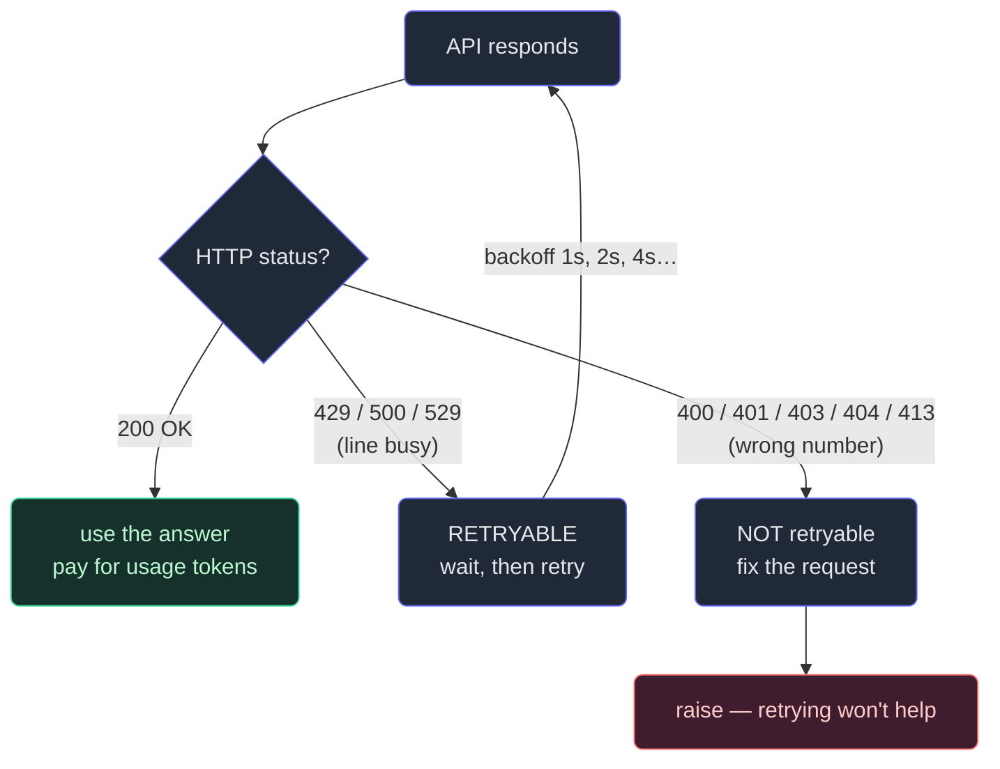

# 9. Tokens, limits & errors

## TL;DR

> You **pay per token** — both the tokens you send (`usage.input_tokens`) and the tokens the
> model writes back (`usage.output_tokens`), each at a per-model price. Count them *exactly* with
> `client.messages.count_tokens(...)` — **never `tiktoken`**, which is OpenAI's tokenizer and is
> wrong for Claude. The API also has **rate limits** (requests/min and tokens/min, per
> organization); exceeding one returns **HTTP 429** with a `retry-after` header. Errors split into
> two kinds: **retryable** (`429`, `500`, `529` — transient, back off and try again) and
> **not retryable** (`400`, `401`, `403`, `404`, `413` — your request is wrong; retrying changes
> nothing). The SDK auto-retries the retryable ones with **exponential backoff** (`max_retries=2`
> by default). And `stop_reason == "max_tokens"` means your `max_tokens` cap chopped the answer
> off mid-sentence. This is the **Context & Reliability** of the CCA — the diligence that makes a
> demo shippable.

## 1. Motivation

In Chapter 1 we sketched Cortex's "explain this error" button, and in Chapter 10 we'll turn it into
a real AI tutor. A prototype of that tutor is easy: one `messages.create` call, print the answer,
ship the demo. It works on your laptop. Then you put it in front of 500 learners and three questions
arrive that the demo never had to answer:

1. **What does this cost?** Every call spends money — money proportional to *tokens*, the units the
   model reads and writes. A tutor that resends a learner's whole failing program and the chapter
   they're stuck on (it must — the API is stateless) is sending a *lot* of tokens per turn. Multiply
   by 500 learners asking 40 times a month and "a few cents" becomes a line item. You need to be able
   to *predict* the bill before the bill predicts itself.

2. **What happens when too many learners click at once?** The API caps how fast one organization can
   call it. Cross the cap and you get a **429**, not an answer. Sound familiar? It's exactly what
   Cortex's own `/api/run` does to *us*: a `RateLimiter` with per-IP and per-user buckets refuses to
   run your code faster than N times a minute. The API rate-limits our tutor for the same reason we
   rate-limit code runs — to protect a shared resource. Same idea, other side of the fence.

3. **What happens when the network hiccups?** Sometimes a call fails. Some failures are worth
   retrying ("the line was busy") and some are not ("you dialed a wrong number"). Retry the wrong
   ones and you waste money looping forever; *don't* retry the right ones and a one-second blip looks
   like an outage to your learner.

This chapter is the **diligence** of Part 1 made concrete: knowing the meter, the limits, and the
failure modes is what separates "it ran once" from "it runs in production."

## 2. Intuition (Analogy)

A Claude call is a **taxi ride**, and the meter is running the whole time.

- **Tokens are the fare, and the meter ticks on every word — in *and* out.** When you get in, you
  hand the driver the whole conversation so far (the API is stateless — Chapter 1 — so you resend
  everything every turn); the meter counts all of it. That's your **input tokens**. Then the driver
  talks back, and the meter keeps ticking for every word *they* say — your **output tokens**. A
  chatty passenger who recites a huge backstory, and a chatty driver who won't stop talking, both run
  up the fare. (In fact the "talking back" half is the pricey one — output costs several times
  input, as we'll see.)

- **Rate limits are the taxi *company* refusing more than N rides a minute.** No matter how much you
  want a cab, dispatch will only send so many per minute across the whole city. Ask for one more and
  they say "all cars busy — try again in 30 seconds." That "try again in 30s" is the **`retry-after`
  header** on a **429**.

- **Retryable vs non-retryable errors are "line busy" vs "wrong number."** If the dispatch line is
  busy (a **429**, or the company's switchboard is down — a **500**/**529**), calling back in a
  moment is exactly right; the situation is temporary. But if you dialed a **wrong number** (a
  **400** — your request is malformed), redialing the same wrong number a hundred times will never
  connect. You have to fix the number.



| | A taxi ride | **A Claude API call** |
|---|---|---|
| What the meter counts | Distance + the driver's chatter | **Input tokens + output tokens** |
| Who sets the price | The fare table | **The per-model price table** (per 1M tokens) |
| "All cars busy, try in 30s" | Dispatch is at capacity | **429 + `retry-after`** (rate limit hit) |
| "Line busy — call back" | Temporary; retry works | **429 / 500 / 529** — retryable |
| "Wrong number" | Redialing never helps | **400 / 401 / 403 / 404 / 413** — fix the request |
| Driver stops mid-sentence | You only paid for so much ride | **`stop_reason == "max_tokens"`** — output truncated |

## 3. Formal Definition

**A token** is a chunk of text — roughly ¾ of a word on average English prose, fewer characters on
code or non-English text. The model reads and writes in tokens, and **you are billed per token**.
Every response carries a `usage` object:

| Term | Meaning |
|---|---|
| `usage.input_tokens` | Tokens in everything you *sent* this call: `system` + the entire `messages` history + tool definitions. You resend history every turn (Chapter 1), so this grows with the conversation. |
| `usage.output_tokens` | Tokens the model *generated* in its reply. Priced higher than input (commonly 5×). |
| **count_tokens** | `client.messages.count_tokens(model=..., messages=...)` → `.input_tokens`. Counts a prompt **before** you send it, against a specific model. Counts are model-specific; pass the model you'll actually call. |
| **price** | USD per **1,000,000** tokens, one rate for input and a higher rate for output, per model. |
| **rate limit** | A per-**organization** ceiling on throughput: requests/min, input-tokens/min, output-tokens/min. Independent of cost — you can be well under budget and still get throttled. |
| `retry-after` | A response header (seconds) on a **429** telling you how long to wait before retrying. |
| `stop_reason` | Why generation stopped. `"max_tokens"` means your `max_tokens` cap truncated the output — raise the cap or stream (Chapter 6). |

**Pricing (per 1M tokens, input / output), 2026 list:**

| Model | Model ID | Input | Output | Context window |
|---|---|---|---|---|
| Opus 4.8 | `claude-opus-4-8` | $5 | $25 | 1M |
| Sonnet 4.6 | `claude-sonnet-4-6` | $3 | $15 | 1M |
| Haiku 4.5 | `claude-haiku-4-5` | $1 | $5 | 200K |
| Fable 5 | `claude-fable-5` | $10 | $50 | 1M |

**Do not estimate tokens with `tiktoken`.** That is OpenAI's tokenizer; it undercounts Claude tokens
by ~15–20% on prose and far more on code. The only correct count for Claude is `count_tokens`.

> **The mental model in one line:** the cost of a request is a pure function of its tokens —
> `cost = input_tokens × in_rate + output_tokens × out_rate`. Everything else in this chapter is
> about (a) measuring those token counts before you're surprised by them, and (b) surviving the
> moments when the call doesn't return a `usage` at all because it errored.

## 4. Worked Example

### The error-code taxonomy

This is the table to memorize. The **Retryable** column is the whole game: it decides whether your
code waits-and-retries or gives up and fixes the request.

| HTTP | Error type | Retryable? | What it means / what to do |
|---|---|---|---|
| **400** | `invalid_request_error` | **No** | Your request is malformed (bad field, roles not alternating, `max_tokens` over the model limit). **Fix the request** — retrying is pointless. |
| **401** | `authentication_error` | No | Missing/invalid API key. Fix the key. |
| **403** | `permission_error` | No | Key lacks access to this model/feature. |
| **404** | `not_found_error` | No | Bad endpoint or **wrong model ID** (e.g. a guessed date suffix). Use exact IDs. |
| **413** | `request_too_large` | No | Payload too big. Shrink it (trim history, compress images). |
| **429** | `rate_limit_error` | **Yes** | Throttled. Honor the **`retry-after`** header, then retry. |
| **500** | `api_error` | **Yes** | Transient server-side error. Back off and retry. |
| **529** | `overloaded_error` | **Yes** | API temporarily overloaded. Back off and retry. |

### The real SDK calls (this block does NOT run here — it hits the network)

Counting tokens and handling typed exceptions with the genuine `anthropic` SDK. The key discipline:
**catch typed exception classes, never string-match the error message.**

```python
import anthropic

client = anthropic.Anthropic()  # reads ANTHROPIC_API_KEY from the environment

# --- Count tokens BEFORE sending, to estimate cost. NOT tiktoken. ---
messages = [{"role": "user", "content": "Explain this Python error for a beginner: ..."}]
counted = client.messages.count_tokens(
    model="claude-opus-4-8",
    messages=messages,
)
print(counted.input_tokens)                      # exact input-token count for THIS model
est_input_cost = counted.input_tokens / 1_000_000 * 5.0   # Opus 4.8 input = $5 / 1M
print(f"estimated input cost: ${est_input_cost:.5f}")

# --- Make the call, handling errors by TYPE (most specific first). ---
try:
    resp = client.messages.create(
        model="claude-opus-4-8",
        max_tokens=1024,
        messages=messages,
    )
    print(resp.usage.input_tokens, resp.usage.output_tokens)   # what you actually pay for
    if resp.stop_reason == "max_tokens":
        print("WARNING: output truncated — raise max_tokens or stream")
except anthropic.RateLimitError as e:                  # 429 — retryable
    wait = int(e.response.headers.get("retry-after", "60"))
    print(f"rate limited; retry after {wait}s")
except anthropic.BadRequestError:                      # 400 — NOT retryable, fix the request
    print("the request itself is wrong — do not retry")
except anthropic.APIStatusError as e:                  # 500/529 and anything else with a status
    print(f"server-side status {e.status_code}" + (" — retryable" if e.status_code >= 500 else ""))
```

Two facts worth underlining. First, the SDK **already retries** `429`/`5xx` for you with exponential
backoff (default `max_retries=2`) — the `try/except` above is for when those retries are *exhausted*
or for an error the SDK won't retry (like a `400`). Second, `count_tokens` lets you price a request
*before* paying for it — the foundation of any budget guardrail.

## 5. Build It

We can't hit the network in the sandbox, so we **model the mechanics** in plain Python — no
`anthropic`, no API, and (importantly) **no real sleeping**: the retry loop *prints* the backoff
delay it would wait instead of waiting, so the output is deterministic. Two parts:

**(a)** a `cost(...)` function over the real price table, run on a realistic tutor request to show the
per-request and per-1,000-request cost, and the monthly bill for 500 learners; **(b)** a
`call_with_retry(...)` that walks a *fixed* failure script like `[429, 500, "ok"]`, retrying
retryable codes with doubling backoff and **raising immediately on a 400**.

```python run
"""Chapter 9 Build It — token economics + retry mechanics, deterministic stdlib only.

No `anthropic` import, no network, no real sleeping. We MODEL the meter and the
retry loop so the numbers are reproducible. The real SDK calls live in a separate
NON-running block in the chapter.
"""

# ---------------------------------------------------------------------------
# Part (a): the taxi meter. You pay per token, input AND output, per model.
# Prices are USD per 1,000,000 tokens (input, output), 2026 list prices.
# ---------------------------------------------------------------------------

PRICES = {
    # model id            (input_per_1M, output_per_1M)
    "claude-opus-4-8":   (5.0, 25.0),
    "claude-sonnet-4-6": (3.0, 15.0),
    "claude-haiku-4-5":  (1.0, 5.0),
}


def cost(input_toks, output_toks, model):
    """Dollar cost of one request: input + output, each at its own rate."""
    in_rate, out_rate = PRICES[model]
    return (input_toks / 1_000_000) * in_rate + (output_toks / 1_000_000) * out_rate


# A realistic Cortex AI-tutor request. The learner's failing code + the error +
# the chapter context they're stuck on get RESENT every turn (statelessness,
# Chapter 1), so the input is big; the explanation it writes back is smaller.
TUTOR_INPUT_TOKENS = 4_000   # system prompt + chapter excerpt + code + error + history
TUTOR_OUTPUT_TOKENS = 600    # the beginner-friendly explanation

print("=== (a) What one tutor request costs ===")
for model in ("claude-opus-4-8", "claude-sonnet-4-6", "claude-haiku-4-5"):
    per_request = cost(TUTOR_INPUT_TOKENS, TUTOR_OUTPUT_TOKENS, model)
    per_thousand = per_request * 1000
    print(
        f"{model:18s}  "
        f"per request ${per_request:.5f}   "
        f"per 1,000 requests ${per_thousand:7.2f}"
    )

# The monthly bill is just (learners x requests/learner x price-per-request).
print()
print("=== Monthly bill: learners x avg requests x price ===")
LEARNERS = 500
REQUESTS_PER_LEARNER = 40   # a month of getting unstuck
total_requests = LEARNERS * REQUESTS_PER_LEARNER
for model in ("claude-opus-4-8", "claude-sonnet-4-6", "claude-haiku-4-5"):
    monthly = total_requests * cost(TUTOR_INPUT_TOKENS, TUTOR_OUTPUT_TOKENS, model)
    print(f"{model:18s}  {total_requests:,} requests/month -> ${monthly:,.2f}")

# Notice the output rate is 5x the input rate on every model: tokens the model
# WRITES cost five times tokens it READS. A chatty tutor is an expensive tutor.
print()
print("Output costs 5x input on every model above"
      " -> a verbose answer is the pricey half of the meter.")

# ---------------------------------------------------------------------------
# Part (b): the retry loop. Some errors are "line busy, call back" (retryable);
# a 400 is "wrong number" (redialing never helps). The real SDK does this for
# you with exponential backoff; here we MODEL it so you understand it.
# ---------------------------------------------------------------------------

RETRYABLE = {429, 500, 529}        # rate limit, server error, overloaded
NON_RETRYABLE = {400, 401, 403, 404, 413}  # fix-the-request errors


class ApiError(Exception):
    """Stand-in for a typed SDK exception, carrying the HTTP status code."""

    def __init__(self, status):
        self.status = status
        super().__init__(f"HTTP {status}")


def call_with_retry(failure_script, base_delay=1.0, max_retries=5):
    """Walk a FIXED failure script like [429, 500, "ok"].

    Retryable status -> print the backoff and try the next scripted outcome.
    Non-retryable status -> raise immediately (no amount of retrying helps).
    "ok" -> success.

    We DO NOT sleep — we print the delay we *would* sleep, so output is
    deterministic. Real backoff is base_delay * 2**attempt (1s, 2s, 4s, ...).
    """
    for attempt, outcome in enumerate(failure_script):
        if outcome == "ok":
            print(f"  attempt {attempt}: ok -> success")
            return "200 OK"
        status = outcome
        if status in NON_RETRYABLE:
            # The taxi analogy's "wrong number": redialing won't fix the request.
            print(f"  attempt {attempt}: {status} -> NOT retryable, raising")
            raise ApiError(status)
        if status in RETRYABLE:
            delay = base_delay * (2 ** attempt)
            print(f"  attempt {attempt}: {status} -> backoff {delay:.1f}s, retrying")
            continue
        raise ApiError(status)  # unknown status: don't guess, surface it
    raise RuntimeError("retries exhausted")  # script ran out without an "ok"


print()
print("=== (b) Retry on retryable, raise on a 400 ===")

print("Script [429, 500, ok]  (transient hiccups, then it works):")
result = call_with_retry([429, 500, "ok"])
print(f"  result: {result}")

print()
print("Script [429, 429, 429, ok]  (watch the delays DOUBLE):")
result = call_with_retry([429, 429, 429, "ok"])
print(f"  result: {result}")

print()
print("Script [400, ok]  (a 400 short-circuits; the 'ok' is never reached):")
try:
    call_with_retry([400, "ok"])
except ApiError as e:
    print(f"  raised ApiError(status={e.status}) immediately -- fix the request, don't retry")
```

Run it. Part (a) prints **$0.03500 per Opus request** ($35 per 1,000), and a **$700/month** bill for
500 learners on Opus — versus **$140** on Haiku, the same arithmetic that drives every real
model-choice decision. Part (b) shows the backoff delays **doubling** — `1.0s → 2.0s → 4.0s` — on
repeated `429`s, then a `400` short-circuiting *before* the scripted `"ok"` is ever reached, because
retrying a malformed request is pointless. That last line is the whole lesson of the error taxonomy
in five characters of output.

## 6. Trade-offs & Complexity

| Choice | Cheaper / safer | The cost |
|---|---|---|
| **Bigger model (Opus) vs smaller (Haiku)** | Haiku is 5× cheaper per token | Lower capability — fine for classification, weak for nuanced tutoring |
| **`count_tokens` before sending** | Predict and cap cost; reject oversized prompts early | An extra (free) round trip; counts can drift slightly from the real call |
| **Let the SDK auto-retry (`max_retries`)** | Survives transient `429`/`5xx` for free | Hidden latency on a bad minute; raise `max_retries` only with backoff, or you hammer the API |
| **Bigger `max_tokens`** | Avoids truncation (`stop_reason == "max_tokens"`) | You can be billed for more output; cap it to your real need |
| **Streaming (Chapter 6)** | No truncation, responsive UX, dodges request timeouts | More client complexity than one blocking call |
| **Resend full history every turn** | Correct (the API is stateless) | Input tokens — and cost — grow every turn; trim or summarize (Chapter 3), or cache (Chapter 7) |

The complexity that matters here is **cost ∝ tokens, and input grows linearly with conversation
length**. A 20-turn tutoring session doesn't cost 20× the first turn — it costs *more*, because each
turn resends an ever-longer history. Prompt caching (Chapter 7) is the standard escape hatch:
cached input tokens cost ~10% of the normal rate.

## 7. Edge Cases & Failure Modes

- **Using `tiktoken` to "estimate" Claude tokens.** Wrong tokenizer — undercounts by 15–20% on
  prose, worse on code. Your budget will be optimistic and your cost surprising. Use `count_tokens`.
- **Retrying a 400.** A malformed request fails identically every time; a naive "retry on any
  exception" loop burns money and latency forever. Branch on **retryable vs not** (or use typed
  exceptions and only retry `RateLimitError`/`APIStatusError` with `status_code >= 500`).
- **String-matching the error message.** `if "rate limit" in str(e)` breaks the instant the wording
  changes. Catch the **typed class** (`anthropic.RateLimitError`) instead.
- **Ignoring `retry-after`.** Retrying a 429 immediately (or worse, in a tight loop) just earns more
  429s. Honor the header's delay; the SDK does this automatically.
- **Silent truncation.** If you don't check `stop_reason`, a `max_tokens` cut-off looks like the
  model "just stopped early." Always check it; raise the cap or stream.
- **No budget guardrail.** Without `count_tokens` + a per-user cap (exactly like Cortex's
  `RateLimiter` caps code runs), one pathological learner pasting a 50,000-line file can spike the
  bill. Budget *is* diligence.
- **Forgetting input dominates a chatty history.** People obsess over output length, but a tutor
  resending a long transcript every turn pays mostly for *input*. Trim/summarize/cache the history.

## 8. Practice

> **Exercise 1 — Read the meter.** A tutor request sends **4,000 input tokens** and the model writes
> **600 output tokens**, on `claude-opus-4-8` (input $5 / 1M, output $25 / 1M). What does this *one*
> request cost, and which half of the meter — input or output — is larger here?

<details>
<summary><strong>Answer</strong></summary>

Cost = input + output, each at its own rate:

- input: `4000 / 1_000_000 × $5 = $0.020`
- output: `600 / 1_000_000 × $25 = $0.015`
- **total: $0.035** (which is exactly the `$0.03500 per request` the Build It block prints for Opus).

Here **input is the larger half** ($0.020 vs $0.015), even though there are far more input tokens
than output tokens — because the *4,000 input tokens* outweigh the 600 output tokens despite output
being priced 5× higher per token. The lesson: with a big resent history and a short answer, you pay
mostly for **input**, so trimming the history (Chapter 3) or caching it (Chapter 7) is where the
savings are.

</details>

> **Exercise 2 — Which errors do you retry?** You get each of these in turn: `429`, `400`, `500`,
> `404`, `529`. For each, say retry or don't, and in one phrase why.

<details>
<summary><strong>Answer</strong></summary>

- **429** `rate_limit_error` → **retry** (transient throttle; honor `retry-after`).
- **400** `invalid_request_error` → **don't** (the request is malformed; fix it).
- **500** `api_error` → **retry** (transient server-side error; back off).
- **404** `not_found_error` → **don't** (bad endpoint or wrong model ID; fix the ID).
- **529** `overloaded_error` → **retry** (API temporarily overloaded; back off).

The rule of thumb: **5xx and 429 are retryable** ("line busy / call back"); **4xx except 429 are
not** ("wrong number"). The SDK auto-retries the retryable set with exponential backoff
(`max_retries=2`), so in practice you only handle these yourself when retries are exhausted or you
want custom behavior.

</details>

> **Exercise 3 — Budget the tutor.** Cortex already rate-limits `/api/run` per user. You want the
> same guardrail on tutor calls. Sketch (in words or pseudocode) a pre-send check that estimates a
> request's cost and refuses it if a per-user monthly budget is blown. Which API call powers the
> estimate, and why not `tiktoken`?

<details>
<summary><strong>Answer</strong></summary>

The estimate is powered by **`client.messages.count_tokens(model=..., messages=...)`** — it returns
the exact input-token count *for that model* without sending (or paying for) the real call.
`tiktoken` is OpenAI's tokenizer and undercounts Claude tokens, so a budget built on it would be
systematically wrong (you'd let through requests you think are cheaper than they are).

```text
def guard(user, messages, model):
    n_in = count_tokens(model, messages).input_tokens
    est = n_in/1e6 * in_rate(model) + EXPECTED_OUTPUT/1e6 * out_rate(model)
    if spent_this_month[user] + est > MONTHLY_CAP[user]:
        raise BudgetExceeded   # same spirit as RateLimiter rejecting an over-quota /api/run
    resp = create(model, messages, max_tokens=...)
    spent_this_month[user] += cost(resp.usage.input_tokens, resp.usage.output_tokens, model)
```

This is the API's rate-limit idea brought *inside* Cortex: the platform's `RateLimiter` caps code
runs per user; your budget guard caps tutor spend per user. Both protect a shared, finite resource —
that parallel is exactly the "Diligence" of Part 1.

</details>

```quiz
{
  "prompt": "Your code calls the Claude API in a loop and retries on *any* exception. One request returns HTTP 400 (invalid_request_error). What happens, and what's the right fix?",
  "input": "Choose one:",
  "options": [
    "The loop retries the 400 forever (it fails identically every time) — fix: branch on the error type and only retry retryable codes (429/5xx), never a 400",
    "The 400 is automatically fixed on the second attempt, so the retry loop is correct as-is",
    "A 400 is a rate-limit error, so honoring retry-after will make the retry succeed",
    "You should count tokens with tiktoken first to avoid the 400"
  ],
  "answer": "The loop retries the 400 forever (it fails identically every time) — fix: branch on the error type and only retry retryable codes (429/5xx), never a 400"
}
```

## In the Wild

- **[Anthropic — API errors & retries](https://docs.claude.com/en/api/errors)** — the authoritative
  HTTP error table, the retryable set, and how the SDK's automatic exponential backoff works. The
  primary source for §4.
- **[Anthropic — Rate limits](https://docs.claude.com/en/api/rate-limits)** — the per-organization
  requests/min and tokens/min ceilings, the `retry-after` and `x-ratelimit-*` headers, and how
  limits scale by usage tier.
- **[Anthropic — Token counting](https://docs.claude.com/en/docs/build-with-claude/token-counting)**
  — the `count_tokens` endpoint that prices a prompt before you send it (and why it, not `tiktoken`,
  is the correct count for Claude).

---

**Next:** you now have every piece — the request, the system prompt, multi-turn state, structured
output, tools, streaming, caching, vision, and the economics and reliability to run it. Time to
assemble them into a real feature: an AI tutor designed to slot into Cortex's existing `/api/run` and
content. → [10. The Claude API in Cortex](/cortex/the-claude-stack/building-with-the-claude-api/claude-api-in-cortex)
