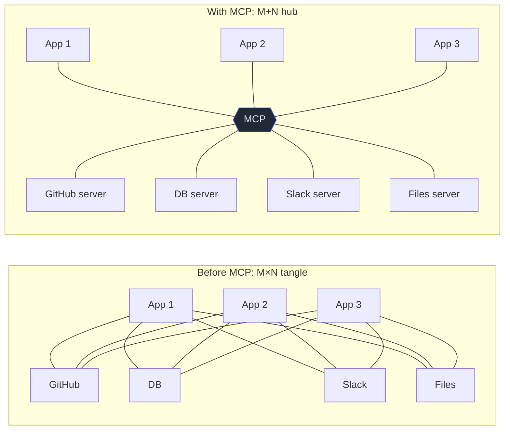

# 1. Why MCP exists

## TL;DR

> Connecting AI applications to the outside world used to be a **combinatorial mess**: *M* apps each
> needing a custom integration to *N* tools and data sources is **M×N** bespoke connectors, and every
> new app or tool multiplies the work. The **Model Context Protocol (MCP)** is an open standard that
> collapses this to **M+N**: each app learns to speak MCP *once*, each tool exposes itself over MCP
> *once*, and then **any** MCP app can use **any** MCP tool with no custom glue. Anthropic's phrase
> for it is "**USB-C for AI**." It is, deliberately, a boring standard — and like all great boring
> standards, that's exactly where its power comes from.

## 1. Motivation

In the 1950s, moving cargo across the world was astonishingly inefficient. Goods arrived at a dock as
a chaos of barrels, sacks, crates, and loose machinery, and gangs of longshoremen hand-loaded each
item into a ship's hold, fitting odd shapes together like a deadly game of Tetris. A ship could sit
in port for a *week* being loaded. Every cargo type needed its own handling; every port, every ship,
every truck had its own way of doing things. The cost of *moving* a thing often rivaled the cost of
the thing itself.

Then a trucking magnate named Malcom McLean asked a dumb-sounding question: what if every piece of
cargo came in the **same standard box**? Not a clever box — a *boring* one, with standard corners and
standard latches. The shipping container. Suddenly a crane didn't need to know whether it was lifting
bananas or car parts; a ship didn't need to know what it carried; a truck chassis fit any container
from any port. Loading time collapsed from days to hours, shipping costs fell by orders of magnitude,
and global trade exploded. The revolution wasn't a smarter crane. It was a **standard interface** that
killed the combinatorial mess of "every cargo type × every machine that moves it."

AI in 2024 had the docks-before-containers problem. Want your AI app to read GitHub? Write a GitHub
integration. Read Slack? Write a Slack one. Now you build a *second* AI app — write both integrations
again. A teammate builds a third — again. Every (app, tool) pair was a little hand-loaded crate of
custom code. **MCP is the shipping container.** Build one MCP **server** for GitHub, and every
MCP-speaking app — Claude Desktop, Claude Code, your IDE, a script — can use it, untouched. This very
repository proves it: its `codegraph` tool was built once, as an MCP server, and the agent that wrote
this book used it without anyone writing "codegraph-for-Claude-Code" glue.

## 2. Intuition (Analogy)

Anthropic's own analogy is the one in your pocket: **USB-C.**

Remember the drawer. Before USB-C, every device had its *own* charger and its *own* cable — the phone,
the camera, the e-reader, the headphones, each with a different plug. *M* devices and *N* chargers
meant a tangled drawer of incompatible cables, and a new device meant a new cable. USB-C ended it with
one boring, standard port: any USB-C charger charges any USB-C device. The drawer empties to a single
cable.

MCP is USB-C for AI. The "port" is the protocol; the "devices" are AI applications; the "chargers" are
tools and data sources. Standardize the port, and the tangle disappears — any app plugs into any tool.

| | Bespoke integrations (pre-MCP) | **MCP (the standard port)** |
|---|---|---|
| Connect M apps to N tools | **M×N** custom connectors | **M+N** (each speaks MCP once) |
| Add one new tool | Write it into *every* app | Build **one** server; all apps get it |
| Add one new app | Re-integrate *every* tool | Speak MCP **once**; all tools work |
| Who maintains the glue | Every app team, forever | The protocol; you maintain *your side* |
| Best when | You have exactly one app and one tool | You have (or will have) *many* |

## 3. Formal Definition

The **M×N integration problem**: with *M* AI applications and *N* external systems (tools, data
sources), point-to-point integration requires up to **M × N** custom connectors — and the count grows
*multiplicatively* as either side grows. This is the same shape as the pre-container docks, or the
pre-USB-C drawer.

**MCP (the Model Context Protocol)** is an **open standard** that defines a single, common interface
between AI applications and external context. By inserting one shared protocol in the middle, the
integration count drops to **M + N**: each application implements the *client* side of MCP once
(reusable across all servers), and each tool/data source implements the *server* side once (reusable
across all applications).

| Term | Meaning |
|---|---|
| **Integration** | The glue code that lets one app talk to one external system. |
| **M×N problem** | M apps × N tools → up to M·N bespoke integrations; grows multiplicatively. |
| **MCP** | An open standard interface between AI apps and external context — "USB-C for AI." |
| **MCP server** | A program that exposes a tool/data source *over MCP*. Build once, used by any MCP app. |
| **MCP host / client** | The AI application (host) and the per-server connector (client) that *speak* MCP. (Architecture: Chapter 2.) |
| **Open standard** | A public, vendor-neutral spec anyone can implement — which is *why* "build once, use everywhere" holds. |

> The crossover insight: MCP is not magic and it's not free. For a *single* app talking to a *single*
> tool, a direct integration is actually *less* work than learning a protocol. MCP wins the instant
> you have **many** — which, for any system that grows, is almost immediately. Standards are an
> investment that pays back at scale.

## 4. Worked Example — the tangle vs the hub

Picture three AI apps and four tools. Point-to-point, that's a spaghetti of up to twelve connectors.
With MCP in the middle, it's seven implementations — three clients, four servers — and they all
interoperate.



That's `codegraph` in this repo: written once as a server, it doesn't know or care *which* app
connects — Claude Code today, some other editor tomorrow. The author of a tool stops writing
per-app glue and writes *one* MCP server; the author of an app stops writing per-tool glue and writes
*one* MCP client. Everyone meets in the middle, at the standard.

## 5. Build It

Numbers make the explosion visceral. Run this: it counts integrations the bespoke way (M×N) versus
the MCP way (M+N), and shows what *adding one tool* costs each way.

```python run
def integrations(apps, tools, *, standard):
    """How many connectors must exist for `apps` apps to reach `tools` tools?"""
    if standard:
        return apps + tools      # MCP: each app speaks MCP once, each tool exposes MCP once
    return apps * tools          # bespoke: one custom connector per (app, tool) pair

print(f"{'apps(M)':>7} {'tools(N)':>8} | {'bespoke M*N':>11} | {'MCP M+N':>7} | saved")
for m, n in [(1, 1), (3, 4), (5, 10), (10, 20)]:
    bespoke = integrations(m, n, standard=False)
    mcp     = integrations(m, n, standard=True)
    print(f"{m:>7} {n:>8} | {bespoke:>11} | {mcp:>7} | {bespoke - mcp:>5}")

print("\nadding the 21st tool to a 10-app world:")
print("  bespoke: 10 new connectors (one per app)")
print("  MCP:     1 new server (every app already speaks MCP)")
```

**Now break it.** Look at the very first row — `1 app, 1 tool`: bespoke needs **1** connector, MCP
needs **2** (one client + one server), so MCP is *more* work and "saved" is **−1**. That negative
number is not a bug; it's the honest truth from §3. For a true one-off, skip the protocol. But watch
how fast it flips: by `3×4` you're already saving 5, and by `10×20` you're saving 170. The crossover
arrives almost immediately, which is why "we only have one integration" is rarely true for long.

## 6. Trade-offs & Complexity

| Adopt MCP (the standard) | Hand-roll a bespoke integration |
|---|---|
| M+N effort; new tools/apps are cheap | M×N effort; every addition multiplies |
| Your tool works in *any* MCP host | Locked to the one app you wrote it for |
| Ecosystem of ready-made servers to reuse | You build (and maintain) everything |
| A protocol to learn; indirection overhead | Dead simple for exactly one pairing |
| Versioning/compat to track | Nothing to negotiate — until you scale |

The cost of MCP is the cost of any standard: a layer of indirection, a spec to learn, versions to keep
compatible. The benefit is the cost of *not* having a standard, avoided — the M×N swamp that drowns
every growing system. Choose bespoke for a genuine one-off; choose MCP the moment "many" is on the
horizon (which, honestly, is most of the time).

## 7. Edge Cases & Failure Modes

- **Bespoke-when-you'll-scale.** Writing a direct integration "just for now," then watching it become
  the third, fourth, fifth copy. The M×N curve is steep; commit to the standard early if growth is
  likely.
- **MCP-for-a-true-one-off.** The opposite mistake: dragging in a whole protocol for a single script
  that talks to a single tool once. The §5 first row is real — sometimes a function call is the answer.
- **Re-inventing instead of reusing.** Building your own GitHub/Slack/Postgres server when a
  battle-tested MCP server already exists. The point of a standard is the *ecosystem* — shop first.
- **Protocol-version mismatch.** Client and server speaking different MCP versions fail to negotiate
  (Chapter 2's `initialize` handshake exists precisely to catch this). Track the version you target.
- **Mistaking MCP for "more AI."** MCP adds no intelligence; it adds *connectivity*. The model is
  exactly as smart as before — it just reaches more of the world.

## 8. Practice

> **Exercise 1 — Do the arithmetic.** Your company has 4 internal AI apps and 6 data sources, and
> plans to add 2 more apps and 3 more data sources next year. Compare the *total* number of
> integrations under the bespoke approach vs MCP, before and after the growth. What does the
> comparison tell you?

<details>
<summary><strong>Answer</strong></summary>

Use the M×N vs M+N formulas from §3.

- **Now (4 apps, 6 sources):** bespoke = 4 × 6 = **24** integrations; MCP = 4 + 6 = **10**.
- **After growth (6 apps, 9 sources):** bespoke = 6 × 9 = **54**; MCP = 6 + 9 = **15**.

The bespoke count more than *doubled* (24 → 54) for a modest amount of growth, while MCP grew only
linearly (10 → 15). The lesson is the shape of the curves: bespoke integrations grow
*multiplicatively* (the swamp deepens fast), MCP grows *additively*. The more you expect to grow — and
4 apps already implies you will — the more decisively the standard wins. This is the §3 crossover seen
at organizational scale.

</details>

> **Exercise 2 — When is bespoke right?** Give a concrete situation where writing a direct integration
> (no MCP) is genuinely the better engineering call, and tie it to the §5 result.

<details>
<summary><strong>Answer</strong></summary>

A genuine **one-off**: a single throwaway script, used by one app, talking to one tool, that you will
not reuse or share. For example, a one-time data-migration script that reads one specific API once.

This ties directly to the §5 first row: at `1 app × 1 tool`, bespoke needs **1** connector while MCP
needs **2** (a client *and* a server) plus the overhead of learning and conforming to a protocol — so
the standard is *more* work with no payoff, because there's nothing to amortize it over. MCP's value
is entirely in *reuse across many*; with no "many," there's no value to capture. The skill (a Part 1
*Delegation*/*Discernment* call) is judging honestly whether "just this once" is actually true — it
usually isn't, but sometimes it is.

</details>

> **Exercise 3 — Spot the container.** The shipping container, USB-C, and MCP are all the same idea.
> State the one structural property they share that produces the M×N → M+N collapse, and name the
> thing each one standardizes.

<details>
<summary><strong>Answer</strong></summary>

The shared property is a **single standard interface in the middle** that *both sides* conform to, so
neither side needs to know the specifics of the other (§2–§3). Because every participant talks only to
the *standard* — not to every other participant directly — you implement your side *once* and
interoperate with *all*, turning a multiplicative tangle (M×N point-to-point links) into an additive
one (M+N implementations of the standard).

What each standardizes:

- **Shipping container:** the *box* — standard dimensions/corners/latches, so any crane/ship/truck
  handles any cargo without custom handling.
- **USB-C:** the *port and cable* — so any charger powers any device.
- **MCP:** the *protocol* for exchanging tools, resources, and prompts between AI apps and external
  systems — so any MCP host uses any MCP server.

Same move every time: standardize the *interface*, and the combinatorial glue evaporates.

</details>

```quiz
{
  "prompt": "What core problem does MCP solve, and how?",
  "input": "Choose one:",
  "options": [
    "The M×N integration explosion — by defining one standard interface so M apps and N tools each implement it once (M+N), instead of a custom connector per pair",
    "It makes the language model itself more intelligent so it needs fewer tools",
    "It lets you skip writing any integration code at all, for any tool, automatically",
    "It replaces HTTP with a faster binary protocol for AI applications"
  ],
  "answer": "The M×N integration explosion — by defining one standard interface so M apps and N tools each implement it once (M+N), instead of a custom connector per pair"
}
```

## In the Wild

- **[Anthropic — Introducing the Model Context Protocol](https://www.anthropic.com/news/model-context-protocol)**
  (Nov 2024) — the announcement that frames MCP as "a USB-C port for AI" and lays out the M×N
  motivation. The primary source for this chapter.
- **[modelcontextprotocol.io — Introduction](https://modelcontextprotocol.io/)** — the open standard's
  home: docs, the spec, and the SDKs you'll use in Chapter 7.
- **[Reference MCP servers](https://github.com/modelcontextprotocol/servers)** — the growing ecosystem
  of ready-made servers (filesystem, GitHub, Postgres, …) that "build once, use everywhere" produces.

---

**Next:** the standard has a precise shape. Who are the *host*, the *client*, and the *server*, what
are the two layers the protocol is built from, and how does a connection actually begin? →
[2. The architecture](/cortex/the-claude-stack/model-context-protocol/the-architecture)
