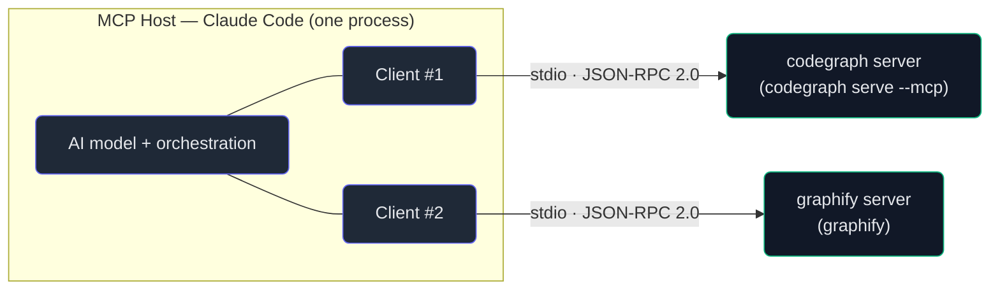

# 2. The architecture

## TL;DR

> Chapter 1 said *why* MCP exists. This chapter gives it a precise **shape**. An MCP **Host** (the AI
> application — Claude Code, Claude Desktop) creates **one MCP Client per MCP Server**, and each Client
> holds a **dedicated 1:1 connection** to its Server. The protocol is built from **two layers**: a
> **data layer** (a [JSON-RPC 2.0](https://www.jsonrpc.org/specification) protocol carrying lifecycle,
> the primitives *tools/resources/prompts*, and notifications) and a **transport layer** (the channel —
> *stdio* or *Streamable HTTP* — plus framing and auth). Every connection opens with an **`initialize`
> handshake** that negotiates a common **protocolVersion** and an intersected set of **capabilities**,
> so each side knows what the other can do before it asks. This very repo is the live example: its
> `.claude/mcp.json` declares **two** servers, so at startup the host spins up **two** clients — one each.

## 1. Motivation

When you launch Claude Code in this repository, something quietly happens before you type a word. The
agent reads `.claude/mcp.json`, finds it declares two MCP servers — `codegraph` and `graphify` — and
for each one it **starts a separate process and opens a separate connection**. Two servers in, two
connections out. Not one shared bus that both tools hang off; two private lines, each owned by one
**client** inside the host, each talking to exactly one **server**.

Why bother with that one-client-per-server discipline? Because it makes every connection **independent
and stateful**. `codegraph` can crash, hang, or be restarted without touching `graphify`. Each
connection can negotiate its *own* protocol version and its *own* capabilities — `codegraph` might
support resource subscriptions while `graphify` doesn't, and the host tracks that per-connection,
never guessing. And because each line is dedicated, the host always knows *which* server a given
message came from. The alternative — one mux'd channel for all tools — would tangle exactly the
concerns MCP works to keep clean.

Chapter 1 gave you the *economic* argument (M×N → M+N). This chapter gives you the *structural* one:
the small, deliberate set of roles and layers that make "build one server, plug into any host" actually
work at runtime. Get this skeleton right and the next four chapters — tools, resources, prompts,
transports — just hang off it.

## 2. Intuition (Analogy)

Picture a **head office that deals with many partner organizations** — an embassy's home ministry, say.
The ministry (the **Host**) doesn't let every department phone every partner directly. Instead, for
each partner it appoints **one dedicated liaison officer** (a **Client**) whose entire job is that one
relationship. Partner A's liaison never speaks for Partner B. Each liaison holds a **private line** to
their counterpart at the partner organization (the **Server**), and every liaison is trained in the
**same diplomatic protocol** (JSON-RPC) — same forms, same greetings, same way of saying "request"
versus "for your information." When a new partnership opens, the ministry appoints a *new* liaison; it
doesn't overload an existing one.

And every relationship begins the same way: a **formal exchange of credentials**. The liaison presents
"here is the protocol version I speak and what I'm authorized to do"; the counterpart replies "I speak
that version too, and here's what *I* can do"; they settle on common ground *before* any real business.
That opening exchange is the `initialize` handshake.

If diplomacy feels far off, here's the desk-drawer version: a **USB hub**. The hub (Host) has many
ports; each port (Client) drives exactly one device (Server). Plug in a keyboard and a drive and the
hub enumerates **two** devices on **two** ports — it never crams both onto one. Every device speaks the
same USB protocol over its own physical lane, and each begins with **enumeration** (the device announces
what it is and what it can do) — USB's version of `initialize`.

| | USB hub | Embassy / head office | **MCP** |
|---|---|---|---|
| The coordinator | The hub | Home ministry | **Host** (the AI app) |
| The per-partner agent | A port | A liaison officer | **Client** (one per server) |
| The thing being used | A device | A partner organization | **Server** (a tool/data source) |
| Shared language | USB protocol | Diplomatic protocol | **JSON-RPC 2.0** (data layer) |
| Physical channel | The cable/lane | The private phone line | **Transport** (stdio / HTTP) |
| Opening ritual | Enumeration | Exchange of credentials | **`initialize` handshake** |
| One-to-one? | One device per port | One liaison per partner | **One client per server** |

## 3. Formal Definition

MCP defines **three participant roles** and splits the protocol into **two layers**.

**The roles** (note: *Host* and *Client* live in the same application — they are not separate
processes):

- An **MCP Host** is the AI application that coordinates everything — Claude Code, Claude Desktop, an
  IDE. The host manages the AI model and decides *which* servers to connect to.
- An **MCP Client** is a component the host instantiates **once per server**. Each client maintains a
  **dedicated 1:1 connection** to its server. *N* servers ⇒ the host holds *N* clients.
- An **MCP Server** is a program that exposes context and capabilities (tools, resources, prompts) over
  MCP. A **local** server (stdio) typically serves a single client; a **remote** server (Streamable
  HTTP) can serve **many** clients at once.

**The two layers** (the key idea: the data layer is the *same* no matter which transport carries it):

- The **data layer** is an inner protocol built on **JSON-RPC 2.0**. It defines **lifecycle management**
  (the `initialize` handshake, capability negotiation, shutdown), the three **primitives** (tools,
  resources, prompts), and **notifications** (one-way messages, e.g. "my tool list changed").
- The **transport layer** is the channel that carries those JSON-RPC messages, plus message **framing**
  and **authentication**. MCP defines two: **stdio** (local subprocess; reads/writes its standard
  streams) and **Streamable HTTP** (remote; HTTP POST with optional Server-Sent Events for streaming,
  and an auth story). The bytes on the wire differ; **the JSON-RPC messages do not**.

**The lifecycle.** MCP is a **stateful** protocol, and every connection opens with capability
negotiation:

1. The client sends an **`initialize` request** — a JSON-RPC request (it has an `id`) carrying its
   desired `protocolVersion`, its `capabilities`, and `clientInfo`.
2. The server replies with **its** `capabilities`, `serverInfo`, and the `protocolVersion` it agrees to.
3. The client sends a **`notifications/initialized`** notification — a JSON-RPC *notification* has **no
   `id`** and gets **no response** — and normal operation begins.

If the two sides can't agree on a compatible `protocolVersion`, **the connection should terminate**.
**Capability negotiation** is the whole point: it tells each side which features the other supports —
`tools`, `resources`, `prompts`, their `listChanged` notifications, plus client features like `sampling`
and `elicitation` — so neither side ever calls something the other can't handle.

| Term | Meaning |
|---|---|
| **Host** | The AI application coordinating the model and its server connections (e.g. Claude Code). |
| **Client** | A connector the host creates **once per server**; owns a 1:1 connection. |
| **Server** | A program exposing tools/resources/prompts over MCP. Local (one client) or remote (many). |
| **Data layer** | The inner **JSON-RPC 2.0** protocol: lifecycle, primitives, notifications. |
| **Transport layer** | The channel (**stdio** or **Streamable HTTP**) + framing + auth. |
| **JSON-RPC 2.0** | The request/response/notification wire format the data layer speaks. |
| **`initialize`** | The first request; negotiates `protocolVersion` + capabilities. |
| **Capability** | A feature flag (`tools`, `resources`, `sampling`, …) advertised in the handshake. |
| **Notification** | A one-way JSON-RPC message with **no `id`** and **no reply**. |
| **Stateful** | The connection remembers negotiated state for its whole lifetime. |

> The crossover insight: the data layer and the transport layer are **orthogonal**. The *same*
> `initialize` request, the *same* `tools/call`, look identical whether they travel over a local stdio
> pipe or a remote HTTPS connection. That separation is why Chapter 6 can swap transports without
> touching anything you learn in Chapters 3–5 — the meaning lives in the data layer, the delivery in the
> transport.

## 4. Worked Example

Here is the runtime shape inside *this* repo. One host process (Claude Code) holds two clients; each
client owns one stdio connection to one server. The data layer (JSON-RPC) rides *inside* each transport.



Two servers declared in `.claude/mcp.json` ⇒ two clients ⇒ two dedicated stdio lines. That is the
"host creates one client per server" rule, live.

Now zoom into a single line at the instant it opens. Client #1 sends the `initialize` **request**; the
server returns its `initialize` **response**. Real JSON-RPC, spec version `2025-06-18`:

```json
{
  "jsonrpc": "2.0",
  "id": 1,
  "method": "initialize",
  "params": {
    "protocolVersion": "2025-06-18",
    "capabilities": {
      "tools": { "listChanged": true },
      "resources": { "subscribe": true }
    },
    "clientInfo": { "name": "ExampleHost", "version": "1.0.0" }
  }
}
```

```json
{
  "jsonrpc": "2.0",
  "id": 1,
  "result": {
    "protocolVersion": "2025-06-18",
    "capabilities": {
      "tools": { "listChanged": true },
      "resources": { "subscribe": true, "listChanged": true },
      "prompts": { "listChanged": true }
    },
    "serverInfo": { "name": "ExampleServer", "version": "2.4.1" }
  }
}
```

Read the shape: same `id` (1) on both — this is a request/response *pair*. The server **echoes back**
the agreed `protocolVersion` and advertises its own `capabilities`. Right after this, the client fires a
one-way `{"jsonrpc":"2.0","method":"notifications/initialized"}` (no `id`, no reply) and the connection
is live. From here on, *because each side learned the other's capabilities*, neither will call a feature
the other never advertised.

## 5. Build It

Let's make the handshake executable. The program below models both halves: `client_initialize()` builds
the request dict; `server_handle(req)` returns a response dict that negotiates the common
`protocolVersion` and the **intersection** of capabilities (a feature survives only if *both* sides
advertise it). It prints the request, the response, and the negotiated capability set — then runs a
**second** case where the client demands `protocolVersion "1999-01-01"`, the server finds no common
version, and the connection **terminates**. Pure stdlib `json`; no SDK, no network — the data-layer
logic, naked.

```python run
"""Model the MCP `initialize` handshake and capability negotiation.

Deterministic, stdlib-only (json). No SDK, no network. This mirrors the
data-layer lifecycle: the client sends an `initialize` request, the server
replies negotiating a common protocolVersion and the INTERSECTION of
capabilities, then (on success) the client would send `notifications/
initialized`. If no common protocolVersion exists, the connection terminates.
"""

import json

# The server in this toy supports exactly these protocol versions, newest first.
SERVER_SUPPORTED_VERSIONS = ["2025-06-18", "2025-03-26", "2024-11-05"]

# What the server itself can do. The client may support more or fewer of these;
# negotiation keeps only what BOTH sides advertise.
SERVER_CAPABILITIES = {
    "tools": {"listChanged": True},
    "resources": {"subscribe": True, "listChanged": True},
    "prompts": {"listChanged": True},
}


def client_initialize(protocol_version, client_capabilities):
    """Build the JSON-RPC 2.0 `initialize` REQUEST the client sends first.

    A request has an `id`; the server must answer it.
    """
    return {
        "jsonrpc": "2.0",
        "id": 1,
        "method": "initialize",
        "params": {
            "protocolVersion": protocol_version,
            "capabilities": client_capabilities,
            "clientInfo": {"name": "ExampleHost", "version": "1.0.0"},
        },
    }


def intersect_capabilities(client_caps, server_caps):
    """Keep only capabilities BOTH sides advertise (a feature works only if
    each side supports it). For shared keys, keep the server's sub-options
    here for simplicity; a real impl negotiates per-field."""
    common = {}
    for name in sorted(server_caps):
        if name in client_caps:
            common[name] = server_caps[name]
    return common


def server_handle(req):
    """Handle an `initialize` request; return a JSON-RPC RESPONSE dict.

    Success -> a `result` with the negotiated protocolVersion + capabilities.
    No common protocolVersion -> a JSON-RPC `error` (the client should then
    terminate the connection).
    """
    req_id = req.get("id")
    params = req.get("params", {})
    requested = params.get("protocolVersion")
    client_caps = params.get("capabilities", {})

    if requested in SERVER_SUPPORTED_VERSIONS:
        negotiated = requested
    else:
        # The server cannot speak the version the client asked for.
        return {
            "jsonrpc": "2.0",
            "id": req_id,
            "error": {
                "code": -32602,  # Invalid params
                "message": "Unsupported protocol version",
                "data": {
                    "requested": requested,
                    "supported": SERVER_SUPPORTED_VERSIONS,
                },
            },
        }

    return {
        "jsonrpc": "2.0",
        "id": req_id,
        "result": {
            "protocolVersion": negotiated,
            "capabilities": intersect_capabilities(client_caps, SERVER_CAPABILITIES),
            "serverInfo": {"name": "ExampleServer", "version": "2.4.1"},
        },
    }


def initialized_notification():
    """The client's follow-up NOTIFICATION after a successful handshake.

    A JSON-RPC notification has NO `id` and gets NO response.
    """
    return {"jsonrpc": "2.0", "method": "notifications/initialized"}


def show(label, obj):
    print(label)
    print(json.dumps(obj, indent=2))
    print()


def run_handshake(title, client_version, client_caps):
    print("=" * 60)
    print(title)
    print("=" * 60)

    request = client_initialize(client_version, client_caps)
    show("--> client sends initialize request:", request)

    response = server_handle(request)
    show("<-- server responds:", response)

    if "result" in response:
        negotiated = response["result"]["protocolVersion"]
        common = sorted(response["result"]["capabilities"])
        notif = initialized_notification()
        show("--> client sends notifications/initialized (no id, no reply):", notif)
        print(f"RESULT: connection ESTABLISHED on protocolVersion {negotiated}")
        print(f"        negotiated capabilities (both sides support): {common}")
    else:
        err = response["error"]
        print("RESULT: handshake FAILED -> connection TERMINATES")
        print(f"        reason: {err['message']}")
        print(f"        client wanted {err['data']['requested']!r}; "
              f"server speaks {err['data']['supported']}")
    print()


# A real client that supports tools + resources, but NOT prompts.
CLIENT_CAPABILITIES = {
    "tools": {"listChanged": True},
    "resources": {"subscribe": True},
    "sampling": {},  # a client-only capability the server doesn't have
}

# Case 1: compatible version -> negotiation succeeds; capabilities intersect.
run_handshake(
    "CASE 1: compatible protocolVersion (2025-06-18)",
    "2025-06-18",
    CLIENT_CAPABILITIES,
)

# Case 2: the client asks for a version no server supports -> rejected.
run_handshake(
    "CASE 2: incompatible protocolVersion (1999-01-01)",
    "1999-01-01",
    CLIENT_CAPABILITIES,
)

# A tiny self-check so the prose's claims are guaranteed true.
ok_req = client_initialize("2025-06-18", CLIENT_CAPABILITIES)
ok_resp = server_handle(ok_req)
assert ok_resp["result"]["protocolVersion"] == "2025-06-18"
# Intersection: client has {tools, resources, sampling}; server has
# {tools, resources, prompts}. Common server-advertised = {resources, tools}.
assert sorted(ok_resp["result"]["capabilities"]) == ["resources", "tools"]
assert "prompts" not in ok_resp["result"]["capabilities"]  # client lacked it
assert "sampling" not in ok_resp["result"]["capabilities"]  # server lacked it

bad_resp = server_handle(client_initialize("1999-01-01", CLIENT_CAPABILITIES))
assert "error" in bad_resp and "result" not in bad_resp
assert initialized_notification().get("id") is None  # notifications have no id
print("self-check: all assertions held.")
```

Run it and the two cases play out exactly. **Case 1** establishes the connection on `2025-06-18` with
negotiated capabilities `['resources', 'tools']` — note what's *missing*: `prompts` (the server had it,
the client didn't) and `sampling` (the client had it, the server didn't) both fall out of the
intersection, so neither side will ever try to use them. **Case 2** prints `handshake FAILED ->
connection TERMINATES`, because `1999-01-01` is in no one's supported list. The closing line confirms
every claim in the prose held:

```text
RESULT: connection ESTABLISHED on protocolVersion 2025-06-18
        negotiated capabilities (both sides support): ['resources', 'tools']
...
RESULT: handshake FAILED -> connection TERMINATES
        reason: Unsupported protocol version
        client wanted '1999-01-01'; server speaks ['2025-06-18', '2025-03-26', '2024-11-05']

self-check: all assertions held.
```

That's the entire lifecycle skeleton in ~60 lines of logic: negotiate a version, intersect
capabilities, or terminate. Real SDKs add transports, retries, and the primitive calls — but this is the
heart.

## 6. Trade-offs & Complexity

| MCP's architectural choice | What it buys | What it costs |
|---|---|---|
| **One client per server** (vs one shared bus) | Isolation, per-connection state, clear provenance | *N* connections/processes to manage for *N* servers |
| **Data ⊥ transport** (two layers) | Same messages over stdio *or* HTTP; swap transports freely | An extra abstraction to learn; framing differs per transport |
| **JSON-RPC 2.0** (vs a bespoke binary protocol) | Human-readable, ubiquitous tooling, easy to debug | Verbose on the wire; JSON (de)serialization overhead |
| **`initialize` handshake** (vs assume-and-go) | Version safety; never call an unsupported feature | A round-trip before any real work; negotiation logic both sides |
| **Stateful** connection (vs stateless requests) | Remembers negotiated capabilities; supports notifications | Must track/clean up state; reconnection re-negotiates |

The through-line: MCP pays a small, fixed **setup tax** (a handshake, a per-server connection, a layer
of indirection) to buy **safety and uniformity** that scale. For one quick local tool the tax is
visible; across an ecosystem of hosts and servers it's a rounding error against the interoperability you
get — the same bargain Chapter 1 made for M+N, now at the level of *runtime mechanics*.

## 7. Edge Cases & Failure Modes

- **Version negotiation fails.** No common `protocolVersion` ⇒ the connection should terminate (Case 2
  above). This is a *feature*: better a clean refusal than two peers silently misunderstanding each
  other. Track the version you target.
- **Calling an un-negotiated capability.** Invoking `tools/call` against a server that never advertised
  `tools`, or expecting `listChanged` notifications a peer didn't offer, is a protocol violation. The
  handshake exists precisely so you can check first.
- **Confusing a notification with a request.** A `notifications/*` message has **no `id`** and must get
  **no response**. Replying to one — or waiting for a reply to one — is a bug. (The Build-It asserts the
  notification has no `id`.)
- **Skipping `notifications/initialized`.** Some servers hold normal operations until the client confirms
  initialization. Send the request, *and* the follow-up notification.
- **Assuming local servers are multi-client.** A stdio server is typically **one client, one process**;
  parallel work usually means parallel processes, not many clients on one stdio pipe. Remote
  (Streamable HTTP) servers are the ones built to fan out to many clients.
- **Treating data and transport as coupled.** They're orthogonal. If a `tools/call` "works on stdio but
  not HTTP," the bug is almost always in the *transport/auth* layer, not the JSON-RPC message — the
  message is identical on both.

## 8. Practice

> **Exercise 1 — Count the connections.** A teammate adds a third server, `postgres`, to
> `.claude/mcp.json` (now `codegraph`, `graphify`, `postgres`). At startup, how many **clients** does the
> host create, how many **connections** are open, and why isn't it one shared connection for all three?

<details>
<summary><strong>Answer</strong></summary>

**Three clients, three connections** — one dedicated client per server, each owning a 1:1 line (§3). The
host instantiates a client *per* declared server, so three servers ⇒ three clients ⇒ three independent
stdio connections.

It isn't one shared connection because MCP deliberately keeps each relationship **isolated and
stateful**: each connection negotiates its own `protocolVersion` and capabilities, each can fail or
restart without disturbing the others, and the host always knows *which* server a message belongs to.
That's the embassy rule from §2 — one liaison per partner, never one liaison juggling all of them.

</details>

> **Exercise 2 — What survives negotiation?** A client advertises capabilities `{tools, resources}`. The
> server advertises `{tools, prompts}`. After a successful `initialize`, which capabilities are usable on
> this connection, and what happens if the client later sends a `prompts/list` request anyway?

<details>
<summary><strong>Answer</strong></summary>

Only the **intersection** is usable: `{tools}` — the one capability *both* sides advertised (§3, and the
Build-It's `intersect_capabilities`). `resources` falls out (the server lacks it) and `prompts` falls
out (the client lacks it).

If the client then sends `prompts/list`, it's **calling an un-negotiated capability** — a protocol
violation (§7). The server never said it does prompts on this connection, so the client had no business
asking. The whole reason `initialize` runs *first* is to let each side learn the other's capabilities and
avoid exactly this call.

</details>

> **Exercise 3 — Same message, two transports.** You move a server from local **stdio** to remote
> **Streamable HTTP**. Does the JSON of an `initialize` request change? Name one thing that *does* change,
> and tie your answer to the two-layer model.

<details>
<summary><strong>Answer</strong></summary>

The **`initialize` JSON does not change** — it's a *data-layer* message, and the data layer is
**orthogonal** to the transport (§3 crossover insight). The same `{"jsonrpc":"2.0","id":1,"method":
"initialize",...}` travels over either channel.

What changes lives in the **transport layer**: the **channel and framing** (stdio reads/writes the
process's standard streams; Streamable HTTP wraps messages in HTTP POST with optional SSE for streaming),
and the **authentication** story (a local subprocess is trusted by virtue of being launched by the host;
a remote HTTP server typically needs real auth). Delivery differs; meaning doesn't — which is exactly why
Chapter 6 can swap transports without touching what you learned here.

</details>

```quiz
{
  "prompt": "How does an MCP host connect to multiple servers, and what opens each connection?",
  "input": "Choose the statement that matches MCP's architecture:",
  "options": [
    "The host creates one dedicated client per server (a 1:1 connection each), and every connection opens with an `initialize` handshake that negotiates a common protocolVersion and intersected capabilities",
    "The host opens a single shared connection that all servers multiplex over, with no per-connection handshake",
    "Each server connects directly to the AI model, bypassing any client, using a custom binary protocol",
    "The host picks one server at a time; capabilities are assumed from the protocol version with no negotiation step"
  ],
  "answer": "The host creates one dedicated client per server (a 1:1 connection each), and every connection opens with an `initialize` handshake that negotiates a common protocolVersion and intersected capabilities"
}
```

## Your Turn

Before you move on, check your understanding with the coach — explain the idea, apply it, weigh the trade-offs, then defend your reasoning.

<div class="concept-coach"></div>

## In the Wild

- **[MCP Architecture overview](https://modelcontextprotocol.io/docs/learn/architecture)** — the
  spec's own description of hosts, clients, servers, and the data/transport layers. The primary source
  for this chapter.
- **[Lifecycle (spec 2025-06-18)](https://modelcontextprotocol.io/specification/2025-06-18/basic/lifecycle)**
  — the exact `initialize` request/response/notification sequence and capability-negotiation rules
  modeled in §5.
- **[JSON-RPC 2.0 specification](https://www.jsonrpc.org/specification)** — the request/response/
  notification format MCP's data layer is built on; worth a skim to see why notifications have no `id`.

---

**Next:** the handshake settled *what* each side can do — now we use it. The first and most important
primitive is the one the model itself drives: actions it can choose to call. →
[3. Tools](/cortex/the-claude-stack/model-context-protocol/tools)
