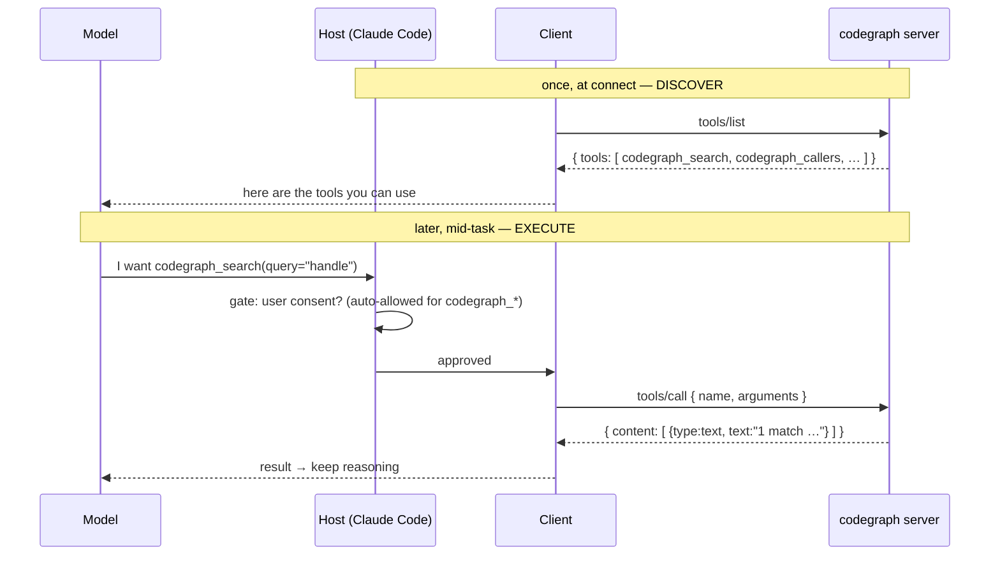

# 3. Tools

## TL;DR

> A server can offer three kinds of thing; the first and most important is **tools** — named,
> executable **actions** the AI can invoke to *do* something (search code, query a database, send a
> message). Tools are the **model-controlled** primitive: the *model* decides when to call one (the
> host gates it with user consent). The flow is two messages. **Discover:** the client sends
> `tools/list` and gets back an array of tool descriptions, each with a `name`, `title`,
> `description`, and a JSON Schema `inputSchema`. **Execute:** the client sends `tools/call` with a
> `name` and `arguments`, and gets back a **content array** — `[{"type":"text","text":"…"}, …]`. A
> failed tool returns a *result* with `isError: true`, not a protocol error, so the model can read
> what went wrong and recover. If this feels familiar, it should: it is exactly the Claude API "tool
> use" from **Part 3, Chapter 5** — same `name`/`description`/`input_schema`, same call→result loop —
> now standardized so the tool lives in a **reusable server** instead of one app's code.

## 1. Motivation

A language model, on its own, is a brain in a jar. It can reason, write, and explain — but it cannot
*touch* anything. It can't read the file on your disk, run a query against your database, or open a
pull request. To be useful as an *agent*, it needs hands.

You already saw it grow hands once. In **Part 3, Chapter 5** the Claude API let the model declare it
wanted to call a tool — `get_weather`, `run_query` — and your application code executed that call and
fed the result back. That works. But notice where the tool *lived*: inside one application's
codebase, wired to one app's loop. Build a second app that needs the same `run_query` tool, and you
write it again. This is the M×N swamp from Chapter 1, viewed up close — every (app, tool) pair its
own hand-loaded crate.

MCP's answer is to make **tools** a first-class, standard primitive of the protocol. A tool is an
executable function the model can invoke; a *server* publishes a set of them; and **any** MCP host can
discover and call them with no app-specific glue. This very repository is the proof. Its `codegraph`
MCP server publishes a set of tools — `codegraph_search`, `codegraph_callers`, `codegraph_callees`,
`codegraph_context`, `codegraph_impact`, `codegraph_node`, `codegraph_files`, `codegraph_status` —
and the agent that wrote this book *used them to navigate the code*, without anyone writing a line of
"codegraph-for-Claude-Code" integration. The tool was built once, in a server, and the model reached
for it. That is the whole idea of this chapter: tools turn the brain in a jar into something that
acts on the world, and they do it through a reusable interface.

## 2. Intuition (Analogy)

A tool server is a **restaurant kitchen that publishes a menu.**

The kitchen (the **server**) decides what it can cook and prints a **menu**. Each item on the menu is
a **dish** (a **tool**) with three things written next to it: a **name** ("Margherita Pizza"), a
**description** of what it is ("wood-fired, San Marzano tomatoes, fresh basil"), and the **required
ingredients** you must supply — *size*, *quantity* — which is the dish's `inputSchema`. The diner (the
**model**) reads the menu and **orders**: "one Margherita, large." That order is a `tools/call`. The
kitchen cooks it and brings out the **plated dish** — the result, MCP's **content array**.

Three details make the analogy faithful. First, **the diner orders, not the waiter** — the model
decides *which* dish based on what it's reading on the menu, which is why the `description` matters so
much: it's the only thing the model has to go on. Second, **you can't order off-menu** — ask for a
dish that isn't listed and the kitchen sends back "we don't serve that" (a result with
`isError: true`), not a kitchen fire. Third, **the menu can change** — today's specials get added, the
salmon runs out; the kitchen can announce "menu updated," and a diner who cares re-reads it (that's
`notifications/tools/list_changed`).

| Restaurant | MCP tools |
|---|---|
| The kitchen that can cook | The **server** that exposes tools |
| The printed **menu** | The `tools/list` response |
| A **dish** (name + description + ingredients) | A **tool** (`name`, `title`, `description`, `inputSchema`) |
| Reading the menu | Discovery via `tools/list` |
| **Ordering** "one Margherita, large" | Execution via `tools/call` with `arguments` |
| The **plated dish** brought to the table | The result's **content array** |
| "We don't serve that" | A result with `isError: true` |
| "Today's menu has changed" | `notifications/tools/list_changed` |
| The diner decides what to order | The **model** decides which tool to call |

## 3. Formal Definition

A **tool** is a named, executable function that an MCP **server** exposes for an AI model to invoke.
Tools are the **model-controlled** primitive of MCP: the *model* selects which tool to call and with
what arguments, while the **host** application typically gates the actual invocation behind user
consent. (Contrast Chapter 4's *resources*, which are application-controlled, and Chapter 5's
*prompts*, which are user-controlled.)

A tool is described by a small object. Its **shape**:

- **`name`** — a stable, unique identifier the client uses to call it. Should be clear and
  *namespaced* to avoid collisions across servers, e.g. `codegraph_search`, `calculator_arithmetic`.
- **`title`** — an optional human-friendly label for display ("Search code symbols").
- **`description`** — natural-language text explaining *what the tool does and when to use it*. This
  is **what the model reads to decide whether to call it**, so write it *prescriptively*.
- **`inputSchema`** — a **JSON Schema** object describing the arguments: their types, which are
  required, and what they mean. The client validates `arguments` against it before calling.

The protocol defines two request methods over the JSON-RPC layer from Chapter 2:

- **Discovery — `tools/list`.** The client sends `tools/list` (no required params); the server replies
  `{"tools": [ <tool description>, … ]}`. This is how the model *learns what hands it has*.
- **Execution — `tools/call`.** The client sends `tools/call` with
  `params: {"name": <tool name>, "arguments": { … per inputSchema … }}`; the server runs the tool and
  replies with a **content array**: `{"content": [ {"type": "text", "text": "…"}, … ]}`. Content
  items can be `text`, `image`, and other types — a tool can return more than a string.

| Term | Meaning |
|---|---|
| **Tool** | A named, executable action a server exposes for the model to invoke. |
| **Model-controlled** | The *model* chooses which tool to call (host gates with consent) — vs. app- or user-controlled. |
| **`tools/list`** | Discovery request: client asks, server returns the array of tool descriptions. |
| **`tools/call`** | Execution request: client sends `name` + `arguments`; server runs it and returns content. |
| **`inputSchema`** | JSON Schema for a tool's `arguments` — types, required fields, descriptions. |
| **Content array** | The result shape: `[{"type":"text","text":"…"}, …]`; supports text/image/etc. |
| **`isError`** | A field on a *result* set to `true` when the tool itself failed — distinct from a JSON-RPC error. |
| **`listChanged`** | A server capability; if set, the server may send `notifications/tools/list_changed` so clients re-`tools/list`. |

> The crossover insight: a tool is **two contracts in one object**. The `name` + `inputSchema` is the
> *machine* contract — the client validates arguments and routes the call against it. The
> `description` is the *model* contract — natural language that persuades the model to pick this tool
> at the right moment. A schema-perfect tool with a vague description is a dish no one orders; a
> well-described tool with a sloppy schema gets ordered and then fails validation. You must write
> *both* well.

## 4. Worked Example

Walk the two-message dance for a real call against this repo's `codegraph` server. The client lists
the tools once (and may cache them); later, when the model decides it needs to find a symbol, the
client calls `codegraph_search`. The host sits in the middle and asks the user before the call runs.



Here is the actual JSON on the wire. First the **discovery** response — a `tools/list` reply
listing two of `codegraph`'s tools (trimmed for space), each a full tool description:

```json
{
  "jsonrpc": "2.0",
  "id": 1,
  "result": {
    "tools": [
      {
        "name": "codegraph_search",
        "title": "Search code symbols",
        "description": "Find symbols (functions, classes, methods) by name in the indexed codebase. Use this FIRST when you know a symbol's name and want its file and kind.",
        "inputSchema": {
          "type": "object",
          "properties": {
            "query": { "type": "string", "description": "Symbol name to find." }
          },
          "required": ["query"]
        }
      },
      {
        "name": "codegraph_impact",
        "title": "Blast radius of a change",
        "description": "List everything that would be affected by changing a symbol. Use BEFORE editing to gauge risk.",
        "inputSchema": {
          "type": "object",
          "properties": {
            "symbol": { "type": "string", "description": "Fully-qualified symbol to analyze." }
          },
          "required": ["symbol"]
        }
      }
    ]
  }
}
```

Then the **execution** pair — the `tools/call` request the client sends, and the result it gets back.
Notice the result is a **content array**, not a bare string, and that nothing here is a JSON-RPC error
even though it *could* have been (a missing symbol would come back as `isError: true`, below):

```json
{
  "jsonrpc": "2.0",
  "id": 2,
  "method": "tools/call",
  "params": {
    "name": "codegraph_search",
    "arguments": { "query": "handle" }
  }
}
```

```json
{
  "jsonrpc": "2.0",
  "id": 2,
  "result": {
    "content": [
      { "type": "text", "text": "1 match for 'handle': def handle(...)  [server/util.py]" }
    ]
  }
}
```

That's the entire mechanism. `id: 2` ties the response to the request (Chapter 2's correlation); the
`content` array is what flows back into the model's context so it can keep reasoning. Swap the names
and this is *byte-for-byte* the Claude API tool-use loop from Part 3, Chapter 5 — only now
`codegraph_search` lives in a server any host can reuse, not inside one application.

## 5. Build It

Let's build a tiny tool server from first principles — no SDK, no network, just the JSON shapes. A
`TOOLS` registry holds each tool's **card** (the `name`/`title`/`description`/`inputSchema` the model
reads) alongside an **impl** (the kitchen the model never sees). `handle(req)` is the dispatcher: it
answers `tools/list` by returning every card, and `tools/call` by validating-then-running the named
tool. We feed it four scripted requests — list, two successful calls, and one order for a tool that
isn't on the menu — and print the JSON. Watch where `isError` shows up.

```python run
import json

# --- The tool registry: each tool = a CARD on the menu (name/description/
#     inputSchema the model reads) PLUS a kitchen `impl` the model never sees.
TOOLS = {
    "codegraph_search": {
        "card": {
            "name": "codegraph_search",
            "title": "Search code symbols",
            "description": (
                "Find symbols (functions, classes, methods) by name in the "
                "indexed codebase. Use this FIRST when you know a symbol's name "
                "and want its file and kind."
            ),
            "inputSchema": {
                "type": "object",
                "properties": {
                    "query": {"type": "string", "description": "Symbol name to find."}
                },
                "required": ["query"],
            },
        },
        # The kitchen. Pretend this hits a real code-intelligence graph.
        "impl": lambda args: f"1 match for {args['query']!r}: def {args['query']}(...)  [server/util.py]",
    },
    "add": {
        "card": {
            "name": "add",
            "title": "Add two integers",
            "description": "Return the sum a + b. Use for exact integer arithmetic.",
            "inputSchema": {
                "type": "object",
                "properties": {
                    "a": {"type": "integer"},
                    "b": {"type": "integer"},
                },
                "required": ["a", "b"],
            },
        },
        "impl": lambda args: str(args["a"] + args["b"]),
    },
}


def handle(req):
    """Dispatch one JSON-RPC request to a JSON-RPC response."""
    rid, method, params = req.get("id"), req["method"], req.get("params", {})

    if method == "tools/list":
        # Discovery: hand back every CARD (never the impls). No params.
        cards = [t["card"] for t in TOOLS.values()]
        return {"jsonrpc": "2.0", "id": rid, "result": {"tools": cards}}

    if method == "tools/call":
        name = params["name"]
        args = params.get("arguments", {})
        tool = TOOLS.get(name)
        if tool is None:
            # Tool error == a RESULT with isError, NOT a JSON-RPC error.
            return {
                "jsonrpc": "2.0", "id": rid,
                "result": {
                    "content": [{"type": "text", "text": f"Unknown tool: {name!r}"}],
                    "isError": True,
                },
            }
        text = tool["impl"](args)            # run the kitchen
        return {
            "jsonrpc": "2.0", "id": rid,
            "result": {"content": [{"type": "text", "text": text}]},
        }

    # Unknown METHOD is a real protocol error (-32601), not a tool error.
    return {"jsonrpc": "2.0", "id": rid,
            "error": {"code": -32601, "message": f"Method not found: {method}"}}


def show(label, obj):
    print(label)
    print(json.dumps(obj, indent=2))
    print()


# 1) The client DISCOVERS what's on the menu.
list_req = {"jsonrpc": "2.0", "id": 1, "method": "tools/list"}
show(">> tools/list  (client asks: what can you do?)", list_req)
show("<< result", handle(list_req))

# 2) The model picks a tool from the menu and ORDERS it.
call_req = {
    "jsonrpc": "2.0", "id": 2, "method": "tools/call",
    "params": {"name": "codegraph_search", "arguments": {"query": "handle"}},
}
show(">> tools/call codegraph_search", call_req)
show("<< result (a content array — the plated dish)", handle(call_req))

# 3) A second order: exact arithmetic.
add_req = {
    "jsonrpc": "2.0", "id": 3, "method": "tools/call",
    "params": {"name": "add", "arguments": {"a": 2, "b": 40}},
}
show(">> tools/call add", add_req)
show("<< result", handle(add_req))

# 4) The model hallucinates a tool that isn't on the menu.
bad_req = {
    "jsonrpc": "2.0", "id": 4, "method": "tools/call",
    "params": {"name": "delete_database", "arguments": {}},
}
show(">> tools/call delete_database  (not on the menu!)", bad_req)
show("<< result (isError:true — the model SEES this and can recover)", handle(bad_req))
```

**Read the output.** The `tools/list` reply is the menu — two complete cards, impls nowhere in sight
(a server hands out *descriptions*, never its source). The two successful `tools/call` replies are
**content arrays**: `codegraph_search` plates one text item, `add` plates `"42"`. The interesting one
is the last: ordering `delete_database` returns a *result* with `"isError": true` and a `content`
array explaining the problem — **not** a JSON-RPC `error`. That distinction is the spec, and it's
deliberate: a tool failure is information *for the model* (it reads the text and can apologize, retry,
or pick another tool), whereas a JSON-RPC error means the *protocol* broke. Now break it yourself:
delete the `"required": ["query"]` line and you've made a tool whose schema no longer protects it —
the model could call `codegraph_search` with no `query` at all, and `impl` would crash with a
`KeyError`. The `inputSchema` isn't decoration; it's the contract a real client validates against
*before* your kitchen ever runs.

## 6. Trade-offs & Complexity

| Tools (model-controlled actions) | The alternative |
|---|---|
| Model *acts* — runs code, writes data, calls APIs | Resources (Ch 4): read-only context, no side effects |
| The **model** decides when to invoke | App decides (resources) or user decides (prompts, Ch 5) |
| One server, reusable by **any** host | Part 3 tool use: re-implemented per application |
| `description` steers the model — write it once, well | A vague description = a capable tool the model never picks |
| Errors come back as data (`isError`) so the model recovers | A thrown exception would just abort the turn |
| Side effects need a consent gate (host responsibility) | Read-only primitives are safe to auto-allow |

The headline trade-off is **power vs. risk**. Tools are the only primitive that can *change the
world*, which is exactly why they're gated: a `resources/read` is safe to allow blindly, but a
`tools/call` named `delete_file` is not. The host's consent prompt is the price of action — and it's
why this repo's `settings.json` auto-allows precisely the eight read-only-ish `codegraph_*` tools and
nothing else (the full permission story is Chapter 10). A second, quieter cost: every tool you add
spends **context budget**, because its full card is loaded into the model's prompt so it knows the
tool exists. Fifty tools is fifty descriptions the model reads on every turn. Curate.

## 7. Edge Cases & Failure Modes

- **Vague descriptions — the silent failure.** A tool with a perfect schema but a `description` like
  "does stuff with code" will simply *never be chosen*, because the model picks tools by reading
  descriptions. Write them prescriptively: say what it does *and when to use it* ("Use this FIRST
  when…"). This is the single highest-leverage thing about authoring a tool.
- **Name collisions.** Two servers both exposing a `search` tool is ambiguous. Namespace every name
  (`codegraph_search`, not `search`) so the model — and the client's router — can tell them apart.
- **Confusing a tool error with a protocol error.** Returning a JSON-RPC `error` for "row not found"
  aborts the model's turn; returning a *result* with `isError: true` hands the model a readable
  message it can recover from. Reserve real JSON-RPC errors for *protocol* faults (bad method,
  malformed request).
- **Schema that doesn't match the impl.** If `inputSchema` says `query` is optional but your code
  indexes `args["query"]` unconditionally, a valid call crashes (the §5 "break it"). The schema is a
  *promise* — keep the implementation honest to it.
- **Stale tool list after `listChanged`.** A server with `tools:{listChanged:true}` can add or remove
  tools at runtime and send `notifications/tools/list_changed`. A client that cached the first
  `tools/list` and never re-fetches will call tools that vanished, or miss tools that appeared.
- **Over-broad, under-gated tools.** A tool like `run_shell(command)` is maximally powerful and
  maximally dangerous; if the host auto-allows it, the model can do anything. Scope tools narrowly and
  let the consent gate (Chapter 10) guard the risky ones.

## 8. Practice

> **Exercise 1 — Trace the two messages.** Using this repo's `codegraph` server, the model needs to
> know *what would break* if it changed a function. Name the **two** JSON-RPC methods involved across
> the whole interaction, which tool gets called, and the *shape* of what comes back. Tie each step to
> the menu analogy.

<details>
<summary><strong>Answer</strong></summary>

Two methods, in order:

1. **`tools/list`** (discovery) — sent once so the model knows the menu. The reply is
   `{"tools": [ … ]}`, an array that includes `codegraph_impact` with its `name`, `description`
   ("List everything that would be affected by changing a symbol. Use BEFORE editing…"), and an
   `inputSchema` requiring a `symbol` string. This is *reading the menu*.
2. **`tools/call`** (execution) — sent with
   `params: {"name": "codegraph_impact", "arguments": {"symbol": "…"}}`. This is *placing the order*.

What comes back is a **content array**: `{"content": [{"type": "text", "text": "…"}]}` — the *plated
dish*. It is a result, not a JSON-RPC error; if the symbol didn't exist, it would still be a result,
just with `isError: true`. The model reads that content and keeps reasoning. (`tools/call` is the
`codegraph_impact` order; `tools/list` was the menu it ordered from.)

</details>

> **Exercise 2 — Why isn't a tool failure a JSON-RPC error?** A `tools/call` asks `codegraph_search`
> for a symbol that doesn't exist. The spec says the server should return a *result* with
> `isError: true` rather than a JSON-RPC `error` object. Explain the reasoning, and what the model can
> do with each.

<details>
<summary><strong>Answer</strong></summary>

A **tool error** is a normal outcome of *running the action* ("no symbol matched your query"), and the
model is exactly the audience that should hear about it. Returning it as a *result* with
`isError: true` puts a readable message into the model's context, so the model can adapt — broaden the
query, try a different tool, or tell the user "no match found." The turn continues.

A **JSON-RPC error** means the *protocol* itself failed — an unknown method, a malformed request, a
transport fault (the `-32601` branch in §5). That's not something the model can "recover" from by
reasoning; it's a bug in the call or the wiring, surfaced to the *client/host*, and it typically
aborts the turn.

So the rule is about *who needs the information and whether reasoning can fix it*: tool-level problems
→ `isError` result (the model handles it); protocol-level problems → JSON-RPC error (the host handles
it). Collapsing the two — throwing a protocol error for "row not found" — needlessly kills a turn the
model could have salvaged.

</details>

> **Exercise 3 — Connect it back to Part 3.** In Part 3, Chapter 5 you gave the Claude API a tool with
> `name`, `description`, and `input_schema`, and ran a call→result loop in your app. State precisely
> what MCP changes and what it keeps the same — and why "build once, use everywhere" follows.

<details>
<summary><strong>Answer</strong></summary>

**Kept the same — the mechanics.** A tool is still a `name` + a natural-language `description` + a JSON
Schema for its arguments (`input_schema` in the API, `inputSchema` in MCP). The model still *decides*
to call it; your side still executes it and feeds the result back. It is the same call→result loop.

**Changed — where the tool lives and who can reach it.** In Part 3 the tool definition and its
executor sat *inside one application's code*, reachable only by that app. MCP standardizes the tool
into a **server** with standard discovery (`tools/list`) and execution (`tools/call`) methods. Because
the interface is the protocol — not one app's private wiring — *any* MCP host can discover and call
the same tool with no app-specific glue.

**Why "build once, use everywhere" follows.** Once the contract is a shared standard rather than an
app's internal API, the tool author implements the action *once* (in the server) and every MCP client
reuses it — the M×N → M+N collapse from Chapter 1, applied to tools specifically. `codegraph` is the
living proof: written once as a server, used by the agent that wrote this book without a line of
bespoke integration.

</details>

```quiz
{
  "prompt": "In MCP, tools are described as the 'model-controlled' primitive. What does that mean, and how does a client invoke one?",
  "input": "Choose one:",
  "options": [
    "The model decides which tool to call (the host gates it with user consent); the client discovers tools via tools/list and invokes one via tools/call with a name and arguments",
    "The application decides which tool runs on a fixed schedule; the client invokes it by reading a resource URI",
    "The user must type the exact tool name every time; the client invokes it by sending a JSON-RPC error the server interprets",
    "The server autonomously runs tools whenever it wants; the client only receives notifications and never sends a request"
  ],
  "answer": "The model decides which tool to call (the host gates it with user consent); the client discovers tools via tools/list and invokes one via tools/call with a name and arguments"
}
```

## Your Turn

Before you move on, check your understanding with the coach — explain the idea, apply it, weigh the trade-offs, then defend your reasoning.

<div class="concept-coach"></div>

## In the Wild

- **[MCP spec — Server Concepts: Tools](https://modelcontextprotocol.io/docs/concepts/tools)** — the
  authoritative definition: the tool shape, `tools/list` / `tools/call`, the content-array result,
  `isError`, and the `listChanged` notification. The primary source for this chapter (spec 2025-06-18).
- **[Reference MCP servers](https://github.com/modelcontextprotocol/servers)** — read real `tools/list`
  output and tool descriptions from the filesystem, GitHub, and Postgres servers; the best way to see
  what *prescriptive* descriptions look like in production.
- **[Anthropic — Claude API tool use](https://docs.claude.com/en/docs/agents-and-tools/tool-use/overview)**
  — the same call→result loop *before* MCP standardized it (Part 3, Chapter 5): identical
  `name`/`description`/`input_schema`, living in one app instead of a reusable server.

---

**Next:** tools let the model *act*. But sometimes you don't want the model to act — you want to hand
it read-only *context* (a file, a config, a database row) that the *application* decides to attach. That
second primitive is application-controlled, addressed by URI, and shaped differently from a tool. →
[4. Resources](/cortex/the-claude-stack/model-context-protocol/resources)
