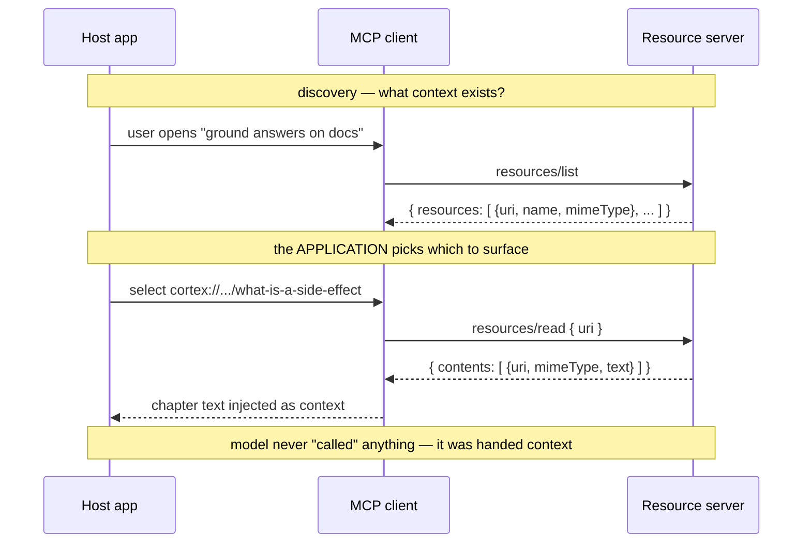

# 4. Resources

## TL;DR

> Chapter 3 covered **tools** — actions the *model* decides to invoke. **Resources** are the other
> half of that coin: **read-only context data** the *application* decides to pull in. A resource is a
> data source — a file's contents, a database record, an API response, a documentation page — each
> addressed by a **URI** like `file:///etc/hosts` or `cortex://.../what-is-a-side-effect`. The host
> **browses the catalog** with `resources/list` and **fetches a body** with `resources/read`; the
> server answers with a `contents[]` array of `{uri, mimeType, text|blob}`. The one fact to burn in:
> **tools are *actions the model invokes*; resources are *context the application supplies*.** Same
> JSON-RPC plumbing as tools — different hand on the wheel, different purpose.

## 1. Motivation

In Chapter 3 you gave the model a *verb*: a `search_orders` tool it could call whenever it judged a
search was needed. The model was in the driver's seat — it read the tool's schema, decided to invoke
it, and waited for a result. That's exactly right for **actions**: things with effects, things you
want the model to choose to *do*.

But a huge amount of what an AI app needs isn't an action at all — it's just **context to read**. The
contents of the file you have open in your editor. The customer record for the ticket you're working.
The three documentation pages relevant to the question. The model doesn't need to "invoke" these; it
needs to be *handed* them. And crucially, **you** — the application, the human, the host — are usually
the one who knows *which* ones matter right now. The user opened *this* file. The ticket is about
*this* customer. Letting the model blindly call a `read_any_file` tool to go fishing would be both
slower and riskier than the app simply attaching the relevant context up front.

That's the gap **resources** fill. A resource server publishes a **catalog** of context it can offer —
each item with a stable address — and the host picks from that catalog and pulls the bodies it wants
*into the prompt*. Concretely for our world: imagine a code-intelligence server like this repo's
**`codegraph`** exposing a file's *source* as a resource at a URI such as
`codegraph://file/server/.../Languages.scala`. The app working on that file lists resources, sees the
source is available, reads it, and grounds the model in the actual code — no guessing, no fishing
tool. Resources are how an MCP server says *"here is context you can read,"* as opposed to tools,
which say *"here are things you can do."*

## 2. Intuition (Analogy)

Think of an MCP server as a **library**, and your AI application as a **researcher** sitting at a
table inside it. The library offers two very different kinds of help.

The **staff** are the people you can *ask to do things*: "pull this book from the closed stacks,"
"renew my loan," "inter-library-loan this title." You make a request, they perform an action, you get
a result. **That's a tool** (Chapter 3) — you invoke the staff to *act*.

The **reference section** is different. It's shelves of material you *consult* — encyclopedias,
manuals, bound journals — each with a **call number** so you can find the exact one. Nobody "runs" a
reference book; you *browse the catalog*, *pull the volume you need onto your table*, and *read it*.
And here's the key bit: **you, the researcher, decide which references land on your table.** You don't
ask the encyclopedia to do anything — you bring it into your workspace as context. **That's a
resource.** The **call number is the URI**, browsing the catalog is **`resources/list`**, and pulling
a volume onto the table is **`resources/read`**.

So the same library gives you *staff to ask* (tools) and a *reference section to consult*
(resources). Same building, same front desk (the JSON-RPC protocol) — opposite direction of control.

| | **Tool** (Chapter 3) | **Resource** (this chapter) |
|---|---|---|
| Library analogy | The **staff** you ask to *do* something | The **reference shelf** you pull onto your table |
| What it is | An **action** with effects | **Context data** to read |
| Who's in control | **The model** decides to invoke it | **The application/host** decides to supply it |
| Intent | *Act* on the world | *Read* / ground the answer |
| Identified by | A **name** (`search_orders`) | A **URI** (`cortex://.../intro`) |
| Discover / use | `tools/list` → `tools/call` | `resources/list` → `resources/read` |
| Returns | Result of the action | `contents[]` — the data |

## 3. Formal Definition

A **resource** is a unit of **read-only context** that an MCP server exposes to a client, identified
by a **URI**. Resources are the **application-controlled** primitive: the host (or the user) chooses
which resources to surface to the model — in contrast to **tools** (model-controlled) and **prompts**
(user-controlled, Chapter 5). Resources carry **no side effects**; reading one must not change state.

A **URI** addresses each resource. The scheme can be a standard one — `file:///path/to/doc.txt`,
`https://…` — or a **custom scheme** the server defines for its own namespace, e.g.
`db://customers/42`, `codegraph://file/…`, or `cortex://production-engineering/zio/what-is-a-side-effect`.
The URI is the *stable name* a client uses to fetch the body later.

Two JSON-RPC methods drive the lifecycle:

- **`resources/list`** — *discovery*. The server returns
  `{"resources": [ {"uri", "name", "title"?, "description"?, "mimeType"?}, … ]}` — **metadata only**,
  no bodies. This is the catalog.
- **`resources/read`** — *retrieval*. The client sends `params: {"uri": …}`; the server returns
  `{"contents": [ {"uri", "mimeType", "text" | "blob"}, … ]}`. Text content rides in `text`; binary
  content rides base64-encoded in `blob`. One read can return **multiple** content items (e.g. a
  directory-like resource).

**Resource templates** let a server advertise *parameterized* URIs — a pattern like
`db://customers/{id}` — so a client can construct a concrete URI (`db://customers/42`) without the
server listing every record. And a server that declares the capability
`resources: {listChanged: true, subscribe: true}` can **notify** clients when the catalog changes and
support **subscriptions** to individual resources, so a long-lived client re-reads when a file is
edited underneath it.

| Term | Meaning |
|---|---|
| **Resource** | A read-only unit of context an MCP server exposes, addressed by a URI. |
| **URI** | The resource's stable address; standard (`file://`, `https://`) or a custom scheme. |
| **`resources/list`** | Discovery call → catalog of `{uri, name, title?, description?, mimeType?}`, no bodies. |
| **`resources/read`** | Retrieval call with `params.uri` → `{contents: [{uri, mimeType, text\|blob}]}`. |
| **`contents[]`** | The returned bodies; `text` for text, base64 `blob` for binary. |
| **`mimeType`** | The content type (`text/markdown`, `application/json`, `image/png`, …). |
| **Resource template** | A parameterized URI pattern (`db://customers/{id}`) for on-demand addresses. |
| **`subscribe` / `listChanged`** | Capabilities for change notifications and per-resource subscriptions. |
| **Application-controlled** | The host/user — not the model — decides which resources to surface. |

> The crossover insight: **tools and resources are the same protocol with the control reversed.** Ask
> *"who decides to invoke this, and is it an action or a read?"* If the **model** chooses and it
> **acts** → tool. If the **application** chooses and it **reads** → resource. Pick the wrong one and
> you either make the model beg for context it should have been handed, or hand it an "action" it can
> never trigger.

## 4. Worked Example

A documentation-grounding app wants to answer using Cortex chapters. The host asks the resource server
what's available (`resources/list`), the **application** picks the relevant chapter, and reads its
body (`resources/read`). The model is never the one "calling" — it's simply handed the text as context.



Here is the same exchange as real JSON-RPC — a `resources/list` request/response, then a
`resources/read` for one chapter URI:

```json
// 1) resources/list  — request
{ "jsonrpc": "2.0", "id": 1, "method": "resources/list" }

// 1) resources/list  — response (catalog: metadata only, no bodies)
{
  "jsonrpc": "2.0",
  "id": 1,
  "result": {
    "resources": [
      {
        "uri": "cortex://production-engineering/zio/what-is-a-side-effect",
        "name": "What is a side effect?",
        "title": "ZIO - What is a side effect?",
        "description": "Chapter: side effects as descriptions vs executions.",
        "mimeType": "text/markdown"
      },
      {
        "uri": "cortex://the-claude-stack/model-context-protocol/why-mcp-exists",
        "name": "Why MCP exists",
        "title": "MCP - Why MCP exists",
        "description": "Chapter: the MxN integration problem; USB-C for AI.",
        "mimeType": "text/markdown"
      }
    ]
  }
}

// 2) resources/read  — request (the application picks ONE uri)
{
  "jsonrpc": "2.0",
  "id": 2,
  "method": "resources/read",
  "params": { "uri": "cortex://production-engineering/zio/what-is-a-side-effect" }
}

// 2) resources/read  — response (the body, in contents[])
{
  "jsonrpc": "2.0",
  "id": 2,
  "result": {
    "contents": [
      {
        "uri": "cortex://production-engineering/zio/what-is-a-side-effect",
        "mimeType": "text/markdown",
        "text": "# What is a side effect?\n\nA side effect is anything a function does beyond returning a value..."
      }
    ]
  }
}
```

Notice the asymmetry between the two responses: **`list` returns names and addresses but never the
text**, while **`read` returns exactly the body you asked for**. That split is the whole point — a
client can cheaply survey a thousand resources without paying to download all of them, then fetch only
the handful it actually needs into the prompt. This is the mirror of Chapter 3's `tools/list` →
`tools/call`, with the model's decision replaced by the application's.

## 5. Build It

Let's implement a tiny resource server over an in-memory **content store** — a dict of
`uri → {mimeType, text}`, flavored with real Cortex chapter URIs. A single `handle(req)` dispatches
`resources/list` (catalog, metadata only) and `resources/read` (one body, or a JSON-RPC error for an
unknown URI). We then run a *list*, a *read of a known URI*, and a *read of an unknown URI*, printing
each JSON response. No SDK, no network — pure dispatch, fully deterministic.

```python run
import json

# The "content store": uri -> {mimeType, text}. Cortex-flavored chapter URIs,
# the kind of read-only context an AI app would pull in to ground an answer.
STORE = {
    "cortex://production-engineering/zio/what-is-a-side-effect": {
        "name": "What is a side effect?",
        "title": "ZIO - What is a side effect?",
        "description": "Chapter: side effects as descriptions vs executions.",
        "mimeType": "text/markdown",
        "text": "# What is a side effect?\n\nA side effect is anything a "
                "function does beyond returning a value: printing, reading a "
                "file, hitting the network. ZIO turns effects into *values* "
                "you describe first and run later.",
    },
    "cortex://the-claude-stack/model-context-protocol/why-mcp-exists": {
        "name": "Why MCP exists",
        "title": "MCP - Why MCP exists",
        "description": "Chapter: the MxN integration problem; USB-C for AI.",
        "mimeType": "text/markdown",
        "text": "# Why MCP exists\n\nM apps times N tools is an MxN swamp of "
                "bespoke connectors. MCP is one standard interface in the "
                "middle, collapsing it to M+N.",
    },
}


def ok(req_id, result):
    """A JSON-RPC 2.0 success envelope."""
    return {"jsonrpc": "2.0", "id": req_id, "result": result}


def err(req_id, code, message):
    """A JSON-RPC 2.0 error envelope (e.g. unknown resource)."""
    return {"jsonrpc": "2.0", "id": req_id,
            "error": {"code": code, "message": message}}


def list_resources():
    """Discovery: the catalog. Metadata only -- never the bodies."""
    catalog = []
    for uri, entry in STORE.items():
        catalog.append({
            "uri": uri,
            "name": entry["name"],
            "title": entry["title"],
            "description": entry["description"],
            "mimeType": entry["mimeType"],
        })
    return {"resources": catalog}


def read_resource(uri):
    """Retrieval: the contents for one uri, in the MCP contents[] shape."""
    entry = STORE[uri]  # KeyError -> caller maps to a JSON-RPC error
    return {"contents": [{
        "uri": uri,
        "mimeType": entry["mimeType"],
        "text": entry["text"],
    }]}


def handle(req):
    """Dispatch one JSON-RPC request to the matching resource method."""
    method = req.get("method")
    req_id = req.get("id")
    params = req.get("params", {})

    if method == "resources/list":
        return ok(req_id, list_resources())

    if method == "resources/read":
        uri = params.get("uri")
        try:
            return ok(req_id, read_resource(uri))
        except KeyError:
            # -32002 is MCP's conventional "resource not found".
            return err(req_id, -32002, "Resource not found: " + str(uri))

    return err(req_id, -32601, "Method not found: " + str(method))


def show(label, response):
    """Pretty-print one response with a header, sorted for determinism."""
    print("--- " + label + " ---")
    print(json.dumps(response, indent=2, sort_keys=True))
    print()


# 1) The application browses the catalog.
show("resources/list", handle({
    "jsonrpc": "2.0", "id": 1, "method": "resources/list",
}))

# 2) The application pulls one known chapter into context.
known = "cortex://production-engineering/zio/what-is-a-side-effect"
show("resources/read (known uri)", handle({
    "jsonrpc": "2.0", "id": 2, "method": "resources/read",
    "params": {"uri": known},
}))

# 3) A typo'd / stale uri -> a clean JSON-RPC error, not a crash.
show("resources/read (unknown uri)", handle({
    "jsonrpc": "2.0", "id": 3, "method": "resources/read",
    "params": {"uri": "cortex://does/not/exist"},
}))

# A one-line invariant: list advertises bodies-free metadata; read returns
# exactly one body for a known uri; unknown uris error instead of guessing.
listed = handle({"jsonrpc": "2.0", "id": 4, "method": "resources/list"})
n_listed = len(listed["result"]["resources"])
read_ok = handle({"jsonrpc": "2.0", "id": 5, "method": "resources/read",
                  "params": {"uri": known}})
n_bodies = len(read_ok["result"]["contents"])
bad = handle({"jsonrpc": "2.0", "id": 6, "method": "resources/read",
              "params": {"uri": "cortex://nope"}})
print("invariants:")
print("  catalog advertised " + str(n_listed) + " resources (metadata only)")
print("  read of a known uri returned " + str(n_bodies) + " content body")
print("  read of an unknown uri returned error code "
      + str(bad["error"]["code"]))
```

Running it, `resources/list` returns **two resources as metadata only** — names, titles, URIs,
mimeTypes, *no bodies*. `resources/read` of the known ZIO chapter returns **one `contents[]` entry**
with the markdown `text`. The unknown URI returns a clean JSON-RPC **error `-32002`** ("resource not
found") instead of crashing or inventing a body. The closing invariants line confirms all three:
*catalog advertised 2 resources (metadata only) · read of a known uri returned 1 content body · read
of an unknown uri returned error code -32002.* That tiny `handle` function is the entire essence of
the resources primitive — the rest (templates, subscriptions) is elaboration.

**This is exactly where Cortex has a GAP.** Cortex's markdown chapters — the very file you're reading —
*are* a perfect resource: read-only context, each at a natural URI like
`cortex://production-engineering/zio/what-is-a-side-effect`, ideal for an AI app to pull in and ground
its answers. But **no such MCP server exists in this repo yet.** Building one — a "cortex-content"
resource server that lists and reads the chapters under `content/cortex/` — is the capstone we design
in **Chapter 11**. The `handle` above is its skeleton.

## 6. Trade-offs & Complexity

| Expose data as a **resource** | Expose it as a **tool** (Chapter 3) |
|---|---|
| App/host controls *what context* is supplied | Model controls *when an action* fires |
| Read-only, no side effects — safe to fetch | Can have effects — must be guarded |
| URI-addressed; cacheable, subscribable | Name + args; invoked per call |
| Great for files, docs, records, API snapshots | Great for searches, writes, computations |
| Model can't "go fishing" — you curate | Model can explore, but may over-call |
| Cost: host must *choose* and inject relevance | Cost: model spends turns deciding to call |

The deeper trade-off is **who curates relevance**. Resources put that judgment on the *application*:
you decide which chapter, which file, which record belongs in the prompt — precise and safe, but it's
work the host must do (and do well, or the model is grounded in the wrong context). Tools push the
judgment onto the *model*: flexible, but the model can over-call, fish, or trigger effects. Many real
servers expose **both** — `codegraph` could offer a file's source as a *resource* (here, read it) and
a `find_callers` *tool* (go, do a graph query). Same server, both hands on the wheel where each
belongs.

## 7. Edge Cases & Failure Modes

- **Treating a resource as an action (or vice-versa).** Modeling "read this file" as a tool forces the
  model to *invoke* context it should have been *handed*; modeling "delete this file" as a resource is
  nonsense (resources are read-only, no side effects). Decide by the §3 test: *who chooses + act vs
  read.*
- **Unknown / stale URI.** A client reads a URI that was listed earlier but has since moved or been
  deleted. The server must return a JSON-RPC **error** (conventionally `-32002`, "resource not
  found") — never a fabricated body. The §5 run shows exactly this.
- **Dumping the body in `list`.** `resources/list` is *metadata only*. Returning full file contents in
  the catalog defeats the cheap-survey/expensive-fetch split and can blow up the response for large or
  numerous resources.
- **Wrong or missing `mimeType`.** Labeling a PNG as `text/plain`, or putting binary in `text` instead
  of base64 `blob`, corrupts the content. Binary → `blob`; text → `text`; set `mimeType` honestly.
- **Stale context with no subscription.** A long-lived client reads a file once and never re-reads
  while the file changes underneath it. Without `subscribe` / `listChanged`, the model is grounded in
  an outdated snapshot — a silent correctness bug, not a crash.
- **Unbounded resources.** Some URIs map to enormous bodies (a giant log, a whole table). Reading them
  whole can overflow the context window; servers should paginate, truncate, or template by range
  rather than hand back everything.

## 8. Practice

> **Exercise 1 — Tool or resource?** For each, decide whether it should be an MCP **tool** or a
> **resource**, and justify it with the §3 test (*who decides to invoke it; act vs read*):
> (a) the current contents of `Languages.scala`; (b) "run the test suite"; (c) the customer record for
> ticket #482; (d) "send the user a Slack message."

<details>
<summary><strong>Answer</strong></summary>

Apply the test from §3: **resource** if the *application* supplies it and it's a *read*; **tool** if
the *model* invokes it and it *acts*.

- **(a) `Languages.scala` contents → resource.** Pure read-only context; the app knows the user is in
  this file and should *hand* it over (URI like `codegraph://file/.../Languages.scala`). The model
  shouldn't have to "invoke" it.
- **(b) Run the test suite → tool.** An *action* with effects (it executes code, takes time); the
  *model* decides when running tests is warranted. `tools/call`, not `resources/read`.
- **(c) Customer record for ticket #482 → resource.** Read-only context the app already knows is
  relevant (it's *this* ticket). A resource template fits beautifully: `db://customers/{id}` →
  `db://customers/482`.
- **(d) Send a Slack message → tool.** A side-effecting *action* the model chooses to take. Resources
  are read-only by definition, so this can only be a tool.

The pattern: (a) and (c) are *context to read* (resources, app-controlled); (b) and (d) are *actions
to perform* (tools, model-controlled).

</details>

> **Exercise 2 — Trace the two calls.** Using the §4 / §5 shapes, write the exact JSON-RPC **request**
> for (i) listing all resources, and (ii) reading
> `cortex://the-claude-stack/model-context-protocol/why-mcp-exists`. Then describe the *shape* of each
> response (what top-level key, and what's inside).

<details>
<summary><strong>Answer</strong></summary>

The two requests:

```json
{ "jsonrpc": "2.0", "id": 1, "method": "resources/list" }
```

```json
{
  "jsonrpc": "2.0",
  "id": 2,
  "method": "resources/read",
  "params": { "uri": "cortex://the-claude-stack/model-context-protocol/why-mcp-exists" }
}
```

Response shapes:

- **`resources/list` →** `result.resources`: an **array of metadata objects**, each
  `{uri, name, title?, description?, mimeType?}` — **no bodies**. It's the catalog.
- **`resources/read` →** `result.contents`: an **array of body objects**, each
  `{uri, mimeType, text | blob}`. For this markdown chapter, one entry with the chapter text in
  `text` and `mimeType: "text/markdown"`.

The split is the lesson: `list` is the cheap metadata survey; `read` is the targeted body fetch.

</details>

> **Exercise 3 — Design the gap.** Cortex has no resource server yet (the §5 GAP). Sketch one: pick a
> **URI scheme** for chapters, say what `resources/list` would return for the book, and what *one*
> `resources/read` would return. Why is a resource (not a tool) the right primitive here?

<details>
<summary><strong>Answer</strong></summary>

A reasonable design for a **"cortex-content"** resource server over `content/cortex/`:

- **URI scheme:** `cortex://<book>/<part>/<chapter>`, e.g.
  `cortex://production-engineering/zio/what-is-a-side-effect`. (A **resource template**
  `cortex://{book}/{part}/{chapter}` would let clients address chapters without listing every one.)
- **`resources/list` →** `{"resources": [ … ]}` with one entry per chapter file under
  `content/cortex/`, each `{uri, name (the title), description (the frontmatter summary),
  mimeType: "text/markdown"}` — metadata only.
- **`resources/read {uri}` →** `{"contents": [ {uri, mimeType: "text/markdown", text: <chapter
  markdown>} ]}` — the actual chapter body, ready to drop into a prompt.

**Why a resource, not a tool:** chapters are **read-only context** with **no side effects**, and the
**application** (an AI tutor grounding an answer) is the one that knows *which* chapter is relevant —
that's the textbook definition of the application-controlled resources primitive (§3). Reading a
chapter is *not* an action the model should have to "invoke"; it's context the host supplies. (This is
exactly the Chapter 11 capstone, and the `handle()` in §5 is its skeleton.)

</details>

```quiz
{
  "prompt": "What is the defining difference between an MCP resource and an MCP tool?",
  "input": "Choose one:",
  "options": [
    "A resource is read-only context the application chooses to supply (via resources/list + resources/read); a tool is an action the model chooses to invoke (via tools/list + tools/call)",
    "Resources use JSON-RPC while tools use plain HTTP, so they share no protocol machinery",
    "Resources are always larger than tools and must be paginated, whereas tools never return data",
    "A resource is model-controlled and a tool is application-controlled — the model picks resources, the app picks tools"
  ],
  "answer": "A resource is read-only context the application chooses to supply (via resources/list + resources/read); a tool is an action the model chooses to invoke (via tools/list + tools/call)"
}
```

## Your Turn

Before you move on, check your understanding with the coach — explain the idea, apply it, weigh the trade-offs, then defend your reasoning.

<div class="concept-coach"></div>

## In the Wild

- **[MCP spec — Resources (2025-06-18)](https://modelcontextprotocol.io/specification/2025-06-18/server/resources)**
  — the authoritative definition: URIs, `resources/list` and `resources/read`, the `contents[]` shape,
  resource templates, and the `subscribe` / `listChanged` capabilities. The primary source for this
  chapter.
- **[MCP docs — Concepts: Resources](https://modelcontextprotocol.io/docs/concepts/resources)** — the
  approachable walkthrough, including the "application-controlled" framing and the tools-vs-resources
  contrast that anchors §2–§3.
- **[Reference MCP servers (filesystem, git, …)](https://github.com/modelcontextprotocol/servers)** —
  real servers that expose resources: the filesystem server surfaces file contents at `file://` URIs;
  the git server surfaces repository data — concrete instances of "data as read-only context."

---

**Next:** tools are model-controlled, resources are application-controlled — which leaves the third
hand on the wheel. Who controls *prompts*, and how does a server hand the **user** a reusable,
parameterized template to invoke? →
[5. Prompts](/cortex/the-claude-stack/model-context-protocol/prompts)
