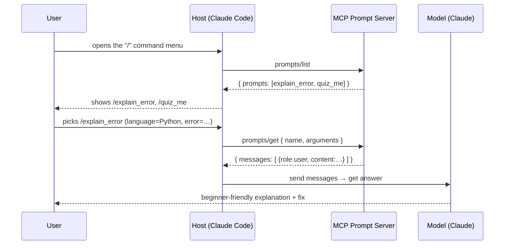

# 5. Prompts

## TL;DR

> A server's third primitive is the **prompt**: a named, reusable **template** that a **human
> deliberately reaches for** — typically surfaced in the host as a slash command or a menu item. The
> host discovers them with `prompts/list` (each prompt advertises a `name`, optional `title`/
> `description`, and an `arguments` schema) and instantiates one with `prompts/get` (passing the
> filled-in arguments), which returns a list of **`messages`** ready to send to the model. The single
> most important idea in this chapter — and a near-certain exam point — is the **trichotomy of who is
> in control**: **tools are MODEL-controlled** (the model decides to act), **resources are
> APPLICATION-controlled** (the app decides to surface context), and **prompts are USER-controlled**
> (the user decides to invoke a template). Same wire, three different drivers.

## 1. Motivation

You have met two of the three server primitives. **Tools** (Chapter 3) are *actions the model
performs* — the model, mid-reasoning, decides to call `search_code` or `run_query`. **Resources**
(Chapter 4) are *context the application surfaces* — the host app attaches a file or a record so the
model can see it. Both are driven by software: the model picks tools, the app picks resources. In
neither case does the *human at the keyboard* directly say "do this specific thing, this specific
way."

But a huge fraction of real AI usage is exactly that: a person who knows precisely what canned
interaction they want and just wants to fire it off. "Explain this error to me." "Quiz me on
hash tables." "Summarize this PR in our house style." These aren't one-off sentences typed fresh each
time — they're *the same structured request, over and over*, worth saving. In a help-desk app you'd
call them **saved replies**. In a shell you'd call them **aliases**. The interaction is reusable, the
wording is fiddly to get right, and the human is the one who decides *when* it fires.

You already use this primitive every day in Claude Code. **Slash commands are prompts.** When you type
`/graphify` in this repo, you are not asking the model to *decide* whether to graphify, and you are
not asking the app to *attach* something — *you*, the user, are deliberately invoking a saved,
parameterized interaction that expands into a full, well-formed request to the model. That is the
prompt primitive in its natural habitat: **a template the human reaches for on purpose.** MCP gives a
server a standard way to publish such templates so *any* host can offer them in its command menu.

## 2. Intuition (Analogy)

Picture a busy professional kitchen, and watch *who* touches *what*.

- The **appliances** — the oven, the blender, the sous-vide bath — are operated by the **cook** as the
  dish demands. The cook reaches for the blender *because the recipe is at the step that needs it*.
  Those are **tools**: the model (the cook) decides to use them, in the flow of the work.
- The **pantry ingredients** — flour, eggs, the labelled spice jars — are **laid out by the kitchen**
  ahead of service so they're within reach. Nobody "decides" to use the flour as a separate act;
  it's simply *available context* the kitchen provisioned. Those are **resources**: the application
  surfaces them.
- The **recipe cards** in the drawer are different. A **human** flips the drawer open, *chooses* the
  card that fits tonight's situation, scribbles in the specifics ("party of 6, no nuts"), and the card
  unfolds into a complete, structured set of instructions. Those are **prompts**: the **user**
  deliberately picks one, fills in the blanks, and it expands into a full request.

A prompt is a **recipe card** (or, in a help-desk app, a **saved reply** from the template menu). The
human reaches for it *on purpose* when the situation fits; it has fill-in-the-blank arguments; and it
expands into something complete and ready to act on. It is not the appliance the cook grabs
mid-stride, and it is not the ingredient the kitchen pre-stocked — it is the deliberate human choice
from a menu of saved, structured interactions.

| | Tools | Resources | **Prompts** |
|---|---|---|---|
| Kitchen analogy | Appliances the cook operates | Pantry the kitchen stocks | **Recipe cards in the drawer** |
| Help-desk analogy | The agent's action buttons | The customer record on screen | **Saved-reply templates** |
| **Who reaches for it** | the **model** | the **application** | the **user** |
| What it produces | a side effect / result | readable context | **ready-to-send `messages`** |
| Triggered when | the model decides to act | the app decides to attach | the human deliberately invokes |
| In Claude Code | `Bash`, `Edit`, `codegraph_*` | an attached file/`@`-mention | **a slash command (`/graphify`)** |

## 3. Formal Definition

A **prompt**, in MCP, is a **server-defined, reusable template** for a model interaction, exposed so
that the **user** can deliberately invoke it through the host (commonly as a slash command or menu
entry). Prompts are the **user-controlled** server primitive.

There are exactly two methods, and they map cleanly onto *discover* then *instantiate*:

- **`prompts/list`** — discovery. The server returns `{"prompts": [ ... ]}`, where each entry is a
  metadata block: a required `name`, an optional human-readable `title` and `description`, and an
  optional `arguments` array. Each argument declares its own `name`, optional `description`, and a
  `required` flag. Crucially, `prompts/list` returns *only the schema* — the shape of each template,
  not its filled-in content.
- **`prompts/get`** — instantiation. The host sends `params: {"name": ..., "arguments": {...}}`. The
  server validates the arguments, substitutes them into the template, and returns
  `{"description"?, "messages": [ ... ]}`. Each message is `{"role": "user" | "assistant", "content":
  {"type": "text", "text": ...}}`. **A prompt returns a list of messages** — an opening
  conversational state, ready to be sent to the model. This is *the* defining shape: not a string, but
  messages.

The deepest idea — the one to memorize — is the **control trichotomy** that distinguishes all three
server primitives by *who decides to use them*:

| Primitive | Controlled by | What it is | Mental tag |
|---|---|---|---|
| **Tools** | the **model** | actions the model invokes mid-reasoning | *model-controlled actions* |
| **Resources** | the **application** | context the host attaches for the model to read | *app-controlled context* |
| **Prompts** | the **user** | templates the human deliberately invokes | *user-controlled templates* |

| Term | Meaning |
|---|---|
| **Prompt** | A named, reusable interaction template a server exposes for the user to invoke. |
| **`prompts/list`** | Discovery call → `{"prompts": [{name, title?, description?, arguments?}, …]}`. |
| **`prompts/get`** | Instantiation call; `params:{name, arguments}` → `{description?, messages:[…]}`. |
| **Argument** | A declared fill-in-the-blank slot: `{name, description?, required?}`. |
| **`messages`** | The output of `prompts/get`: a list of `{role, content}` ready to send to the model. |
| **User-controlled** | The defining property: a *human* deliberately chooses to invoke it (not the model, not the app). |
| **Slash command** | A host's common surface for a prompt — e.g. typing `/graphify` to invoke one. |

## 4. Worked Example

A user is stuck on a Python traceback. In Claude Code's content server (the kind Chapter 11 designs),
they open the command menu, pick `/explain_error`, and fill in the language and the error text. Here is
the round trip: the host first lists what prompts exist, then *gets* the chosen one with arguments, and
receives back a `messages` array it can send straight to Claude.



The two calls on the wire — a `prompts/list` request/response, then a `prompts/get` request/response
— look like this. Note that `prompts/list` carries *only schema* (no content), while `prompts/get`
returns *messages* with the user's arguments substituted in:

```json
// 1) prompts/list  (host: "what templates do you offer?")
{ "jsonrpc": "2.0", "id": 1, "method": "prompts/list" }
{
  "jsonrpc": "2.0",
  "id": 1,
  "result": {
    "prompts": [
      {
        "name": "explain_error",
        "title": "Explain an error",
        "description": "Turn a raw error message into a beginner-friendly explanation plus a fix.",
        "arguments": [
          { "name": "language", "description": "Programming language", "required": true },
          { "name": "error",    "description": "The error text",       "required": true }
        ]
      },
      { "name": "quiz_me", "title": "Quiz me on a topic",
        "description": "Generate a short interactive quiz on a topic of your choice.",
        "arguments": [ { "name": "topic", "description": "What to be quizzed on", "required": true } ] }
    ]
  }
}

// 2) prompts/get  (user invoked /explain_error and filled the blanks)
{
  "jsonrpc": "2.0", "id": 2, "method": "prompts/get",
  "params": {
    "name": "explain_error",
    "arguments": { "language": "Python", "error": "IndexError: list index out of range" }
  }
}
{
  "jsonrpc": "2.0",
  "id": 2,
  "result": {
    "description": "Turn a raw error message into a beginner-friendly explanation plus a fix.",
    "messages": [
      {
        "role": "user",
        "content": {
          "type": "text",
          "text": "You are a patient tutor. Explain this Python error to a beginner, in plain language, then give one concrete fix.\n\nError:\nIndexError: list index out of range"
        }
      }
    ]
  }
}
```

## 5. Build It

Let's implement that exact server in plain Python — no MCP SDK, no network, just dictionaries shaped
like the wire. A catalogue holds each prompt's *metadata* (what `prompts/list` returns) plus a `build`
function (what turns arguments into `messages`). One `handle(req)` dispatches both methods, validates
required arguments, and returns the spec's shapes. We run a `list`, then a `get`, print the JSON — and
then print the trichotomy table so the "who controls it" axis is reinforced in the output itself.

```python run
import json

# --- The template catalogue: metadata (for prompts/list) + a builder (for prompts/get) ---

def build_explain_error(args):
    return [{"role": "user", "content": {"type": "text", "text":
        "You are a patient tutor. Explain this " + args["language"] +
        " error to a beginner, in plain language, then give one concrete fix."
        "\n\nError:\n" + args["error"]}}]

def build_quiz_me(args):
    return [{"role": "user", "content": {"type": "text", "text":
        "Quiz me on " + args["topic"] + ". Ask exactly three multiple-choice "
        "questions, one at a time, and wait for my answer before the next."}}]

PROMPTS = {
    "explain_error": {
        "meta": {"name": "explain_error", "title": "Explain an error",
                 "description": "Turn a raw error message into a beginner-friendly explanation plus a fix.",
                 "arguments": [
                     {"name": "language", "description": "Programming language", "required": True},
                     {"name": "error", "description": "The error text", "required": True}]},
        "build": build_explain_error},
    "quiz_me": {
        "meta": {"name": "quiz_me", "title": "Quiz me on a topic",
                 "description": "Generate a short interactive quiz on a topic of your choice.",
                 "arguments": [{"name": "topic", "description": "What to be quizzed on", "required": True}]},
        "build": build_quiz_me},
}

# --- One dispatcher, two methods: discover (list) then instantiate (get) ---

def handle(req):
    method, rid = req.get("method"), req.get("id")
    if method == "prompts/list":
        catalogue = [entry["meta"] for entry in PROMPTS.values()]
        return {"jsonrpc": "2.0", "id": rid, "result": {"prompts": catalogue}}
    if method == "prompts/get":
        params = req.get("params", {})
        entry = PROMPTS.get(params.get("name"))
        if entry is None:
            return {"jsonrpc": "2.0", "id": rid,
                    "error": {"code": -32602, "message": "Unknown prompt: " + str(params.get("name"))}}
        supplied = params.get("arguments", {})
        missing = [a["name"] for a in entry["meta"]["arguments"]
                   if a.get("required") and a["name"] not in supplied]
        if missing:
            return {"jsonrpc": "2.0", "id": rid,
                    "error": {"code": -32602, "message": "Missing argument(s): " + ", ".join(missing)}}
        return {"jsonrpc": "2.0", "id": rid,
                "result": {"description": entry["meta"]["description"],
                           "messages": entry["build"](supplied)}}
    return {"jsonrpc": "2.0", "id": rid,
            "error": {"code": -32601, "message": "Method not found: " + str(method)}}

def show(label, payload):
    print(label)
    print(json.dumps(payload, indent=2))
    print()

# 1) The user opens the slash-command menu -> host calls prompts/list
show(">>> prompts/list", handle({"jsonrpc": "2.0", "id": 1, "method": "prompts/list"}))

# 2) The user picks /explain_error and fills it in -> host calls prompts/get
get_req = {"jsonrpc": "2.0", "id": 2, "method": "prompts/get",
           "params": {"name": "explain_error",
                      "arguments": {"language": "Python", "error": "IndexError: list index out of range"}}}
resp = handle(get_req)
show(">>> prompts/get  (returns `messages`, ready to send to the model)", resp)

# The arguments were substituted; the result is a list of messages, not a string.
msgs = resp["result"]["messages"]
assert isinstance(msgs, list) and msgs[0]["role"] == "user"
assert "Python" in msgs[0]["content"]["text"] and "IndexError" in msgs[0]["content"]["text"]

# 3) The trichotomy -- the single most important takeaway, printed as a table.
rows = [("Tools", "MODEL", "Actions the model decides to perform"),
        ("Resources", "APPLICATION", "Context the app decides to surface"),
        ("Prompts", "USER", "Templates the user decides to invoke")]
print("The three server primitives -- WHO is in control:")
print("  {:<10} {:<12} {}".format("PRIMITIVE", "CONTROLLED BY", "PURPOSE"))
print("  " + "-" * 60)
for name, who, purpose in rows:
    print("  {:<10} {:<12} {}".format(name, who, purpose))
```

The `prompts/list` response is pure schema — names, descriptions, argument slots — so the host can
render a menu without knowing any content. The `prompts/get` response is the payoff: the user's
`language` and `error` are baked into a `text`, wrapped as a `user` message, inside a `messages` list
the host forwards verbatim to Claude. That `messages`-as-output shape is what makes a prompt a
*template for an interaction* rather than just a tool result or a blob of context.

## 6. Trade-offs & Complexity

| Use a prompt (user-controlled template) | Use a tool / resource instead |
|---|---|
| The **human** knows exactly what canned interaction they want | The **model** should decide whether/when to act → **tool** |
| The interaction is **reusable** and worth saving (a slash command) | You just need to **attach context** for reading → **resource** |
| You want **fill-in-the-blank arguments** with a clear schema | A free-form one-off sentence the user types fresh each time |
| Discovery + instantiation is two cheap calls (`list`, then `get`) | The action has **side effects** the model must reason about → tool |
| Returns **`messages`** the host sends as-is | You need a return *value* the model consumes mid-loop → tool |

Complexity-wise, prompts are the *lightest* primitive: `prompts/list` is one round trip that returns
schema only, and `prompts/get` is one more that does a string substitution and returns messages —
**O(arguments)** work, no side effects, no model decision in the loop. The cost is conceptual, not
computational: the discipline to pick the *right* primitive. The trichotomy is the whole decision
procedure — ask **"who should be in control here?"** Model → tool. App → resource. **User → prompt.**

## 7. Edge Cases & Failure Modes

- **Confusing a prompt with a tool.** The classic mix-up. If the *model* should decide whether to do
  the thing, it's a **tool**; if the *human* deliberately fires it, it's a **prompt**. "Run the
  tests" the model chooses → tool. "Summarize this PR in our style" the user invokes → prompt.
- **Confusing a prompt with a resource.** Both can carry text, but a resource is *context the app
  attaches for reading*, while a prompt is *a template the user invokes that returns messages*. The
  pantry ingredient vs. the recipe card.
- **Missing or wrong arguments.** A `prompts/get` that omits a `required` argument must be rejected by
  the server (our `handle` returns a `-32602` error). Hosts should validate against the declared
  `arguments` schema *before* sending, to fail fast in the UI.
- **Unknown prompt name.** `prompts/get` for a `name` not in the catalogue is an error, not an empty
  result — never silently return nothing, or the host can't tell "no such command" from "command with
  no output."
- **Returning a bare string instead of `messages`.** A prompt MUST return a `messages` list, even for
  a single message. Hand back a raw string and conformant hosts can't forward it to the model.
- **Treating prompts as automatic.** Prompts are *user-initiated by definition*. A server cannot make
  the user invoke one; if you find yourself wanting the interaction to fire on its own, you wanted a
  tool (model decides) or a resource (app surfaces), not a prompt.

## 8. Practice

> **Exercise 1 — Sort them into the trichotomy.** For each, name the primitive (tool / resource /
> prompt) and *who controls it*: **(a)** a `/quiz-me-on` command a learner picks from a menu in a
> Cortex content server; **(b)** `run_query`, which Claude calls on its own to fetch data mid-answer;
> **(c)** the current chapter's markdown, attached by the host so the model can see it.

<details>
<summary><strong>Answer</strong></summary>

- **(a)** `/quiz-me-on` → **prompt**, **user-controlled**. The learner *deliberately invokes* it from
  the command menu; it's a reusable template that expands (via `prompts/get`) into ready-to-send
  `messages`. This is exactly the slash-command shape from §1, the sibling of this repo's `/graphify`.
- **(b)** `run_query` → **tool**, **model-controlled**. The *model* decides, mid-reasoning, to call it;
  it performs an action and returns a value the model consumes. (Chapter 3.)
- **(c)** the chapter markdown → **resource**, **application-controlled**. The *host app* attaches it
  as readable context; nobody "invokes" it as a discrete act. (Chapter 4.)

The procedure is always the same one question — **who is in control?** — which is the whole point of
the trichotomy table in §3.

</details>

> **Exercise 2 — Two methods, two shapes.** Without re-reading §3, state what `prompts/list` returns
> versus what `prompts/get` returns, and explain why a prompt's output is a *list of messages* rather
> than a plain string.

<details>
<summary><strong>Answer</strong></summary>

- **`prompts/list`** returns **schema only**: `{"prompts": [{name, title?, description?, arguments?},
  …]}` — enough for the host to render a command menu, with *no* filled-in content.
- **`prompts/get`** returns **instantiated content**: `{"description"?, "messages": [{role, content},
  …]}` — the arguments substituted into the template.

It returns a **list of messages**, not a string, because a prompt defines an *interaction*, not just a
line of text. Messages carry **roles** (`user`/`assistant`), so a template can seed multi-turn
structure — for example, a few-shot example as a prior `assistant` turn, or a `user` framing message —
and the host can forward the whole `messages` array straight to the model as the opening
conversational state. A bare string couldn't express role structure, and conformant hosts wouldn't
know how to send it. (This is the defining shape called out in §3.)

</details>

> **Exercise 3 — Design one for Cortex.** Sketch a prompt named `explain_error` for a Cortex content
> server: give its `arguments` schema as it would appear in `prompts/list`, and the `messages` a
> `prompts/get` would return for `{language: "Python", error: "KeyError: 'user_id'"}`. Then say *why*
> this is a prompt and not a tool.

<details>
<summary><strong>Answer</strong></summary>

**`prompts/list` entry (schema):**

```json
{ "name": "explain_error", "title": "Explain an error",
  "description": "Beginner-friendly explanation of an error, plus one fix.",
  "arguments": [
    { "name": "language", "description": "Programming language", "required": true },
    { "name": "error",    "description": "The error text",       "required": true } ] }
```

**`prompts/get` result for the given arguments:**

```json
{ "description": "Beginner-friendly explanation of an error, plus one fix.",
  "messages": [ { "role": "user", "content": { "type": "text",
    "text": "You are a patient tutor. Explain this Python error to a beginner, in plain language, then give one concrete fix.\n\nError:\nKeyError: 'user_id'" } } ] }
```

It is a **prompt**, not a tool, because the **user** deliberately invokes it ("explain *this* error to
me") — it's a reusable, parameterized template the learner reaches for on purpose, and its job is to
return ready-to-send `messages`, not to perform a side-effecting action the *model* chose to take. If
instead the model decided, on its own, to look up an error while answering, that would be a tool. The
deciding question is always **who is in control** (§3) — here, the user.

</details>

```quiz
{
  "prompt": "In MCP, what distinguishes the three server primitives — tools, resources, and prompts?",
  "input": "Choose the most accurate statement:",
  "options": [
    "WHO controls them: tools are model-controlled (actions the model invokes), resources are application-controlled (context the app surfaces), and prompts are user-controlled (templates the user deliberately invokes)",
    "Their transport: tools use stdio, resources use HTTP, and prompts use WebSockets",
    "Their return type: all three return a plain string, just over different methods",
    "Prompts are the only one the model can call; tools and resources are purely decorative metadata"
  ],
  "answer": "WHO controls them: tools are model-controlled (actions the model invokes), resources are application-controlled (context the app surfaces), and prompts are user-controlled (templates the user deliberately invokes)"
}
```

## Your Turn

Before you move on, check your understanding with the coach — explain the idea, apply it, weigh the trade-offs, then defend your reasoning.

<div class="concept-coach"></div>

## In the Wild

- **[MCP spec — Server Concepts: Prompts](https://modelcontextprotocol.io/docs/concepts/prompts)** —
  the authoritative definition of `prompts/list` and `prompts/get`, the `arguments` schema, and the
  `messages` return shape. The primary source for this chapter.
- **[MCP spec — server features overview](https://modelcontextprotocol.io/specification/2025-06-18/server)**
  — lays out tools, resources, and prompts side by side and names the control distinction
  (model- vs. application- vs. user-controlled): the trichotomy, straight from the 2025-06-18 spec.
- **[Anthropic docs — Claude Code slash commands](https://docs.anthropic.com/en/docs/claude-code/slash-commands)**
  — the user-invoked, prompt-shaped entry points you trigger every day; the same mental model as a
  server-published MCP prompt (this repo's `/graphify` is one such command).

---

**Next:** we've now seen all three primitives, but glossed over *how* the bytes actually move between
host and server. What's the pipe — a local process over stdio, or a remote server over HTTP? →
[6. Transports](/cortex/the-claude-stack/model-context-protocol/transports)
