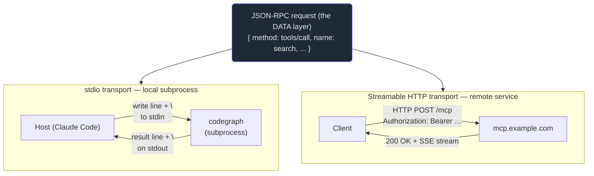

# 6. Transports

## TL;DR

> MCP has two layers. The **data layer** is the JSON-RPC 2.0 messages you've been meeting —
> `tools/call`, `resources/read`, `prompts/get`. The **transport layer** is merely *how those
> messages move*. There are two transports, and the **same message rides either one unchanged**.
> **stdio**: the host *launches the server as a local subprocess* and exchanges newline-delimited
> JSON over its stdin/stdout — fast, private, local-only, no auth (it's your own child process).
> This is exactly how `.claude/mcp.json` runs `codegraph` and `graphify`. **Streamable HTTP**: the
> server is a *remote HTTP service*; the client POSTs messages and the server may stream replies
> back as Server-Sent Events (SSE) — works at a distance and serves many clients, but needs HTTP
> auth (bearer tokens; OAuth to obtain them) and careful security. You write your tools/resources/
> prompts **once**; choosing a transport is a *deployment* decision, not a rewrite.

## 1. Motivation

You've now built a mental model of the *data layer*: a server exposes **tools** (Chapter 3),
**resources** (Chapter 4), and **prompts** (Chapter 5), and the client invokes them with JSON-RPC
requests like `{"method": "tools/call", ...}`. But a question has been quietly unanswered the whole
time: when the client sends that request, **how does it physically reach the server?** Bytes don't
teleport. Something has to carry `{"method":"tools/call",...}` from the AI application to the
program that runs the tool, and carry the result back.

That "something" is the **transport**. And here is the elegant part of MCP's design that makes this
chapter short and powerful: **the transport is a separate, swappable layer.** The protocol is built
in two halves — an *inner* data layer (the JSON-RPC messages, identical everywhere) and an *outer*
transport layer (the delivery mechanism). The data layer doesn't know or care which transport it
rides. So the *exact same* `tools/call` message that works when the server is a subprocess on your
laptop also works, byte-for-byte, when the server is a SaaS endpoint across the internet.

This repo makes the local case concrete. Open `.claude/mcp.json`:

```json
{
  "mcpServers": {
    "codegraph": { "command": "codegraph", "args": ["serve", "--mcp"] },
    "graphify":  { "command": "graphify" }
  }
}
```

Notice what's there and what *isn't*. There's a `command` (and optional `args`) — and **no URL, no
host, no token**. That's the signature of **stdio**: the host doesn't *connect* to these servers, it
*launches* them. Claude Code runs `codegraph serve --mcp` as a child process and talks JSON-RPC over
that process's stdin/stdout pipe. The agent that wrote this book called `codegraph_*` tools dozens of
times, and every one of those calls was a JSON-RPC message slid down a subprocess pipe. A hosted
Sentry or GitHub MCP server, by contrast, has no `command` to run on your machine — it lives
somewhere else, so it would be configured with a **URL** and reached over **Streamable HTTP**. Same
tools, same messages; different delivery.

## 2. Intuition (Analogy)

Think of a JSON-RPC message as a **letter**. The letter's contents — "please run the `search` tool
with these arguments" — are fixed. What changes between transports is purely *how the letter is
delivered*.

**stdio is sliding a note under the office door.** The server is a colleague sitting in the next room
— a subprocess the host spawned, right there on the same machine. You write the note, slide it under
the door, and they slide the reply back. It's **instant**, **private** (no one outside the building
sees it), and needs **no postage and no ID check** — it never leaves the office, and you already
trust the person you started in that room. But it only works for someone *in the same building*: you
cannot slide a note under a door three time zones away.

**Streamable HTTP is mailing the letter across the country.** Now the recipient is remote, so the
*identical* letter goes into an **envelope**: it needs an **address** (the URL — which host, which
path), **postage and a return address** (HTTP headers), and an **ID check** (auth — a bearer token,
typically obtained via OAuth) so the recipient knows you're allowed to send it and you know you reached
the right office. It **works at any distance** and the same mailbox can receive letters from **many**
senders. The price is the envelope: address, postage, identity, and all the security that mailing
something into the open world demands. And because the recipient may have a lot to say, they can reply
with a **stream of postcards** rather than one fat letter — that's Server-Sent Events.

The thing in both hands is *the same letter*. Read the table along that spine: contents fixed,
delivery different.

| Aspect | **stdio** (note under the door) | **Streamable HTTP** (mail it across the country) |
|---|---|---|
| The letter (JSON-RPC message) | **Identical** | **Identical** |
| Where the server lives | Local subprocess the host launches | Remote service reachable over the network |
| Framing / "envelope" | Newline after each JSON message | HTTP request (method, path, headers) + body |
| Reach | Same machine only | Anywhere with a network route |
| Clients per server | Typically **one** (your subprocess) | **Many** (it's a shared service) |
| Auth / "ID check" | None needed (your own child process) | Required — bearer token / API key (OAuth to get it) |
| Streamed replies | The pipe is naturally a stream | Server-Sent Events (SSE) over the same connection |
| Overhead | Lowest (no network) | Network + TLS + auth |
| Configured in `.claude/mcp.json` with | `command` + `args` | a URL (+ auth) |

## 3. Formal Definition

MCP is layered. The **data layer** defines the messages — JSON-RPC 2.0 requests, responses, and
notifications for the lifecycle (`initialize`) and the primitives (`tools/*`, `resources/*`,
`prompts/*`). The **transport layer** defines how a stream of those messages is carried between client
and server. The spec standardizes **two** transports; an application picks one per server connection,
and the data layer is **invariant** across the choice.

**stdio transport.** The MCP **host launches the server as a local subprocess** and communicates over
that subprocess's standard input and standard output. Messages are **newline-delimited** JSON-RPC
(one JSON object per line) written to the server's **stdin** (client→server) and read from its
**stdout** (server→client); the server's **stderr** is free for logging. There is no network: it is
inter-process communication on one host. Properties: **local-only**, **lowest overhead**, **no
transport auth** (the host already controls the child process), and **typically one client per
server** (one host owns one subprocess). This is the transport behind every `command`-based entry in
`.claude/mcp.json`.

**Streamable HTTP transport.** The MCP server is a **remote HTTP service** at a URL. The client sends
each JSON-RPC message via an **HTTP POST**; the server replies either with a single JSON response or,
when it needs to stream multiple messages (results plus notifications/progress), by upgrading the
response to **Server-Sent Events (SSE)** over the same connection. Because it's plain HTTP, it carries
**standard HTTP authentication** — bearer tokens, API keys, custom headers — and MCP **recommends
OAuth** for obtaining those tokens. Properties: **remote-capable**, **many clients per server**,
**auth required**, and a larger security surface (Chapter 10). *(Historical note: an earlier
"HTTP+SSE" transport — two endpoints, one POST and one long-lived SSE GET — was **superseded** by the
single-endpoint Streamable HTTP transport. You may still see it in older servers.)*

| Term | Meaning |
|---|---|
| **Data layer** | The JSON-RPC 2.0 messages (lifecycle + primitives). Identical across transports — the "inner" layer. |
| **Transport layer** | How a stream of those messages is carried between client and server — the "outer" layer. |
| **stdio transport** | Host launches the server as a subprocess; newline-delimited JSON over stdin/stdout. Local, no auth, ~1 client. |
| **Streamable HTTP transport** | Remote HTTP service; client POSTs messages, server may stream replies via SSE. Remote, auth required, many clients. |
| **Server-Sent Events (SSE)** | A one-way HTTP streaming format the server uses to push multiple messages (results, notifications) on one connection. |
| **Framing** | The transport's rule for where one message ends — a newline for stdio, HTTP `Content-Length`/body for HTTP. |
| **Bearer token** | A credential sent in an HTTP `Authorization` header to prove the client may call the server (MCP recommends OAuth to obtain it). |

> The crossover insight: a transport adds **zero** capability to your tools. A tool that lists files,
> or searches a code graph, does the identical work whether the request arrived under the door (stdio)
> or through the mail (HTTP). The transport decides **reach, sharing, and security** — *where* the
> server can live, *how many* can use it, and *what trust* the connection needs — never *what the
> server can do*. That's why "write once, deploy either way" holds.

## 4. Worked Example — one message, two transports

Watch a single `tools/call` request travel both ways. The mermaid sketch shows the two delivery
paths; the JSON below shows the *exact same payload* on each wire — once as a bare stdio line, once
wrapped in an HTTP envelope.



Over **stdio**, the message is just one line of JSON followed by a newline — that trailing `\n` is the
entire "envelope". This is literally what crosses the pipe between Claude Code and `codegraph`:

```bash
# stdio: the host writes ONE newline-delimited JSON line to the subprocess's stdin.
# (The trailing newline IS the frame boundary; stderr is left free for the server's logs.)
{"jsonrpc":"2.0","id":7,"method":"tools/call","params":{"name":"search","arguments":{"query":"transports","limit":3}}}
```

Over **Streamable HTTP**, that *same JSON* becomes the **body** of an HTTP POST. The bytes after the
blank line are character-for-character the stdio payload; everything above it is the envelope the
network requires — address, content type, the `Accept` that invites an SSE stream, and the auth header
stdio never needed:

```bash
# Streamable HTTP: identical JSON-RPC payload, now as an HTTP POST body to a remote server.
POST /mcp HTTP/1.1
Host: mcp.example.com
Content-Type: application/json
Accept: application/json, text/event-stream
Authorization: Bearer tok_abc123
Content-Length: 118

{"jsonrpc":"2.0","id":7,"method":"tools/call","params":{"name":"search","arguments":{"query":"transports","limit":3}}}
```

Diff the two and the payload is untouched; only the framing around it differs. The server's tool
handler receives the very same decoded request object either way — it cannot even tell which transport
delivered it. That indistinguishability **is** the data-layer/transport-layer separation, made
visible.

## 5. Build It

Let's *prove* the invariant instead of asserting it. The script below models **stdio framing** with a
pair of tiny functions — `write_message` JSON-dumps a message and appends a newline; `read_message`
reads a line and JSON-loads it — and pushes a real `tools/call` request through an in-memory
`io.StringIO` "pipe", reading it back unchanged. Then it wraps the **same** message in a pretend HTTP
envelope and asserts the decoded JSON-RPC body is **identical** to the stdio one. Pure stdlib (`json`,
`io`), fully deterministic — no SDK, no sockets, no network.

```python run
import io
import json

# The DATA LAYER: one JSON-RPC 2.0 request -- a real `tools/call`. This is the
# "letter". It does not know or care which transport will carry it.
request = {
    "jsonrpc": "2.0",
    "id": 7,
    "method": "tools/call",
    "params": {"name": "search", "arguments": {"query": "transports", "limit": 3}},
}

# Compact, stable serialisation (no incidental spaces) -- the bytes on the wire.
def encode(msg):
    return json.dumps(msg, separators=(",", ":"))

# --- TRANSPORT 1: stdio -- newline-delimited JSON over a stream -------------
def write_message(stream, msg):
    stream.write(encode(msg))       # the message becomes one line of text
    stream.write("\n")              # newline = the frame boundary

def read_message(stream):
    line = stream.readline()        # read up to and including the next newline
    return json.loads(line) if line else None

pipe = io.StringIO()                # in-memory stand-in for a subprocess pipe
write_message(pipe, request)        # host -> server, over stdio
stdio_wire = pipe.getvalue()        # exactly what crossed the pipe, as text
pipe.seek(0)                        # rewind so the "server" can read it
stdio_decoded = read_message(pipe)  # server decodes the framed line

print("=== stdio (newline-delimited JSON over a subprocess pipe) ===")
print("on the wire:", repr(stdio_wire))
print("decoded:    ", json.dumps(stdio_decoded, sort_keys=True))
print()

# --- TRANSPORT 2: Streamable HTTP -- identical JSON as an HTTP POST body ----
def build_http_request(msg, host, path, token):
    body = encode(msg)              # SAME serialisation as the stdio line
    headers = [
        "POST " + path + " HTTP/1.1",
        "Host: " + host,
        "Content-Type: application/json",
        "Accept: application/json, text/event-stream",   # invites an SSE stream
        "Authorization: Bearer " + token,                # auth (stdio needs none)
        "Content-Length: " + str(len(body)),
    ]
    return "\r\n".join(headers) + "\r\n\r\n" + body       # blank line ends headers

def parse_http_body(raw_http):
    _head, _sep, body = raw_http.partition("\r\n\r\n")
    return json.loads(body)

http_wire = build_http_request(request, "mcp.example.com", "/mcp", "tok_abc123")
http_decoded = parse_http_body(http_wire)

print("=== Streamable HTTP (same JSON as an HTTP POST body) ===")
for line in http_wire.split("\r\n"):
    print("   " + line)
print("decoded:    ", json.dumps(http_decoded, sort_keys=True))
print()

# --- THE POINT: transport changed; message did not -------------------------
identical = (stdio_decoded == http_decoded)
print("=== comparison ===")
print("identical payload:", identical)

assert identical,                 "transports must preserve the JSON-RPC payload"
assert stdio_decoded == request,  "round-trip must equal the original request"
assert stdio_wire.endswith("\n"), "stdio frames with a trailing newline"
assert "Authorization: Bearer" in http_wire, "HTTP carried auth"
assert "Authorization" not in stdio_wire,    "stdio carried no auth"
print("invariants hold: same data layer, two transport layers.")
```

Running it prints the stdio line (note the trailing `\n` in the `repr`), then the full HTTP request
(headers + the same JSON body), then `identical payload: True`. The two `assert`s on auth are the
quiet lesson: the stdio wire contains **no** `Authorization`, while the HTTP wire **must** — distance
is what forces an ID check.

**Now break it.** Change the HTTP body to carry a *different* request (say, bump `"limit": 3` to
`"limit": 99` only in `build_http_request`) and the `identical` assertion fires — proving the test
has teeth: it's genuinely comparing payloads, not rubber-stamping. Conversely, change the *framing*
all you like — swap the newline for `\r\n`, reorder the HTTP headers, drop the `Content-Length` — and
as long as the JSON object is the same, `stdio_decoded == http_decoded` stays `True`. That asymmetry
is the whole chapter: **framing is the transport's business and may differ freely; the payload is the
data layer's and must not.**

## 6. Trade-offs & Complexity

| | **stdio** | **Streamable HTTP** |
|---|---|---|
| Server location | Local subprocess only | Remote (or local) over the network |
| Setup in `.claude/mcp.json` | `command` + `args` (no URL) | a URL (+ auth) |
| Auth | None needed (your own child process) | **Required** — bearer/API key; OAuth to obtain |
| Clients per server | Typically one (host owns the process) | Many (shared service) |
| Latency / overhead | Lowest — no network, no TLS | Network + TLS + auth round-trips |
| Lifecycle | Host starts/stops the subprocess | Server runs independently; client connects |
| Security surface | Tiny (local IPC) | Larger — exposed endpoint (Chapter 10) |
| Best for | Local dev tools, CLIs, anything on your machine (our `codegraph`, `graphify`) | Hosted/shared servers, SaaS integrations, team-wide tools |
| Worst for | Anything that must be reached remotely or shared | A throwaway local tool (needless network + auth) |

The rule of thumb: **stdio for local, Streamable HTTP for remote.** If the server is a program that
lives on your machine and serves *you*, stdio is simpler, faster, and needs no credentials — start
there (it's what `.claude/mcp.json` does). The moment a server must be reached *over a network* or
shared by *many* clients — a hosted product, a team-wide integration — you need Streamable HTTP, and
with it you inherit auth and the security work of Chapter 10. Crucially, this is a **deployment**
choice: the tools/resources/prompts you wrote don't change when you switch transports. You can develop
a server over stdio and later expose the *same* server over HTTP.

## 7. Edge Cases & Failure Modes

- **Polluting stdout on stdio.** Over stdio, **stdout is the message channel** — newline-delimited
  JSON only. A stray `print()` for debugging injects a non-JSON line and corrupts the stream, breaking
  the client's parser. Rule: on stdio, **logs go to stderr**, never stdout.
- **Reaching for HTTP when stdio suffices.** Standing up a network endpoint (with TLS, tokens, OAuth)
  for a tool that only ever runs on your laptop is pure overhead and a new attack surface. For local
  dev tools, stdio is the right default — exactly why `codegraph` and `graphify` use it.
- **Shipping stdio when you need reach.** The mirror mistake: a tool a whole team needs, or a service
  that must run off-box, cannot be stdio — the host can only launch a subprocess it can see locally.
  Remote or shared ⇒ Streamable HTTP.
- **Forgetting auth on HTTP.** stdio needs none, so it's easy to forget that an HTTP server is exposed
  to the network and **must** authenticate every request. An unauthenticated HTTP MCP endpoint is an
  open door (Chapter 10). Use bearer tokens / OAuth from day one.
- **Assuming the transport changes the message.** It doesn't. If a tool "works on stdio but not HTTP,"
  the bug is in framing/auth/networking — the *transport* — not in your `tools/call` payload. The data
  layer is identical by design; debug the envelope, not the letter.
- **Using the deprecated HTTP+SSE transport.** Older servers may still use the superseded two-endpoint
  HTTP+SSE scheme. New work should target **Streamable HTTP**; know the old one exists so you recognize
  it in the wild.
- **Not draining/closing the subprocess.** With stdio, the server's lifetime is tied to the
  subprocess. If the host crashes without reaping it, or the server never reads EOF on stdin, you can
  leak processes. Clean startup/shutdown is the host's job — but it's a real failure mode.

## 8. Practice

> **Exercise 1 — Read the config.** Here are two `.claude/mcp.json`-style server entries. For each,
> name the transport, say whether the server runs locally or remotely, and state whether the
> connection needs auth — and *why* you can tell from the entry alone.
> ```json
> {
>   "graphify":  { "command": "graphify" },
>   "acme-saas": { "url": "https://mcp.acme.com/mcp", "headers": { "Authorization": "Bearer ${ACME_TOKEN}" } }
> }
> ```

<details>
<summary><strong>Answer</strong></summary>

- **`graphify`** → **stdio**. The tell is `command` with **no URL**: the host doesn't connect to it,
  it *launches* `graphify` as a **local subprocess** and talks JSON-RPC over that process's
  stdin/stdout. It runs **locally** and needs **no auth** — it's the host's own child process, so
  there's nothing to authenticate to (§1, §3). This is exactly how this repo runs both `codegraph` and
  `graphify`.
- **`acme-saas`** → **Streamable HTTP**. The tell is a `url` (a remote `https://` endpoint) plus an
  `Authorization` header. The server runs **remotely**, reached over the network via HTTP POST (with
  replies possibly streamed back as SSE), and it **requires auth** — the bearer token — because, being
  exposed on the network, it must verify who's calling (§2–§3). MCP recommends OAuth for *obtaining*
  that token.

The structural giveaway: **`command` ⇒ stdio/local/no-auth; `url` ⇒ HTTP/remote/auth.**

</details>

> **Exercise 2 — Same letter, two envelopes.** A client sends `{"jsonrpc":"2.0","id":1,"method":
> "resources/read","params":{"uri":"file:///readme.md"}}`. Show (in words or sketch) what that single
> message looks like on the **stdio** wire versus inside a **Streamable HTTP** request, and state the
> one thing that is guaranteed to be identical in both.

<details>
<summary><strong>Answer</strong></summary>

- **stdio:** the message is written as **one line of JSON to the server's stdin, terminated by a
  newline** — the `\n` is the only framing. Nothing else wraps it; no headers, no auth:
  `{"jsonrpc":"2.0","id":1,"method":"resources/read","params":{"uri":"file:///readme.md"}}\n`
- **Streamable HTTP:** the *same* JSON becomes the **body of an HTTP POST** to the server's URL, behind
  an envelope of request line + headers — `POST /mcp HTTP/1.1`, `Host:`, `Content-Type:
  application/json`, an `Accept:` that permits `text/event-stream`, an `Authorization: Bearer …`, and
  `Content-Length:` — then a blank line, then the body.

**Guaranteed identical:** the **JSON-RPC payload itself** — the `{"jsonrpc":"2.0","id":1,"method":
"resources/read", ...}` object. That's the data layer; only the framing/envelope around it differs
(§4, and the §5 `assert identical`). The server's `resources/read` handler receives the same decoded
request either way and cannot tell which transport delivered it.

</details>

> **Exercise 3 — Pick the transport.** For each, choose stdio or Streamable HTTP and justify in one
> line: **(a)** a CLI tool that indexes *your* local repo and you run it only on your own machine;
> **(b)** a hosted error-tracking product that wants to expose its data to many customers' AI apps
> over the internet; **(c)** a quick experimental server you're developing on your laptop and testing
> from Claude Code.

<details>
<summary><strong>Answer</strong></summary>

- **(a) Local repo indexer → stdio.** It runs on your machine and serves only you, so the host can
  launch it as a subprocess — lowest overhead, no auth, no network. (This is literally `codegraph`.)
- **(b) Hosted error-tracker for many customers → Streamable HTTP.** It must be reachable **remotely**
  and serve **many** clients, which stdio cannot do (the host can only spawn a local subprocess). HTTP
  gives remote reach + multi-client + standard auth (bearer/OAuth) — at the cost of the Chapter 10
  security work.
- **(c) Experimental local server → stdio.** During local dev, stdio is the fastest path: a `command`
  in `.claude/mcp.json`, no endpoint to host, no tokens to manage. Because the data layer is
  transport-agnostic, you can later expose the **same** server over Streamable HTTP when you're ready
  to share it — without rewriting any tools (§6).

The through-line: **local/personal ⇒ stdio; remote/shared ⇒ Streamable HTTP**, and switching later is
a deployment change, not a rewrite.

</details>

```quiz
{
  "prompt": "Your MCP server's tools work perfectly when configured with a `command` in `.claude/mcp.json`, but you now need a teammate on another machine to use them too. What actually has to change, and why?",
  "input": "Choose one:",
  "options": [
    "Switch the server from stdio to the Streamable HTTP transport (host it at a URL with auth); the tools/resources/prompts themselves don't change, because the transport is a separate layer from the JSON-RPC data layer",
    "Rewrite every tool handler, since each transport requires its own tool implementation",
    "Nothing — stdio servers are automatically reachable over the network once configured",
    "Change the JSON-RPC messages to a different format that HTTP understands"
  ],
  "answer": "Switch the server from stdio to the Streamable HTTP transport (host it at a URL with auth); the tools/resources/prompts themselves don't change, because the transport is a separate layer from the JSON-RPC data layer"
}
```

## Your Turn

Before you move on, check your understanding with the coach — explain the idea, apply it, weigh the trade-offs, then defend your reasoning.

<div class="concept-coach"></div>

## In the Wild

- **[MCP spec — Transports](https://modelcontextprotocol.io/specification/2025-06-18/basic/transports)**
  (spec 2025-06-18) — the authoritative definition of the **stdio** and **Streamable HTTP** transports,
  the newline framing, the SSE streaming rules, and the note that HTTP+SSE was superseded.
- **[Architecture overview — data layer vs transport layer](https://modelcontextprotocol.io/docs/learn/architecture)**
  — the two-layer picture this chapter is built on: the JSON-RPC data layer (inner) and the transport
  layer (outer), and why the same messages ride either transport.
- **[Reference MCP servers](https://github.com/modelcontextprotocol/servers)** — real servers you can
  read: many run over **stdio** (a `command` you launch), and you'll spot the same `tools/call`
  messages regardless of how each one is wired.

---

**Next:** you understand the messages *and* how they travel. Time to write the program on the other end
of the pipe — a minimal MCP server, just like our stdio `codegraph` and `graphify`. →
[7. Build a server](/cortex/the-claude-stack/model-context-protocol/build-a-server)
