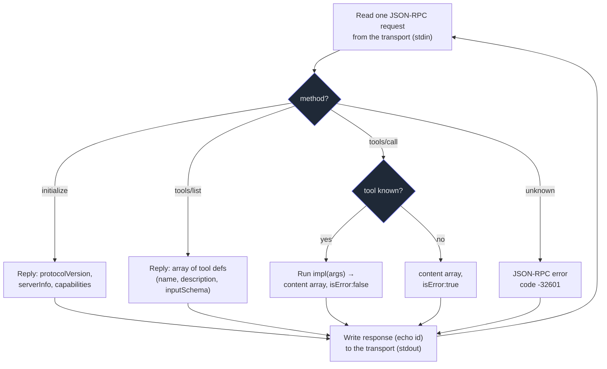

# 7. Build a server

## TL;DR

> An **MCP server** is a tiny program with one job: speak **JSON-RPC 2.0** over a **transport**
> (usually **stdio** for local), answer the **`initialize`** handshake (returning its name and which
> capabilities it offers), and then dispatch the **primitive methods** it supports — at minimum
> **`tools/list`** (advertise what it can do) and **`tools/call`** (actually do it). You *can*
> hand-roll that loop — it's about forty lines of stdlib, which we'll write below — but in practice
> you **don't**: you use an official SDK. Python's high-level API is **FastMCP**, where a decorator,
> `@mcp.tool()`, reads a typed function's signature into an input schema and its docstring into a
> description, turning `def add(a: int, b: int)` into a fully-formed MCP tool in *one line*. The host
> then launches your server as a `command` (exactly how `.claude/mcp.json` launches `codegraph` and
> `graphify`) and talks to it over stdio. The SDK is the franchise kit; you just stock the shelves.

## 1. Motivation

For six chapters MCP has been a thing other people built. You learned the *shape* of a server — it
exposes tools, resources, and prompts — but every concrete server in the story (`codegraph`,
`graphify`, the reference GitHub and Postgres servers) arrived pre-built, a black box the host
launched and talked to. That's the right way to *consume* the ecosystem. But the whole promise of a
standard (Chapter 1's M+N collapse) only pays off because *someone writes the server*. Today, that
someone is you.

And it is far less work than it sounds. Stripped to its essence a server is a **loop**: read one
JSON-RPC request, look at its `method`, do the matching thing, write one JSON-RPC response, repeat.
The part you'd dread — parsing JSON-RPC, framing messages, shaping the `initialize` reply, building
the `inputSchema` for every tool — is pure boilerplate, identical across servers, and **an SDK writes
all of it for you.** What's left, the part that's actually *yours*, is a handful of plain functions:
"given these arguments, return this text." This chapter shows you the machinery once — by building a
working server from scratch in the standard library — so that when the SDK hides it, you know exactly
what it's hiding. Then it shows you the real thing you'd ship.

## 2. Intuition (Analogy)

Building an MCP server is like **opening a shop inside a standard shopping mall**.

The mall (MCP) has rules every store follows, and because of those rules a shopper (the host) can
walk into *any* store and know how it works without a tour. To open your shop you must do three
things. First, follow the **mall's standard opening procedure** — sign the lease, get your unit
number, tell mall management what kind of store you are: that's **`initialize`**, where you announce
your name and capabilities. Second, **hang a sign listing your goods** in the mall directory so
shoppers know what you sell before they walk in: that's **`tools/list`**. Third, **staff a counter
that fulfills orders** — a shopper hands you a request, you do the work, you hand back the result:
that's **`tools/call`**. Do those three and you are open for business; *any* shopper in the mall can
buy from you, with no special arrangement.

Now, you *could* construct the building yourself — pour the foundation, wire it to code, install the
plumbing. That's hand-rolling JSON-RPC. Or you take the **franchise kit**: the franchisor hands you a
pre-built unit that's already up to building code, with the directory listing and the order counter
wired in, and says "just stock the shelves." You write the *products* — the functions — and the kit
handles the rest. **FastMCP is that franchise kit.** `@mcp.tool()` is the kit reading your product
off the shelf and writing its directory entry and price tag automatically.

| | Hand-roll the building | **SDK franchise kit (FastMCP)** |
|---|---|---|
| Opening procedure (`initialize`) | You write the handshake reply by hand | Done for you |
| Directory sign (`tools/list`) | You assemble each listing + schema | Generated from the function signature |
| Order counter (`tools/call`) | You parse args, dispatch, shape the result | Generated; it just calls your function |
| Your actual work | A few plain functions | The *same* few plain functions |
| What you learn | The whole protocol, exposed | The protocol is hidden (but it's the same) |

## 3. Formal Definition

An **MCP server** is a program that:

1. **Speaks JSON-RPC 2.0 over a transport.** Each message is a JSON object; requests carry a
   `method`, optional `params`, and an `id`; responses echo that `id` and carry either a `result` or
   an `error`. For a *local* server the transport is **stdio** — requests arrive on stdin, responses
   leave on stdout (Chapter 6).
2. **Handles `initialize`.** The first request of every session. The server replies with its
   `protocolVersion`, a `serverInfo` (name + version), and a **`capabilities`** object declaring
   which primitives it offers (e.g. `{"tools": {}}` means "I support the tools primitive").
3. **Implements the primitive methods it advertised.** At minimum, a tool server implements
   **`tools/list`** (return the array of tool definitions, each with a `name`, `description`, and
   JSON-Schema **`inputSchema`**) and **`tools/call`** (run the named tool with the given
   `arguments`, return a **content array**; signal a *tool-level* failure with `isError: true`
   inside the result, distinct from a *protocol-level* JSON-RPC `error`). Optionally it adds
   `resources/list` + `resources/read` and/or `prompts/list` + `prompts/get`.

In practice you do **not** write that loop. You use an **official SDK**. The Python SDK's high-level
API is **FastMCP**:

| Term | Meaning |
|---|---|
| **MCP server** | A program exposing primitives over MCP; a `command` the host launches. |
| **JSON-RPC 2.0** | The message format: `{method, params, id}` → `{result \| error, id}`. |
| **`initialize`** | The opening handshake; server returns `serverInfo` + `capabilities`. |
| **Capability** | A declared primitive the server supports (`tools`, `resources`, `prompts`). |
| **`tools/list`** | Method returning tool definitions (name, description, `inputSchema`). |
| **`tools/call`** | Method that runs a tool and returns a content array (`isError` on tool failure). |
| **`inputSchema`** | JSON Schema describing a tool's arguments — how the model knows what to pass. |
| **FastMCP** | Python SDK high-level API: `FastMCP("name")` + `@mcp.tool()` + `mcp.run()`. |
| **`@mcp.tool()`** | Decorator turning a typed function into a tool: signature → schema, docstring → description. |
| **MCP Inspector** | An official tool for poking a server's `tools/list`/`tools/call` by hand while developing. |

> The crossover insight: the SDK does not give your server *more power* than the from-scratch one —
> both answer the exact same three methods with the exact same JSON. The SDK gives you **less code to
> get it wrong in**. You stop maintaining protocol plumbing and start maintaining functions, which is
> the only part a tool author should ever have to think about.

## 4. Worked Example

A server is a request-dispatch loop. Read a message, branch on its `method`, build a response, send
it back. Here is that loop for a tool server:



That's the whole control flow. Now — the **real way you'd actually write it**. You don't implement
the loop; the SDK owns it. You hand FastMCP your functions, and `@mcp.tool()` turns each one into a
tool entry (signature → `inputSchema`, docstring → `description`). This is a complete, shippable
server — the genuine official Python SDK, *not* a toy:

```python
# real_server.py — the actual MCP Python SDK (FastMCP). Run: python real_server.py
# (Shown for illustration; it imports `mcp` and speaks stdio, so it doesn't run inline here.)
from mcp.server.fastmcp import FastMCP

mcp = FastMCP("toy-mcp")  # the franchise kit: server name + the whole JSON-RPC loop

@mcp.tool()
def add(a: int, b: int) -> str:
    """Add two integers and return the sum as text."""
    # signature (a: int, b: int) -> inputSchema; docstring -> description; the rest is automatic
    return f"{a} + {b} = {a + b}"

@mcp.tool()
def reverse(text: str) -> str:
    """Reverse a string."""
    return text[::-1]

if __name__ == "__main__":
    mcp.run()  # serve over stdio: read stdin, dispatch, write stdout — forever
```

Two decorated functions, and you have a server that correctly answers `initialize`, `tools/list`
(advertising `add` and `reverse` with full schemas), and `tools/call`. Every line of the dispatch
loop from the diagram is inside `mcp.run()`. **This is exactly the shape of `codegraph` and
`graphify`** — the only differences are the server name, the set of decorated functions, and that
they're compiled binaries rather than a Python script.

## 5. Build It

To *see* what `mcp.run()` hides, let's write the dispatch loop ourselves — in pure standard library,
no `mcp` import, no stdin, no network. A `Server` holds a tool registry; `dispatch(req)` is the
branch from the diagram; we then drive it with a **scripted conversation** (`initialize`,
`tools/list`, a good `tools/call`, and a deliberately broken one) and print each JSON-RPC response.
This is the entire server, made of nothing but `json`:

```python run
import json


class Server:
    """A toy MCP server: a name, a tool registry, and a JSON-RPC dispatcher."""

    def __init__(self, name):
        self.name = name
        self.tools = {}  # tool name -> {"schema": ..., "impl": ...}

    def tool(self, name, description, schema, impl):
        """Hang a sign: register one tool the way @mcp.tool() does for you."""
        self.tools[name] = {"description": description, "schema": schema, "impl": impl}

    def dispatch(self, req):
        """Route one JSON-RPC request to the right handler; always reply with its id."""
        rid, method, params = req.get("id"), req["method"], req.get("params", {})

        if method == "initialize":
            result = {
                "protocolVersion": "2025-06-18",
                "serverInfo": {"name": self.name, "version": "0.1.0"},
                "capabilities": {"tools": {}},  # we offer the tools primitive
            }
        elif method == "tools/list":
            result = {
                "tools": [
                    {"name": n, "description": t["description"], "inputSchema": t["schema"]}
                    for n, t in self.tools.items()
                ]
            }
        elif method == "tools/call":
            name = params["name"]
            tool = self.tools.get(name)
            if tool is None:  # unknown tool -> a result with isError, NOT a crash
                result = {
                    "content": [{"type": "text", "text": f"unknown tool: {name}"}],
                    "isError": True,
                }
            else:
                text = tool["impl"](**params.get("arguments", {}))
                result = {"content": [{"type": "text", "text": text}], "isError": False}
        else:  # method we do not implement -> JSON-RPC error object
            return {"jsonrpc": "2.0", "id": rid, "error": {"code": -32601, "message": "method not found"}}

        return {"jsonrpc": "2.0", "id": rid, "result": result}


# --- stock the shelves: one real tool, a plain typed function ---------------
def add(a, b):
    return f"{a} + {b} = {a + b}"


srv = Server("toy-mcp")
srv.tool(
    "add",
    "Add two integers and return the sum as text.",
    {"type": "object", "properties": {"a": {"type": "integer"}, "b": {"type": "integer"}},
     "required": ["a", "b"]},
    add,
)

# --- drive it with a scripted conversation (no stdio, no network) ------------
conversation = [
    {"jsonrpc": "2.0", "id": 1, "method": "initialize", "params": {}},
    {"jsonrpc": "2.0", "id": 2, "method": "tools/list"},
    {"jsonrpc": "2.0", "id": 3, "method": "tools/call",
     "params": {"name": "add", "arguments": {"a": 2, "b": 3}}},
    {"jsonrpc": "2.0", "id": 4, "method": "tools/call",
     "params": {"name": "subtract", "arguments": {"a": 9, "b": 4}}},
]

for req in conversation:
    resp = srv.dispatch(req)
    print(f"--> {req['method']}")
    print(f"<-- {json.dumps(resp)}")
```

Run it and you watch a whole MCP session play out:

```
--> initialize
<-- {"jsonrpc": "2.0", "id": 1, "result": {"protocolVersion": "2025-06-18", "serverInfo": {"name": "toy-mcp", "version": "0.1.0"}, "capabilities": {"tools": {}}}}
--> tools/list
<-- {"jsonrpc": "2.0", "id": 2, "result": {"tools": [{"name": "add", "description": "Add two integers and return the sum as text.", "inputSchema": {"type": "object", "properties": {"a": {"type": "integer"}, "b": {"type": "integer"}}, "required": ["a", "b"]}}]}}
--> tools/call
<-- {"jsonrpc": "2.0", "id": 3, "result": {"content": [{"type": "text", "text": "2 + 3 = 5"}], "isError": false}}
--> tools/call
<-- {"jsonrpc": "2.0", "id": 4, "result": {"content": [{"type": "text", "text": "unknown tool: subtract"}], "isError": true}}
```

Read the four exchanges as the mall analogy: `initialize` is the opening procedure (name +
`capabilities: {tools}`); `tools/list` is the directory sign (one entry, `add`, with its full
`inputSchema`); the first `tools/call` is a fulfilled order (`2 + 3 = 5`, `isError: false`); the
second is a customer asking for a product you don't carry (`subtract`) — note the server **does not
crash**: it returns a normal result with `isError: true`, so the host (and the model) can read the
failure and recover. That is the entire contract. Now compare these forty lines to the eight-line
FastMCP server in §4: *the SDK produces this same JSON*, but you wrote two decorated functions
instead of a dispatcher. To turn our toy into a real server you'd delete the `Server` class, `import
FastMCP`, decorate `add`, and call `mcp.run()` — that's the whole migration.

## 6. Trade-offs & Complexity

| Use an official SDK (FastMCP) | Hand-roll the JSON-RPC loop |
|---|---|
| Schemas generated from type hints — never drift from the code | You hand-write every `inputSchema`; easy to desync from the impl |
| `initialize`, framing, error codes handled correctly | You own every protocol detail (and every protocol bug) |
| You write only functions — the part that's truly yours | You write functions *and* hundreds of lines of plumbing |
| Tracks spec/version changes via SDK upgrades | You chase the spec by hand every revision |
| One extra dependency; some "magic" hidden from you | Zero dependencies; the whole thing is visible |
| The obvious choice for anything you ship | Worth it once: to *learn* the protocol (this chapter) |

The from-scratch server is wonderful pedagogy and almost never the right thing to ship. The protocol
plumbing is pure boilerplate with sharp edges — get the `initialize` reply or an `inputSchema` subtly
wrong and the host silently can't use your tool. An SDK collapses that surface area to "write a typed
function with a docstring." Reach for from-scratch only when you must understand the bytes (or you're
implementing the SDK itself); reach for FastMCP every other time.

## 7. Edge Cases & Failure Modes

- **Returning a JSON-RPC `error` for a tool failure (or vice-versa).** A tool that fails at its job
  (bad input, upstream timeout) should return a normal `result` with `isError: true` — the model
  reads it and can retry. A JSON-RPC `error` is for *protocol* faults (unknown method, malformed
  request). Conflating them either hides tool errors from the model or makes the host treat a
  recoverable problem as a hard transport failure.
- **Writing to stdout on a stdio server.** On stdio, stdout *is* the JSON-RPC channel. A stray
  `print()` (or a chatty library) injects garbage between messages and corrupts the stream. Logs and
  diagnostics must go to **stderr**. (This is the single most common reason a hand-built stdio server
  "mysteriously doesn't connect.")
- **A missing or mismatched `inputSchema`.** The schema is the *only* thing telling the model how to
  call your tool. Omit it, mistype a field, or let it drift from the function and the model will call
  the tool wrong — or not at all. SDK-generated schemas exist precisely to kill this class of bug.
- **Forgetting to echo the request `id`.** Every response must carry the same `id` as its request, or
  the host can't match replies to calls. (Notifications have no `id` and get no response — don't
  invent one.)
- **Declaring a capability you don't implement.** If `initialize` advertises `{"tools": {}}` but you
  never handle `tools/list`, the host will call a method that errors. Capabilities are a *promise*;
  only declare what you actually serve.
- **A tool that blocks forever.** A `tools/call` impl that hangs (an un-timed network call, an
  infinite loop) stalls the whole single-threaded loop — every later request waits behind it. Put
  timeouts on anything that touches the outside world.

## 8. Practice

> **Exercise 1 — From scratch to SDK.** Take the §5 server and add a second tool, `reverse`, that
> takes one string argument `text` and returns it reversed. First do it the *from-scratch* way (what
> exactly must you write?), then do it the *FastMCP* way. What's different about the amount and kind
> of work?

<details>
<summary><strong>Answer</strong></summary>

**From-scratch**, you must write *both* the implementation and its schema, and register them:

```python
def reverse(text):
    return text[::-1]

srv.tool(
    "reverse",
    "Reverse a string.",
    {"type": "object", "properties": {"text": {"type": "string"}}, "required": ["text"]},
    reverse,
)
```

So: a function, a hand-written `inputSchema` (which you must keep in sync with the function's args),
a description string, and a registration call.

**FastMCP**, you write *only* the function — the schema and description are read off it:

```python
@mcp.tool()
def reverse(text: str) -> str:
    """Reverse a string."""
    return text[::-1]
```

The difference is the *kind* of work, not just the amount. From-scratch, you author and maintain the
schema by hand — a second source of truth that can silently drift from the function (Exercise's
§7 trap). FastMCP derives the schema *from* the function, so the two can never disagree. You wrote
the part that's genuinely yours (the logic) and nothing else.

</details>

> **Exercise 2 — Two kinds of failure.** In the §5 output, calling `subtract` returned
> `{"isError": true}` *inside* a `result`, while calling an unsupported method like `resources/list`
> would return a top-level `{"error": {"code": -32601, ...}}`. Why are these two different shapes, and
> what would break if a server reported "unknown tool" as a JSON-RPC `error` instead?

<details>
<summary><strong>Answer</strong></summary>

They live at different *layers*. The JSON-RPC `error` is a **protocol-level** fault: the request
itself was unanswerable — the method doesn't exist, the message was malformed. The
`result.isError: true` is an **application-level** signal: the protocol worked perfectly (a valid
`tools/call` was received and answered), but the *tool's own task* failed or, here, the requested
tool isn't one this server carries.

The distinction matters because the two are *consumed* differently. An `isError` result flows back to
the model as tool output — the model reads "unknown tool: subtract" and recovers (picks a real tool,
retries). A JSON-RPC `error` is handled by the *host's transport layer*, often before the model sees
anything. Report every unknown-tool call as a JSON-RPC `error` and you push a recoverable,
model-visible situation down into the plumbing: the model loses its chance to adapt, and the host may
treat a routine "wrong tool name" as a server malfunction. Keep tool outcomes in `result` (with
`isError`); reserve JSON-RPC `error` for genuinely broken requests.

</details>

> **Exercise 3 — The silent server.** A teammate writes a FastMCP server, wires it into
> `.claude/mcp.json` as `{"command": "python", "args": ["server.py"]}`, but the host shows *no* tools
> from it — yet `python server.py` starts without crashing. Their `add` function prints
> `f"adding {a} and {b}"` for debugging before returning. What's the likely cause, and how does the
> §7 list pin it down?

<details>
<summary><strong>Answer</strong></summary>

The debug `print()` is the culprit. On the **stdio** transport, **stdout is the JSON-RPC channel** —
reserved exclusively for protocol messages. A `print()` inside the tool writes `adding 2 and 3`
straight into that channel, between (or mid-) JSON-RPC frames; the host's parser hits non-JSON bytes,
the stream corrupts, and the connection never initializes cleanly — so *no* tools appear, even though
the Python process itself ran fine (which is why `python server.py` "works").

This is exactly the second bullet in §7: *writing to stdout on a stdio server*. The fix is to route
all logging to **stderr** (`print(..., file=sys.stderr)` or a stderr-configured logger), leaving
stdout pristine for MCP. It's the most common reason a hand-built stdio server "mysteriously doesn't
connect" — and the from-scratch §5 server dodges it only by never touching stdio at all; a *real*
stdio server must guard stdout religiously.

</details>

```quiz
{
  "prompt": "You're building a local MCP server in Python and want the least error-prone path to a correct server. What does FastMCP's `@mcp.tool()` decorator do for you?",
  "input": "Choose one:",
  "options": [
    "It reads the function's type-hinted signature into the tool's inputSchema and its docstring into the description, and wires the function into the server's tools/list and tools/call — so you only write the function",
    "It makes the language model call the tool more accurately by retraining it on the function",
    "It replaces JSON-RPC with a faster custom protocol so the server doesn't need initialize",
    "It exposes the function as an HTTP endpoint but you still hand-write the inputSchema and the initialize handshake yourself"
  ],
  "answer": "It reads the function's type-hinted signature into the tool's inputSchema and its docstring into the description, and wires the function into the server's tools/list and tools/call — so you only write the function"
}
```

## Your Turn

Before you move on, check your understanding with the coach — explain the idea, apply it, weigh the trade-offs, then defend your reasoning.

<div class="concept-coach"></div>

## In the Wild

- **[Build an MCP server — modelcontextprotocol.io quickstart](https://modelcontextprotocol.io/quickstart/server)**
  — the official walkthrough that builds a real FastMCP server (`@mcp.tool()` → `mcp.run()`) and
  wires it into a host, the same shape as §4.
- **[python-sdk — `mcp.server.fastmcp`](https://github.com/modelcontextprotocol/python-sdk)** — the
  source of the SDK whose decorators we used; read `FastMCP` to see the dispatch loop we hand-rolled
  in §5 done for real.
- **[MCP Inspector](https://github.com/modelcontextprotocol/inspector)** — the official dev tool for
  poking a server's `tools/list` / `tools/call` by hand while you build it, before you wire it into a
  host.

---

**Next:** you can now build a server — so let's open the hood on the **two real ones this repository
already runs**, reading `.claude/mcp.json` line by line and replaying the exact tools `codegraph` and
`graphify` advertise. → [8. Our MCP servers](/cortex/the-claude-stack/model-context-protocol/our-mcp-servers)
