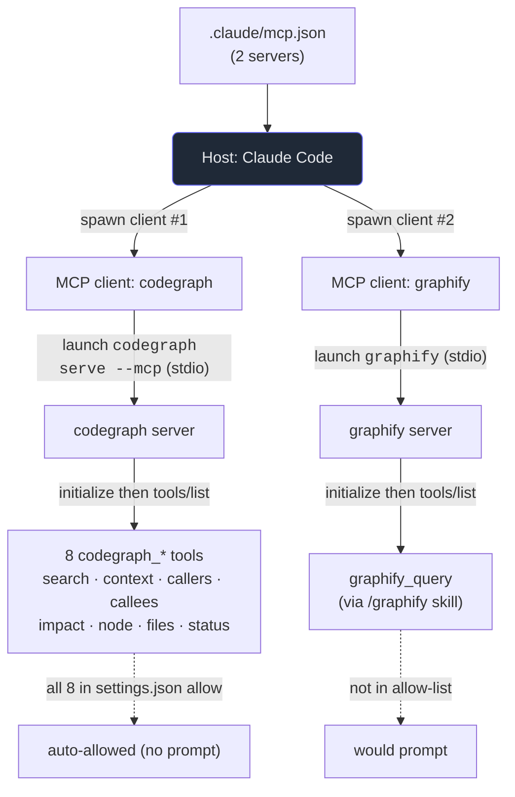

# 8. Our MCP servers

## TL;DR

> You've studied the wiring diagram — the **host / client / server** architecture (Ch. 2), the
> **tools / resources / prompts** primitives (Ch. 3–5), and how to **build a server** yourself (Ch. 7).
> Now we open *this* repository's real breaker box. The file is `.claude/mcp.json`, it is **eleven
> lines**, and it declares **two stdio servers**: **`codegraph`** (launched as `codegraph serve --mcp`)
> — a code-intelligence knowledge graph the book's author actually used to navigate this codebase — and
> **`graphify`** (launched as `graphify`) — a turn-anything-into-a-knowledge-graph tool. On startup the
> host reads this file, spawns **one client per server**, runs `initialize`, then `tools/list` to learn
> each server's tools. A second file, `.claude/settings.json`, lists **eight `codegraph_*` tools** under
> `permissions.allow`, so the agent may call them **without a per-call prompt**. This is the "read the
> real file" chapter: every field below is in the repo you're reading from.

## 1. Motivation

For seven chapters MCP has been an *idea*. We drew the M×N tangle, named the host and the client and the
server, sorted actions into tools, resources, and prompts, and even wrote a minimal server by hand. All
true, all abstract. The danger of abstraction is that you can nod along to every diagram and still not be
able to point at the *thing* when it's sitting in front of you.

So this chapter does something the others can't: it points. This repository — **Cortex**, the platform
serving this very book — is itself a Claude Code project, and Claude Code is an **MCP host**. That host is
configured by a real file, `.claude/mcp.json`, and it is short enough to quote in full without eliding a
single character:

```json
{
  "mcpServers": {
    "codegraph": {
      "command": "codegraph",
      "args": ["serve", "--mcp"]
    },
    "graphify": {
      "command": "graphify"
    }
  }
}
```

Eleven lines. Two servers. That is the entire MCP configuration of a production codebase. Everything the
earlier chapters described — the stdio transport, the client-per-server fan-out, the `initialize`
handshake, `tools/list` discovery, the permission gate — is *implied* by those eleven lines, and our job
here is to make every bit of it visible. There is no fictional `weather` server in this chapter. There is
only the file on disk, and what happens when the host reads it.

## 2. Intuition (Analogy)

Imagine you've just finished an electronics course. You learned what a circuit is, how a breaker trips,
why each branch is isolated so a short in the bathroom doesn't kill the kitchen. You understand the
*architecture* completely — on paper.

Then you walk down to your basement and open your **own house's breaker panel** for the first time. There
it is: a grey metal box, a column of labeled switches. `KITCHEN`. `BATHROOM`. `GARAGE`. Each breaker is a
circuit you studied in the abstract, but now it's *real*, it's *yours*, and you can trace each labeled
switch along its wire to the actual outlets and lights it powers. The bathroom breaker really does feed
the bathroom — you can flip it and watch the light die. The knowledge stops being a diagram and becomes a
map of your own house.

`.claude/mcp.json` is that panel. It has exactly **two breakers**, each labeled: `codegraph` and
`graphify`. This chapter is the walk down to the basement — we open the box, read the labels, and trace
each circuit to what it powers. And `.claude/settings.json` is the note taped inside the panel door
saying "*these eight switches are safe to flip without calling the electrician*."

| | Studying circuits (Ch. 2–7) | **Opening your own panel (this chapter)** |
|---|---|---|
| What you're looking at | A generic wiring *diagram* | The real `.claude/mcp.json` on disk |
| The breakers | "a server" in the abstract | **`codegraph`** and **`graphify`**, by name |
| Tracing a circuit | "a server exposes tools" | `codegraph` → 8 graph-navigation tools you can list |
| The safety note | "permissions gate each call" | `settings.json` auto-allows the 8 `codegraph_*` tools |
| What you can do after | Describe MCP | *Use* it — flip a switch and see the light |

## 3. Formal Definition

Here the "formal definition" is not a new abstraction — it is a **precise walkthrough of our real config
and the startup sequence it triggers**. Let's go field by field, then trace the boot.

**The file.** `.claude/mcp.json` has one top-level key, `mcpServers`, whose value is an **object keyed by
server name**. Each key (`"codegraph"`, `"graphify"`) is a *label you choose*; the host uses it as the
server's identity everywhere else (in logs, and — crucially — in the tool-id prefix). Each value is a
**launch spec**: a `command` (the executable to run) and an optional `args` array (its arguments).

- **`codegraph`** → `command: "codegraph"`, `args: ["serve", "--mcp"]`. The host will run the binary
  `codegraph` with the arguments `serve --mcp`. The `--mcp` flag tells that binary to *behave as an MCP
  server* — to speak JSON-RPC over its stdin/stdout rather than, say, printing a human report. (Many CLIs
  follow this pattern; recall Ch. 7's server and Ch. 6's stdio transport.)
- **`graphify`** → `command: "graphify"`, no `args`. The host runs the bare `graphify` binary. Same
  pattern, fewer arguments.

There is **no `transport` field**, and that's the point: when a server is declared with a `command`, the
host launches it as a **local subprocess and talks over stdio** — the default, zero-config transport from
Chapter 6. No ports, no URLs, no network. The host owns the process's lifetime.

**The startup sequence.** When Claude Code (the host) starts in this repo, for *each* entry in
`mcpServers` it performs, independently and in parallel:

1. **Launch** the subprocess (`codegraph serve --mcp`; `graphify`), wiring up its stdin/stdout.
2. **Spawn a dedicated client** — one MCP client object *per server* (Ch. 2's 1-host-to-N-clients fan-out;
   the client and server are a 1-to-1 pair).
3. **`initialize`** — the client and server exchange a handshake, negotiating the protocol version and
   advertising capabilities (Ch. 2). If they can't agree, this server fails to connect — and the *other*
   one is unaffected (isolation, just like breakers).
4. **`tools/list`** — the client asks the server what tools it offers; the server replies with their
   names and JSON schemas (Ch. 3). Those tools become available to the model, **namespaced** by server.

**The namespace + permission tie-in.** A tool named `codegraph_search` on the `codegraph` server is
exposed to the host as the fully-qualified id `mcp__codegraph__codegraph_search` — the pattern
`mcp__<server>__<tool>`. This matters because the *second* file, `.claude/settings.json`, gates tool
calls by exactly these ids. Its `permissions.allow` array lists eight of them:

```
mcp__codegraph__codegraph_search     mcp__codegraph__codegraph_node
mcp__codegraph__codegraph_impact     mcp__codegraph__codegraph_files
mcp__codegraph__codegraph_callers    mcp__codegraph__codegraph_status
mcp__codegraph__codegraph_callees    mcp__codegraph__codegraph_context
```

Any tool id on that list, the agent may call **without stopping to ask the user** (Ch. 3 of Part 2; the
deep treatment is Part 4 Ch. 10, security & permissions). A tool *not* on the list — e.g. anything from
`graphify` — would trigger a permission prompt before running. These eight are read-only graph queries:
safe to auto-allow precisely because they only *read* the index, they never mutate code.

| Term | Meaning (in *our* config) |
|---|---|
| **`mcpServers`** | The one top-level object in `.claude/mcp.json`; maps a chosen **server name** → its launch spec. |
| **`command`** | The executable the host runs to start a server (`codegraph`, `graphify`). |
| **`args`** | Arguments passed to that command (`["serve", "--mcp"]` for codegraph; absent for graphify). |
| **stdio launch** | With a `command` and no transport field, the host runs the server as a local subprocess and speaks JSON-RPC over its stdin/stdout (Ch. 6 default). |
| **client-per-server** | The host spawns one MCP client per declared server; codegraph and graphify each get their own. |
| **`tools/list`** | The post-`initialize` request by which the host learns a server's tools and their schemas. |
| **`mcp__<server>__<tool>`** | The fully-qualified tool id the host uses; the server *name* from the config becomes the middle segment. |
| **`permissions.allow`** | The `settings.json` array of tool ids the agent may call without a per-call prompt; here, the 8 `codegraph_*` tools. |

> The crossover insight: there is **nothing here you haven't met**. `mcpServers`, `command`, stdio,
> `initialize`, `tools/list`, the `mcp__server__tool` namespace, the allow-list — every concept was
> introduced in Chapters 2–7. This chapter adds **zero new theory**; it only swaps the toy example for the
> file that actually boots when you `git clone` this repo. The payoff of a good standard is exactly this:
> the real thing looks just like the diagram.

## 4. Worked Example

Here is the host reading our two-breaker panel and bringing both circuits live — launch, client, handshake,
discovery — for `codegraph` and `graphify` side by side.



And the actual configuration that drives that diagram — the **real, unedited** `.claude/mcp.json` from
this repository:

```json
{
  "mcpServers": {
    "codegraph": {
      "command": "codegraph",
      "args": ["serve", "--mcp"]
    },
    "graphify": {
      "command": "graphify"
    }
  }
}
```

Two server entries; two clients; two subprocesses over stdio; two `initialize`/`tools/list` rounds. The
left circuit (`codegraph`) lights up eight read-only graph tools, every one of them on the allow-list. The
right circuit (`graphify`) lights up its query tool, which — being absent from the allow-list — would ask
first. That asymmetry is not an accident; it's the security posture of §3 made concrete (and the through
line into Ch. 10).

## 5. Build It

Let's *simulate the host's startup* against the exact bytes of our two files — no network, no live MCP, no
file reads at runtime: the config and the allow-list are embedded as Python literals so this runs offline
and deterministically. For each server it prints the four-step boot (launch → client → `initialize` →
`tools/list`) and marks each discovered tool **`AUTO-ALLOW`** or **`would-prompt`** by checking the
fully-qualified id against the allow-list.

```python run
import json

# --- The REAL .claude/mcp.json from this repo, embedded as a dict literal ---
# (no file reads at runtime: this must run offline & deterministically)
MCP_JSON = {
    "mcpServers": {
        "codegraph": {"command": "codegraph", "args": ["serve", "--mcp"]},
        "graphify": {"command": "graphify"},
    }
}

# --- The REAL settings.json permissions.allow list (codegraph tools only) ---
ALLOW = [
    "mcp__codegraph__codegraph_search",
    "mcp__codegraph__codegraph_impact",
    "mcp__codegraph__codegraph_callers",
    "mcp__codegraph__codegraph_callees",
    "mcp__codegraph__codegraph_context",
    "mcp__codegraph__codegraph_node",
    "mcp__codegraph__codegraph_files",
    "mcp__codegraph__codegraph_status",
]

# --- What each server would advertise in its tools/list reply (fixture, ---
# --- not a live call: keeps this offline & deterministic) ---
TOOLS_LIST = {
    "codegraph": [
        "codegraph_search",
        "codegraph_context",
        "codegraph_callers",
        "codegraph_callees",
        "codegraph_impact",
        "codegraph_node",
        "codegraph_files",
        "codegraph_status",
    ],
    "graphify": [
        "graphify_query",
    ],
}


def qualified(server, tool):
    """The fully-qualified tool id the host uses for permission matching."""
    return f"mcp__{server}__{tool}"


def launch_line(server, spec):
    cmd = spec["command"]
    args = " ".join(spec.get("args", []))
    return f"{cmd} {args}".strip()


def simulate_host_startup(config, allow):
    allow_set = set(allow)
    servers = config["mcpServers"]
    summary = {"servers": 0, "tools": 0, "auto_allowed": 0, "would_prompt": 0}

    print("=" * 64)
    print("HOST STARTUP  (reading .claude/mcp.json)")
    print(f"  servers declared: {len(servers)}  ->  {', '.join(servers)}")
    print("=" * 64)

    for name, spec in servers.items():
        summary["servers"] += 1
        line = launch_line(name, spec)
        print(f"\n[{name}]")
        print(f"  1. launch   `{line}` over stdio (JSON-RPC on stdin/stdout)")
        print(f"  2. spawn    one MCP client dedicated to `{name}`")
        print(f"  3. initialize  ->  protocol handshake (version negotiated)")
        print(f"  4. tools/list  ->  server advertises its tools:")

        for tool in TOOLS_LIST.get(name, []):
            summary["tools"] += 1
            qid = qualified(name, tool)
            if qid in allow_set:
                summary["auto_allowed"] += 1
                mark = "AUTO-ALLOW"
            else:
                summary["would_prompt"] += 1
                mark = "would-prompt"
            print(f"       - {tool:<22} {mark}  [{qid}]")

    print("\n" + "-" * 64)
    print("STARTUP SUMMARY")
    print(f"  servers connected : {summary['servers']}")
    print(f"  tools discovered  : {summary['tools']}")
    print(f"  auto-allowed      : {summary['auto_allowed']}")
    print(f"  would-prompt      : {summary['would_prompt']}")
    print("-" * 64)
    return summary


def main():
    # Echo the real config the way the host parses it, so the log is grounded.
    print("config bytes parsed (.claude/mcp.json):")
    print(json.dumps(MCP_JSON, indent=2))
    print()

    result = simulate_host_startup(MCP_JSON, ALLOW)

    # A couple of deterministic assertions the prose relies on.
    assert result["servers"] == 2
    assert result["auto_allowed"] == 8
    assert result["would_prompt"] == 1
    print("\nOK: 2 servers, 8 codegraph tools auto-allowed, 1 graphify tool would-prompt.")


if __name__ == "__main__":
    main()
```

Running it prints the panel coming alive. The tail of the log is the part to read:

```
[codegraph]
  1. launch   `codegraph serve --mcp` over stdio (JSON-RPC on stdin/stdout)
  2. spawn    one MCP client dedicated to `codegraph`
  3. initialize  ->  protocol handshake (version negotiated)
  4. tools/list  ->  server advertises its tools:
       - codegraph_search       AUTO-ALLOW  [mcp__codegraph__codegraph_search]
       ...
[graphify]
  1. launch   `graphify` over stdio (JSON-RPC on stdin/stdout)
  ...
       - graphify_query         would-prompt  [mcp__graphify__graphify_query]

STARTUP SUMMARY
  servers connected : 2
  tools discovered  : 9
  auto-allowed      : 8
  would-prompt      : 1
```

**Now poke at it.** Notice the `graphify` line: its one tool is `would-prompt`, not `AUTO-ALLOW`, purely
because `mcp__graphify__graphify_query` is absent from `ALLOW`. Add that string to the `ALLOW` list and
re-run — the count flips to `auto_allowed: 9, would_prompt: 0` and the assertion at the bottom fails. That
failure is the lesson: **the allow-list is the only thing standing between "the agent asks first" and "the
agent just does it."** And it keys off the `mcp__<server>__<tool>` id, which means the *server name you typed
in `mcp.json`* (`codegraph`) is load-bearing for security — rename the server and every allow-list entry
silently stops matching. The simulation is faithful to the real boot because it reads the same two
literals the host reads from disk.

## 6. Trade-offs & Complexity

| Our setup (2 stdio servers, codegraph auto-allowed) | The alternative |
|---|---|
| **stdio launch** — zero config, no ports, runs locally, host owns lifetime | Remote HTTP/SSE server: works across machines, but needs hosting, URLs, auth (Ch. 6, 10) |
| **Auto-allowing the 8 `codegraph_*` tools** — fast, no prompt-fatigue mid-task | Prompt on every call: safer-by-default, but interrupts flow constantly |
| **Safe to auto-allow** *because* the tools are **read-only** graph queries | Auto-allowing a *write* tool would be reckless — one bad call mutates state |
| **Two small, focused servers** (navigate code; build a graph) | One mega-server: fewer processes, but a fatter trust surface and blast radius |
| **Config lives in the repo** (`.claude/`), versioned, reviewable in PRs | Per-user/global config: convenient, but invisible to teammates and review |
| **We are a HOST that *uses* servers** | Authoring our *own* server (the Ch. 11 gap) — more power, more to maintain |

The honest cost of auto-allowing tools is that you are pre-granting trust. We get away with it here for one
specific reason: **every auto-allowed tool only reads.** `codegraph_search`, `codegraph_callers`,
`codegraph_impact` and friends query a SQLite index of the codebase; none of them can change a file, run a
command, or reach the network. The moment a server offered a *mutating* tool, blanket-allowing it would be
a mistake — which is exactly why `graphify` (which writes graph artifacts) is **not** on the list. This is
the precise trade-off Chapter 10 will formalize.

## 7. Edge Cases & Failure Modes

- **`command` not on `PATH`.** `mcp.json` says `"command": "codegraph"` — a bare name. If the `codegraph`
  binary isn't installed or isn't on the host's `PATH`, launch fails and that server simply doesn't
  connect. The *other* server is unaffected (breaker isolation). The fix is install/`PATH`, not the JSON.
- **One server crashes; the rest live.** Because each server is its own subprocess with its own client, a
  `graphify` that dies on boot doesn't take `codegraph` down. You lose one circuit, not the panel.
- **Renaming a server silently breaks the allow-list.** Permissions key off `mcp__<server>__<tool>`. Rename
  `"codegraph"` to `"cg"` in `mcp.json` and *every* `mcp__codegraph__*` entry in `settings.json` stops
  matching — the tools quietly revert to prompting. The two files are coupled by that name string.
- **Allow-listing a write/exec tool.** The auto-allow list is safe *only because* the eight tools are
  read-only. Adding a mutating tool to `permissions.allow` hands the agent un-prompted power to change
  things — the canonical permission footgun (Ch. 10). Audit what a tool *does* before allow-listing it.
- **`--mcp` omitted.** `codegraph` without `--mcp` would run in its normal CLI mode and *not* speak the
  protocol, so `initialize` never completes and no tools appear. The flag is what turns a CLI into an MCP
  server (Ch. 7's "behave as a server" switch).
- **Mistaking the file for an install.** `mcp.json` only tells the host *how to launch* servers; it does
  **not** install them. The binaries must already exist. Config ≠ dependency management.

## 8. Practice

> **Exercise 1 — Read the panel.** Given *only* the eleven-line `.claude/mcp.json` above, answer without
> running anything: (a) how many MCP **clients** does the host spawn at startup, and why that number?
> (b) What **transport** does each server use, and which field tells you? (c) When the host wants
> `codegraph`'s search tool, what **fully-qualified id** does it use?

<details>
<summary><strong>Answer</strong></summary>

(a) **Two** clients — one per entry under `mcpServers` (`codegraph`, `graphify`). The host spawns a
dedicated MCP client per declared server (Ch. 2's 1-host → N-clients fan-out; client and server are a 1:1
pair), so two entries means two clients.

(b) **stdio** for both. The tell is that each entry has a **`command`** (and no `transport`/URL field):
when a server is declared by a command to run, the host launches it as a **local subprocess and speaks
JSON-RPC over its stdin/stdout** (Ch. 6 default).

(c) **`mcp__codegraph__codegraph_search`** — the `mcp__<server>__<tool>` pattern, where the middle segment
is the server *name* you chose in the config (`codegraph`) and the last is the tool name. That is also the
exact string `settings.json` matches to auto-allow the call.

</details>

> **Exercise 2 — Flip a breaker safely (or not).** A teammate wants `graphify`'s tool to run without a
> prompt, so they add `"mcp__graphify__graphify_query"` to `permissions.allow`. Walk through what changes at
> the next startup, and give the one-question test they should have applied before doing it.

<details>
<summary><strong>Answer</strong></summary>

At the next startup the simulation's count flips from `auto_allowed: 8, would_prompt: 1` to
**`auto_allowed: 9, would_prompt: 0`**: the host now lets the agent call `graphify_query` **without
stopping to ask the user**.

Whether that's *safe* depends on **what the tool does**, and that's the one-question test:
**"Does this tool only read, or can it write / execute / reach the network?"** The eight `codegraph_*`
tools are auto-allowed precisely because they are **read-only** graph queries — they can't mutate code or
the world. `graphify` *builds and writes* graph artifacts (and may pull from URLs), so auto-allowing it
pre-grants the agent un-prompted power to produce side effects. The right move is usually to leave a
writing/executing tool **off** the allow-list and let it prompt (the §6 trade-off; the formal treatment is
Ch. 10). If you do allow it, do so deliberately, knowing the blast radius.

</details>

> **Exercise 3 — Where's the gap?** This repo is an MCP **host** that *uses* `codegraph` and `graphify`.
> What has it **not** done with MCP that the rest of Part 4 builds toward — and which chapter closes that
> gap?

<details>
<summary><strong>Answer</strong></summary>

Cortex **authors no MCP server of its own.** It *consumes* two third-party servers (`codegraph`,
`graphify`) over stdio, but there is no "cortex-content" or "cortex-runner" server exposing *this
project's* data (its chapters, its `/api/run` code runner) over MCP for any host to use. In the M+N
framing of Ch. 1, Cortex is purely an "app" side; it contributes nothing to the "tool" side of the
ecosystem.

That's the deliberate **gap**, and **Chapter 11 — "Design a Cortex MCP"** closes it on paper: it designs a
`cortex-content` MCP server (tools to search chapters, fetch a section, maybe run a snippet) so that *other*
MCP hosts could reach into Cortex the same way our host reaches into `codegraph`. Chapter 7 taught the
*how* (build a minimal server); Chapter 11 applies it to *our* domain.

> 🚢 **Closed for real:** since this was written, the **[Cortex Tutor](/cortex/cortex-onboarding/cortex-tutor/grounding-and-the-skill)** ships a real authored MCP server — **`grounding_mcp`**, a read-only Streamable-HTTP server over the Cortex corpus that feeds the coach lesson/problem context (with the solution withheld pre-implement). It's a *different* host relationship than this chapter's `.claude/mcp.json` (the tutor *service* is the host that consumes it, not Claude Code), but it means Cortex is no longer purely an "app" side of the M+N ecosystem — it now contributes a server too.

</details>

```quiz
{
  "prompt": "In this repo's `.claude/settings.json`, the eight `codegraph_*` tools are listed under `permissions.allow`. What does that achieve, and why is it considered safe here?",
  "input": "Choose one:",
  "options": [
    "The agent may call those eight tools without a per-call permission prompt — safe because they are read-only graph queries that can't mutate code or reach the network",
    "It installs the codegraph server, replacing the need for the `command` field in mcp.json",
    "It makes those tools run faster by caching their results across sessions",
    "It grants the agent permission to edit any file in the repository through codegraph"
  ],
  "answer": "The agent may call those eight tools without a per-call permission prompt — safe because they are read-only graph queries that can't mutate code or reach the network"
}
```

## In the Wild

- **[modelcontextprotocol.io — Connect to local MCP servers](https://modelcontextprotocol.io/quickstart/user)**
  — the official quickstart for the exact file we dissected: a host's JSON config with `command`/`args`
  entries that launch local stdio servers. Our `.claude/mcp.json` is one concrete instance of this format.
- **[Claude Code — MCP configuration](https://docs.anthropic.com/en/docs/claude-code/mcp)** — how the host
  in *this* repo reads `mcp.json`, manages server scope (project vs. user), and surfaces the `mcp__*` tools.
- **[Claude Code — settings & permissions](https://docs.anthropic.com/en/docs/claude-code/settings)** — the
  reference for `permissions.allow` and the `mcp__<server>__<tool>` matcher that turns our eight
  `codegraph_*` entries into un-prompted calls. The security model behind §3's allow-list.

---

**Next:** our two servers expose only *tools*, and the host only *launches and lists* them — but the
protocol can do far more. Servers can ask the model to think (sampling), see the workspace (roots), and
prompt the user (elicitation); hosts can discover tools at runtime (as this very session did via
ToolSearch). → [9. Advanced capabilities](/cortex/the-claude-stack/model-context-protocol/advanced-capabilities)
