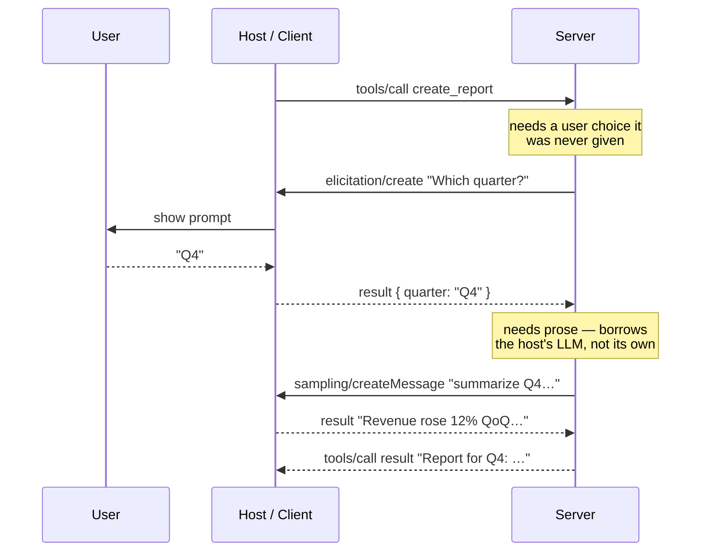

# 9. Advanced capabilities

## TL;DR

> The three primitives in Chapters 3–5 (tools, resources, prompts) all flow **one way**: the client
> reaches into the server. MCP also defines the **reverse** — **client primitives a server can call
> back on** — plus the ability to change what's offered at runtime. **Sampling**
> (`sampling/createMessage`) lets a server ask the **host** to run an LLM completion *on its behalf*,
> so the server can use a model **without bundling a model SDK or an API key** — it stays
> model-independent and the host keeps control of cost and a human in the loop. **Elicitation**
> (`elicitation/create`) lets a server ask the **user** for input or confirmation *mid-operation*
> ("which repo?", "confirm delete?"). **Roots** let the client tell the server which filesystem/URI
> roots it may touch (scoping its reach); **logging** lets the server stream diagnostics to the
> client. And **dynamic discovery** means tools aren't frozen at startup: clients learn capabilities
> at runtime via `*/list`, and a server with `listChanged: true` fires
> `notifications/tools/list_changed` when its offerings change, so the client re-lists. Together these
> turn MCP from a static, one-way tool list into a **live, two-way, model-and-user-aware** system.

## 1. Motivation

Everything so far has been a **one-way street**. In Chapter 3 the client called `tools/list` and
`tools/call`; in Chapter 4 it read a resource by URI; in Chapter 5 it fetched a prompt. In every case
the *client* reached into the *server* and pulled something out. The server was passive — it sat there
and answered. A perfectly good vending machine: you press a button, it dispenses.

But real work isn't always a clean one-shot. Suppose a server exposes a `create_report` tool, and
halfway through running it the server realizes it's **missing a piece of information only the user
has** — *which* quarter? — and it needs a *paragraph of prose* it has no good way to write itself.
With only the basic primitives it's stuck: it can fail, or guess. What it actually wants is to **turn
around and ask** — ask the *user* "which quarter?", and ask the *host's model* "summarize these
numbers." That requires the arrow to point the **other way**: the server calling back into the client.

There's a second limitation. The tool list has so far been **static** — discovered once at the
`initialize` handshake and then frozen. But a server's capabilities can *change*: a database server
learns a new schema, a deploy server gains a new environment, a host with thousands of tools doesn't
want to load every schema upfront. **This very session is proof.** The harness that wrote this book
did **not** load every tool's schema at startup — most were **deferred**, just names, and were
**fetched on demand via `ToolSearch`** only when actually needed (you can see the deferred-tool list
in the system reminders). That is *exactly* the "don't preload everything; discover at runtime" idea,
and it's how a host keeps a sprawling tool ecosystem manageable. This chapter is the set of features —
**sampling, elicitation, roots, logging, and dynamic discovery** — that turn MCP from a static
one-way list into a live two-way conversation. (Our two servers, `codegraph` and `graphify`, don't
use sampling or elicitation today — so we'll flag those as a *could-extend*, honestly, as we go.)

## 2. Intuition (Analogy)

Go back to the vending machine. With the basic primitives, that's all a server is: a glass-fronted box
of buttons. You (the client) scan the menu, press a button, and it drops a can. The transaction is
entirely *yours* to drive — the machine never speaks first, never asks you anything, never changes.

Advanced capabilities turn that vending machine into a **conversation with a clerk behind a counter**:

- **Elicitation** is the clerk **asking you a question back**: "Regular or large?" The clerk can't
  finish your order without an answer it doesn't have, so it pauses *mid-transaction* and asks. (The
  server asks the *user*.)
- **Sampling** is the clerk **phoning a translator for help**: they don't speak the language on your
  coupon, so they call someone who does, relay your request, and use the answer. The clerk doesn't
  need to *be* a translator — they just borrow one. (The server borrows the *host's LLM*, instead of
  bundling its own.)
- **Roots** is the clerk being told **which shelves they're allowed to reach**: "you may serve from
  aisles 1–3 only." The client fences the server's world.
- **Logging** is the clerk **narrating what they're doing** so you can follow along ("checking the
  back room…").
- **Dynamic discovery** (`list_changed`) is the clerk **updating the menu board live**: a new item
  appears, the old one sells out, and a little sign says "menu changed — take another look."

The single shift: a vending machine is **one-way** (you act on it). A clerk is **two-way** (they can
act on you — ask, fetch help, update the board). That's the whole chapter.

| | Basic primitives (Ch. 3–5) | **Advanced capabilities (this chapter)** |
|---|---|---|
| Direction | One-way: client → server | **Two-way: server can call back → client** |
| Server is… | A vending machine (passive) | **A clerk (can ask, fetch help, narrate)** |
| Get user input mid-call | Impossible — args fixed at call time | **Elicitation: server asks the *user*** |
| Need an LLM in the server | Bundle your own SDK + key | **Sampling: borrow the *host's* model** |
| Server's reach | Whatever it implements | **Roots: client *scopes* it** |
| Tool list | Static, discovered once | **Dynamic: `*/list` + `list_changed` at runtime** |

## 3. Formal Definition

Beyond the three **server primitives**, MCP defines **client primitives** — capabilities the *client*
offers that a *server* may invoke — plus **runtime discovery**. All ride the same JSON-RPC 2.0 channel
from Chapter 6; the only new thing is the *direction* of the arrow and a notification or two.

**Client primitives (server → client):**

- **Sampling** — the server sends `sampling/createMessage`; the **host** runs an LLM completion and
  returns the assistant message. The server thereby uses a model **without** owning a model SDK or API
  key — it stays *model-independent*, and the **host** picks the model, bears the cost, and *should
  keep a human in the loop / approve* the call.
- **Elicitation** — the server sends `elicitation/create` with a `message` and a `requestedSchema`;
  the **host** asks the **user** and returns a structured response (`action: "accept" | "decline" |
  "cancel"`, plus matching `content`). This is how a server gathers input or confirmation *mid-
  operation*.
- **Roots** — the **client** declares the filesystem/URI **roots** the server is permitted to operate
  within (and can send `notifications/roots/list_changed` when they change), scoping the server's
  reach.
- **Logging** — the server sends `notifications/message` (log) entries to the client at a chosen
  level; the client can set the level via `logging/setLevel`.

**Dynamic discovery (runtime, either direction):** capabilities are negotiated at `initialize`, but
the concrete *lists* are fetched at **runtime** via `tools/list`, `resources/list`, `prompts/list`. A
server that advertised `listChanged: true` for a primitive emits a notification —
`notifications/tools/list_changed` (or `…/resources/…`, `…/prompts/…`) — whenever its offerings change;
the client responds by **re-listing**. Tools need not be static, nor all loaded upfront.

| Term | Meaning |
|---|---|
| **Sampling** (`sampling/createMessage`) | Server → host LLM completion. Server uses a model **without** its own SDK/key; host controls model + cost, keeps a human in the loop. |
| **Elicitation** (`elicitation/create`) | Server → user request for input/confirmation *mid-call*. Carries a `requestedSchema`; returns `action` + structured `content`. |
| **Roots** | Client-declared filesystem/URI boundaries the server may operate within — **scopes** the server's reach. |
| **Logging** | Server → client diagnostic messages (`notifications/message`); level set via `logging/setLevel`. |
| **`listChanged`** | A capability flag a server sets (e.g. `tools.listChanged: true`) declaring it *will* notify when that list changes. |
| **`notifications/tools/list_changed`** | A notification (no `id`, no reply) telling the client the tool list changed → client re-runs `tools/list`. Likewise for resources/prompts. |
| **Dynamic discovery** | Learning capabilities at **runtime** via `*/list` rather than assuming a fixed, preloaded set. |

> The crossover insight: the basic primitives make MCP a **catalog** — useful, but the server is inert
> and the menu is fixed. The advanced capabilities make it a **collaborator** — the server can ask the
> user, borrow the host's brain, be fenced to its lane, and revise its own menu. Not every server
> needs them (a pure read-only tool server is happy as a vending machine), but the moment a server
> needs *judgment*, *missing input*, or a *model* of its own, the arrow has to point both ways.

## 4. Worked Example

Take a single `tools/call` that **can't finish on its own**. The client invokes `create_report`, but
the server is missing a user choice (*which quarter?*) and needs prose it can't write itself. So
mid-execution it calls **back**: first an **elicitation** (host asks the user, returns `"Q4"`), then a
**sampling** request (host runs its LLM, returns a one-line summary). Only *then* does the server
answer the original call. Watch the round-trip.



Two arrows go the "wrong" way — `elicitation/create` and `sampling/createMessage` both flow **server →
host**, the reverse of every message in Chapters 3–5. That is the entire point: the server is no
longer a vending machine; it's conducting a conversation. Here is the actual `sampling/createMessage`
the server sends in step two (the host will fill in the model and the completion):

```json
{
  "jsonrpc": "2.0",
  "id": 3,
  "method": "sampling/createMessage",
  "params": {
    "maxTokens": 100,
    "messages": [
      {
        "role": "user",
        "content": { "type": "text", "text": "Summarize Q4 metrics in one sentence." }
      }
    ]
  }
}
```

Notice what's *absent*: no model name, no API key, no SDK. The server states *what* it wants completed;
the **host** decides *which* model runs it, pays for it, and (per spec) gets the user's approval. That
absence is the feature — it's how a server stays model-independent and lets the host stay in control.

## 5. Build It

We can't run real MCP servers (no SDK, no network) — but the *shape* of the exchange is the lesson, not
the transport. Below, a **`Host`** owns the user and the model (both answers canned), a **`ReportServer`**
handles `create_report` by calling **back** to the host — `elicitation/create`, then
`sampling/createMessage` — before returning its result, and then we model **dynamic discovery**: a
`notifications/tools/list_changed` makes the client **re-run `tools/list`** and find a brand-new tool.
Every message is printed in order, tagged with who's speaking to whom. Stdlib `json` only; fully
deterministic.

```python run
# ---------------------------------------------------------------------------
# Advanced MCP capabilities, modelled with stdlib json only -- no network, no
# `mcp` SDK. We make the *two-way* nature concrete: a SERVER, mid-tool-call,
# (1) ELICITS a missing input from the user via the HOST, and (2) borrows the
# host's LLM via SAMPLING -- then returns its final result. After that we show
# DYNAMIC DISCOVERY: a `notifications/tools/list_changed` makes the client
# re-run `tools/list` and find a brand-new tool. Every value is canned, so the
# whole exchange is deterministic and reproducible.
# ---------------------------------------------------------------------------
import json

# A monotonically increasing JSON-RPC id, so each request/response pairs up.
_next_id = 0


def _rpc_id():
    global _next_id
    _next_id += 1
    return _next_id


def show(direction, msg):
    """Print one JSON-RPC message, tagged with who is speaking to whom."""
    print(f"{direction:<16} {json.dumps(msg)}")


# ---------------------------------------------------------------------------
# THE HOST stand-in. In real MCP the host owns the model and the user, and it
# is the host (NOT the server) that runs an LLM completion or asks the user.
# The server can only *request*; the host decides, keeping a human in the loop.
# Here both answers are canned so the run is deterministic.
# ---------------------------------------------------------------------------
class Host:
    # What the user would pick when the server asks "which quarter?"
    CANNED_USER_ANSWER = {"quarter": "Q4"}
    # What the host's LLM would return when the server asks for a summary.
    CANNED_LLM_SUMMARY = "Revenue rose 12% QoQ; churn fell to 3.1%."

    def handle_elicitation(self, req):
        """`elicitation/create`: ask the USER for input, return their answer.

        The host shows the server's prompt to the human and collects a
        structured response that matches the requested schema. A real host
        would render a form; we return a canned, schema-shaped answer.
        """
        params = req["params"]
        show("host->user", {"show_prompt": params["message"]})
        return {
            "jsonrpc": "2.0",
            "id": req["id"],
            "result": {"action": "accept", "content": self.CANNED_USER_ANSWER},
        }

    def handle_sampling(self, req):
        """`sampling/createMessage`: run an LLM completion FOR the server.

        This is how a server uses a model WITHOUT bundling a model SDK or an
        API key of its own -- it borrows the host's. The host controls which
        model runs and the cost, and should approve the call. We return a
        canned completion so there is no real model and no network.
        """
        msgs = req["params"]["messages"]
        user_text = msgs[-1]["content"]["text"]
        show("host->llm", {"run_completion_on": user_text})
        return {
            "jsonrpc": "2.0",
            "id": req["id"],
            "result": {
                "role": "assistant",
                "model": "host-chosen-model",
                "stopReason": "endTurn",
                "content": {"type": "text", "text": self.CANNED_LLM_SUMMARY},
            },
        }


# ---------------------------------------------------------------------------
# THE SERVER stand-in. It exposes a `create_report` tool. Handling that tool
# is NOT a one-shot return: mid-execution the server discovers it needs (a) a
# user choice it doesn't have and (b) prose it can't write itself, so it calls
# BACK to the host -- first elicitation, then sampling -- before finishing.
# That callback ability is what makes MCP two-way instead of a vending machine.
# ---------------------------------------------------------------------------
class ReportServer:
    def __init__(self, host):
        self.host = host

    def call_create_report(self):
        # --- 1. The server needs a user choice it was never given. It ASKS. ---
        elicit_req = {
            "jsonrpc": "2.0",
            "id": _rpc_id(),
            "method": "elicitation/create",
            "params": {
                "message": "Which quarter should the report cover?",
                "requestedSchema": {
                    "type": "object",
                    "properties": {"quarter": {"type": "string"}},
                    "required": ["quarter"],
                },
            },
        }
        show("server->host", elicit_req)
        elicit_resp = self.host.handle_elicitation(elicit_req)
        show("host->server", elicit_resp)
        quarter = elicit_resp["result"]["content"]["quarter"]

        # --- 2. The server needs prose. Rather than bundle its own model, it
        #        borrows the HOST's LLM via sampling. ---
        sample_req = {
            "jsonrpc": "2.0",
            "id": _rpc_id(),
            "method": "sampling/createMessage",
            "params": {
                "maxTokens": 100,
                "messages": [
                    {
                        "role": "user",
                        "content": {
                            "type": "text",
                            "text": f"Summarize {quarter} metrics in one sentence.",
                        },
                    }
                ],
            },
        }
        show("server->host", sample_req)
        sample_resp = self.host.handle_sampling(sample_req)
        show("host->server", sample_resp)
        summary = sample_resp["result"]["content"]["text"]

        # --- 3. Only NOW can the server return the tool result. ---
        return {
            "content": [
                {"type": "text", "text": f"Report for {quarter}: {summary}"}
            ],
            "isError": False,
        }


# ===========================================================================
# PART 1 -- one tools/call that fans out into elicitation + sampling and back.
# ===========================================================================
print("=== A tool call that calls back: elicitation + sampling ===\n")

host = Host()
server = ReportServer(host)

# The client/host invokes the tool. This is the only message the *user* started.
call_req = {
    "jsonrpc": "2.0",
    "id": _rpc_id(),
    "method": "tools/call",
    "params": {"name": "create_report", "arguments": {}},
}
show("client->server", call_req)

# Handling it triggers the two server->host round-trips printed inside.
result = server.call_create_report()

# The server answers the ORIGINAL tools/call, last -- after its callbacks.
call_resp = {"jsonrpc": "2.0", "id": call_req["id"], "result": result}
show("server->client", call_resp)

final_text = result["content"][0]["text"]
print("\nFINAL tool result:", final_text)
assert final_text == "Report for Q4: Revenue rose 12% QoQ; churn fell to 3.1%."


# ===========================================================================
# PART 2 -- dynamic discovery. Tools are not frozen at startup. When the
# server's offerings change it emits a `notifications/tools/list_changed`, and
# the client RE-LISTS to learn what is new. This is exactly how a host keeps a
# huge, shifting tool ecosystem manageable: discover at runtime, don't preload.
# ===========================================================================
print("\n=== Dynamic discovery: list_changed -> re-list ===\n")

# The server's live tool registry. It starts with one tool...
server_tools = ["create_report"]


def tools_list():
    """Respond to `tools/list` with whatever the server offers RIGHT NOW."""
    req = {"jsonrpc": "2.0", "id": _rpc_id(), "method": "tools/list"}
    show("client->server", req)
    resp = {
        "jsonrpc": "2.0",
        "id": req["id"],
        "result": {"tools": [{"name": n} for n in server_tools]},
    }
    show("server->client", resp)
    return [t["name"] for t in resp["result"]["tools"]]


before = tools_list()
print("client knows:", before)

# ...then the server gains a new tool at runtime and NOTIFIES (no id: it is a
# notification, not a request -- the client must not reply to it).
server_tools.append("export_pdf")
note = {"jsonrpc": "2.0", "method": "notifications/tools/list_changed"}
show("server->client", note)

# Because capabilities are discovered at RUNTIME, the client simply re-lists.
after = tools_list()
print("client knows:", after)

assert before == ["create_report"]
assert after == ["create_report", "export_pdf"]
print("\nNew tool 'export_pdf' discovered at runtime -- no restart, no preload.")
```

Running it prints the whole two-way exchange, in order:

```
=== A tool call that calls back: elicitation + sampling ===

client->server   {"jsonrpc": "2.0", "id": 1, "method": "tools/call", "params": {"name": "create_report", "arguments": {}}}
server->host     {"jsonrpc": "2.0", "id": 2, "method": "elicitation/create", "params": {"message": "Which quarter should the report cover?", "requestedSchema": {"type": "object", "properties": {"quarter": {"type": "string"}}, "required": ["quarter"]}}}
host->user       {"show_prompt": "Which quarter should the report cover?"}
host->server     {"jsonrpc": "2.0", "id": 2, "result": {"action": "accept", "content": {"quarter": "Q4"}}}
server->host     {"jsonrpc": "2.0", "id": 3, "method": "sampling/createMessage", "params": {"maxTokens": 100, "messages": [{"role": "user", "content": {"type": "text", "text": "Summarize Q4 metrics in one sentence."}}]}}
host->llm        {"run_completion_on": "Summarize Q4 metrics in one sentence."}
host->server     {"jsonrpc": "2.0", "id": 3, "result": {"role": "assistant", "model": "host-chosen-model", "stopReason": "endTurn", "content": {"type": "text", "text": "Revenue rose 12% QoQ; churn fell to 3.1%."}}}
server->client   {"jsonrpc": "2.0", "id": 1, "result": {"content": [{"type": "text", "text": "Report for Q4: Revenue rose 12% QoQ; churn fell to 3.1%."}], "isError": false}}

FINAL tool result: Report for Q4: Revenue rose 12% QoQ; churn fell to 3.1%.

=== Dynamic discovery: list_changed -> re-list ===

client->server   {"jsonrpc": "2.0", "id": 4, "method": "tools/list"}
server->client   {"jsonrpc": "2.0", "id": 4, "result": {"tools": [{"name": "create_report"}]}}
client knows: ['create_report']
server->client   {"jsonrpc": "2.0", "method": "notifications/tools/list_changed"}
client->server   {"jsonrpc": "2.0", "id": 5, "method": "tools/list"}
server->client   {"jsonrpc": "2.0", "id": 5, "result": {"tools": [{"name": "create_report"}, {"name": "export_pdf"}]}}
client knows: ['create_report', 'export_pdf']

New tool 'export_pdf' discovered at runtime -- no restart, no preload.
```

Read the order. The original `tools/call` (id `1`) is sent **first** but answered **last** — between
them, the server fires *two* requests of its own (ids `2` and `3`) that go **server → host**, exactly
opposite to everything in Chapters 3–5. That inversion is the whole idea: the server paused
mid-execution to **ask the user** and to **borrow the host's model**, then resumed. **Now break it:**
delete the `host.handle_elicitation(...)` round-trip and hard-code `quarter = "Q4"` — the code still
runs and prints a report, but you've turned the clerk back into a vending machine that *assumes* your
order instead of asking. The value of elicitation is precisely that the server *didn't* guess. In Part
2, note the `list_changed` message has **no `id`** — it's a notification, so the client must *not*
reply; it simply re-lists. That `list_changed → re-list` reflex is dynamic discovery in one line, and
it's the same reflex that let *this session* defer most tools and fetch their schemas via `ToolSearch`
only when needed, instead of loading thousands of schemas upfront.

## 6. Trade-offs & Complexity

| Use an advanced capability | Stay with the basic primitives |
|---|---|
| **Sampling:** server uses an LLM with **no** SDK/key of its own; host controls model + cost | Bundle a model SDK + secret in every server; server owns the bill and the model choice |
| **Elicitation:** gather missing input / confirm *mid-call* — fewer failed calls, safer destructive ops | Take all args upfront; on missing/ambiguous input, fail or (worse) guess |
| **Roots:** client *scopes* the server's reach — a real safety boundary | Server operates over whatever it implements; trust is all-or-nothing |
| **Dynamic discovery:** huge/shifting tool sets stay manageable; load schemas on demand | Every tool schema loaded upfront; the list can't change without a reconnect |
| Cost: the host must **implement** these (a sampling provider, an elicitation UI, root config) | Nothing extra to build — a plain request/response server |
| Cost: more round-trips, more surface, a human-in-the-loop to design | One call in, one result out — simplest possible shape |

The trade is **capability vs. moving parts**. Sampling and elicitation are genuinely powerful — a
server that can think (via the host's model) and ask (the user) is far more capable than one that
can't — but they're **optional, and they cost host-side machinery**: a host must offer a sampling
provider and an elicitation UI, *and* keep a human in the loop so a server can't silently spend tokens
or coerce a confirmation. A read-only data server needs none of this; it's happy as a vending machine.
Reach for the advanced features when a server needs **judgment, missing input, or a model** — and not
before. (Honestly: `codegraph` and `graphify` need none of these today, which is why they don't
implement them — a clean example of "don't add a capability you don't need.")

## 7. Edge Cases & Failure Modes

- **Sampling without a human in the loop.** A server that can trigger LLM completions can run up cost
  or be steered into doing something unintended. The spec says the **host** keeps a human in the loop /
  approves — skip that and you've handed a server an unmetered model. Approval is not optional polish.
- **Elicitation that ignores `decline`/`cancel`.** The user can refuse or cancel an elicitation
  (`action: "decline" | "cancel"`), not just `accept`. A server that assumes it always gets an answer
  will hang or crash. Handle all three outcomes — declining is a valid, expected response.
- **Trusting elicited / sampled content blindly.** Both a user's elicitation answer and a sampled
  completion are *inputs from outside the server*. Validate the elicitation response against the
  `requestedSchema`; never feed a sampled string straight into a shell or SQL. (This is the same
  untrusted-input discipline as tool arguments — Chapter 10's territory.)
- **`listChanged` advertised but never fired (or fired without re-listing).** If a server claims
  `listChanged: true` but never notifies, clients show a **stale** tool list; if a client receives the
  notification but doesn't re-list, same result. The contract is *notify on change* **and** *re-list on
  notification* — both halves, or discovery silently rots.
- **Replying to a notification.** `notifications/tools/list_changed` (and other `notifications/*`) have
  **no `id`** and expect **no response**. Sending one back is a protocol error. Notifications are
  fire-and-forget.
- **Roots that aren't enforced.** Roots *declare* a boundary, but the **server** must actually respect
  it. A server that reads outside its granted roots defeats the point — roots are a contract, not a
  sandbox; pair them with real OS-level confinement for anything sensitive.
- **Capability assumed, not negotiated.** Sampling, elicitation, and roots are only available if the
  *other side* declared support at `initialize`. A server that fires `sampling/createMessage` at a host
  that never offered sampling just gets an error. Check the negotiated capabilities first.

## 8. Practice

> **Exercise 1 — Which capability, and which way does the arrow point?** For each need, name the MCP
> capability and state whether the message flows **server → client** or **client → server**: (a) a
> `delete_branch` tool that must get the user to confirm before deleting; (b) a translation server
> that wants to summarize text but ships **no** model SDK or API key; (c) telling a filesystem server
> it may only touch `~/project`; (d) a database server that just learned a new table and wants clients
> to see a new `query_orders` tool.

<details>
<summary><strong>Answer</strong></summary>

- **(a) Elicitation** (`elicitation/create`) — **server → client (→ user)**. The server pauses
  mid-call to ask the user to confirm; the host surfaces the prompt and returns `accept`/`decline`/
  `cancel`.
- **(b) Sampling** (`sampling/createMessage`) — **server → client (→ host's LLM)**. The server borrows
  the *host's* model so it needs no SDK or key of its own; the host runs the completion and controls
  model + cost.
- **(c) Roots** — **client → server**. The *client* declares the filesystem roots the server may
  operate within, scoping its reach.
- **(d) Dynamic discovery** — **server → client**: the server fires `notifications/tools/list_changed`
  (no `id`), and the client re-runs `tools/list` to pick up `query_orders`.

The throughline: (a) and (b) are the **reverse** arrow (server calling back into the client) that makes
MCP two-way; (c) is the client fencing the server; (d) is the list refusing to stay frozen.

</details>

> **Exercise 2 — Why is sampling better than bundling a model?** A teammate says, "instead of all this
> `sampling/createMessage` ceremony, just put an Anthropic API key in the server and call the model
> directly." Give two concrete reasons the sampling design is better, tied to §3.

<details>
<summary><strong>Answer</strong></summary>

Two reasons from §3:

1. **Model-independence and no secret sprawl.** With sampling, the server ships **no** model SDK and
   **no** API key — it just says *what* it wants completed and the **host** supplies the model. Bundle
   a key in the server and now *every* server needs its own credential (a secret-management and
   blast-radius problem), is welded to one provider, and breaks when the user wants a different model.
2. **The host controls cost and keeps a human in the loop.** Because completions run through the host,
   the host picks the model, meters the spend, and (per spec) gets user approval. A server with its own
   key can silently burn tokens with no oversight — the very thing the §7 "sampling without a human in
   the loop" failure warns about.

In short, sampling keeps the *model* and the *money* under the host's control while letting the server
stay a thin, portable, model-agnostic component. (Our servers don't need an LLM at all today — but if
`graphify` ever wanted to *summarize* a graph, sampling is how it'd do so without becoming an
API-key-carrying app.)

</details>

> **Exercise 3 — Discovery in this very session.** The harness that wrote this book did **not** load
> every tool's schema at startup; most were *deferred* and fetched on demand via `ToolSearch`. Connect
> that observed behavior to the MCP concept in this chapter, and explain why a host with thousands of
> available tools *wants* to work this way.

<details>
<summary><strong>Answer</strong></summary>

That behavior **is dynamic discovery** (§3): capabilities are learned at **runtime**, not all loaded
upfront. The deferred-tool list is a registry of *names*; the actual schemas are fetched only when a
tool is about to be used — the harness's `ToolSearch` is playing the role of a runtime `*/list`
lookup, and "deferred → fetch on demand" is the same reflex as "`list_changed` → re-list."

A host *wants* this at scale for the reasons §6 names. Loading thousands of full tool schemas upfront
would (1) **bloat context** — every schema spent is context the model can't use for the task; (2) be
**wasteful** — most tools in a session are never called; and (3) be **brittle** — the available set can
*change* during the session. Discovering at runtime keeps a sprawling, shifting tool ecosystem
manageable: the model sees a lightweight catalog and pulls the heavy detail only for the tools it
actually reaches for. That's precisely why MCP makes lists runtime-fetched and changeable rather than a
fixed manifest — and why you watched it happen live in this session.

</details>

```quiz
{
  "prompt": "A server handling a `tools/call` realizes mid-execution that it needs the user to pick a value it was never given, and it needs a sentence of prose but ships no model SDK or API key. Which two MCP capabilities does it use, and which way do those messages flow?",
  "input": "Choose one:",
  "options": [
    "Elicitation (elicitation/create) to ask the user, and sampling (sampling/createMessage) to borrow the host's LLM — both flow server → host (the reverse of tools/resources/prompts), and the original tools/call is answered last",
    "It calls tools/list and resources/list on itself to look up the missing data, both flowing client → server",
    "It bundles its own Anthropic API key and calls the model directly, so no MCP message is needed and nothing flows to the host",
    "It sends notifications/tools/list_changed twice, once for the user input and once for the prose, and the host replies to each"
  ],
  "answer": "Elicitation (elicitation/create) to ask the user, and sampling (sampling/createMessage) to borrow the host's LLM — both flow server → host (the reverse of tools/resources/prompts), and the original tools/call is answered last"
}
```

## In the Wild

- **[MCP spec — Client Features (Sampling, Roots, Elicitation)](https://modelcontextprotocol.io/specification/2025-06-18/client)**
  — the authoritative definitions of the client primitives a server can call back on: the
  `sampling/createMessage` and `elicitation/create` shapes, roots, and the human-in-the-loop guidance.
  The primary source for this chapter.
- **[MCP spec — Server Features (Tools / Resources / Prompts + `listChanged`)](https://modelcontextprotocol.io/specification/2025-06-18/server)**
  — where `*/list`, the `listChanged` capability, and the `notifications/*/list_changed` messages are
  specified: the machinery behind dynamic discovery.
- **[MCP docs — Build an MCP client](https://modelcontextprotocol.io/docs/develop/build-client)** — a
  client implementation that wires up sampling and handles capability negotiation, showing the "other
  side" of these features in real SDK code.

---

**Next:** these two-way capabilities — a server that can run a model, ask the user, and reach the
filesystem — are exactly where trust gets dangerous. Who is allowed to do what, how does OAuth fit, and
why is a tool's own *description* an attack surface? →
[10. Security & auth](/cortex/the-claude-stack/model-context-protocol/security-and-auth)
