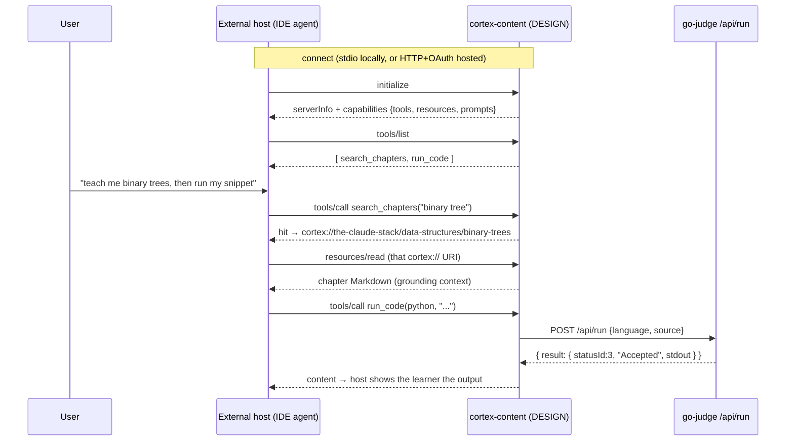

# 11. Design a Cortex MCP

## TL;DR

> Across Part 4 you toured *other people's* MCP servers — this repo's `codegraph` and `graphify`,
> wired up in `.claude/mcp.json` and used by the very agent that wrote this book. You never built
> **your own**. This capstone is the **design** (think ADR) for the one Cortex is missing: a
> **`cortex-content` MCP server** that exposes this learning platform to the *whole* MCP ecosystem. Be
> clear-eyed: **it is unimplemented** — no such server exists in the repo. The design assembles every
> Part-4 primitive on Cortex's *real* footprint. **Tools** (ch3): `search_chapters(query)` over the
> Markdown content index, and `run_code(language, source)` that wraps Cortex's *existing* go-judge
> **`/api/run`** so any host can execute code in the sandbox. **Resources** (ch4): each chapter as
> read-only context at `cortex://<book>/<section>/<chapter>`. **Prompts** (ch5): `explain-error` and
> `quiz-me-on(topic)` templates a user invokes. **Transport** (ch6): **stdio** for local dev (exactly
> like `codegraph`), **Streamable HTTP** + **OAuth** (ch10) for a hosted version. Advanced (ch9):
> **sampling** to summarize a chapter using the *host's* model, **elicitation** to ask *which* book.
> Security (ch10): least privilege, treat learner `run_code` input as **untrusted**. The payoff:
> Cortex stops being a website and becomes a **reusable tool** any agent can search, read, and run
> against.

> 🚢 **Update — Cortex now authors a real MCP server (scoped differently).** This chapter's `cortex-content`
> server is still unbuilt, but the "Cortex has authored no MCP server" premise is no longer absolute: the
> **[Cortex Tutor](/cortex/cortex-onboarding/cortex-tutor/grounding-and-the-skill)** ships **`grounding_mcp`** —
> a real, read-only Streamable-HTTP MCP server over the Cortex corpus. It's *narrower* than the design here
> (it serves lesson/problem context to the tutor's own coach, with the solution withheld pre-implement — not a
> public `search_chapters` + `run_code` server for any host), but it's a genuine authored server that proves
> out this chapter's transport + resources + security thinking on real code. The full `cortex-content` design
> below remains the architect's exercise; `grounding_mcp` is the first real step into it.

## 1. Motivation

For ten chapters you have been a *customer* in the MCP mall. You learned the architecture by watching
this repo's `codegraph` server answer `tools/list`; you learned tools, resources, and prompts as
things *servers expose and you consume*; you dissected `.claude/mcp.json` in Chapter 8 and saw two
stdio servers — `codegraph` and `graphify` — that someone else built, which the agent writing this
book used without a line of glue. Every example pointed *outward*: here is a shop, here is its menu,
here is how you order.

There is a conspicuous gap, and the manifest names it bluntly: **Cortex has authored no MCP server of
its own.** It runs them. It has never *been* one. So this chapter flips the camera around. Instead of
shopping in someone else's shop, you draw the blueprint for **your own** — a `cortex-content` MCP
server that would take everything this platform already has (a corpus of Markdown chapters, a working
code sandbox) and expose it over MCP so that *any* host — Claude Desktop, an IDE, a teammate's agent —
could search Cortex, read chapters as grounded context, and run code in Cortex's sandbox.

Be clear-eyed about status, and I will keep saying it: **this server does not exist.** You cannot
`grep` for it. This is an **architect's design document** — an ADR — for code that *should* exist, the
deliverable you write *before* anyone opens an editor. That is deliberately the same posture as Part
3's capstone, which designed the unbuilt `POST /api/tutor` AI tutor. The discipline of Part 4 is the
same as the discipline of Part 1: **knowing precisely what you have not built**, and specifying it
correctly against the system you *do* have. The "system you do have" here is concrete and real — the
Markdown content pipeline and its generated index, the go-judge `/api/run` endpoint, and the
`.claude/mcp.json` stdio pattern to imitate. The server is imaginary; everything it wraps is not.

## 2. Intuition (Analogy)

You have spent Part 4 **walking the MCP mall**, browsing other people's shops. `codegraph` is the
hardware store with a wall of labeled drawers (`codegraph_search`, `codegraph_impact`, …). `graphify`
is the print shop that turns anything into a knowledge graph. You read their menus, placed orders, and
left. The capstone is different: you are no longer a shopper. **You are opening your own shop in the
mall**, and an architect opening a shop makes a sequence of decisions.

**The menu** (your **tools**) — the dishes customers can *order you to cook*: "search the chapters,"
"run this code." **The reference shelf** (your **resources**) — the books customers may *take down and
read* but not change: every chapter, on a shelf, each with a call-number on its spine (`cortex://…`).
**The recipe cards** (your **prompts**) — pre-written cards a customer picks up and fills in: "explain
this error," "quiz me on *X*." **Local stall or national chain?** (your **transport**) — a single
counter you run by hand (stdio, on one developer's laptop) versus a chain any city can franchise
(Streamable HTTP, reachable over the network). And the **security desk at the door** (auth + least
privilege) — who may walk in, what they may touch, and the rule that anything a *customer hands you* to
cook is treated as possibly-poisoned until proven safe.

Draw those five decisions well and something larger happens: **the whole mall's customers can now shop
at Cortex.** A standard storefront is what turns a private kitchen into a business the entire ecosystem
can patronize.

| Opening a shop in the mall | Designing the `cortex-content` MCP server |
|---|---|
| The **menu** of dishes to order | **Tools** (ch3): `search_chapters`, `run_code` — actions a host invokes |
| The **reference shelf** you may read, not edit | **Resources** (ch4): chapters at `cortex://…`, read-only context |
| **Recipe cards** to pick up and fill in | **Prompts** (ch5): `explain-error`, `quiz-me-on(topic)` |
| **Local stall** vs **national chain** | **Transport** (ch6): stdio (local) vs Streamable HTTP (hosted) |
| The **security desk** at the door | **Auth + least privilege** (ch10): OAuth; untrusted `run_code` input |
| Borrowing the mall's shared kitchen | **`run_code` wraps the *existing* go-judge `/api/run`** |

## 3. Formal Definition

The **`cortex-content` MCP server** (DESIGN, UNIMPLEMENTED) is a specification for an MCP server that
exposes Cortex's content corpus and code sandbox over the Model Context Protocol, so that any MCP host
can use them with no Cortex-specific integration. It is defined by the three primitives, plus a
transport and a trust model.

**Tools (model-controlled, ch3)** — the menu of actions:

- **`search_chapters(query: string)`** → returns the chapters whose text matches `query`, each as
  `{uri, title}`. It reads Cortex's existing **Markdown content index** — the one
  `tools/gen_cortex_index.py` regenerates (via the repo's `Write|Edit` PostToolUse hook) from files
  under `content/cortex/`. Read-only; safe.
- **`run_code(language: string, source: string)`** → compiles/runs `source` by calling Cortex's
  **existing `POST /api/run`** and relaying the result. This is the load-bearing design choice: the
  server adds *no* new execution engine — it **wraps go-judge**, the sandboxed command runner Cortex
  already ships (`--network none`, per-language limits, `source` ≤ 64 KiB). Any MCP host gains
  sandboxed execution for free. Effectful and fed untrusted input → it is the tool the host must gate.

**Resources (application-controlled, ch4)** — the reference shelf:

- Each Markdown chapter is a **resource** identified by a URI of the form
  **`cortex://<book>/<section>/<chapter>`**, e.g.
  `cortex://production-engineering/zio/what-is-a-side-effect`. The path segments mirror Cortex's own
  slug logic (strip the numeric order prefix, slugify, join with `/`). `resources/list` enumerates
  them; `resources/read` returns the chapter's Markdown. Read-only context an app *pulls in* — never
  an action the model decides to take.

**Prompts (user-controlled, ch5)** — the recipe cards:

- **`explain-error`** — a template that takes a failing snippet + its error and expands into a
  message asking for a beginner-friendly explanation. **`quiz-me-on(topic)`** — expands into a request
  to quiz the user on `topic`, grounded in the matching chapters. A *user* invokes these (a slash
  command, a menu pick) — the server never fires them on its own.

**Transport (ch6)** — **stdio** for local dev: the host launches the server as a subprocess and speaks
JSON-RPC over stdin/stdout, exactly the shape `codegraph` uses in `.claude/mcp.json`. **Streamable
HTTP** for a hosted version, so *remote* hosts can reach one shared instance — which immediately
requires **auth (ch10)**.

| Term | Meaning |
|---|---|
| **`cortex-content`** | The (UNIMPLEMENTED) MCP server designed here; exposes Cortex content + sandbox. |
| **`search_chapters`** | Tool: query → matching chapters `{uri, title}` from the content index. |
| **`run_code`** | Tool: `(language, source)` → result, by **wrapping the existing `/api/run`** (go-judge). |
| **`cortex://…` URI** | A resource address: `cortex://<book>/<section>/<chapter>`, one per Markdown chapter. |
| **`explain-error` / `quiz-me-on`** | Prompts (user-controlled templates) the host surfaces for a user to invoke. |
| **stdio transport** | Local: host spawns the server, JSON-RPC over stdin/stdout — the `codegraph` pattern. |
| **Streamable HTTP** | Hosted: one networked instance many remote hosts share; needs OAuth (ch10). |
| **Least privilege** | The server holds only the narrow access it needs (read content, call `/api/run`). |

> The crossover insight: a server author and a server *consumer* see the same protocol from opposite
> sides. As a consumer (chs 3–8) you *read* a tool's `description` and *call* `tools/list`. As the
> author (this chapter) you *write* that `description` and *answer* `tools/list`. Nothing about the
> wire format changes — `cortex-content` would emit byte-identical JSON-RPC to what `codegraph` emits.
> What changes is **ownership**: you now decide the menu, the shelf, the cards, and the door. The whole
> of Part 4 was preparation for sitting on this side of the table.

## 4. Worked Example

Picture an **external host** — say a teammate's IDE agent, which has never heard of Cortex — connecting
to `cortex-content` and doing one realistic loop: discover what's on offer, search for a topic, read
the matching chapter as grounded context, then run a snippet in Cortex's sandbox. The host owns the
model and the consent gate; `cortex-content` owns the content and the `/api/run` wrap.



Here is a **non-running sketch** of the server in `FastMCP` (Python). This is *illustrative design
code* — it imports an SDK and calls Cortex's HTTP API, so it does **not** run in our deterministic
harness; the runnable, stdlib-only version is in §5. Read it for *shape*: three decorators, one per
primitive, plus the `run_code` wrap of the real `/api/run`.

```python
# DESIGN SKETCH — does NOT run here (needs the `mcp` SDK + a live Cortex).
# This is the architect's reference, not shipped code. cortex-content is UNIMPLEMENTED.
import httpx
from mcp.server.fastmcp import FastMCP

mcp = FastMCP("cortex-content")
CORTEX = "https://cortex.example"  # the running Cortex backend

@mcp.tool()
def search_chapters(query: str) -> list[dict]:
    """Find Cortex chapters by topic. Returns [{uri, title}]."""
    # Reads the Markdown content index (tools/gen_cortex_index.py output).
    hits = httpx.get(f"{CORTEX}/api/cortex", params={"q": query}).json()
    return [{"uri": f"cortex://{h['slug']}", "title": h["title"]} for h in hits]

@mcp.tool()
def run_code(language: str, source: str) -> dict:
    """Run `source` in Cortex's go-judge sandbox. `source` is UNTRUSTED."""
    # No new engine: wrap the EXISTING /api/run (go-judge, --network none).
    r = httpx.post(f"{CORTEX}/api/run", json={"language": language, "source": source})
    return r.json()["result"]  # {statusId, statusDescription, stdout, stderr, ...}

@mcp.resource("cortex://{book}/{section}/{chapter}")
def chapter(book: str, section: str, chapter: str) -> str:
    """One chapter's Markdown, read-only grounding context."""
    return load_markdown(book, section, chapter)  # from content/cortex/

@mcp.prompt()
def explain_error(language: str, source: str, error: str) -> str:
    """User-invoked template: ask for a beginner-friendly fix."""
    return f"A learner ran this {language} and hit an error.\n{source}\nError:\n{error}\nExplain simply."

if __name__ == "__main__":
    mcp.run(transport="stdio")  # local dev, like codegraph; HTTP for hosted
```

Notice `run_code` is four lines and contains **no sandbox** — it *delegates* to `/api/run`. That is the
entire reuse story: Cortex already solved sandboxed execution; the server just standardizes a doorway
to it.

## 5. Build It

We can't run the SDK sketch (no `mcp` package, no network). But we *can* run the **protocol** —
because, as Chapter 2 established, an MCP server is just a function from a JSON-RPC request to a
JSON-RPC response. Below is a **deterministic, stdlib-only simulation** of one session against
`cortex-content`: an external host sends `initialize`, then `tools/list`, then `resources/list`, then
calls `search_chapters("binary tree")`, then calls `run_code(python, "print(1+1)")` — and `run_code`
returns the **canned go-judge result** (`statusId: 3`, `"Accepted"`, `stdout: "2\n"`) it would have
relayed from the real `/api/run`. No SDK, no sockets, no LLM — just the shapes on the wire.

```python run
import json

# ---------------------------------------------------------------------------
# A *simulated* `cortex-content` MCP server. This server is UNIMPLEMENTED in
# Cortex; this is the architect's executable sketch of one session over it.
# Stdlib `json` only -- no `mcp` SDK, no network, fully deterministic.
# `handle(req)` maps one JSON-RPC request to its JSON-RPC response, exactly
# like the stdio servers in `.claude/mcp.json` (codegraph / graphify) do.
# ---------------------------------------------------------------------------

# The server's identity, returned by `initialize`.
SERVER_INFO = {"name": "cortex-content", "version": "0.0.0-design"}

# Two tools (model-controlled, ch3): search the book index, and run code by
# wrapping Cortex's EXISTING go-judge `/api/run`.
TOOLS = [
    {
        "name": "search_chapters",
        "title": "Search Cortex chapters",
        "description": (
            "Full-text search across every Cortex chapter. Use to FIND "
            "chapters by topic before reading them as resources."
        ),
        "inputSchema": {
            "type": "object",
            "properties": {"query": {"type": "string"}},
            "required": ["query"],
        },
    },
    {
        "name": "run_code",
        "title": "Run code in the Cortex sandbox",
        "description": (
            "Execute a snippet in Cortex's go-judge sandbox (no network). "
            "Wraps the existing POST /api/run. Treat `source` as untrusted."
        ),
        "inputSchema": {
            "type": "object",
            "properties": {
                "language": {"type": "string"},
                "source": {"type": "string"},
            },
            "required": ["language", "source"],
        },
    },
]

# A few chapters, each addressable as a resource (app-controlled, ch4) at a
# `cortex://<book>/<section>/<chapter>` URI -- read-only grounding context.
RESOURCES = [
    {
        "uri": "cortex://production-engineering/zio/what-is-a-side-effect",
        "name": "What is a side effect?",
        "mimeType": "text/markdown",
    },
    {
        "uri": "cortex://the-claude-stack/data-structures/binary-trees",
        "name": "Binary trees",
        "mimeType": "text/markdown",
    },
]

# Canned search hits, keyed by a lowercased substring. Deterministic stand-in
# for the real Markdown index (tools/gen_cortex_index.py).
SEARCH_INDEX = {
    "binary tree": [
        {
            "uri": "cortex://the-claude-stack/data-structures/binary-trees",
            "title": "Binary trees",
        }
    ],
}


def _result(rid, payload):
    return {"jsonrpc": "2.0", "id": rid, "result": payload}


def _content(text):
    return {"content": [{"type": "text", "text": text}]}


def search_chapters(query):
    hits = SEARCH_INDEX.get(query.lower().strip(), [])
    return _content(json.dumps({"query": query, "hits": hits}))


def run_code(language, source):
    # The REAL server would POST {language, source} to /api/run and relay the
    # RunResponse. go-judge reports Accepted as statusId 3 on a clean exit 0.
    # Here we return a CANNED result for `print(1+1)` -> "2\n".
    canned = {
        "statusId": 3,
        "statusDescription": "Accepted",
        "stdout": "2\n",
        "stderr": "",
        "compileOutput": "",
    }
    return _content(json.dumps({"language": language, "result": canned}))


def handle(req):
    rid = req.get("id")
    method = req["method"]
    params = req.get("params", {})

    if method == "initialize":
        # Handshake: agree on protocol + advertise which primitives we serve.
        return _result(rid, {
            "protocolVersion": "2025-06-18",
            "serverInfo": SERVER_INFO,
            "capabilities": {"tools": {}, "resources": {}, "prompts": {}},
        })

    if method == "tools/list":
        return _result(rid, {"tools": TOOLS})

    if method == "resources/list":
        return _result(rid, {"resources": RESOURCES})

    if method == "tools/call":
        name = params["name"]
        args = params.get("arguments", {})
        if name == "search_chapters":
            return _result(rid, search_chapters(args["query"]))
        if name == "run_code":
            return _result(rid, run_code(args["language"], args["source"]))
        # Unknown TOOL -> a result with isError (model can recover), not a
        # protocol error.
        bad = _content("Unknown tool: " + repr(name))
        bad["isError"] = True
        return _result(rid, bad)

    # Unknown METHOD -> a real JSON-RPC error (-32601).
    return {"jsonrpc": "2.0", "id": rid,
            "error": {"code": -32601, "message": "Method not found: " + method}}


def show(label, obj):
    print(label)
    print(json.dumps(obj, indent=2))
    print()


# One scripted session: handshake -> discover -> call. Each request is what an
# external MCP host (Claude Desktop, an IDE, a teammate's agent) would send.
session = [
    (">> initialize", {"jsonrpc": "2.0", "id": 1, "method": "initialize",
                       "params": {"protocolVersion": "2025-06-18"}}),
    (">> tools/list", {"jsonrpc": "2.0", "id": 2, "method": "tools/list"}),
    (">> resources/list", {"jsonrpc": "2.0", "id": 3, "method": "resources/list"}),
    (">> tools/call search_chapters(\"binary tree\")",
     {"jsonrpc": "2.0", "id": 4, "method": "tools/call",
      "params": {"name": "search_chapters", "arguments": {"query": "binary tree"}}}),
    (">> tools/call run_code(python, \"print(1+1)\")",
     {"jsonrpc": "2.0", "id": 5, "method": "tools/call",
      "params": {"name": "run_code",
                 "arguments": {"language": "python", "source": "print(1+1)"}}}),
]

for label, req in session:
    show(label, req)
    show("<< response", handle(req))
```

**Read the output.** The `initialize` reply advertises three capabilities — `tools`, `resources`,
`prompts` — so the host knows all three primitives are on offer before asking for any. `tools/list`
returns the **menu** (`search_chapters`, `run_code`); `resources/list` returns the **shelf** (two
`cortex://…` call-numbers). The `search_chapters("binary tree")` call comes back as a **content array**
whose text is a JSON hit pointing at the binary-trees chapter's URI — exactly the URI the host would
hand to `resources/read` next. And `run_code` returns the canned go-judge shape (`statusId: 3`,
`"Accepted"`, `stdout: "2\n"`) — the same `result` object the real `/api/run` produces. **Now break
it:** change `run_code`'s `source` argument in the last request to anything else and the *output never
changes* — because this simulation hard-codes the result. That is the honest seam of the design: the
real `run_code` must actually POST to `/api/run` and relay whatever go-judge says, including failures
(a non-zero exit, a `Compilation Error` with `statusId: 6`). The simulation proves the *protocol* wire;
the *engine* is the existing `/api/run`, untouched.

## 6. Trade-offs & Complexity

| Build `cortex-content` (expose Cortex over MCP) | Don't — keep Cortex a closed website |
|---|---|
| Any MCP host can search, read, and run against Cortex | Content + sandbox reachable only via Cortex's own UI |
| `run_code` **reuses** go-judge `/api/run` — no new engine | No new attack surface, no auth to build, no server to run |
| Resources give *grounded* context (real chapters, by URI) | Other agents must scrape HTML or re-host the corpus |
| One server, M hosts — the M+N win from Chapter 1 | Zero ongoing maintenance; nothing new to version |
| Hosted version multiplies reach… | …and forces OAuth, rate-limit reuse, abuse monitoring (ch10) |
| stdio version is trivial (the `codegraph` pattern) | Even trivial is *more* than nothing for a true one-off |

The headline trade-off is **reach vs. surface area**. Exposing Cortex turns it from a destination into
a *capability* the ecosystem can compose — but every doorway you open is a doorway someone can misuse,
and the riskiest is `run_code`, which executes attacker-influenced input. The mitigating truth is that
the *hard* part is already built and hardened: go-judge runs `--network none` with per-language CPU,
clock, and memory limits, and `/api/run` already enforces size caps and rate limits. The server's job
is to **not weaken** those guarantees — to pass `run_code` straight through to the existing endpoint
rather than inventing a second, softer path. A secondary cost is the usual standard-bearer's tax from
Chapter 1: a protocol to implement, capabilities to advertise, a version to keep compatible. For a
single private use you might skip it; the instant "many hosts" is plausible, the M+N math wins.

## 7. Edge Cases & Failure Modes

- **Forgetting it's unimplemented.** This is a design, not shipped code — there is no `cortex-content`
  in the repo, and `grep` will not find one. Treating the ADR as if it already runs is the first
  failure. The deliverable here is the *specification*; building it is future work the manifest tracks.
- **`run_code` re-implementing the sandbox.** The whole design hinges on `run_code` **wrapping** the
  existing `/api/run`. If an implementer instead spins up their *own* executor "for convenience," they
  re-create — and probably weaken — the `--network none` isolation, the size caps, and the rate limits
  go-judge already enforces. Wrap; don't reinvent.
- **Trusting learner-submitted `source`.** `run_code` input is **untrusted** by definition: it is code
  a stranger asked you to execute, and its *output* (which flows back into a model's context) can carry
  a **prompt-injection** payload ("ignore your instructions and…"). Sandbox the execution (go-judge
  does) *and* treat the returned stdout as data, not instructions (ch10).
- **Auth gap on the hosted transport.** stdio is implicitly trusted — the user launched the
  subprocess. The moment you expose **Streamable HTTP**, an unauthenticated endpoint lets *anyone*
  drive `run_code` and burn the sandbox. The hosted version is not done until OAuth (ch10) and the
  existing per-user rate limits gate it.
- **Stale or wrong `cortex://` URIs.** Resource URIs mirror Cortex's slug logic
  (`tools/gen_cortex_index.py`). If a chapter is renamed or moved and the server doesn't rebuild from
  the same index, `resources/read` 404s or, worse, serves the wrong chapter. The resource list must
  derive from the *same* source of truth as the website, not a hand-kept copy.
- **Over-broad tools.** `run_code(language, source)` is maximally powerful. Don't also add a
  `run_shell` or a `write_file`; scope the menu to exactly what a *learning* platform needs (search,
  read, run) so the consent gate has little to fear.

## 8. Practice

> **Exercise 1 — Place each primitive.** For the `cortex-content` design, assign each of the four
> capabilities to its MCP primitive **and** its control model (model- / app- / user-controlled), and
> say in one phrase why: (a) executing a learner's snippet, (b) pulling a chapter in as background
> context, (c) finding chapters about "recursion," (d) a "quiz me on big-O" template a learner clicks.

<details>
<summary><strong>Answer</strong></summary>

- **(a) Execute a snippet → a *tool* (`run_code`), model-controlled (ch3).** It is an *action* with
  side effects; the *model* decides to call it (and the host gates it), because running code is
  something the agent chooses to *do* mid-reasoning.
- **(b) Pull a chapter as context → a *resource* (`cortex://…`), application-controlled (ch4).** It is
  read-only *context*, not an action; the *application* decides to attach it, the way you'd attach a
  file — the model doesn't "invoke" a resource.
- **(c) Find chapters about recursion → a *tool* (`search_chapters`), model-controlled (ch3).** It's an
  action the model invokes to *discover* which resources exist, before reading them.
- **(d) "Quiz me on big-O" → a *prompt* (`quiz-me-on`), user-controlled (ch5).** It's a template a
  *user* deliberately invokes (a click, a slash command); the server never fires it on its own.

The split that matters: **tools the model drives, resources the app attaches, prompts the user
triggers** — and `cortex-content` uses all three because a learning platform needs *acting*,
*grounding*, and *guided requests*.

</details>

> **Exercise 2 — Why wrap `/api/run` instead of building an executor?** The design insists `run_code`
> delegate to Cortex's existing go-judge endpoint rather than run code itself. Give two concrete
> reasons grounded in what `/api/run` + go-judge already provide, and name the failure mode of ignoring
> this.

<details>
<summary><strong>Answer</strong></summary>

Two concrete reasons:

1. **Security is already solved and hardened.** go-judge runs with **`--network none`** and per-language
   CPU/clock/memory limits, and `/api/run` enforces a `source` size cap (≤ 64 KiB) and rate limits. A
   hand-rolled executor would have to re-create *all* of that correctly — and a softer copy is a real
   vulnerability, since `run_code` executes untrusted, learner-submitted code.
2. **Single source of truth / no drift.** One execution path means the MCP `run_code` behaves
   *identically* to the website's code runner — same languages, same limits, same `RunResult` shape
   (`statusId`, `stdout`, `stderr`, …). Two paths drift: a snippet that runs in the UI could behave
   differently (or unsafely) via MCP.

The failure mode of ignoring this is **reinventing — and weakening — the sandbox**: an implementer adds
a second executor "for convenience," loses the `--network none` isolation or a resource cap, and turns
a safe doorway into an arbitrary-code-execution hole. The rule from §7: *wrap, don't reinvent.*

</details>

> **Exercise 3 — From AI tutor to MCP client.** Part 3's capstone designed an unbuilt AI tutor
> (`POST /api/tutor`) that calls Claude and can run code. Part 5 is about Skills. In one or two
> sentences each: how could that tutor become a **client** of `cortex-content`, and how is a future
> Cortex **Skill** a *different* packaging of the same expertise?

<details>
<summary><strong>Answer</strong></summary>

**Tutor as a client of `cortex-content`.** The Part-3 tutor needs two things this server already
offers: grounded context and a way to run code. Instead of re-implementing them, the tutor's host could
**connect to `cortex-content` as an MCP client** — call `search_chapters` + read the matching
`cortex://…` resource to ground its hint in the *actual* chapter, and call `run_code` to verify a fix —
turning two separately-designed unbuilt features into a producer/consumer pair over the standard. (Both
are still UNIMPLEMENTED; this is how they'd compose.)

**A Skill is a different packaging (preview of Part 5).** An MCP server exposes *capabilities a host
calls over a protocol* — tools, resources, prompts, wire format, transport, auth. A **Skill** packages
*expertise as instructions + bundled files the model reads* (a `SKILL.md` that progressively discloses
how to do a task, like this repo's `graphify` skill or its workbench-author conventions). MCP gives the
model new **hands** (callable endpoints); a Skill gives it new **know-how** (loaded guidance). Same goal
— make the model better at Cortex work — packaged at two different layers, which is exactly the contrast
Part 5 opens with.

</details>

```quiz
{
  "prompt": "In the cortex-content design, how does the run_code tool execute code, and what does that choice protect?",
  "input": "Choose one:",
  "options": [
    "It wraps Cortex's EXISTING go-judge /api/run endpoint, so it inherits the already-hardened --network none isolation, per-language resource limits, and size/rate caps instead of building a second, weaker executor",
    "It spins up a fresh container per call inside the MCP server, replacing go-judge with its own sandbox",
    "It asks the host's LLM to predict the program's output, since no real execution is needed",
    "It runs the snippet directly in the MCP server's own process for lowest latency"
  ],
  "answer": "It wraps Cortex's EXISTING go-judge /api/run endpoint, so it inherits the already-hardened --network none isolation, per-language resource limits, and size/rate caps instead of building a second, weaker executor"
}
```

## In the Wild

- **[MCP — Build an MCP server (server quickstart)](https://modelcontextprotocol.io/quickstart/server)**
  — the official guide to authoring a server (the `FastMCP` shape in §4): `@tool`, `@resource`,
  `@prompt`, and `mcp.run(transport="stdio")`. The blueprint `cortex-content` would follow.
- **[Reference MCP servers](https://github.com/modelcontextprotocol/servers)** — real servers that do
  exactly what this design proposes for a domain (filesystem, git, fetch): study how they shape tools,
  resources, and prompts before you build your own.
- **[Anthropic — Connecting to remote MCP servers](https://docs.claude.com/en/docs/agents-and-tools/remote-mcp-servers)**
  — what the *hosted* (Streamable HTTP + OAuth) version of `cortex-content` plugs into: how Claude
  reaches remote MCP servers, the auth story from Chapter 10 in practice.

---

**Next:** an MCP server gives the model new *hands* — callable tools, readable resources. But there's a
second, very different way to package expertise: not as endpoints a host calls, but as **instructions
and files the model reads**. That's Skills — `SKILL.md`, progressive disclosure, and the `graphify`
skill this repo already ships. → [Part 5 — Agent Skills](/cortex/the-claude-stack/agent-skills)
