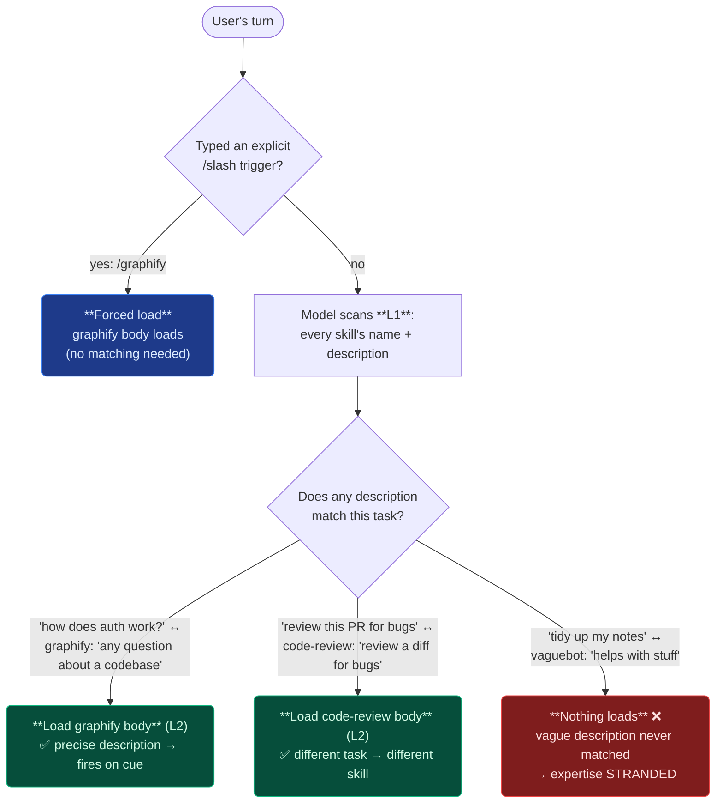

# 3. Triggers & discovery

## TL;DR

> Skills are **model-discovered**: the model always carries every skill's **`name` + `description`**
> (Level 1) in context, and at each turn it *decides* whether to load a skill's body by checking
> whether that description matches the task. So **the `description` is the trigger.** A good
> description says **what** the skill does *and* **when** to use it, with concrete cues — e.g.
> graphify's real description ends *"Use when user asks any question about a codebase… especially if
> `graphify-out/` exists."* That precision is the whole game: a **vague** description ("helps with
> graphs") never matches, so the expertise is **stranded**; an **over-broad** one matches everything,
> so the **bloat** you avoided comes back. There's also a second, deterministic path: a skill can
> declare an explicit **slash trigger** (`trigger: /graphify`), and a user typing `/graphify`
> **forces** it regardless of any match.

## 1. Motivation

You wrote a beautiful skill in Chapter 2 — a crisp `SKILL.md` body, bundled examples, the works. You
ship it. And it *never loads.* Not once. The agent keeps doing the task the dumb generalist way,
your expertise sitting on the shelf untouched. What went wrong?

Nothing in the body. The problem is one line above it: the **description**. Remember the mechanism
from Chapter 1 — at rest, the model sees only **Level 1**, the `name` + `description` of every skill.
The body (Level 2) is on the shelf; the model loads it **only when it decides the description matches
the current task**. That decision is made *entirely* from the description. The model never reads your
brilliant body to *decide* whether to read your brilliant body — that would defeat the whole
point. It reads the one-liner and judges.

So a description like `"helps with graphs"` is a catastrophe disguised as a sentence. *Which* graphs —
bar charts? social graphs? knowledge graphs? *When* — always? never? The model has no signal, so it
plays it safe and skips. Your skill is invisible. Flip it the other way and write `"use this for any
task"` and now it loads on *every* turn, dragging its whole body into every conversation — you've
re-created the fat-system-prompt bloat that skills exist to kill (Chapter 1, §5). The description is a
**trigger**, and like any trigger it can be too stiff (never fires) or too loose (fires constantly).
Getting it *exactly right* — fires precisely when the expertise is needed — is the single highest-
leverage thing you do when authoring a skill.

This repo gives us a model answer. The real `graphify` skill's description reads:

> *"any input (code, docs, papers, images, videos) to knowledge graph. Use when user asks any
> question about a codebase, documents, or project content - especially if `graphify-out/` exists,
> treat the question as a /graphify query."*

Read it as a trigger and it's almost a rulebook: it names the **inputs** (code, docs, papers…), the
**situations** ("any question about a codebase… or project content"), and even a **concrete environmental
cue** ("especially if `graphify-out/` exists"). The model doesn't have to guess — the description told
it exactly when to reach for this skill. That's the craft this chapter teaches.

## 2. Intuition (Analogy)

Picture a row of **emergency cabinets** on a wall, each behind glass with a label:
**"Break glass in case of ____."** The label is all anyone reads in the moment of need — nobody opens
the cabinet to find out what it's for. So the label *is* the trigger.

- A cabinet labeled **"In case of FIRE"** gets smashed open at exactly the right moment: there's a
  fire, the label matches, you grab the extinguisher. **Precise trigger → fires on cue.**
- A cabinet labeled **"In case of problems"** is useless. Is a paper cut a "problem"? A fire? A bad
  mood? Either people ignore it (it's too vague to trust) or they smash it for everything (and now
  it's empty when the fire comes). **Vague trigger → never fires, or fires for everything.**

A skill's `description` is that label, and the model is the person scanning the wall. It reads the
labels (L1), and the instant the task in front of it matches a label, it breaks the glass and pulls
that skill's body (L2). Write **"In case of FIRE"** — name the situation precisely — and your skill is
summoned exactly when it should be. Write **"helps with stuff"** and it's either ignored or yanked at
random.

There's a second way to open a cabinet, too: a **manual override key** that opens *this specific*
cabinet on demand, no label-matching involved. That's the explicit slash trigger — a user typing
`/graphify` reaches past the label-matching and forces the cabinet open. (Think also of a smart-home
voice assistant: tune the wake-word too narrow and it never wakes; too broad and it wakes at every
stray word — but you can always just press the button on the device.)

| | Precise description ("In case of FIRE") | Vague description ("In case of problems") | Explicit slash trigger (override key) |
|---|---|---|---|
| Who decides to load it | The **model**, by matching the task | The **model** — but it has no signal | The **user**, deliberately |
| When it fires | Exactly when the situation matches | Never, or for *everything* | The moment the user types it |
| Failure mode | Rare (only on truly ambiguous tasks) | Stranded expertise **or** constant bloat | None — it's a manual command |
| Who's in control | Model's judgment, guided by you | Left to chance | Fully the user |

## 3. Formal Definition

**Discovery** is the process by which a skill's body becomes loaded into the model's working context.
For Agent Skills there are **two discovery paths**:

1. **Model-match-on-description (the primary path).** The model holds **L1** — every skill's `name` +
   `description` — in context at all times. On each turn it evaluates the user's task against those
   descriptions and **autonomously decides** to load the body (**L2**) of any skill whose description
   matches. No tool call, no schema negotiation, no user action — the description is read as a
   **natural-language trigger** and the model self-selects. This is why **the `description` *is* the
   trigger**, and why it must state both **what** the skill does and **when** to use it.

2. **Explicit user invocation (the deterministic path).** A skill may declare an explicit
   **`trigger`** (a slash command, e.g. `trigger: /graphify`). When the user types that command, the
   skill is **forced** — its body loads regardless of whether the description would have matched. This
   gives the user a deterministic override on top of the model's judgment.

| Term | Meaning |
|---|---|
| **Description** | The skill's one-line frontmatter field. Always in context (L1). Doubles as the **trigger**: what + when. |
| **Trigger conditions** | The *situations* a good description names ("Use when…") so the model knows when to load the skill. |
| **Concrete cue** | A specific, checkable signal inside a description (e.g. "if `graphify-out/` exists") that sharpens the match. |
| **Model-discovered** | The model decides — from descriptions alone — which skills to load. The default path for skills. |
| **Explicit trigger (`trigger:`)** | A declared slash command (`/graphify`) the user types to **force** the skill, bypassing matching. |
| **Stranded expertise** | A correct skill that never loads because its description is too vague to ever match a task. |
| **Over-trigger** | A description so broad the skill loads on irrelevant turns, reintroducing context bloat. |

**How this differs from the other extension mechanisms.** Each of the four mechanisms in this stack is
*discovered* differently — and skills are unique in leaning on a natural-language description:

| Mechanism | How it's discovered |
|---|---|
| **Agent Skill** | **Model-matched on the `description`** (natural-language trigger), or forced via an explicit slash `trigger:`. |
| **MCP tool** | The host calls **`tools/list`** to enumerate tools; the model picks one by its **structured schema** (Part 4, ch3). |
| **Slash command** | An **explicit user entry point** — the user types it; no matching involved. |
| **Subagent** | **Invoked by the orchestrator** (the main agent decides to spawn it for a delegated task) (Part 6). |

The throughline: tools advertise a *schema*, slash commands are *typed*, subagents are *spawned* — but
a **skill advertises a sentence**, and that sentence has to do the entire job of getting the skill
noticed at the right moment.

## 4. Worked Example — the match-and-load flow

Watch a single turn flow through both discovery paths. The user asks a codebase question; the model
scans L1 descriptions, the graphify description matches, its body loads. A *different* task matches a
*different* skill. A task that *should* match a vaguely-described skill **doesn't** — expertise
stranded. And a `/graphify` invocation **forces** the load regardless.



The diagram makes the lesson visceral: **the green paths fired because a description named the
situation; the red path failed because a description named nothing.** Same model, same mechanism — the
*only* variable is the quality of the sentence. Here is that variable side by side:

```yaml
# GOOD — names WHAT it does and WHEN to use it, with a concrete cue.
# The model reads this and knows exactly when to break the glass.
name: graphify
description: >-
  any input (code, docs, papers, images, videos) to knowledge graph.
  Use when user asks any question about a codebase, documents, or project
  content - especially if graphify-out/ exists, treat the question as a
  /graphify query.
trigger: /graphify        # second path: user can FORCE it by typing /graphify

# VAGUE — names neither WHAT precisely nor WHEN. No trigger signal.
# The model has nothing to match on, so the body never loads. Expertise stranded.
name: graphify
description: helps with graphs
# (no trigger: → not even a manual override to save it)
```

Both skills have the *identical* 55 KB body of expertise behind them. The first one gets summoned the
instant you ask a codebase question; the second one is a ghost. **The description is the difference
between a skill that works and a skill that doesn't** — and it's *one line*.

## 5. Build It

Let's make the trigger mechanism executable. Below is a tiny **discovery matcher**: a registry of
skills (each with a keyword-bearing `description`), a `discover(task)` that scores every description
against the task by keyword overlap and loads the best match **above a threshold** (or nothing), and
an **explicit `/slash` override** that forces a skill regardless of score. Run it on real tasks and
watch which skill loads — and *why*.

```python run
import re

# A toy skill registry. The `desc` is the ONLY thing discovery sees (Level 1).
# Trigger keywords live INSIDE the description — exactly as in real skills.
SKILLS = {
    "graphify": {
        "trigger": "/graphify",
        "desc": "any input code docs papers to knowledge graph. use when "
                "user asks any question about how a codebase module or "
                "project content works especially if graphify-out exists",
    },
    "code-review": {
        "trigger": "/review",
        "desc": "review a diff or pull request for bugs security and "
                "correctness before you merge",
    },
    "pdf-fill": {
        "trigger": "/pdf",
        "desc": "fill in a pdf form file field by field with values",
    },
    # The cautionary tale: identical expertise, useless description.
    "vaguebot": {
        "trigger": None,
        "desc": "helps with stuff",          # names neither WHAT nor WHEN
    },
}

STOP = {"a", "the", "to", "for", "of", "and", "or", "with", "in", "if",
        "you", "use", "user", "asks", "any", "this", "by", "your", "on",
        "before", "into", "that", "it", "do", "i", "me", "my"}

def words(text):
    """Lowercase content words (drop punctuation + stop-words)."""
    toks = re.findall(r"[a-z0-9-]+", text.lower())
    return {t for t in toks if t not in STOP and len(t) > 1}

THRESHOLD = 2   # need at least this many overlapping content words to fire

def discover(task, forced=None):
    """Return (skill_name, reason). Mirrors how the model self-selects from L1.
    - forced: a typed /slash command → load that skill regardless of score.
    - otherwise: score each description vs the task; load the best ABOVE threshold."""
    if forced:                                          # path 2: explicit invocation
        for name, s in SKILLS.items():
            if s["trigger"] == forced:
                return name, f"FORCED by typing {forced} (no matching needed)"
        return None, f"no skill declares the trigger {forced}"

    task_words = words(task)                             # path 1: match on description
    scored = []
    for name, s in SKILLS.items():
        overlap = task_words & words(s["desc"])
        scored.append((len(overlap), name, overlap))
    scored.sort(reverse=True)                            # best score first; ties: name order
    best_score, best_name, hits = scored[0]
    if best_score >= THRESHOLD:
        return best_name, f"matched {sorted(hits)} (score {best_score} >= {THRESHOLD})"
    return None, (f"best was '{best_name}' score {best_score} < {THRESHOLD} "
                  f"-> NOTHING loads (expertise stranded)")

CASES = [
    ("model-match: codebase question", "How does the auth module work in this codebase?", None),
    ("model-match: a different skill",  "Please review this pull request for security bugs", None),
    ("vague desc strands expertise",    "Can you help me tidy up and organize my notes?",   None),
    ("explicit /graphify override",     "(any task at all)",                         "/graphify"),
]

print(f"{'CASE':<34} {'LOADS':<12} WHY")
print("-" * 96)
for label, task, forced in CASES:
    name, why = discover(task, forced)
    loaded = name if name else "(none)"
    print(f"{label:<34} {loaded:<12} {why}")
```

Run it and read the four lines. The codebase question loads **graphify** because the task shares
*codebase*, *question*-ish, *project* words with its description. "Review this pull request" loads
**code-review**, not graphify — *different task, different skill*, because the descriptions are
specific enough to discriminate. "Tidy up my notes" loads **nothing**: `vaguebot` could have helped,
but `"helps with stuff"` shares no content words with the task, so it scores 0 and stays on the
shelf — **expertise stranded by a bad description**, the exact failure this chapter warns about. And
`/graphify` loads graphify **unconditionally**, bypassing every score — the deterministic second path.

**Now break it.** Change `vaguebot`'s `desc` to a *good* trigger —
`"organize and clean up plain-text notes and markdown files"` — and re-run: the "tidy up my notes"
case now fires `vaguebot`. The expertise was never the problem; the *description* was. That one edit
is the difference between a stranded skill and a summoned one — which is the entire lesson of triggers.

## 6. Trade-offs & Complexity

| | Precise, scoped description | Vague description | Over-broad description | Explicit slash `trigger:` |
|---|---|---|---|---|
| **Loads when needed?** | Yes — fires on the matching task | **No** — never matches → stranded | Yes, but also when *not* needed | Only when the user types it |
| **Resting context cost** | Tiny (one line, L1) | Tiny, but useless | Tiny at rest — **but body loads constantly** | Tiny (one line) |
| **Who's in control** | Model's judgment, well-guided | Left to chance | Model over-fires | The **user**, deterministically |
| **Main risk** | Rare miss on a truly ambiguous task | Wasted skill | Re-creates fat-prompt bloat | User must know the command exists |
| **Authoring effort** | Think hard about *when* (the cues) | Zero thought (and it shows) | Zero thought (the other way) | One extra frontmatter line |

The economics are stark. The description costs the **same** few-dozen tokens (L1) no matter how good
it is — but a *precise* one buys you a body that loads **exactly when relevant**, while a *vague* one
buys you a body that **never** loads, and an *over-broad* one buys you a body that loads **always**
(the very bloat skills exist to prevent — Chapter 1). So the entire cost/benefit of a skill collapses
onto one line you control for free. The explicit `trigger:` is cheap insurance: it gives the user a
deterministic override, but it only helps people who *know the command exists*, so it complements —
never replaces — a good description.

## 7. Edge Cases & Failure Modes

- **Description too vague → never triggers (stranded).** `"helps with graphs"` gives the model no
  signal about *when*. The skill is invisible; the expertise is wasted. Always include an explicit
  **"Use when…"** that names concrete situations.
- **Description too broad → triggers on everything (bloat).** `"use this for any task"` loads the body
  on every turn, re-creating the fat-system-prompt cost skills exist to avoid (Chapter 1, §5). Scope
  the trigger to the situations that *actually* need the skill.
- **`what` without `when`.** Describing the *capability* ("converts inputs to a knowledge graph") but
  not the *trigger conditions* ("use when the user asks about a codebase") leaves the model unsure
  whether *this* turn qualifies. State both halves.
- **Vague or colliding `name`.** Names are part of L1 and aid discovery — `graphify` is specific and
  memorable; `helper` or `tool2` is not. Two skills with near-identical descriptions also collide, so
  the model can't tell which to load. Make names and descriptions **clear and specific**.
- **Over-reliance on the slash trigger.** Shipping a great body behind a `trigger: /x` but a weak
  *description* means the skill only ever fires when a user *remembers to type `/x`* — it never
  auto-loads. The slash path is a complement to a good description, not a substitute.
- **Trigger drift.** If a description still says "use for X" after the skill's body has been
  repurposed for Y, it fires on the wrong tasks (or misses the right ones). Update the description
  whenever the skill's job changes — the trigger must track the expertise.

## 8. Practice

> **Exercise 1 — Diagnose the silence.** A teammate ships a `migrate-db` skill with a perfect 40-line
> body, but it never loads — the agent keeps running migrations by hand. Its frontmatter reads
> `description: database stuff`. In terms of the discovery mechanism, explain *exactly* why the skill
> never loads, and rewrite the description so it reliably triggers.

<details>
<summary><strong>Answer</strong></summary>

**Why it never loads (§1, §3):** the model selects skills from **L1 — the `name` + `description`
only**. It never reads the 40-line body to *decide* whether to load the body; it judges from the
description alone. `"database stuff"` names a vague *topic*, not **what** the skill does or **when** to
use it — there are no trigger conditions and no concrete cues, so on a turn like "apply the new
migration to the users table" the description doesn't clearly match and the model skips it. The
expertise is **stranded**.

**A description that triggers (state what + when + a cue):**

```yaml
description: >-
  Safely run a database schema migration in this repo (creates a backup,
  applies the migration, verifies row counts). Use when the user asks to
  migrate the database, apply a new migration, or change the DB schema —
  especially when files under migrations/ have changed.
```

This names the **what** ("run a schema migration… backup… verify"), the **when** ("use when the user
asks to migrate… apply a new migration… change the schema"), and a **concrete cue** ("when files under
`migrations/` have changed"). Now the model has a clear trigger to match against — and you could add
`trigger: /migrate` so a user can force it too.

</details>

> **Exercise 2 — The two discovery paths.** Name the two ways a skill's body can come to be loaded,
> say *who* initiates each, and give the one situation where the second path saves you even though the
> first path *would* have worked.

<details>
<summary><strong>Answer</strong></summary>

The two paths (§3):

1. **Model-match-on-description (primary).** The **model** initiates it: it scans the L1 descriptions
   each turn and autonomously loads the body of any skill whose description matches the task. No user
   action required.
2. **Explicit user invocation (`trigger:`).** The **user** initiates it by typing the declared slash
   command (e.g. `/graphify`), which **forces** the skill regardless of whether the description would
   have matched.

**When the second path saves you even though the first would have worked:** when you want to
*guarantee* the skill runs on a borderline task and not leave it to the model's judgment — e.g. the
task is ambiguously phrased and might or might not cross the matching threshold, but you *know* you
want graphify. Typing `/graphify` removes the uncertainty: it's deterministic, so you don't gamble on
whether the description matched this particular phrasing. (It's also how you invoke a skill on a task
whose wording happens to share few words with the description.)

</details>

> **Exercise 3 — Too sharp, too dull, just right.** Here are three candidate descriptions for a skill
> that formats Scala code with `scalafmt`. For each, predict its failure mode (never fires / fires on
> everything / fires correctly), then pick the best one: (a) `"formatting"`; (b) `"always run this on
> every message before responding"`; (c) `"Format Scala source with scalafmt. Use when the user asks
> to format Scala / fix formatting, or before committing .scala changes."`

<details>
<summary><strong>Answer</strong></summary>

- **(a) `"formatting"` → never fires (stranded).** It names a vague topic with no *what* (format
  *what*? with which tool?) and no *when*. On "scalafmt my code" it shares little and likely won't
  match; the model skips it. Useless skill (§7, "too vague").
- **(b) `"always run this on every message…"` → fires on everything (bloat).** This is an over-broad
  trigger: it loads the body on *every* turn, dragging it into conversations that have nothing to do
  with Scala formatting — re-creating the fat-prompt cost skills exist to avoid (§6, §7, "too broad").
- **(c) → fires correctly. Best choice.** It names the **what** ("Format Scala source with scalafmt"),
  the **when** ("Use when the user asks to format Scala / fix formatting"), and a **concrete cue**
  ("before committing `.scala` changes"). It matches precisely the tasks that need it and stays quiet
  otherwise — the **"In case of FIRE"** of descriptions (§2).

The pattern: (a) is too dull to ever fire, (b) is so loose it fires constantly, (c) is the precise
trigger — **what + when + a cue**.

</details>

```quiz
{
  "prompt": "A skill has an excellent, detailed SKILL.md body but its description reads only \"helps with data.\" Why does the model rarely load it?",
  "input": "Choose one:",
  "options": [
    "The model selects skills from the name + description alone (Level 1); a vague description gives it no signal about WHEN to use the skill, so it doesn't match the task and the body never loads",
    "The body is too long, so the model refuses to load it",
    "Skills can only be loaded by typing an explicit slash command, never automatically",
    "The model reads every skill's full body each turn and picks the most detailed one"
  ],
  "answer": "The model selects skills from the name + description alone (Level 1); a vague description gives it no signal about WHEN to use the skill, so it doesn't match the task and the body never loads"
}
```

## In the Wild

- **[Claude Docs — Agent Skills](https://docs.claude.com/en/docs/agents-and-tools/agent-skills)** — the
  authoritative guide to the `SKILL.md` format and how the `description` drives discovery: write it to
  say *what the skill does* and *when to use it*.
- **[Anthropic — Introducing Agent Skills](https://www.anthropic.com/news/skills)** — the announcement
  framing skills as **model-invoked** expertise: the model decides which skill to use, which is exactly
  why the description must carry the trigger.
- **[The real `graphify` skill + this repo's `/graphify` wiring](https://github.com/ani2fun/cortex)** —
  graphify's installed `description` ("Use when user asks any question about a codebase… especially if
  `graphify-out/` exists") is a model trigger; the root `CLAUDE.md` *also* wires `/graphify` as an
  explicit user trigger. Both discovery paths, in one shipping skill.

---

**Next:** a description gets the *body* loaded — but the body's real power is the scripts and reference
files it can pull in on demand. What can a skill bundle, and how does it reach for those resources? →
[4. Bundled resources & scripts](/cortex/the-claude-stack/agent-skills/bundled-resources-and-scripts)
