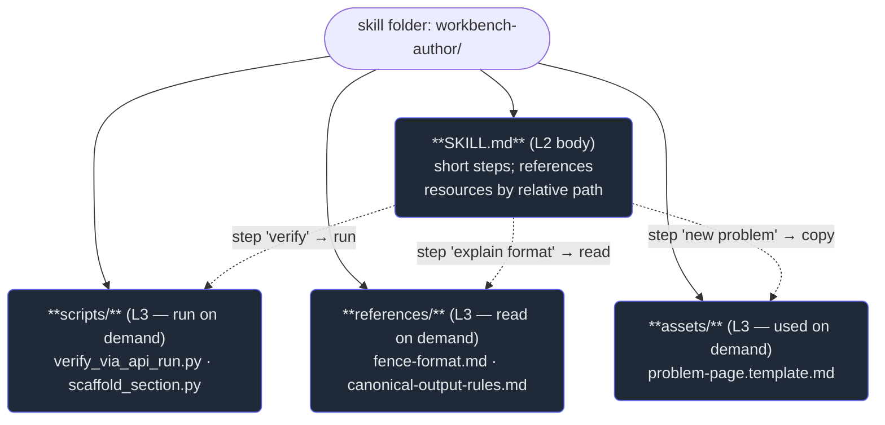

# 4. Bundled resources & scripts

## TL;DR

> A skill is a *folder*, and `SKILL.md` is only its front door. The folder can also carry three kinds
> of **bundled resources**: **reference documents** (extra detail the body points to), **templates &
> assets** (boilerplate files, images), and **executable scripts** (a Python or shell helper the agent
> *runs*). These are **Level 3** of progressive disclosure: the body (L2) names each one by **relative
> path** — `"see references/api.md"`, `"run scripts/validate.py"` — and it loads or executes **only
> when that step is reached**. The payoff is twofold. The body stays **lean** (it delegates detail
> instead of inlining it), and — crucially — a skill can ship **real code the agent executes** rather
> than a fiddly procedure the model re-derives in tokens every time. A bundled script buys you
> **determinism, reliability, and token savings** all at once.

## 1. Motivation

Chapter 1 sold you the headline: a skill keeps a cheap *description* always in context and reveals an
expensive *body* on demand. But stop and look at what a body has to contain if it's the *only* level
below the description. Consider this repo's real `workbench-author` know-how (Chapter 6): the precise,
byte-exact procedure for verifying a code exercise — write the candidate output to a temp file, POST it
to `/api/run` against the `go-judge` sandbox, diff the bytes, fail on any mismatch. That's not vibes;
it's an *exact* recipe with no room for improvisation.

You have two bad ways to put that in a skill, and they mirror Chapter 1's dilemma one level down.
**Inline the whole procedure as prose in the body.** Now every time the agent runs that step it
*re-derives* the exact curl invocation, the diff logic, the exit-code handling — from a paragraph of
English — and it might get a flag wrong, or format the request body slightly differently, on any given
run. It's also a wall of text bloating the body (L2). **Or leave it vague** — "verify the output
matches" — and the agent improvises an approach that's subtly wrong, which for a *verification* step is
the worst possible outcome.

There's a third option, and it's the one any seasoned engineer reaches for: **don't describe the fiddly
procedure — ship it as a script and tell the agent to run it.** Bundle `scripts/verify_via_api_run.py`
in the skill folder; the body just says *"run `scripts/verify_via_api_run.py`"*. Now the exact logic is
**code that executes the same way every time**, the body shrinks to one line, and you spend a handful
of tokens invoking it instead of hundreds re-deriving it. A skill, it turns out, can carry real
*software* — not just instructions.

## 2. Intuition (Analogy)

Think of an **IKEA flat-pack**. The instruction sheet is famously *short* — a few pictograms per step —
and that's deliberate. It doesn't print the dimensions of every dowel or re-explain how a cam lock
works. Instead it **points**: step 4 shows a little bag labeled *"H"* and the one funny Allen key, and
you only tear open bag H and pick up that tool **when you reach step 4**. The thin instruction sheet is
the **SKILL.md body**; the bagged parts and the special tool are the **bundled resources** — sitting in
the box, unopened, until a step calls for them.

Or picture a **field medic's kit**. The laminated manual says *"for a suspected fracture, use the splint
in pocket C."* The manual stays short precisely because it **defers**: it doesn't reprint the splint's
spec sheet, and the medic doesn't read that spec until a fracture actually presents. Pocket C — and the
detailed care card tucked inside it — is **Level 3**: referenced by location, opened on demand.

The deep point both analogies share: **the instructions are short *because* the detail lives elsewhere
and is fetched just-in-time.** A flat-pack sheet that inlined every part's full spec would be a
phone-book nobody reads. A skill body that inlines every reference doc and re-derives every procedure is
the same mistake — and it gives up the one thing a script buys you that a paragraph can't: *doing the
exact same correct thing every single time.*

| | Body inlines everything (no L3) | Bundled resources (L3, on demand) |
|---|---|---|
| Body length | Bloated — every detail + procedure inline | **Lean — names resources by relative path** |
| A fiddly exact procedure | Re-derived from prose each run (may drift) | **Runs a script — deterministic, identical each run** |
| A rarely-needed reference table | Always in the body, always paid for | **Loaded only on the step that needs it** |
| Can ship actual code? | No — only words | **Yes — executable scripts the agent runs** |
| Token cost of an unused detail | Paid every time the body loads | **Zero until that step is reached** |

## 3. Formal Definition

A **skill** is a directory; **`SKILL.md`** is its only required file. Beyond it, the directory may bundle
**resources** — any additional files the body references. They fall into three kinds:

1. **Reference documents** — extra detail (e.g. `references/api.md`, a long format spec, a lookup table)
   that the body points to and the agent **reads on demand** when a step needs that depth.
2. **Templates & assets** — boilerplate or binary files (a starter config, an HTML skeleton, an image,
   a font) the agent **copies or uses** as raw material.
3. **Executable scripts** — runnable helpers (e.g. `scripts/validate.py`, a shell script) the agent
   **runs** rather than re-deriving the logic in tokens.

These are **Level 3 (L3)** of progressive disclosure. The rule that defines them: the body (L2)
references each resource **by relative path**, and the resource is **loaded (read) or executed (run)
only when the step that names it is actually reached** — never merely because the body loaded.

| Term | Meaning |
|---|---|
| **Bundled resource** | Any file in the skill folder besides `SKILL.md` that the body can reference |
| **Reference document** | An L3 file the agent **reads** for extra detail (`references/…`) |
| **Template / asset** | An L3 boilerplate or binary file the agent **uses** as raw material |
| **Executable script** | An L3 file the agent **runs** (`scripts/…`) — the skill shipping real *code* |
| **Relative path** | How the body names a resource (`scripts/validate.py`), resolved against the skill dir |
| **On-demand load/run** | A resource is loaded or executed only when its step is reached, not at body-load time |
| **L3** | Level 3 of progressive disclosure — bundled resources, loaded/run just-in-time |

> The line to remember: **L2 is what the agent *reads to decide what to do*; L3 is what it *opens or
> runs to actually do it* — and L3 can be code, not just text.** A bundled script is the difference
> between *telling* the model a fiddly procedure and *handing it a tool* that performs that procedure
> identically every time.

## 4. Worked Example — a `workbench-author` skill's folder

Here's the shape of a real skill that carries all three kinds of L3 resource. The body is short; the
detail and the exact procedures live in bundled files it references by relative path.



On disk it's just a folder of files — nothing magic, which is exactly the point:

```text
workbench-author/
├── SKILL.md                         # L2: the body — short, names the resources below
├── references/                      # L3 docs — READ only when a step needs the detail
│   ├── fence-format.md              #   the exact testcases/quiz/solution fence rules
│   └── canonical-output-rules.md    #   py↔java byte-parity rules
├── scripts/                         # L3 scripts — RUN, not re-derived in prose
│   ├── verify_via_api_run.py        #   the proven /api/run byte-verification step
│   └── scaffold_section.py          #   stamp out a section's directory structure
└── assets/                          # L3 templates/assets — USED as raw material
    └── problem-page.template.md     #   boilerplate for a new problem page
```

The body never inlines the `/api/run` curl-and-diff dance or the full fence grammar. It says, in
effect: *"To verify an exercise, run `scripts/verify_via_api_run.py`. For the exact fence rules, see
`references/fence-format.md`. To add a problem, copy `assets/problem-page.template.md`."* When the agent
is merely *scaffolding* a section, it runs `scripts/scaffold_section.py` and **never opens** the
verification script or the format doc — those stay on the shelf. When it's *verifying*, it runs the
proven verifier and gets **identical, correct behavior every time**, instead of re-deriving a
byte-diff from a paragraph. That's L3: lean body, real code, loaded just-in-time.

## 5. Build It

Let's make L3's on-demand behavior concrete — including the headline that a bundled resource can be an
**executable script (real code)**, not just a doc. We model a tiny skill whose body is a list of named
steps; one step **runs** a bundled `scripts/validate.py` (stood in for by an actual deterministic
function — because a bundled script *is* code), and another step only **reads** a bundled
`references/format.md` (a string). `run_skill(task)` loads or runs **only** the L3 resources the task's
steps name, and logs exactly what it touched — so you can see one task run the script while never
opening the doc, and another do the reverse.

```python run
# Model Level 3 of progressive disclosure: a skill's BODY (L2) names
# bundled resources by relative path, and each is loaded/run ONLY when a
# task's steps require it. We model two L3 kinds:
#   - an EXECUTABLE SCRIPT  (scripts/validate.py) the agent RUNS
#   - a REFERENCE DOC       (references/format.md) the agent merely READS
# A bundled script can carry real, deterministic CODE -- so we stand in
# for scripts/validate.py with an actual local function, not prose.

# ---- The bundled SCRIPT (Level 3): exact, deterministic logic. ----
# In a real skill this lives at scripts/validate.py and the agent shells
# out to it; here it is a Python function so this demo runs end to end.
def bundled_validate_py(record):
    """Stand-in for scripts/validate.py. Deterministic: same input ->
    same verdict, every time. This is WHY you bundle a script instead of
    asking the model to re-derive the rule in prose each run."""
    problems = []
    if "id" not in record:
        problems.append("missing required field 'id'")
    if record.get("score", 0) < 0:
        problems.append("'score' must be >= 0")
    return ("PASS", []) if not problems else ("FAIL", problems)

# ---- The bundled REFERENCE DOC (Level 3): text loaded on demand. ----
# In a real skill this lives at references/format.md.
REFERENCES_FORMAT_MD = (
    "Record format: an 'id' (string) and a non-negative integer 'score'."
)

# ---- The skill itself. The BODY is a short list of named steps (L2). ----
# Each step declares which L3 resource it needs, BY RELATIVE PATH -- the
# body stays lean and points outward; nothing here loads until used.
SKILL_BODY_STEPS = {
    "validate": {"needs": "scripts/validate.py",   "kind": "run"},
    "explain":  {"needs": "references/format.md",  "kind": "read"},
}

# The two L3 resources the body can reach, keyed by their relative path.
L3_RESOURCES = {
    "scripts/validate.py":  bundled_validate_py,
    "references/format.md": REFERENCES_FORMAT_MD,
}


def run_skill(task_name, steps, record):
    """Execute a task = an ordered subset of the skill's body steps.
    Loads/runs ONLY the L3 resources those steps name. Returns a log of
    exactly which resources were touched, and how."""
    touched = []        # which L3 paths this task actually pulled in
    result = None
    for step in steps:
        spec = SKILL_BODY_STEPS[step]
        path = spec["needs"]
        resource = L3_RESOURCES[path]          # <-- L3 loads HERE, on demand
        if spec["kind"] == "run":
            verdict, problems = resource(record)   # RUN the bundled script
            touched.append((path, "ran"))
            result = (verdict, problems)
        else:  # "read"
            _ = resource                            # READ the bundled doc
            touched.append((path, "read"))
    return touched, result


def report(task_name, steps, record):
    touched, result = run_skill(task_name, steps, record)
    print(f"TASK: {task_name}")
    print(f"  body steps requested : {steps}")
    if touched:
        for path, how in touched:
            print(f"  L3 loaded            : {path}  ({how})")
    else:
        print("  L3 loaded            : (none -- no step needed a resource)")
    # What L3 stayed on the shelf for this task?
    used_paths = {p for p, _ in touched}
    idle = [p for p in L3_RESOURCES if p not in used_paths]
    print(f"  L3 NOT loaded        : {idle if idle else '(all were used)'}")
    if result is not None:
        verdict, problems = result
        detail = "" if not problems else f"  -> {problems}"
        print(f"  result               : {verdict}{detail}")
    print()


good_record = {"id": "rec-1", "score": 42}
bad_record  = {"score": -5}   # no 'id', negative 'score'

# --- Task A: only the "validate" step. RUNS scripts/validate.py.
#     It never touches references/format.md.
report("A: validate a good record", ["validate"], good_record)

# --- Task B: only the "explain" step. READS references/format.md.
#     It never runs (or even loads) scripts/validate.py.
report("B: explain the format", ["explain"], good_record)

# --- Task C: both steps, on a bad record -- the bundled SCRIPT catches
#     the exact problems deterministically, no model re-derivation.
report("C: validate then explain (bad record)", ["validate", "explain"], bad_record)

# --- The asymmetry, stated. ---
print("WHY THIS MATTERS")
print("  * Each L3 resource loads ONLY when a step names it (by relative path).")
print("  * Task A ran the script but never opened the doc; Task B did the reverse.")
print("  * The script is REAL CODE: deterministic + reliable + cheap vs prose.")
```

Read the output and the lesson is right there. **Task A** runs `scripts/validate.py` and reports
`scripts/validate.py (ran)` while `references/format.md` shows up under **L3 NOT loaded** — the doc was
never opened. **Task B** is the mirror image: it reads the doc, and the *script never loads at all*.
**Task C** runs the bundled script against a broken record and gets back the *exact* problems —
`missing required field 'id'`, `'score' must be >= 0` — deterministically, because that logic is **code
that executes**, not a paragraph the model interprets afresh. Now imagine inlining Task C's checks as
English in the body: every run, the model would re-read the rule and *maybe* apply it the same way. The
script removes the "maybe." That's the whole case for L3 scripts: lean body, just-in-time loading, and
real code where determinism matters.

## 6. Trade-offs & Complexity

| Choice | Body size at rest | Reliability of a fiddly step | Token cost of detail | When it shines |
|---|---|---|---|---|
| **Inline everything in the body** | Large — every detail + procedure | Lower — exact procedures re-derived from prose each run | Paid on every body load | Tiny skills with no exact procedure or deep reference |
| **Bundle reference docs (L3)** | Lean — body points to `references/…` | N/A (it's reference, not procedure) | Zero until that step reads it | Long specs, lookup tables, rarely-needed depth |
| **Bundle a script (L3)** | Lean — body says "run `scripts/…`" | **Highest — identical execution every run** | A few tokens to invoke vs many to re-derive | Exact, fiddly, repeatable procedures (parse, transform, verify) |
| **Bundle templates/assets (L3)** | Lean — body says "copy `assets/…`" | High — boilerplate is consistent, not retyped | Zero until that step uses it | Boilerplate files, images, starter configs |

The complexity you take on with L3 is **indirection and packaging**: the resource has to actually exist
at the relative path, ship with the skill, and (for scripts) run in the agent's environment. In return
you get a body that scales (Chapter 1's resting-cost argument, one level down) and, for scripts, the
thing prose can never give you — **determinism**. The rule of thumb: if a step is *reference detail*,
bundle a **doc**; if it's an *exact, repeatable procedure*, bundle a **script**; if it's *boilerplate*,
bundle a **template/asset**; and if it's neither deep nor exact, just leave it inline in the body.

## 7. Edge Cases & Failure Modes

- **Body inlines what should be bundled.** Pasting a 200-line format spec or a fiddly procedure straight
  into `SKILL.md` defeats the purpose: the body bloats (you pay for the detail on every load) and an
  exact procedure becomes prose the model re-derives. Move it to `references/` or `scripts/`.
- **Broken relative path.** The body says `run scripts/validate.py` but the file is at `bin/validate.py`
  (or wasn't shipped). The reference dangles, the step fails, and the skill silently misbehaves. The
  body and the folder must agree on the path.
- **Script that doesn't run in the agent's environment.** A bundled script that needs a library, network
  access, or a binary the sandbox lacks won't execute — and an L3 *script* is only valuable if the agent
  can actually run it. Keep bundled scripts self-contained and environment-appropriate.
- **Should've stayed inline.** Bundling a one-line note as `references/note.md` is over-engineering: now
  there's an extra file and an indirection for content that cost nothing inline. L3 is for *deep* detail
  or *exact* procedures, not every sentence.
- **Stale bundled resource.** A reference doc or script that drifts out of sync with reality is worse
  than none — the agent confidently reads a wrong table or runs an outdated verifier. Bundled resources
  are code and need maintenance like any other (Chapter 7).
- **Non-determinism leaks back in.** Bundling a "script" that itself calls a model, or depends on
  wall-clock time or randomness, throws away the determinism you bundled it *for*. The win comes from the
  script being *deterministic*; keep it that way.

## 8. Practice

> **Exercise 1 — Three kinds, three jobs.** A `pdf` skill needs three things at L3: (a) the full table
> of every PDF form-field type and how to fill each, (b) a `fill_form` helper that takes a field map and
> writes the filled PDF, (c) a blank cover-sheet PDF to stamp onto outputs. For each, say which **kind**
> of bundled resource it is (reference doc / executable script / template-or-asset) and how the body
> would reference it.

<details>
<summary><strong>Answer</strong></summary>

Map each to the three kinds from §3 — and note the body always references by **relative path**:

- **(a) Full table of field types → reference document.** It's *detail the agent reads on demand*, not a
  procedure and not boilerplate. Body: *"for every field type and how to fill it, see
  `references/field-types.md`."* Loaded only when the agent hits an unfamiliar field.
- **(b) `fill_form` helper → executable script.** It *performs an exact, repeatable operation* (map →
  filled PDF) — the determinism-and-reliability case for shipping code. Body: *"run
  `scripts/fill_form.py`."* This is the skill carrying real code, not words.
- **(c) Blank cover-sheet PDF → template/asset.** It's *raw material used as-is* (a binary file). Body:
  *"stamp `assets/cover-sheet.pdf`."* Used only when a cover sheet is requested.

The discriminator: detail-to-read → **doc**; procedure-to-run → **script**; material-to-use → **asset**.

</details>

> **Exercise 2 — Why a script, not prose?** Your skill needs to verify that a generated code exercise
> produces byte-identical output across two languages. A colleague says "just write the verification
> steps in the SKILL.md body — describe the diff and the exit-code check." Give two concrete reasons a
> *bundled script* (`scripts/verify.py`) beats prose here, grounded in this chapter.

<details>
<summary><strong>Answer</strong></summary>

Any two of the three benefits named in §1/§5/§6:

- **Determinism / reliability.** A byte-diff is an *exact* procedure. As a script it executes the same
  way every run; as prose, the model re-derives the diff and exit-code handling each time and can drift —
  catastrophic for a *verification* step whose entire job is to be exact (§7's "should've been a
  script").
- **Token savings.** The body shrinks to one line (*"run `scripts/verify.py`"*), costing a handful of
  tokens to invoke, versus a paragraph of procedure re-read and re-derived on every run (§6's cost
  column).
- **The skill ships real code.** Verification *logic* belongs in code, not English; bundling it means the
  skill carries software that *does* the check, not instructions hoping the model does it right (§3's
  headline that L3 can be code, not just text).

The throughline: an exact, repeatable procedure is more reliable and cheaper as a script the agent
*runs* than as words it re-interprets — which is exactly when §6 says "bundle a script."

</details>

> **Exercise 3 — Which loads when?** Using the §5 model: a task whose steps are `["explain"]` runs. List
> exactly which L3 resources load (and whether each is *read* or *run*), which stay on the shelf, and
> state the principle in one sentence.

<details>
<summary><strong>Answer</strong></summary>

The `"explain"` step declares `needs: references/format.md, kind: read` (§5's `SKILL_BODY_STEPS`).

- **Loads:** `references/format.md` — **read** (the agent opens the doc).
- **Stays on the shelf (NOT loaded):** `scripts/validate.py` — the bundled script is *never even loaded*,
  let alone run, because no step in this task names it. (This is exactly Task B's output: `L3 NOT loaded
  : ['scripts/validate.py']`.)

**Principle:** an L3 resource is loaded or executed **only when a step that names it (by relative path)
is actually reached** — so a task touches just the subset of the skill's resources its steps require,
and everything else costs nothing.

</details>

```quiz
{
  "prompt": "Why would you bundle an *executable script* in a skill (e.g. scripts/validate.py) instead of writing the same procedure as prose in the SKILL.md body?",
  "input": "Choose the best answer:",
  "options": [
    "A script runs the exact same logic deterministically every time and costs few tokens to invoke, whereas prose makes the model re-derive a fiddly procedure each run (less reliable, more tokens) — so a skill can ship real code, not just instructions",
    "Scripts are always loaded into context before the body, so they make the skill respond faster on every turn",
    "Markdown bodies cannot contain step-by-step instructions, so any procedure must be a script",
    "Bundling a script encrypts the skill so other agents cannot read its logic"
  ],
  "answer": "A script runs the exact same logic deterministically every time and costs few tokens to invoke, whereas prose makes the model re-derive a fiddly procedure each run (less reliable, more tokens) — so a skill can ship real code, not just instructions"
}
```

## Your Turn

Before you move on, check your understanding with the coach — explain the idea, apply it, weigh the trade-offs, then defend your reasoning.

<div class="concept-coach"></div>

## In the Wild

- **[Claude Docs — Agent Skills](https://docs.claude.com/en/docs/agents-and-tools/agent-skills)** — the
  authoritative guide to the `SKILL.md` format and how a skill bundles reference files and executable
  scripts loaded under progressive disclosure. The primary source for L3.
- **[Anthropic Skills on GitHub](https://github.com/anthropics/skills)** — Anthropic's open document
  skills (`pdf`, `docx`, `xlsx`, `pptx`). Open any one and you'll find a short `SKILL.md` body beside a
  `scripts/` directory of helper code the agent *runs* to manipulate the file — bundled scripts in the
  wild.
- **[The real `graphify` skill](https://github.com/ani2fun/cortex)** — this repo's installed skill
  (`~/.claude/skills/graphify/SKILL.md`): its body references operations and commands rather than
  inlining every detail, the same "point outward, load on demand" discipline at the heart of L3.

---

**Next:** you now have all three levels and the full anatomy of a skill — so when should you reach for a
skill at all, versus an MCP server or a subagent? They overlap, and choosing wrong is a common mistake. →
[5. Skills vs MCP vs subagents](/cortex/the-claude-stack/agent-skills/skills-vs-mcp-vs-subagents)
