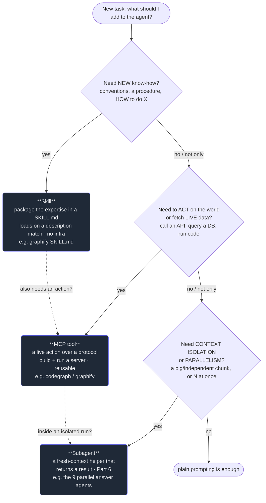

# 5. Skills vs MCP vs subagents

## TL;DR

> There are **three ways to extend an agent**, and they answer three *different* questions. A
> **Skill** adds **knowledge** — packaged expertise/conventions/procedure in a `SKILL.md`, loaded on a
> description match, **no infrastructure** ("HOW to do X"). An **MCP server** (Part 4) adds
> **capability** — live **tools/resources** over a protocol so the agent can **act on the world or
> fetch fresh data** ("DO X / GET live data"); you **build and run a server**. A **subagent** (Part 6)
> adds **isolation** — a **fresh-context helper** that does a sub-task and hands back a result, for
> **context isolation or parallelism** ("offload a big/independent chunk, or run N at once"). The
> trap is treating them as rivals. They **compose**: a subagent can load a skill that calls an MCP
> tool. So you don't ask "which one is best" — you ask **"what does this task PRIMARILY need?"**:
> *knowledge → skill · action/live-data → tool/MCP · isolation/parallelism → subagent.* This repo runs
> **all three** — the `graphify` skill, the `codegraph`/`graphify` MCP servers, and 9 parallel
> subagents that added answer blocks to 63 chapters.

## 1. Motivation

By now you've met all three mechanisms separately, and each one looked, in its own chapter, like *the*
way to make an agent more capable. That's the problem. When you sit down to a real task — "make the
agent good at authoring our quiz exercises," "let it look up a stock price," "have it review forty
files" — you face a fork the individual chapters never made you confront: **which mechanism do I
reach for?** Pick wrong and you don't just do extra work; you build the *wrong kind* of thing and it
*can't do the job*.

The failures are specific and unforgiving. Package a live **action** as a **skill** and you've handed
the model a beautiful page of instructions on *how* to call the stock API — with no way to actually
call it; the lookup never happens. Solve a pure **knowledge** gap by standing up an **MCP server** and
you've written, deployed, and now have to *operate* a whole service to deliver what a Markdown file
would have delivered for free. Try to **isolate** a huge forty-file review by writing a **skill** and
the review still runs in *your* context window, filling it exactly as if the skill weren't there.
Same effort, wrong tool, broken result.

So this is the **decision-framework** chapter — and it's a likely CCA-exam favorite, because the exam
cares less about any one mechanism's syntax than about whether you can *choose* correctly under
pressure. The good news: the choice reduces to a single question asked well. Name the task's
**primary need**, and the mechanism falls out. The rest of this chapter makes that question crisp,
memorable, and grounded in three real things this repo already ships.

## 2. Intuition (Analogy)

You're **building a team**, and a new hire shows up on Monday. To make them effective you give them
**three different kinds of things, for three different reasons** — and you'd never confuse one for
another:

- **The SOP binder** — the company's playbook: how we write a ticket, our code-review checklist, the
  house style. This is **knowledge**. It doesn't *do* anything; it tells the hire **how** to do
  things. → A **Skill**. (In this repo: the `graphify` `SKILL.md` — packaged know-how, sitting on the
  shelf until a task matches its description.)
- **Access badges and equipment** — a door key, a database login, a company credit card, the build
  server. This is **capability**: it lets the hire *act on the world* and *fetch things that change*.
  A binder can't open a locked door; a badge can. → An **MCP tool**. (In this repo: the `codegraph`
  and `graphify` **MCP servers** — the agent's live tools for querying the code graph and building
  knowledge graphs.)
- **Delegating a whole sub-project to a contractor** — "take this self-contained chunk, work on it in
  your *own* office, and hand me back the finished result." You do this for **isolation** (their mess
  doesn't clutter your desk) and **parallelism** (you can hire ten and run them at once). → A
  **Subagent**. (In this repo: the **9 parallel subagents** that each took a slice of 63 chapters,
  added answer blocks, and reported back — without polluting the main context.)

The punchline of the analogy is the punchline of the chapter: you give *one person* a binder **and** a
badge **and** a contractor, for *different reasons*. They aren't competitors; they're **complementary
moves you stack as the task demands**.

| | **Skill** (SOP binder) | **MCP tool** (badge + equipment) | **Subagent** (contractor) |
|---|---|---|---|
| What it adds | **Knowledge** / conventions | **Capability** to act / live data | **Isolation** + parallelism |
| Answers the question | "*HOW* do I do X?" | "*DO* X / *GET* live data" | "Offload this big/independent chunk" |
| Can it act on the world? | No — instructions only | **Yes** — that's the point | Only via the tools *it* holds |
| Infra to build | None (a Markdown folder) | A **server** to write + run | An agent **invocation** (no server) |
| Resting cost | Tiny (just its description) | The server runs alongside | One delegated call when used |
| This-repo anchor | `graphify` `SKILL.md` | `codegraph`/`graphify` servers | the 9 parallel answer agents |

## 3. Formal Definition

The three mechanisms, defined precisely and side by side. Read each row as "what it fundamentally
**is**," because that — not surface similarity — is what tells you when to use it.

A **Skill** is a directory containing a **`SKILL.md`** (YAML frontmatter + a Markdown body of
instructions, optionally bundling reference files and scripts). It is fundamentally **packaged
knowledge**: expertise, conventions, a procedure. It is **model-discovered** — its `description`
(Chapter 3) is its trigger; on a match the body loads via **progressive disclosure** (Chapter 1). It
requires **no running infrastructure**. It tells the model **what to do**; it can *describe* or even
*bundle* a script, but the skill itself is *know-how*, not a live capability.

An **MCP server** (Part 4) is a program that speaks the **Model Context Protocol** (JSON-RPC over a
transport) and exposes **primitives** — chiefly **tools** (model-controlled actions) and **resources**
(app-controlled data). It is fundamentally a **live capability**: it lets the agent **act on the
external world or fetch data that changes** — call an API, query a database, run code. It must be
**built and run** as a server, and in exchange it is **reusable across hosts**. Where a skill carries
*instructions*, an MCP tool performs the *action*.

A **Subagent** (Part 6) is a **fresh-context helper agent** the orchestrator spawns to perform a
sub-task and **return a result**. It is fundamentally **context isolation** (its work — large reads,
intermediate reasoning — stays out of the parent's window) and, because you can spawn many at once,
**parallelism**. It is neither knowledge nor a tool; it is a *way of running work*. A subagent can
itself **load skills and call MCP tools** — which is exactly why the three compose.

| Term | Precise meaning | Primary need it serves | Cost to build |
|---|---|---|---|
| **Skill** | a `SKILL.md` folder of instructions, loaded on a description match | **knowledge** ("HOW to do X") | write a Markdown file |
| **MCP server / tool** | a protocol server exposing actions/data the model can invoke | **action / live data** ("DO X / GET data") | write **and run** a server |
| **Subagent** | a fresh-context helper that does a sub-task and returns a result | **isolation / parallelism** | an agent invocation (no server) |
| **Compose** | stacking mechanisms on one task (e.g. subagent → skill → MCP tool) | a task with **more than one** primary need | sum of the parts |
| **Primary need** | the *dominant* thing a task lacks; the selector for the whole choice | — | — |

> The one line to remember: **knowledge → skill · action/live-data → tool/MCP · isolation/parallelism
> → subagent — and because they compose, you choose by the task's PRIMARY need, not by picking a
> favorite.**

## 4. Worked Example

The framework is a decision tree. Walk it top-down and **stop at the first "yes"** — and where a task
says yes to more than one, you **stack** the mechanisms (the dashed edges).



Now route a few concrete tasks through it:

- **"Make the agent follow our exact 9-section quiz-exercise format."** Need new know-how? **Yes** —
  it's a convention, pure procedure. → **Skill.** (No action, no isolation; stop at the first yes.)
- **"Fetch the current price of a stock."** Know-how? No — the model knows *how* a price works; what
  it lacks is *the live number*. Act on the world / fetch live data? **Yes.** → **MCP tool.**
- **"Review 40 files for one bug, fast."** Know-how? No. Live action? No (reading files is ordinary).
  Isolation/parallelism? **Yes** — forty files would swamp one context, and you want them in parallel.
  → **Subagent** (fan out; this is literally the repo's 9-agent answer-block job).
- **"Get the callers of `recommend()` from the code graph."** That's a live query against an index —
  an **action**. → **MCP tool** (`codegraph`). Note it *feels* like "knowledge," but the knowledge is
  *fetched at call time from a live source*, which is the tell for a tool, not a skill.
- **"Author a verified exercise: apply our rules AND run the code to check it."** Two primary needs —
  **knowledge** (the format rules) *and* an **action** (execute the code). → **Skill + MCP tool,
  composed.** The skill supplies the procedure; the tool runs the verification. Neither alone is
  enough, which is the whole point of "compose."

Notice the discipline: every routing started by **naming the need**, not by admiring a mechanism. The
mechanism was the *output*, never the input.

## 5. Build It

Let's turn the decision tree into a tiny, deterministic **router**. Each task declares its
**primary need(s)**; the router maps each need to a mechanism with a one-line reason, prints the
single-mechanism cases and the one **composition** case, and then — the instructive part — shows
**what failure you buy if you pick the wrong mechanism** for a given need. Stdlib only, fully
reproducible.

```python run
# A router that picks the right way to EXTEND an agent, by the task's PRIMARY need.
#
# Three mechanisms, three needs:
#   knowledge -> Skill     packaged know-how / conventions / procedure ("HOW to do X")
#   action    -> MCP tool  act on the world or fetch live data        ("DO X / GET data")
#   isolation -> Subagent  fresh context or parallelism               ("offload a big chunk")
#
# The whole discipline of this chapter is: name the PRIMARY need first, and the
# mechanism falls out. Some tasks have TWO primary needs at once (knowledge AND an
# action), and then the mechanisms COMPOSE -- they are not mutually exclusive, they
# stack. This program encodes that rule, routes five real-ish tasks, and then shows
# what it costs to pick the WRONG mechanism. Everything is deterministic, stdlib only.

# ---------------------------------------------------------------------------
# 1. The knowledge base: one canonical recommendation per primary need.
# ---------------------------------------------------------------------------

# need -> (mechanism, one-line reason)
MECHANISM = {
    "knowledge": ("Skill",    "package the know-how; loads on a description match, no infra"),
    "action":    ("MCP tool", "needs a live action / fresh data the model can't do from text"),
    "isolation": ("Subagent", "isolate context or run many in parallel, then hand back a result"),
}

# The "building a team" analogy, one line per mechanism.
ANALOGY = {
    "Skill":    "hand the new hire the SOP binder (knowledge)",
    "MCP tool": "issue access badges + equipment (capability to act)",
    "Subagent": "delegate a sub-project to a contractor in their own office (isolation)",
}

# A REAL anchor from this repo for each mechanism (the book's grounding facts).
ANCHOR = {
    "Skill":    "the graphify SKILL.md",
    "MCP tool": "the codegraph / graphify MCP servers",
    "Subagent": "the 9 parallel agents that added answer blocks to 63 chapters",
}

# What it costs to pick the WRONG mechanism for a given need: the failure you get.
WRONG_PICK = {
    # need        : { mechanism the model wrongly reached for : the failure }
    "knowledge": {
        "MCP tool": "built+ran a server for what was just instructions -- infra you didn't need",
        "Subagent": "spun up a fresh context that still doesn't KNOW the convention -- guesses wrong",
    },
    "action": {
        "Skill":    "instructions on how to act, but no way to ACT -- the API call never happens",
        "Subagent": "a fresh context that also lacks the tool -- still can't reach the live world",
    },
    "isolation": {
        "Skill":    "know-how, but the big job still runs in YOUR context -- window fills up",
        "MCP tool": "an action, but it doesn't isolate context or parallelize -- no fan-out",
    },
}

ORDER = ["knowledge", "action", "isolation"]  # stable order -> deterministic output


# ---------------------------------------------------------------------------
# 2. The router.
# ---------------------------------------------------------------------------

def recommend(needs):
    """Map a list of primary needs to mechanism(s) + reason(s), in a FIXED order.

    `needs` is like ["knowledge"] or ["knowledge", "action"]. Returning a list
    (not a set) keeps the order stable so the printed output is reproducible.
    """
    chosen = [n for n in ORDER if n in needs]
    mechs = [MECHANISM[n][0] for n in chosen]
    reasons = [MECHANISM[n][1] for n in chosen]
    return mechs, reasons


def render(needs):
    """Produce a (headline, why) pair, handling the single vs composed cases."""
    mechs, reasons = recommend(needs)
    if len(mechs) == 1:
        return mechs[0], reasons[0]
    headline = " + ".join(mechs) + "   (COMPOSE)"
    why = "; ".join(f"{m}: {r}" for m, r in zip(mechs, reasons))
    return headline, why


def wrong_cost(need):
    """Return the list of (wrong_mechanism, failure) pairs for a single need."""
    return sorted(WRONG_PICK[need].items())


# ---------------------------------------------------------------------------
# 3. Five example tasks. Naming the need is the human's only real job.
# ---------------------------------------------------------------------------

TASKS = [
    ("follow our exact quiz-exercise format",        ["knowledge"]),
    ("fetch the current price of a stock",           ["action"]),
    ("review 40 files in parallel for one bug",      ["isolation"]),
    ("get the callers of a function from the graph", ["action"]),
    ("author a verified exercise (rules + run it)",  ["knowledge", "action"]),
]


# ---------------------------------------------------------------------------
# 4. Drive it.
# ---------------------------------------------------------------------------

def section(title):
    print(title)
    print("=" * 74)


def route_all():
    section("PRIMARY-NEED ROUTER  (knowledge->Skill, action->MCP, isolation->Subagent)")
    for task, needs in TASKS:
        head, why = render(needs)
        print(f"task : {task}")
        print(f"  -> {head}")
        print(f"     reason: {why}")
        print()


def mechanisms_table():
    section("Each mechanism: the analogy and a REAL anchor in this repo")
    for need in ORDER:
        mech = MECHANISM[need][0]
        print(f"  {need:<10} -> {mech:<9} | {ANALOGY[mech]}")
        print(f"  {'':<10}    {'':<9} | anchor: {ANCHOR[mech]}")
    print()


def wrong_picks_table():
    section("Pick the WRONG mechanism and here is the failure you buy")
    for need in ORDER:
        right = MECHANISM[need][0]
        print(f"  need = {need}  (right answer: {right})")
        for wrong, failure in wrong_cost(need):
            print(f"     x {wrong:<9} -> {failure}")
        print()


def invariants():
    """Tiny self-checks that make the framework's rules concrete and falsifiable."""
    section("Invariants")
    singles = [t for t in TASKS if len(t[1]) == 1]
    multis = [t for t in TASKS if len(t[1]) > 1]

    # A single-need task yields exactly one mechanism; a k-need task yields k.
    assert all(len(recommend(n)[0]) == 1 for _, n in singles)
    assert all(len(recommend(n)[0]) == len(n) for _, n in multis)

    # The router is order-insensitive in INPUT but order-stable in OUTPUT:
    # feeding the needs reversed must give the identical recommendation.
    for _, needs in multis:
        assert recommend(needs) == recommend(list(reversed(needs)))

    # Every need maps to a distinct mechanism (the three are not interchangeable).
    distinct = {MECHANISM[n][0] for n in ORDER}
    assert len(distinct) == 3

    print(f"  {len(singles)} single-need tasks -> 1 mechanism each.")
    print(f"  {len(multis)} multi-need task -> mechanisms COMPOSE (input-order-insensitive).")
    print("  3 needs -> 3 distinct mechanisms (no overlap).")
    print("  all invariants hold. OK")


def main():
    route_all()
    mechanisms_table()
    wrong_picks_table()
    invariants()


if __name__ == "__main__":
    main()
```

The router is trivial — and that's the lesson. Once you've **named the need**, the mapping is a
lookup; the hard part was always the naming, never the choosing. Two things in the output are worth
dwelling on. The **composition** row (`Skill + MCP tool`) is not a special case bolted on — it falls
straight out of a task simply *having two needs*; the same machinery handles one need or two. And the
**wrong-pick** block makes the cost of a misroute concrete: every wrong answer doesn't merely waste
effort, it produces a thing that *cannot do the job* (instructions that can't act, a fresh context
that still doesn't know the rule, an action that doesn't isolate). That asymmetry — right tool works,
wrong tool is structurally broken — is why the framework is worth memorizing.

## 6. Trade-offs & Complexity

| Dimension | **Skill** | **MCP server / tool** | **Subagent** |
|---|---|---|---|
| Adds | knowledge / conventions | live action / fresh data | context isolation + parallelism |
| Best when the need is | "HOW to do X" | "DO X / GET live data" | "offload a big/independent chunk" |
| Build cost | lowest — a Markdown folder | highest — write **and run** a server | medium — an invocation, no server |
| Runtime cost | tiny (description at rest) | a process running alongside | one delegated call per use |
| Can act on the world? | no (instructions only) | **yes** | only via tools it holds |
| Reusable across hosts? | yes (it's a file/plugin) | **yes** (that's MCP's point) | within an agent system |
| Main failure mode | bad description mis-triggers | infra + auth surface to secure | orchestration/return-contract bugs |
| This-repo anchor | `graphify` `SKILL.md` | `codegraph`/`graphify` servers | the 9 parallel answer agents |

The throughline of the table: **cost rises as you move from knowledge to capability to orchestration**,
so the framework is also a *frugality* rule — don't reach for a server (or a fleet of subagents) when
a Markdown file would do, and don't try to fake a live action or a parallel fan-out with a file. Match
the mechanism's *weight* to the need's *weight*. And remember the rows aren't mutually exclusive: a
real system (this one) runs a column's worth of each, because real work has a mix of needs.

## 7. Edge Cases & Failure Modes

- **Treating them as rivals ("skills vs MCP vs subagents").** The chapter title is a deliberate
  provocation — the *answer* is "yes, and." Forcing one mechanism to do another's job is the root
  failure; the fix is to ask "what does this task **primarily** need?" and to **compose** when there's
  more than one need.
- **Packaging an action as a skill.** The single most common misroute: a `SKILL.md` that *describes*
  calling an API but gives the model no way to call it. Instructions ≠ capability. If it must touch the
  live world, it's a **tool/MCP** (Part 4).
- **"Live knowledge" mistaken for a skill.** Data that *changes* — a stock price, the current callers
  of a function — is **not** knowledge to bake into a skill; it's an **action** to fetch at call time.
  The tell: if the answer can be stale, it's a tool, not a skill.
- **Standing up a server for a pure-knowledge gap.** The opposite waste: writing, deploying, and
  operating an MCP server to deliver conventions a Markdown file would carry for free. Reserve the
  server's cost for genuine *actions*.
- **Using a subagent when the task is small and context-cheap.** Isolation and parallelism aren't free
  — there's an orchestration and return-contract cost (Part 6). For a quick, in-context step, plain
  prompting (or a skill) beats spawning a helper.
- **Over-composing.** Stacking all three on a task that needed one adds moving parts and failure
  surface. Compose for *distinct* needs the task actually has — not as a reflex.
- **A subagent that can't see your skills/tools.** Composition only works if the spawned agent is
  actually granted the skill or MCP tool it's meant to use; forget that and the "compose" silently
  degrades to a generalist guessing (Part 6 covers wiring this up).

## 8. Practice

> **Exercise 1 — Route five tasks.** For each, name the **primary need** and the mechanism (or
> composition): (a) "teach the agent our PR-description template"; (b) "send a message to a Slack
> channel"; (c) "summarize a 300-file repo without blowing up the main context"; (d) "look up today's
> exchange rate"; (e) "draft a chapter that follows our house format **and** runs its code block to
> verify it."

<details>
<summary><strong>Answer</strong></summary>

Name the need first; the mechanism follows (§3–§4).

- **(a) PR-template → Skill.** Pure convention/know-how, relevant only when writing a PR. No action,
  no isolation. *(Like the `graphify` skill: packaged expertise.)*
- **(b) Send a Slack message → MCP tool.** A live **action** on the external world; instructions alone
  can't send anything.
- **(c) Summarize 300 files without bloating context → Subagent.** The primary need is **context
  isolation** (and likely parallelism). *(Exactly the repo's 9-agent pattern.)*
- **(d) Exchange rate → MCP tool.** **Live data** that changes — fetch it at call time; never bake it
  into a skill (it'd be stale).
- **(e) Format-true chapter that self-verifies → Skill + MCP tool (composed).** Two primary needs:
  **knowledge** (the house format) *and* an **action** (run the code). The skill supplies the
  procedure; the tool executes the verification.

The discipline that scores points: each answer *starts* by naming the need, and (e) is recognized as
**two** needs → a composition, not a single pick.

</details>

> **Exercise 2 — Catch the misroute.** A teammate says: "We need the agent to always use our exact
> commit-message style AND to actually create the git commit. I'll build one MCP server that contains
> the style guide and also makes the commit." What's right, what's wrong, and what's the cleaner
> design?

<details>
<summary><strong>Answer</strong></summary>

**Right:** creating the commit is a live **action** on the world — that genuinely belongs in a **tool/
MCP** (§3). Good instinct there.

**Wrong:** stuffing the **style guide** (pure **knowledge**/convention) *inside* the server conflates
two different needs. Conventions don't need a running server; that's exactly what a **skill** is for —
free at rest, loaded on a description match (Chapter 1). Baking it into the server means you now
operate infrastructure to deliver a Markdown page, and the guidance can't be reused or progressively
disclosed the way a skill's would be.

**Cleaner design — compose:** a **skill** carrying the commit-message style/convention **+** an **MCP
tool** that performs the commit. The skill tells the model *how* to phrase it; the tool *does* the
commit. Two needs (knowledge + action) → two mechanisms, stacked. That's the §4 composition case, and
it keeps each mechanism doing only what it's good at.

</details>

> **Exercise 3 — Why "primary need," not "favorite"?** In one paragraph, explain why the framework
> selects by the task's *primary need* rather than by a default mechanism — and what concretely goes
> wrong if you pick a favorite (say, "always write a skill").

<details>
<summary><strong>Answer</strong></summary>

Because the three mechanisms aren't interchangeable tools that vary only in convenience — they add
*structurally different things* (knowledge vs. capability vs. isolation; §3), so a default favorite
will be **categorically wrong** for any task whose need it can't supply, not merely suboptimal.
"Always write a skill" produces instructions that **can't act** when the task needed a live action
(the API call never fires), and leaves the big job **running in your context** when the task needed
isolation (the window fills anyway). Selecting by *primary need* guarantees the mechanism can actually
satisfy what the task lacks — and, when a task lacks more than one thing, it tells you to **compose**
rather than force a single tool to do two jobs. The need is a property of the task and is observable
up front; a favorite is a property of you and ignores the task. That's why naming the need is the
whole skill, and the mapping afterward is just a lookup.

</details>

```quiz
{
  "prompt": "An agent must (1) follow your team's exact code-review checklist AND (2) actually fetch the open pull requests from GitHub to review them. Which is the BEST way to extend the agent?",
  "input": "Choose one:",
  "options": [
    "A skill for the checklist composed with an MCP tool that fetches the PRs — knowledge need → skill, live-data need → tool",
    "One skill that contains both the checklist and the steps to fetch the PRs",
    "One MCP server that hard-codes the checklist text and also fetches the PRs",
    "A subagent, since reviewing PRs is a big task"
  ],
  "answer": "A skill for the checklist composed with an MCP tool that fetches the PRs — knowledge need → skill, live-data need → tool"
}
```

## In the Wild

- **[Anthropic Engineering — Equipping agents for the real world with Agent Skills](https://www.anthropic.com/engineering/equipping-agents-for-the-real-world-with-agent-skills)** —
  Anthropic's own framing of skills as composable expertise and how they sit alongside tools and
  orchestration. The primary source for "skills add knowledge."
- **[Model Context Protocol — Specification](https://modelcontextprotocol.io/specification/latest)** —
  the authoritative definition of MCP servers, tools, and resources: the "capability/live-action" leg
  of the framework, in full detail.
- **[Claude Docs — Subagents](https://docs.claude.com/en/docs/claude-code/sub-agents)** — how
  fresh-context helper agents are spawned, isolated, and given their own tools/skills: the
  "isolation/parallelism" leg, and the mechanism that lets all three **compose**.

---

**Next:** enough theory about *which* mechanism — let's build the "knowledge" one for real, turning
this repo's own workbench conventions into a working skill. →
[6. Build a Cortex skill](/cortex/the-claude-stack/agent-skills/build-a-cortex-skill)
