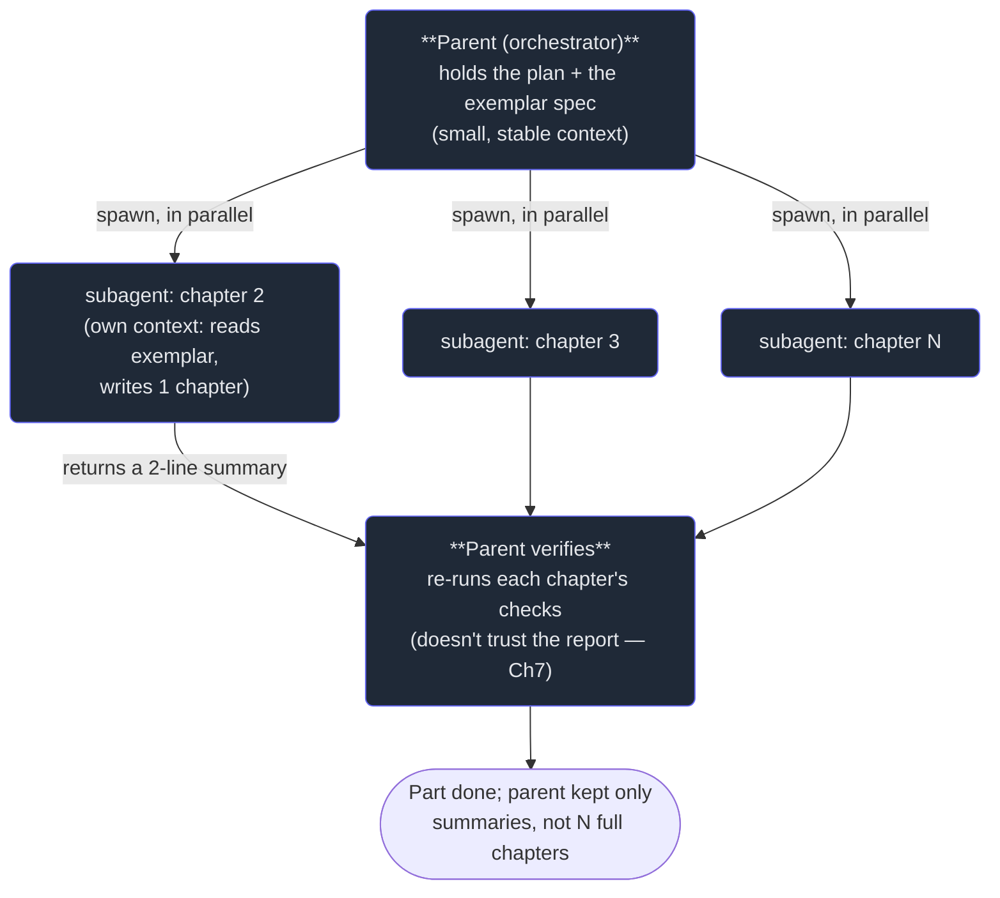

# 1. Why subagents

## TL;DR

> A **subagent** is a fresh agent instance that a parent agent **spawns** to do a sub-task and
> **return a result**. It exists to defeat the two limits of a single agent. First, **context is
> finite and not free**: a long task fills the window with detail that crowds out the goal ("context
> rot"). Second, **one agent works sequentially**. A subagent fixes both: it runs in its **own clean
> context** — it does the heavy reading/work, and hands the parent back only its *conclusion*, so the
> parent's window stays lean (**context isolation**) — and **many subagents can run at once**
> (**parallelism**). The parent orchestrates; the children do the work. This is the engine that built
> the book you're reading.

## 1. Motivation

Try to picture writing this book — fifty-one first-principles chapters — inside a *single* agent's
context window. Chapter 1 goes fine. By chapter 10, the window holds nine finished chapters plus all
the files you read to write them. By chapter 25, it's a swamp: the agent is "remembering" twenty-four
chapters' worth of prose it no longer needs, the relevant instructions are buried, and quality
quietly degrades — the dreaded **context rot**, where a window so full of *old* detail loses the
*current* goal. Long before chapter 51, the whole thing collapses.

That's not how this book got written. A **parent** agent wrote a tight, self-contained spec for each
chapter — *"here's the exemplar, here are the rules, write this one chapter, return a two-line
summary"* — and **spawned a subagent per chapter**. Each child woke up with a *clean* context, read
the one exemplar it needed, wrote its one chapter, and handed back two lines. The parent's window
never held fifty-one chapters; it held fifty-one *summaries*. The detail lived and died in the
children. And because the children were independent, six or ten of them ran **at the same time** —
a Part that would take hours sequentially finished in minutes.

Two limits, two fixes, in one move. **Context isolation** (the child holds the detail, the parent
keeps the result) made the book *possible*. **Parallelism** (many children at once) made it *fast*.
Subagents are not a trick for huge tasks only — they're the answer whenever a job is too big for one
window or too wide for one timeline. You are, quite literally, holding the proof.

## 2. Intuition (Analogy)

Recall *Delegation* from Part 1 — but now with a sharp new reason for it.

A **manager who personally does every task** ends up buried: their desk (context) piles high with the
details of task one while they're trying to start task two, and they can only work one task at a time.
A **manager who delegates** keeps a *clean desk*. They hand a team member a clear brief; that person
goes to their *own* office, reads the fifty-page document, does the work, and comes back with a
*one-paragraph* summary. The manager never had to stack those fifty pages on their own desk — they got
the paragraph. And while one teammate reads that document, four others are working their own briefs in
parallel.

A subagent is that teammate. Its **own office** is its own context window — what it reads and thinks
there never lands on the parent's desk. Its **one-paragraph report** is its return value — the only
thing that crosses back. "Clean desk" is the whole game: the parent stays clear-headed and focused on
*coordinating*, precisely because the *doing* (and the clutter it generates) happens elsewhere.

| | One agent does everything | **Parent + subagents** |
|---|---|---|
| Where the detail lives | The single context window — it fills up | **Each child's own window — isolated** |
| What the orchestrator holds | Everything (goal *and* all the clutter) | **Just the results (clean desk)** |
| Work style | Sequential — one thing at a time | **Parallel — many children at once** |
| Failure at scale | Context rot; the goal drowns | **Stays lean; scales to many** |
| Visibility | Sees its own every step | Sees the *result*, not the child's steps |

## 3. Formal Definition

A **subagent** is a child agent that a **parent** (or **orchestrator**) spawns by handing it a prompt.
The child has its **own context window**, runs its own gather → act → verify loop (Part 2), and when
it finishes, its **final message becomes the return value** delivered to the parent. Crucially, the
parent's context gains *only that return value* — none of the child's intermediate reading, tool
calls, or reasoning.

| Term | Meaning |
|---|---|
| **Subagent** | A child agent spawned to do a sub-task and return a result. |
| **Parent / orchestrator** | The agent that spawns subagents and coordinates their results. |
| **Context isolation** | The child's work lives in *its* window; only the result crosses back. The parent stays lean. |
| **Return value** | The child's final message — the one thing the parent receives. A clear *return contract* matters (Chapter 3). |
| **Fan-out** | Spawning many subagents at once to work in parallel (Chapter 4). |
| **Context rot** | Quality decay when a window holds too much stale detail relative to the live goal. |

Two properties define the value. **Context isolation**: delegating a context-heavy sub-task (read this
whole subsystem, draft this whole chapter) keeps the bulk *out* of the parent — you pay for the
child's window once, transiently, and keep only a summary. **Parallelism**: because children are
independent, N of them run concurrently, turning sum-of-work wall-clock into max-of-work wall-clock
(the fibers idea from earlier, now at the agent level).

> The one line: **a subagent lets the parent benefit from work it never has to hold.** The child reads
> the haystack; the parent gets the needle. That asymmetry — full effort in the child, tiny footprint
> in the parent — is why a single orchestrator can direct a system far larger than its own window.

## 4. Worked Example — how this book was built

Here is the real shape of the loop that authored each Part, drawn as an orchestrator pattern.



Notice three things that recur in every orchestration. The parent's context stays **small and stable**
— it holds the plan, not the output. The children carry the **weight** — each reads and writes a full
chapter in isolation. And the parent's last act is **not to trust** the children's "all verified!"
reports but to *independently re-check* them (Chapter 7) — because a confident self-report is not
evidence (Part 1's Discernment, mechanized). Parent orchestrates, children labor, parent verifies:
that triangle is the heartbeat of multi-agent work.

## 5. Build It

Let's make context isolation concrete. This models a parent with a small budget doing four
context-heavy sub-tasks two ways: inline (all detail lands on the parent) versus delegated (detail
stays in the children; only summaries return).

```python run
PARENT_BUDGET = 1000  # tokens the parent can comfortably hold

SUBTASKS = {  # each: the detail it must read/produce, and the short result it returns
    "read auth module": {"detail": 1200, "result": 40},
    "read db layer":    {"detail":  900, "result": 35},
    "read api routes":  {"detail": 1500, "result": 45},
    "summarize tests":  {"detail":  800, "result": 30},
}

def inline(tasks):
    """One agent does it all: every task's working detail piles into the parent."""
    return sum(t["detail"] for t in tasks.values())

def delegated(tasks):
    """A subagent per task: detail stays in each child; only summaries return to the parent."""
    parent_holds = sum(t["result"] for t in tasks.values())   # just the results cross back
    busiest_child = max(t["detail"] for t in tasks.values())  # children run in parallel
    return parent_holds, busiest_child

inline_cost = inline(SUBTASKS)
parent_holds, busiest_child = delegated(SUBTASKS)

print(f"inline    : parent holds {inline_cost:>4} tokens  -> " +
      ("OVER BUDGET" if inline_cost > PARENT_BUDGET else "ok"))
print(f"delegated : parent holds {parent_holds:>4} tokens  -> " +
      ("OVER BUDGET" if parent_holds > PARENT_BUDGET else "ok"))
print(f"  detail lived in the children (busiest: {busiest_child} tokens, its own window)")
print(f"  delegating kept the parent {inline_cost // parent_holds}x leaner")
```

**Now break it.** Add a fifth and sixth heavy sub-task. The `inline` number keeps climbing — past the
budget, toward context rot — while the `delegated` parent grows only by each task's tiny *result*. That
divergence is the entire argument: inline cost scales with the *total work*, delegated parent-cost
scales only with the *number of summaries*. Push it far enough and the inline agent simply can't hold
the job; the orchestrator can direct a hundred children while holding a hundred one-liners.

## 6. Trade-offs & Complexity

| Subagents (orchestration) | One agent, doing it all |
|---|---|
| Context isolation — parent stays lean | Everything competes for one window |
| Parallelism — many at once | Strictly sequential |
| Scales past a single window | Bounded by one context |
| Coordination overhead; spawn cost | Zero coordination — it's all one mind |
| Parent sees results, **not** the child's reasoning | Full visibility into every step |
| Depends on a clear return contract | No hand-off to get wrong |

Subagents are not free. Spawning has overhead, the parent loses visibility into *how* the child got
its result (so you must define a crisp return contract and *verify* the output), and a task that
genuinely needs the parent's accumulated context shouldn't be exiled to a blank-slate child. The win
is decisive exactly when a job is **context-heavy** (delegate the reading) or **wide** (fan it out) —
which, for any ambitious task, is most of the time. The art (the rest of this Part) is knowing *what*
to delegate, *how* to brief it, and *how* to check what comes back.

## 7. Edge Cases & Failure Modes

- **Delegating context-dependent work.** A child wakes blind; if the task needs everything the parent
  has learned, the child either flounders or you re-send so much that isolation buys nothing. Keep
  such work in the parent.
- **No return contract.** If the child doesn't know the exact shape to return, the parent gets prose
  it can't use. Specify the output (Chapter 3).
- **Over-delegation.** Spawning a subagent for a one-line lookup costs more in overhead than it saves.
  Delegate weight, not trivia.
- **Trusting the self-report.** The child says "done, verified!" — that is a *claim*, not evidence. The
  parent must independently check (Chapter 7). This is the single most common multi-agent failure.
- **Lost-in-translation goals.** A vague spawn prompt yields confident, off-target work (Part 1's
  Description, again). The brief is everything.
- **Runaway fan-out.** Spawning hundreds of children at once can swamp limits/cost; cap concurrency and
  scope the breadth (Chapter 4).

## 8. Practice

> **Exercise 1 — Name the two walls.** A colleague asks why you don't just have "one really capable
> agent do the whole 50-file refactor." Using §1 and §3, name the two limits of a single agent that
> subagents lift, and the mechanism for each.

<details>
<summary><strong>Answer</strong></summary>

The two walls (§1):

1. **Finite, costly context.** A single agent reading and editing 50 files fills its window with all
   that detail; past a point it suffers **context rot** — the live goal drowns in stale material, and
   quality degrades. Subagents lift this via **context isolation**: spawn a child per file (or
   cluster), each reads/edits in its *own* window and returns just a summary, so the parent's context
   holds results, not 50 files' worth of detail (§3).
2. **Sequential work.** One agent does one thing at a time, so 50 files is 50 steps in a row. Subagents
   lift this via **parallelism**: many children run **at once**, turning sum-of-work wall-clock into
   max-of-work (§3).

So the honest answer to the colleague: a single agent isn't *capable enough* in the relevant
sense — not because it's not smart, but because it has one window and one timeline. Subagents give it
many of each.

</details>

> **Exercise 2 — Do the isolation math.** Using the §5 model's numbers, compute what the parent holds
> inline vs. delegated, and explain in one sentence why the delegated number barely grows when you add
> more sub-tasks.

<details>
<summary><strong>Answer</strong></summary>

From §5: details are 1200 + 900 + 1500 + 800 = **4400**; results are 40 + 35 + 45 + 30 = **150**.

- **Inline:** the parent holds all the detail → **4400 tokens** (over the 1000 budget — heading for
  context rot).
- **Delegated:** the parent holds only the returned summaries → **150 tokens** (well under budget); the
  busiest child held 1500 in *its own* window.

The delegated number barely grows with more sub-tasks because **the parent's cost scales with the
number of *results* (small summaries), not with the *total work* (large detail)** — each new child
adds only its one-line return, while its heavy reading stays isolated in its own context. That's
exactly why an orchestrator can direct dozens of children while staying lean.

</details>

> **Exercise 3 — Delegate or keep?** For each, say whether to delegate to a subagent or keep it in the
> parent, and why: (a) "read these 12 unfamiliar files and tell me where auth is enforced"; (b) "decide
> the overall architecture of the refactor we've been discussing for 20 turns"; (c) "run the same
> lint-and-summarize over 30 independent modules."

<details>
<summary><strong>Answer</strong></summary>

The test (§6): delegate **context-heavy** or **wide** work; keep work that needs the parent's
accumulated context or judgment.

- **(a) Read 12 files, report where auth is enforced — DELEGATE.** It's context-heavy and
  self-contained: a child reads all twelve in its own window and returns a short finding (the needle),
  sparing the parent the twelve files (the haystack). An **Explore**-type subagent (Chapter 2) is ideal.
- **(b) Decide the overall architecture after 20 turns of discussion — KEEP.** This depends on the
  parent's *accumulated context* — the whole conversation, the constraints surfaced over 20 turns. A
  blank-slate child would decide without the very context that should drive the decision. Judgment
  that rests on what the parent has learned stays with the parent.
- **(c) Lint-and-summarize 30 independent modules — DELEGATE, in parallel.** It's **wide** and the
  modules are independent — a textbook fan-out (Chapter 4): 30 children at once, each returning a
  summary, instead of 30 sequential passes in one window.

Throughline: (a) and (c) are *heavy/wide and self-contained* → delegate; (b) is *judgment rooted in the
parent's own context* → keep.

</details>

```quiz
{
  "prompt": "What are the two core benefits a subagent provides over doing everything in one agent?",
  "input": "Choose one:",
  "options": [
    "Context isolation (the child holds the detail; only its result returns to the parent) and parallelism (many children run at once)",
    "It makes the underlying model smarter and faster",
    "It removes the need to verify the work, since each subagent self-checks",
    "It lets you skip writing any prompt, because subagents infer the task automatically"
  ],
  "answer": "Context isolation (the child holds the detail; only its result returns to the parent) and parallelism (many children run at once)"
}
```

## In the Wild

- **[Anthropic — Building effective agents](https://www.anthropic.com/engineering/building-effective-agents)**
  — the orchestrator-workers pattern and when to split work across agents. The conceptual backbone.
- **[Anthropic — How we built our multi-agent research system](https://www.anthropic.com/engineering/built-multi-agent-research-system)**
  — a real production system where a lead agent fans out to subagents in isolated contexts; the §4
  pattern at scale.
- **[Claude Code — Subagents](https://docs.claude.com/en/docs/claude-code/sub-agents)** — the actual
  tool you'll use to spawn them, and the agent types you'll meet in Chapter 2.

---

**Next:** the *why* is settled — now the *how*. What is the tool that spawns a subagent, what agent
*types* can you spawn (and why does picking the right one matter), and what exactly comes back? →
[2. The Agent tool & types](/cortex/the-claude-stack/subagents-and-orchestration/the-agent-tool-and-types)
