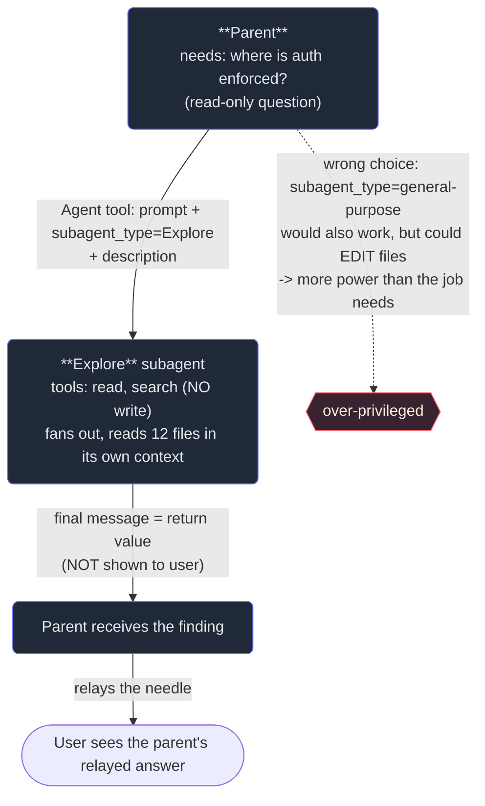

# 2. The Agent tool & types

## TL;DR

> You spawn a subagent with **one tool** — the **Agent tool** (also called the **Task tool**). You
> pass it three things: a **`prompt`** (the task), a **`subagent_type`** (which *kind* of agent to
> spawn), and a short **`description`**. The child runs its own loop to completion and its **final
> message becomes the return value** the parent receives — and *only* the parent: it is **not shown to
> the user**, so the parent must **relay** what matters. Pass a **`schema`** and the child must return
> validated **structured output** (a JSON object) instead of free text. The heart of the chapter is the
> **types**. Each type is a *role* defined by its **tool access**: **Explore** is read-only
> search/fan-out (it *cannot* edit), **Plan** designs (read-only too), **general-purpose** has the full
> toolset and actually *does* the work, and **custom** types are project-defined. Picking the right type
> is **fit + least privilege**: give the job the powers it needs and *no more* — an Explore agent
> *literally can't* damage anything, which is exactly why it's the safe choice for "where is X?".

## 1. Motivation

Chapter 1 settled the *why*: a subagent runs in its own clean context and hands back only a result. But
"spawn a subagent" is not magic the parent narrates into existence — it is a concrete **tool call**, the
same shape as Read or Bash. So the first real question is: *what is that call, and what knobs does it
have?*

There is exactly one tool, and it takes a prompt, a type, and a one-line description. Two of those are
obvious. The third — the **type** — is where every interesting decision lives, and it's easiest to feel
with the book in your hands. **This** book was written by a fleet of **general-purpose** subagents: the
parent spawned one per chapter, each *read* the exemplar *and wrote* a new `.md` file. Writing a file
requires the `Write` tool — so the type had to be one that *grants* `Write`. Now flip it. The repo's
root `CLAUDE.md` gives a standing order for codebase questions: use **Explore** agents. Why a different
type? Because exploring should *only read*. An Explore agent's toolset has no `Write` and no `Edit` — so
while it's fanning out across forty files answering "where is auth enforced?", it **cannot** accidentally
modify one of them. The restriction *is* the feature.

That is the whole motivation for types. The same Agent tool, pointed at the same codebase, behaves
completely differently depending on the one word you put in `subagent_type` — and that word encodes both
what the child *can* do and what it *can't*. Choose it well and the agent fits the job like the right
tool fits the screw. Choose it badly and you either hand a researcher a sledgehammer (over-privileged) or
ask a researcher to weld (a power it simply doesn't have).

## 2. Intuition (Analogy)

**Spawning a subagent is hiring for a role.**

When a job lands on your desk, you don't hire a generic "person" — you hire a *role* whose powers and
permissions match the work. A **researcher** has library access and can read anything, but no key to the
building's electrical panel — and that's *correct*, because their job is to find things, not rewire the
office. A **general contractor** has the keys, the permits, and the power tools to actually renovate — but
you wouldn't pay a contractor's day-rate (and hand over the keys) just to look up a zoning code. An
**architect** drafts the plan and weighs trade-offs but doesn't pour concrete.

You don't send the researcher to renovate the kitchen, or the contractor to look something up. Each role
comes with the right tools *and the right restrictions*, and matching the role to the task is the entire
skill. The "hire" is your Agent-tool call; the **role** you hire for is the **`subagent_type`**; the
**brief** you give them is the **`prompt`**; and the **report they bring back** is the return value —
which lands on *your* desk, not the client's, so you're the one who relays it onward.

| | Hiring for a role | **Spawning a subagent** |
|---|---|---|
| The decision | *Which role?* (researcher / contractor / architect) | The **`subagent_type`** (Explore / general-purpose / Plan / custom) |
| The brief | The job description you hand them | The **`prompt`** |
| What they can touch | Role-scoped access (keys, permits) | Type-scoped **tool access** (read-only vs. can-write) |
| The safety | A researcher *has no key* to the panel | An **Explore** agent *has no* Write/Edit tool |
| What you get back | Their report on your desk | The child's **final message** (return value), to the parent |
| Wrong pick | Over-paid or can't-do-the-job | Over-privileged, or **BLOCKED** — type lacks the tool |

## 3. Formal Definition

The **Agent tool** (a.k.a. the **Task tool**) spawns one subagent. A call carries:

- **`prompt`** — the task brief. Self-contained, because the child wakes with a blank context (Chapter 3).
- **`subagent_type`** — *which kind* of agent to spawn. This selects the child's **tool access** (its
  capabilities) and its disposition.
- **`description`** — a 3–5 word label, for logging and the UI.
- **`schema`** *(optional)* — a structure the child's output **must** validate against. Supply it and the
  return is a **structured object**, not prose.

The child runs its own gather → act → verify loop. When it finishes, its **final message becomes the
return value** delivered to the parent — and **only** the parent. The user does **not** see it. So a
standing rule: **the parent must relay** anything the user needs.

| Term | Meaning |
|---|---|
| **Agent / Task tool** | The single tool that spawns a subagent. |
| **`prompt`** | The task brief handed to the child (its whole world — see Chapter 3). |
| **`subagent_type`** | Which **type** to spawn; selects the child's tool access + role. |
| **`description`** | A short label for the spawn (logging/UI). |
| **`schema`** | Optional output contract; forces **validated structured (JSON) output**. |
| **Return value** | The child's **final message** — the one thing the parent receives. **Not user-visible.** |
| **Agent type** | A role bundling a **toolset** (what it *can* do) + intent + restrictions. |
| **Least privilege** | Grant the job the powers it needs and **no more** — picking the smallest-fitting type. |

The **types** (pick by task; they differ in **tool access** = least privilege + fit):

- **Explore** — *read-only search / fan-out.* Reads excerpts, locates code across many files; **cannot
  edit or write**. The right choice for **"where / how is X?"** questions.
- **Plan** — *the architect.* Designs an implementation plan, names the critical files, weighs
  trade-offs. **Read-only** — it proposes, it doesn't change anything.
- **general-purpose** — *the full toolset.* Research **plus** multi-step work **plus** edits/writes. The
  type to actually **DO** work (this book's chapters were written by these).
- **custom** types — *project-defined agents* registered in the repo (e.g. a `code-reviewer` with a
  curated toolset and instructions).

> The one line: **the `subagent_type` is a contract of capability.** It says, in one word, both *what the
> child can do* and *what it can't* — and the second half is the safety. You don't trust an Explore agent
> to "be careful" not to edit; you spawn it *knowing the edit tools aren't even in its hand.*

## 4. Worked Example

Take the standing order from this repo's `CLAUDE.md`: for a codebase question, use an **Explore** agent.
Here is the shape of that spawn.



The solid path is the right one: an **Explore** type, read-only, fans out, and returns the finding —
which the parent then **relays** to the user (the dashed warning shows why general-purpose, though it
*would* work, hands over more power than a lookup needs). Here is the call and what comes back, as a
sketch:

```json
{
  "tool": "Agent",
  "subagent_type": "Explore",
  "description": "Locate auth enforcement",
  "prompt": "Read-only. Find every place in this repo where authentication is ENFORCED (not just defined). Report each as file:line with a one-line note on what it gates. Do not modify any file. Return a short list, nothing else.",

  "returns (the child's FINAL message = the return value, delivered to the PARENT, not the user)": "Auth is enforced in 3 places: (1) server/src/main/scala/.../AuthFilter.scala:48 — rejects requests with no bearer token; (2) .../RouteGuards.scala:91 — checks the `admin` claim on /admin/*; (3) .../WsHandshake.scala:22 — validates the token before upgrading the websocket. No enforcement on /public/*. (Read-only run; nothing was changed.)"
}
```

Three things to carry forward. (1) The **type made the run safe**: even though the prompt also *said*
"do not modify", the Explore type *couldn't* have anyway — the edit tools aren't in its hand. (2) The
return value is *the child's last message* — a tidy finding, not the twelve files it read; the haystack
stayed in the child, the needle crossed back. (3) That finding landed on the **parent**, not the user —
so if the user asked the question, the parent now has to **relay** it. Want this back as data instead of
prose? Add a `schema` (say, a list of `{file, line, gates}` objects) and the child must return a
validated JSON object the parent can iterate over directly.

## 5. Build It

Let's make "the type *is* the safety" executable. We model an **agent-type dispatcher**: a registry
mapping each type to the capabilities it's allowed to use, and a `dispatch(needs, chosen_type)` that
returns **OK** when the type covers the task's needs, or **BLOCKED** naming the missing capability. We
route a read-only "find where auth is" task to **Explore** (OK), then route an "edit 3 files" task to
Explore (**BLOCKED** — read-only) and to **general-purpose** (OK — it has `write`). Deterministic,
standard-library only.

```python run
# type -> the capabilities that type is ALLOWED to use (its tools = its powers).
# Explore/Plan are read-only by design; general-purpose can also change the repo.
REGISTRY = {
    "Explore":         {"read", "search"},
    "Plan":            {"read", "search", "plan"},
    "general-purpose": {"read", "search", "plan", "write", "run"},
}

# A "least-privilege rank": smaller capability set = safer (fewer ways to do harm).
SAFETY_RANK = {t: len(caps) for t, caps in REGISTRY.items()}


def dispatch(task, needs, chosen_type):
    """Route one task to a chosen agent type. Returns a decision dict.

    OK      -> the type's capabilities are a superset of what the task needs.
    BLOCKED -> at least one needed capability is outside the type's powers.
    """
    if chosen_type not in REGISTRY:
        return {"task": task, "type": chosen_type, "ok": False,
                "missing": sorted(needs), "reason": "unknown agent type"}

    allowed = REGISTRY[chosen_type]
    missing = needs - allowed
    return {
        "task": task,
        "type": chosen_type,
        "ok": not missing,
        "missing": sorted(missing),
        "reason": "covers all needs" if not missing
        else "type cannot " + "/".join(sorted(missing)),
    }


def cheapest_type_for(needs):
    """Least-privilege pick: the SAFEST type whose powers still cover the needs.

    This is the 'right tool for the job' rule -- grant the minimum that fits.
    """
    fits = [t for t, caps in REGISTRY.items() if needs <= caps]
    return min(fits, key=lambda t: SAFETY_RANK[t]) if fits else None


def show(decision):
    mark = "OK     " if decision["ok"] else "BLOCKED"
    line = "[" + mark + "] " + decision["task"]
    line += "  --(" + decision["type"] + ")--> " + decision["reason"]
    if not decision["ok"]:
        line += "  [missing: " + ", ".join(decision["missing"]) + "]"
    print(line)


# --- A tiny queue of spawn requests, each: (task, capabilities it needs) -------
TASKS = {
    "find where auth is enforced": {"read", "search"},
    "design the refactor plan":    {"read", "search", "plan"},
    "edit 3 files to add a flag":  {"read", "write"},
    "run the test suite":          {"read", "run"},
}

print("== Routing decisions (the type you CHOSE) ==")
# A read-only search task, correctly routed to Explore -> OK.
show(dispatch("find where auth is enforced",
              TASKS["find where auth is enforced"], "Explore"))

# The SAME edit task, two ways:
#   chosen Explore  -> BLOCKED (Explore is read-only; it lacks 'write').
#   chosen general-purpose -> OK (it has 'write', so it can actually do the work).
show(dispatch("edit 3 files to add a flag",
              TASKS["edit 3 files to add a flag"], "Explore"))
show(dispatch("edit 3 files to add a flag",
              TASKS["edit 3 files to add a flag"], "general-purpose"))

print()
print("== Least-privilege pick (the type you SHOULD choose) ==")
for task, needs in TASKS.items():
    pick = cheapest_type_for(needs)
    safety = SAFETY_RANK[pick]
    print("  " + task.ljust(30) + " -> " + pick.ljust(15)
          + " (needs " + str(len(needs)) + " caps; type grants " + str(safety) + ")")

print()
print("== Why the restriction is the safety ==")
# Even if a buggy spec told an Explore agent to 'write', the type can't:
buggy = dispatch("(buggy) explore agent told to edit", {"read", "write"}, "Explore")
show(buggy)
print("  -> the Explore type has no 'write' power, so the edit is refused by")
print("     CONSTRUCTION, not by luck. Least privilege = the wrong call is blocked.")
```

Running it prints the routing: the auth lookup goes to **Explore — OK**; the edit task is **BLOCKED**
under Explore (`missing: write`) and **OK** under general-purpose; and the least-privilege picker chooses
**Explore** for the lookup, **Plan** for the design, **general-purpose** for the two that need `write`/`run`.
**Now break it.** Register a `custom` `code-reviewer` type as `{read, search, comment}` and add a task
needing `{read, comment}` — watch it route there instead of to the over-powered general-purpose. Or hand
the auth lookup to general-purpose and notice that while it's still **OK**, the picker *refuses* to: the
job needs 2 capabilities and that type grants 5, so least privilege says no. The dispatcher is a toy, but
its rule is the real one: **fit covers the needs; least privilege keeps the surplus power out of the
child's hands.**

## 6. Trade-offs & Complexity

| Choice | Strength | Cost / when it bites |
|---|---|---|
| **Explore** (read-only) | Safe by construction — can't edit; great for fan-out search | Can't *do* anything; useless when the task needs a change |
| **Plan** (read-only) | Produces a real plan + critical files + trade-offs | Still no edits; you must execute the plan separately |
| **general-purpose** (full tools) | Actually does the work end-to-end | Most power = most blast radius; verify its output (Ch7) |
| **custom** type | Tailored toolset + instructions for a recurring job | Needs setup/registration; one more thing to maintain |
| **`schema`** (structured return) | Machine-usable, validated output | Rigid; over-constraining a fuzzy task wastes the child's effort |
| **Right type, wrong fit** | — | Over-privileged (needless risk) **or** BLOCKED (lacks the tool) |

The recurring tension is **power vs. safety**, and **fit vs. least privilege**. More capable types do
more but can do more *damage*, and their results demand more scrutiny. The discipline is to grant the
**minimum type that fits**: Explore for lookups, Plan to design, general-purpose only when something must
actually change. A second axis is the **return shape** — free text is flexible but the parent has to parse
it; a `schema` makes the return a clean object at the price of rigidity. Pick the smallest type that can
do the job, and the smallest return shape that carries the answer.

## 7. Edge Cases & Failure Modes

- **Forgetting the return is private.** The child's final message goes to the **parent**, *not* the user.
  If the parent doesn't **relay** it, the user sees nothing. The "answer" exists — in the wrong place.
- **Wrong type, over-privileged.** Spawning **general-purpose** for a read-only lookup works, but hands a
  blank-slate agent edit/run powers it never needed — needless blast radius. Default to **Explore** for
  "where/how is X?".
- **Wrong type, under-powered.** Asking **Explore** to "fix the bug" can't succeed — the edit tools aren't
  in its toolset. It will read, perhaps *describe* the fix, but never apply it. Match the type to the verb.
- **Prompt says one thing, type allows another.** A prompt that *tells* an Explore agent to "go ahead and
  edit" still can't edit — the **type wins**. (That's the safety; don't fight it — re-spawn the right type.)
- **No `schema` when you needed structure.** If the parent intends to iterate over results, prose forces
  brittle parsing. Pass a `schema` so the return is a validated object.
- **Over-constraining with `schema`.** Forcing a tight JSON shape onto an open-ended task can straitjacket
  a child that needed room to reason. Use structure for *data*, free text for *judgment*.
- **Spawning fresh when you meant to continue.** A new spawn is a *blank* context; **continuing** an
  existing subagent keeps its accumulated context. Don't re-spawn (and re-pay the ramp-up) when you meant
  to resume the same one.

## 8. Practice

> **Exercise 1 — Pick the type (and say why the others are wrong).** For each task, name the *single best*
> `subagent_type` and one sentence of justification: (a) "tell me every file that imports the old logger";
> (b) "rename the symbol across the 14 files that use it"; (c) "propose how we'd migrate this module to the
> new API, listing the files to touch and the risks."

<details>
<summary><strong>Answer</strong></summary>

Match the **verb** to the type's **tool access** (§3), and prefer least privilege.

- **(a) Find importers → Explore.** It's a read-only **"where is X?"** fan-out: Explore reads across the
  files and returns the list, and *can't* alter anything while it looks. general-purpose would work but is
  over-privileged for a pure lookup.
- **(b) Rename across 14 files → general-purpose.** This must *change* files, which needs the `Edit`/`Write`
  tools. **Explore can't** (no write) and **Plan can't** (read-only) — only general-purpose has the hands
  to actually do it.
- **(c) Propose a migration plan → Plan.** The deliverable is a *design* — files to touch, risks,
  trade-offs — not a change. Plan is built for exactly this and stays read-only; you'd execute its plan
  afterward with a general-purpose agent.

Throughline: a *question* → Explore, a *design* → Plan, a *change* → general-purpose.

</details>

> **Exercise 2 — Trace the dispatcher.** Using the §5 registry, give the decision (OK / BLOCKED + any
> missing capability) for: (a) `dispatch("audit imports", {"read","search"}, "Explore")`; (b)
> `dispatch("add a config flag", {"read","write"}, "Plan")`; (c) `cheapest_type_for({"read","plan"})`.

<details>
<summary><strong>Answer</strong></summary>

Recall `Explore={read,search}`, `Plan={read,search,plan}`, `general-purpose={read,search,plan,write,run}`.

- **(a) OK.** `{read,search}` ⊆ Explore's `{read,search}` — nothing missing. A read-only audit is exactly
  Explore's job.
- **(b) BLOCKED, missing `write`.** Plan is read-only (`{read,search,plan}`); it has no `write`, so an
  "add a flag" task can't run there. (You'd route this to general-purpose.)
- **(c) `Plan`.** Both Plan and general-purpose cover `{read,plan}`, but the picker chooses the
  **smaller-fitting** type by `SAFETY_RANK` — Plan (3 capabilities) over general-purpose (5). Least
  privilege: grant the minimum that fits.

</details>

> **Exercise 3 — Where did the answer go?** A teammate spawns a general-purpose subagent to "summarize the
> release notes," and the child returns a clean three-bullet summary. The teammate complains: "I ran it,
> but the user never saw the summary." What happened, and what's the fix — in terms of this chapter's model?

<details>
<summary><strong>Answer</strong></summary>

The child's **final message is the return value delivered to the *parent*, not the user** (§3). The
summary isn't lost — it landed on the parent's desk. The user saw nothing because the parent never
**relayed** it.

The fix is the standing rule: **the parent must relay what matters.** After the spawn returns, the parent
includes the child's summary (or its own paraphrase) in its *own* reply to the user. If the teammate wants
the result in a machine-usable form to forward verbatim or post elsewhere, they can also pass a `schema`
so the child returns a validated object — but even then, *something in the parent has to surface it.* The
subagent's job ends at "return to parent"; closing the last mile to the user is the parent's.

</details>

```quiz
{
  "prompt": "You need a subagent to find where a feature is implemented across many files, and you must be certain it can't accidentally modify anything while it looks. Which subagent_type fits — and why?",
  "input": "Choose one:",
  "options": [
    "Explore — it's read-only (search + read, no Write/Edit), so it can fan out and report the finding but literally cannot change a file",
    "general-purpose — it's the most capable type, so it's always the safest default",
    "Plan — it edits files carefully according to a plan it makes first",
    "Any type works; subagent_type only affects logging, not what tools the child can use"
  ],
  "answer": "Explore — it's read-only (search + read, no Write/Edit), so it can fan out and report the finding but literally cannot change a file"
}
```

## In the Wild

- **[Claude Code — Subagents](https://docs.claude.com/en/docs/claude-code/sub-agents)** — the real Agent
  tool: how to define types, scope their **tool access**, and invoke them. The mechanics of this chapter.
- **[Claude Docs — Tool use (function calling)](https://docs.claude.com/en/docs/build-with-claude/tool-use/overview)**
  — the Agent/Task tool *is* a tool call; this is the request/response shape every spawn is built on,
  including how a tool's input schema constrains what it returns.
- **[Anthropic — How we built our multi-agent research system](https://www.anthropic.com/engineering/built-multi-agent-research-system)**
  — a production lead agent spawning typed subagents into isolated contexts and relaying their returns;
  the §4 spawn-and-relay loop at scale.

---

**Next:** you can spawn any type — but a subagent is only as good as the brief you hand it. How do you
write a `prompt` that wakes a blank-slate child knowing exactly what to do and exactly what to return? →
[3. Prompting subagents well](/cortex/the-claude-stack/subagents-and-orchestration/prompting-subagents-well)
