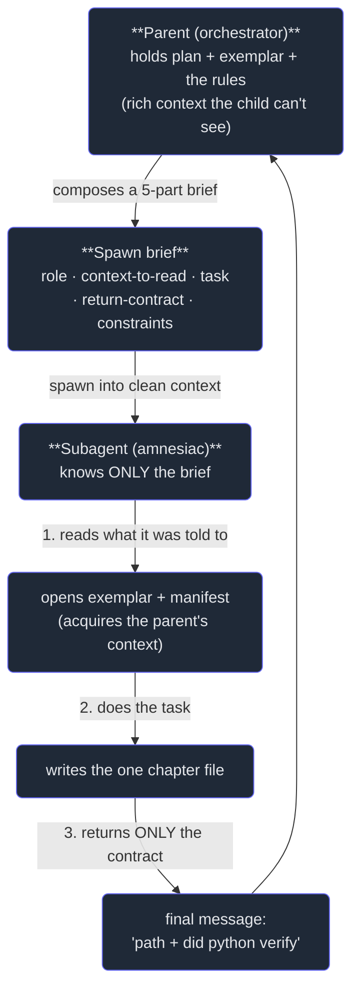

# 3. Prompting subagents well

## TL;DR

> A subagent wakes with a **clean context**: it knows *only* what you put in its spawn prompt — none
> of the conversation, files, or decisions the parent accumulated. So the brief must be
> **self-contained**, and a good one carries five parts: **role** (who it is), **context to read**
> (it starts blind — name the files/exemplar to open), the precise **task**, the exact **return
> contract** (the shape to send back), and **constraints** (hard rules / done-criteria). The
> return contract matters most because the child's **final message is the only product** — specify
> the shape or you get a five-page essay where you needed a filled-in form; for machine-parseable
> output, hand it a **schema** so it returns a validated JSON object. This is Part 1's *Description*
> (precise communication) and Part 3's prompt-engineering, now aimed at a colleague who shares none
> of your memory. The proof, again, is this book: every chapter was written by a child handed exactly
> these five things.

## 1. Motivation

Chapter 1 settled the *why* of subagents and Chapter 2 the *what* — the Agent tool and the types you
can spawn. This chapter is the *how-to-ask*, and it is where most multi-agent attempts quietly fail.

Picture spawning a subagent with the prompt **"write the chapter."** To *you* that sentence is full
of meaning — you know which chapter, which exemplar sets the voice, which section order is mandatory,
that there must be exactly one quiz, that the Build-It code has to actually run. The child knows
*none* of it. It woke a heartbeat ago in an **empty room**: no conversation history, no open files, no
memory of the plan you have been refining for twenty turns. It will do *something* — confidently — but
it will be the wrong chapter, in the wrong shape, missing the rules you never stated. The return comes
back unusable, and the parent's "delegation" cost more than doing it inline would have.

That is not how this book got written. Each chapter's child was handed a brief that *spelled out
everything*: **who** it was ("an expert CS educator writing ONE chapter"), **what to read first** (the
exemplar path *and* the manifest — because it couldn't see the parent's context), the **task** (write
this one file), the **return contract** ("return a 2-line summary: file path + did python verify"),
and the **hard requirements** (the section order, the quiz schema, the rule that the python block must
actually run). Five parts, every time. The child read the exemplar to *learn the voice the parent
already knew*, produced the file, and sent back two lines the parent could act on without re-reading a
word of the chapter. The quality of the book is, in a real sense, the quality of those briefs.

The lesson generalizes past book-writing. **A subagent is only as good as its brief**, because the
brief is the *entire* world it operates in. Get the five parts right and a blank-slate child does
correct, usable work; leave one out and you get confident garbage. This chapter is the anatomy of
getting it right.

## 2. Intuition (Analogy)

Imagine hiring a **brilliant freelancer who has total amnesia about your project**. Genuinely
world-class at the craft — but every morning they forget your company exists. You can only reach them
by a **single email**, and whatever they email back is the *only* thing you ever get. No follow-up
thread, no "quick question" — one email out, one deliverable back.

How do you write that email so the work comes back usable? You put in *everything*: **who they are on
this job** ("you're the copy-editor for our docs site"), **which documents to open first** ("read the
house style guide and last week's published page before you touch anything"), **exactly what to
produce** ("edit chapter 3 for clarity, keep it under 270 lines"), and — easy to forget, fatal to
omit — **the exact format to send back** ("return the edited file plus a two-line changelog"). Leave
out that last part and the amnesiac freelancer, having no idea what you'll do with it, mails you a
*five-page essay* on their editing philosophy when you needed a filled-in form. The work might be
excellent. It is also useless, because it doesn't fit the slot you had for it.

A subagent is that freelancer, and the spawn prompt is that one email. The **amnesia** is the clean
context — it remembers nothing of your project, so "read these docs first" isn't optional politeness,
it's how the child *acquires* the context you already hold. The **one email back** is the return value
— the final message, the sole product — which is why naming its shape is the highest-leverage sentence
you write. "Put everything in the one email" is the whole skill.

| | "write the chapter" (vague) | The five-part brief (self-contained) |
|---|---|---|
| What the child knows | Almost nothing — guesses the rest | Everything it needs, stated explicitly |
| Where context comes from | Assumed (wrongly) to be shared | **Acquired** by reading the named files |
| What comes back | A confident essay in some shape | The **exact shape** you asked for |
| Can the parent use it? | Rarely — wrong target, wrong format | Yes — drops straight into the plan |
| Failure mode | Off-target, unusable return | (none — that's the point) |
| Underlying skill | — | Part 1's **Description**, to an amnesiac |

## 3. Formal Definition

A **spawn brief** is the prompt a parent hands a subagent. Because the child runs in an **isolated,
clean context** (Chapter 1), the brief is the child's *complete* knowledge of the world: it has no
access to the parent's conversation, open files, or accumulated decisions. A well-formed brief carries
five components, each answering a question the context-less child silently asks on wake-up:

| Component | Answers the child's question | Why it's load-bearing for a blank-slate child |
|---|---|---|
| **Role** | "Who am I supposed to be?" | Sets stance, expertise, and voice — the persona it adopts (Part 3 ch2's system-prompt idea). |
| **Context to read** | "I'm blind — what do I open first?" | The child can't see the parent's context; this is how it *acquires* it. Name files, paths, an exemplar. |
| **Task** | "What exactly do I produce?" | The precise deliverable. Vague tasks yield confident, off-target work (Part 1's Description). |
| **Return contract** | "What shape do I send back?" | The final message is the **only** product. Specify the shape or the result is unusable prose. |
| **Constraints** | "What are the hard rules / done-criteria?" | The non-negotiables and definition of done — the rules you'd otherwise assume were "obvious." |

Two of these deserve emphasis because they fail most often. **Context to read** exists *because of
isolation*: the very thing that makes subagents valuable (the child's window is separate) means the
child cannot see what the parent learned, so you must tell it where to look. **The return contract**
exists because of the return value: the child's final message is the sole thing that crosses back
(Chapter 1), so an unspecified shape is the difference between "I can use this" and "I got a wall of
prose." When you need **machine-parseable** output — not just human-readable text — go one step
further and pass a **schema**: a declared structure (field names, types) the child must return as a
validated JSON object, so the parent can parse it programmatically instead of scraping prose. (This is
Part 3 ch4's *structured output*, now applied to a subagent's return.)

> The one line: **a subagent's only world is its brief, and its only product is its return.** So the
> brief must hand a context-less worker everything it needs (role, what to read, the task, the
> constraints) *and* name the exact shape of what to send back. Get those right and a blank slate does
> correct, usable work; leave the return shape unstated and even perfect work comes back in a form you
> can't consume.

This is **Description** from Part 1 — precise communication — operating under the hardest condition:
the receiver shares *none* of your context and you get *one* message back. It is also
prompt-engineering (Part 3 ch2) pointed at a colleague instead of a chat: role and constraints *are* a
system prompt; the task *is* the user turn; the return contract is the output spec.

## 4. Worked Example — the anatomy of a real spawn brief

Here is the shape of a single delegated chapter — the parent composes a five-part brief, the blind
child reads its way into context, works, and returns the one contracted message.



Read the five parts off the diagram: the **role** and **constraints** travel in the brief, the
**context-to-read** step is why the child opens files at all, the **task** is the middle, and the
**return contract** is the single arrow back. Now here is the actual anatomy of the brief that wrote a
chapter of *this book*, labeled by component — this is the real artifact, not a toy:

```text
SPAWN BRIEF  (the parent's prompt → one chapter subagent)

[ ROLE ] -------------------------------------------------------------
  "You are an expert CS educator writing ONE chapter of
   'The Claude Stack' book."
      → sets persona + voice. (This is the child's system prompt.)

[ CONTEXT TO READ ] --------------------------------------------------
  "FIRST read COMPLETELY and match voice/depth/structure:
     - TEMPLATE: 06-subagents-and-orchestration/01-why-subagents.md
     - MANIFEST: .claude-stack/manifest.md"
      → the child is BLIND to the parent's context. These two files
        ARE how it learns the voice + rules the parent already knows.

[ TASK ] -------------------------------------------------------------
  "Write a single NEW file at EXACT path:
     06-subagents-and-orchestration/03-prompting-subagents-well.md"
      → one precise deliverable, exact path. No guessing.

[ RETURN CONTRACT ] --------------------------------------------------
  "Return a 2-line summary: file path written, and whether python
   ran exit 0 on host python3."
      → the ONLY thing that crosses back. Names the exact shape, so the
        parent gets two usable lines, not a five-page essay.

[ CONSTRAINTS / HARD REQUIREMENTS ] ----------------------------------
  "Sections IN ORDER: TL;DR → 1.Motivation → ... → In the Wild → Next.
   Exactly ONE valid quiz block (JSON: prompt,input,options>=2,answer).
   /api/run is DOWN → python = deterministic stdlib only; VERIFY by
   writing /tmp/p6c3.py and running it (exit 0, stdout matches prose).
   ~200-270 lines. Write ONLY this file."
      → the non-negotiables + definition of done. Without these the
        child would invent its own structure and skip verification.
```

Notice the **context-to-read** line carries the entire weight of isolation: the child is handed the
exemplar *to read* precisely because it **cannot see the parent's context** — the exemplar is how the
amnesiac learns the house voice the parent already holds in its head. And notice the **return
contract** is two lines, not "tell me how it went": that specificity is what let the parent collect
fifty-one summaries without ever re-reading a chapter (Chapter 1's §5 math).

## 5. Build It

Let's make "a brief is only as good as its five parts" mechanical. This is a **spawn-brief scorer**: it
checks a brief for the five components, weights the return contract heaviest (it's the only product),
and predicts the outcome. We run it on a **vague** brief ("write the chapter") and on the **complete**
brief that actually wrote this book. It is the mirror of Part 3 ch2's prompt-linter, retargeted at
subagent briefs. (Deterministic, stdlib-only — same result on every run.)

```python run
"""Spawn-brief SCORER — predicts whether a subagent will return usable work."""

# The five components a self-contained brief must carry. Each maps to a
# question the context-less child silently asks on wake-up.
COMPONENTS = [
    ("role",            "Who am I supposed to be?"),
    ("context_to_read", "I'm blind - what do I open first?"),
    ("task",            "What exactly do I produce?"),
    ("return_contract", "What shape do I send back?"),
    ("constraints",     "What are the hard rules / done-criteria?"),
]

# The return contract is what crosses back, so weight it heaviest: a missing
# return shape is the difference between usable output and a wall of prose.
WEIGHTS = {"role": 1, "context_to_read": 2, "task": 2, "return_contract": 3, "constraints": 1}
MAX_SCORE = sum(WEIGHTS.values())  # 9


def score(brief):
    present = {k for k, v in brief.items() if str(v).strip()}
    points = sum(WEIGHTS[k] for k in WEIGHTS if k in present)
    missing = [k for k, _ in COMPONENTS if k not in present]
    return points, present, missing


def predict(points, missing):
    if "return_contract" in missing:
        return "UNUSABLE RETURN - prose the parent can't consume"
    if missing:
        return "OFF-TARGET - child guesses the gaps, drifts from intent"
    return "ON-TARGET - parseable return the parent can use as-is"


def scorecard(label, brief):
    points, present, missing = score(brief)
    bar = "#" * points + "-" * (MAX_SCORE - points)
    print("BRIEF:", label)
    for key, question in COMPONENTS:
        mark = "[x]" if key in present else "[ ]"
        print("  {} {:<16} ({}w)  {}".format(mark, key, WEIGHTS[key], question))
    print("  score   : {}/{}  [{}]".format(points, MAX_SCORE, bar))
    if missing:
        print("  missing : " + ", ".join(missing))
    print("  predict : " + predict(points, missing))
    return points, missing


# Brief A: VAGUE. Feels like delegation; isn't.
vague = {"task": "write the chapter"}

# Brief B: COMPLETE. The real anatomy that wrote THIS book - all five parts.
complete = {
    "role": "expert CS educator writing ONE chapter",
    "context_to_read": "read the exemplar + manifest FIRST (you start blind)",
    "task": "write 03-prompting-subagents-well.md",
    "return_contract": "return 2 lines: file path + did python verify",
    "constraints": "section order; one valid quiz; python exit 0; ~200-270 lines",
}

pa, ma = scorecard("vague delegation", vague)
print()
pb, mb = scorecard("self-contained brief (this book's real anatomy)", complete)
print()
print("vague    : {}/{} -> {}".format(pa, MAX_SCORE, predict(pa, ma)))
print("complete : {}/{} -> {}".format(pb, MAX_SCORE, predict(pb, mb)))
print("the +{} jump on return_contract is the difference between an essay and a"
      .format(WEIGHTS["return_contract"]))
print("2-line summary the parent drops straight into its plan.")
```

Running it prints two scorecards. The vague brief scores **2/9** and predicts *UNUSABLE RETURN* —
because the highest-weighted component, the return contract, is absent, so even if the child writes
*something*, the shape that comes back is prose the parent can't consume. The complete brief scores
**9/9** and predicts *ON-TARGET — parseable return the parent can use as-is*. **Now break it:** delete
the `return_contract` line from `complete` and re-run — the score drops to 6/9 and the prediction flips
straight to *UNUSABLE RETURN*, even though role, context, task, and constraints are all still perfect.
That single flip is the chapter's thesis made executable: **the return shape is the load-bearing
sentence.** Everything else makes the work *correct*; the return contract makes it *usable*.

## 6. Trade-offs & Complexity

| Tight, self-contained brief | Loose / vague brief ("just write it") |
|---|---|
| Child does correct, on-target work | Child guesses; confidently off-target |
| Names what to read → child acquires context | Assumes shared context that isn't there |
| Return contract → parseable, usable result | Prose in a shape you can't consume |
| Schema → machine-parseable JSON the parent parses | Hand-scrape prose, hope the fields are there |
| Costs you authoring effort up front | Cheap to write, expensive to receive |
| Verifiable (clear done-criteria) | "Done" is whatever the child decided |

A self-contained brief is not free: it takes real effort to write down everything an amnesiac needs,
and over-specifying a *trivial* task (a one-line lookup) costs more than just doing it. The cost curve
is the inverse of the work's weight — for **heavy or wide** sub-tasks (Chapter 1 §6), a few extra
sentences of brief buy an enormous, usable return; for trivia, skip delegation entirely. There is also
a *what-to-delegate-vs-keep* judgment baked in: brief out the **heavy, wide, self-contained** work, but
**keep** the judgment that depends on the parent's accumulated context — a blank-slate child briefed on
"decide our architecture after 20 turns of discussion" can't acquire those 20 turns from a paragraph,
so that decision stays with the parent. The art is spending brief-effort exactly where the return
justifies it.

## 7. Edge Cases & Failure Modes

- **No return contract → unusable prose.** The single most common brief failure. The child doesn't know
  the shape you need, so it returns a free-form essay. *Name the exact shape* (two lines, a table, a
  JSON object) every time.
- **Assuming shared context.** Writing the brief as if the child can see the conversation ("finish what
  we discussed"). It can't — it's blind. *Name the files/exemplar to read* so it acquires the context.
- **Vague task → confident off-target work.** "Improve the docs" yields *some* change, rarely the one
  you meant (Part 1's Description). State the precise deliverable and exact path/scope.
- **Delegating context-dependent judgment.** Briefing out a decision that rests on the parent's
  accumulated context. A paragraph can't transmit 20 turns of nuance — *keep* such work in the parent
  (Chapter 1 §6).
- **Stale or wrong "read this" pointer.** Telling the child to read a file that moved or doesn't match
  the goal. It will faithfully learn the *wrong* voice/rules. Point at the real, current exemplar.
- **Free-form return where you needed structure.** Asking for prose when the parent must *parse* the
  result programmatically. *Pass a schema* and require a validated JSON object (Part 3 ch4).
- **Over-briefing trivia.** Wrapping a one-line lookup in a five-part brief. The authoring overhead
  dwarfs the task — delegate weight, not trivia.

## 8. Practice

> **Exercise 1 — Name the five, and the heaviest.** A teammate spawns a subagent with the prompt
> *"summarize the auth code"* and gets back a rambling page they can't use. Using §3, name the five
> components a good brief carries, say which one was most responsible for the unusable result, and
> rewrite the prompt so the return is usable.

<details>
<summary><strong>Answer</strong></summary>

The five components (§3): **role**, **context to read**, **task**, **return contract**, **constraints**.

The prompt *"summarize the auth code"* is missing four of the five — but the one most responsible for
an *unusable* result is the **return contract**. Even if the child summarizes the right code, it has no
idea what *shape* you need, so it free-forms a page. (It also lacks **context to read** — *which* files?
— and **constraints**, so it may summarize the wrong thing entirely.)

A usable rewrite, all five present:

- **Role:** "You are a security-focused code reviewer."
- **Context to read:** "Read `server/.../auth/` — start with `AuthMiddleware` and `TokenService`."
- **Task:** "Identify every place a request's identity is enforced."
- **Return contract:** "Return a bullet list: `file:line — what is enforced there`. Max 10 bullets."
- **Constraints:** "Findings only — no code, no editorializing. If you find none, say so explicitly."

Now the return is a short, parseable list the parent can act on — not a page of prose.

</details>

> **Exercise 2 — Brief vs. keep, and why a schema.** For each, say whether to (i) brief it out to a
> subagent or (ii) keep it in the parent — and if you'd brief it out, whether you'd ask for **prose** or
> a **schema-validated JSON** return: (a) "read these 20 modules and return, per module, its public
> functions and whether each has a test, so I can build a coverage table"; (b) "decide the final API
> shape for the feature we've debated over the last 30 turns."

<details>
<summary><strong>Answer</strong></summary>

The test (§6): brief out **heavy/wide/self-contained** work; **keep** judgment that depends on the
parent's accumulated context. The return shape depends on whether the parent must *parse* the result.

- **(a) Read 20 modules, per-module functions + test flags → BRIEF IT OUT, ask for a SCHEMA.** It's
  wide and self-contained (a textbook fan-out candidate, Chapter 4). Crucially, the parent wants to
  *build a table* from the result — it must **parse** it — so don't ask for prose. Pass a **schema**
  (e.g. a list of `{module, function, has_test}` objects) and require a validated JSON return, so the
  parent gets machine-readable rows it can assemble directly (Part 3 ch4).
- **(b) Decide the final API shape after 30 turns of debate → KEEP.** This rests on the parent's
  **accumulated context** — every constraint and trade-off surfaced across 30 turns. A blank-slate
  child can't acquire that from a paragraph; it would decide without the very context that should drive
  the decision. Judgment rooted in what the parent has learned stays with the parent.

Throughline: (a) is heavy/wide/self-contained *and* needs parsing → brief it out **with a schema**; (b)
is judgment rooted in the parent's own context → keep it.

</details>

> **Exercise 3 — Why "read the exemplar"?** In the §4 brief that wrote this book, why does the
> *context-to-read* line hand the child the exemplar *to read*, rather than the parent just describing
> the house style in the brief? Connect your answer to context isolation (Chapter 1).

<details>
<summary><strong>Answer</strong></summary>

Because of **context isolation** (Chapter 1): the child runs in a *separate, clean window* and
**cannot see** the parent's context — including the parent's hard-won feel for the house voice across
all the chapters it has already overseen. The parent *holds* that voice, but the child can't inherit it
by osmosis.

Two reasons "read the exemplar" beats "let me describe the style":

1. **Fidelity.** A finished, gold-standard chapter encodes the voice, depth, section rhythm, table
   style, and quiz format *exactly* — far more precisely and completely than any paragraph of
   description could. The child matches a real artifact, not a lossy summary of one.
2. **Brevity + isolation done right.** Pointing at a file is how you transmit a large amount of context
   *cheaply*: the heavy reading happens in the **child's** window (it pays that cost, transiently),
   while the brief stays short. That's isolation used correctly — the parent names *where* the context
   lives and lets the child go acquire it, rather than stuffing it all into the prompt.

So "read the exemplar" is the **context-to-read** component doing its job: it's how a blind child
acquires the context the parent already has, at high fidelity and low brief-cost.

</details>

```quiz
{
  "prompt": "A subagent wakes with a clean context and its final message is the only thing that crosses back. Given that, which single component of a spawn brief most determines whether the result is USABLE (not just correct)?",
  "input": "Choose one:",
  "options": [
    "The return contract — naming the exact shape to send back, since the final message is the only product; without it you get prose the parent can't consume",
    "The role — a vivid persona is what makes the output usable",
    "The constraints — listing rules guarantees the return is the right shape on its own",
    "None — a capable subagent infers the right return format automatically, so the brief's shape doesn't matter"
  ],
  "answer": "The return contract — naming the exact shape to send back, since the final message is the only product; without it you get prose the parent can't consume"
}
```

## In the Wild

- **[Anthropic — Claude Code subagents](https://docs.claude.com/en/docs/claude-code/sub-agents)** — the
  real tool, including how a subagent's prompt and description shape what it does; the brief you write
  is exactly this.
- **[Anthropic — How we built our multi-agent research system](https://www.anthropic.com/engineering/built-multi-agent-research-system)**
  — a production system whose hardest lesson is "teach the orchestrator how to delegate": detailed task
  descriptions (role, objective, output format) are what make subagent results usable. §4's brief at
  scale.
- **[Anthropic — Building effective agents](https://www.anthropic.com/engineering/building-effective-agents)**
  — the prompt-engineering and structured-output foundations under a good brief: precise instructions
  in, a specified shape out.

---

**Next:** one brief is one worker — but the children are independent, so why wait for them one at a
time? How to spawn many at once, what fans out cleanly, and where concurrency bites back →
[4. Parallel fan-out](/cortex/the-claude-stack/subagents-and-orchestration/parallel-fan-out)
