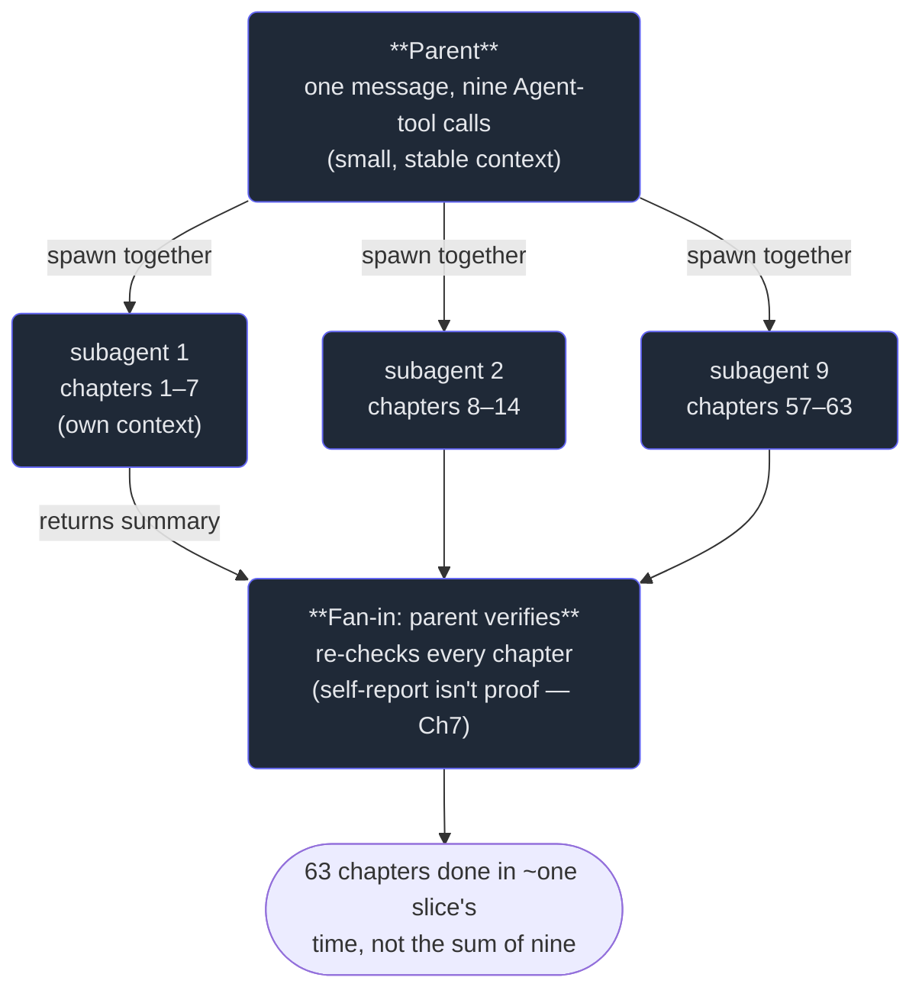

# 4. Parallel fan-out

## TL;DR

> **Fan-out** means launching *several* subagents in **one** message so they run **concurrently**
> instead of one-after-another. The payoff is a law you already met with fibers: for **independent**
> work, parallel wall-clock is the **MAX** of the children's times, not the **SUM**. Nine 10-minute
> tasks done in a row take 90 minutes; fanned out, ~10. The two catches: it only works when the
> children **don't depend on each other** (dependent stages need pipelines — Chapter 5), and breadth
> isn't free — too many at once can swamp rate limits, cost, or your machine, so you **cap
> concurrency**. With a cap of C and N children it's `ceil(N/C)` rounds, each costing the max of its
> batch. This is the engine that gave 63 Production-Engineering chapters their collapsible answers in
> a single fan-out — nine subagents at once, not nine passes in a row.

## 1. Motivation

In the last chapter we briefed *one* subagent well. But the headline win of subagents isn't one
well-briefed child — it's *many at once*. Recall the claim from Chapter 1: parallelism turns
"sum-of-work" wall-clock into "max-of-work." This chapter is where we cash that claim.

Here is the real moment. The **Production Engineering** book had **63 chapters** that each needed the
same mechanical edit: wrap every exercise's answer in a collapsible `<details>` block. One agent could
have walked them in a row — open chapter, add the blocks, save, next — sixty-three times. At a couple
of minutes each that's a long, dull afternoon, and the agent's context slowly fills with sixty-three
chapters it doesn't need.

We didn't do that. We spawned **nine general-purpose subagents in a single message**, each handed a
slice of about seven chapters, each working in its **own** context. They ran **concurrently**. The
whole job finished in roughly the time the *slowest* slice took — not the sum of all nine. Then the
parent did the one thing that doesn't parallelize away: it **verified** every chapter (Chapter 7).
That same shape authored this very book: each Part you've read was written by **~6–10 subagents fanned
out together**, then checked. Fan-out isn't an exotic optimization. It's the default move the instant
your work is *wide* and the pieces are *independent*.

## 2. Intuition (Analogy)

Picture a **newsroom on deadline**. Tomorrow's paper needs nine stories, and the press runs at
midnight — miss it and the edition doesn't print.

One reporter writing all nine **in a row** is doomed: even at her fastest, nine stories back-to-back
blow past midnight. The whole paper waits on the *sum* of the writing.

So the editor does the obvious thing — assigns **nine reporters, one story each**, and they write **at
the same time**. Now the paper is ready the moment the **slowest** story is filed, not after all nine
are added up. That's the *max*, not the sum. The editor (the **parent**) doesn't write; she briefs,
waits for the filings, and then **fact-checks each one** before it runs — because a reporter saying
"it's solid" isn't proof (Chapter 7).

Two honest wrinkles the newsroom knows well. First, this only works because the stories are
**independent** — nobody's piece needs another's first. A follow-up that can't start until the lead
story lands is a *pipeline*, not a fan-out (Chapter 5). Second, the newsroom has only so many desks
and editors: assign *fifty* reporters and the editor drowns in filings she can't check fast enough.
Real newsrooms **cap** how many run at once. Same with subagents.

| | One reporter, nine stories in a row | **Nine reporters, in parallel** |
|---|---|---|
| Wall-clock | **Sum** of all nine (misses the press) | **Max** — done when the slowest files |
| Who writes | The one reporter, sequentially | Nine, concurrently, each own desk |
| Editor's job | Also writing — no time to edit | **Briefs + fact-checks** each filing |
| Requirement | — | Stories must be **independent** |
| Limit | Bounded by one person's hours | Bounded by **desks** (cap concurrency) |

## 3. Formal Definition

**Fan-out** is the act of spawning **N** subagents from a single parent turn so they execute
**concurrently**, each in its own isolated context, returning N independent results the parent then
collects (and verifies). The mechanism in Claude Code is concrete: **multiple Agent-tool calls placed
in one assistant message launch in parallel**; the same calls spread across separate messages run
**sequentially**. One message, many children — that's the whole trick.

The wall-clock law, stated precisely:

- **Sequential** (one at a time): `T_seq = sum(durations)`.
- **Parallel, uncapped** (cap ≥ N): `T_par = max(durations)` — the slowest child sets the clock.
- **Parallel, capped at C**: split the N tasks into `ceil(N / C)` **rounds** of up to C each; each
  round costs the **max** of its batch, so `T_cap = sum over rounds of max(batch)`. As C → N this
  collapses to the uncapped `max`; as C → 1 it degrades to the sequential `sum`.

| Term | Meaning |
|---|---|
| **Fan-out** | Spawning many subagents in one message to run concurrently. |
| **Concurrency / parallelism** | Multiple children executing at the same time (the fibers idea, at the agent level). |
| **Wall-clock** | Elapsed real time to finish — what you actually wait. Sum if sequential, max if parallel. |
| **Concurrency cap (C)** | The most children allowed to run at once; bounds load, cost, and rate-limit pressure. |
| **Round / batch** | One wave of up to C children under a cap; there are `ceil(N/C)` of them. |
| **Independent work** | Tasks with no data dependency between them — the precondition for fan-out. |
| **Fan-in** | The parent collecting and verifying the N returned results after the fan-out. |

> The one line: **independent work parallelizes; the clock follows the slowest child, not the pile.**
> Fan-out converts *N sequential waits* into *one wait the length of the worst case* — capped only by
> how many you dare run at once. Width that used to cost time now costs almost none; it costs
> concurrency budget instead.

## 4. Worked Example

One parent spawns many children **in a single message**; they run at once; the parent fans them back
in and verifies. Here is the real 63-chapter job (drawn with three of the nine children for clarity):



**The wall-clock comparison.** Say the nine slices took, in minutes,
`[12, 9, 14, 11, 8, 13, 10, 15, 9]` — they differ because some slices had heavier chapters. That's
**101 agent-minutes of total work**.

- **Sequential** (one agent, all 63 chapters in a row): you wait the **sum** → **101 minutes**.
- **Fanned out, all nine at once** (cap ≥ 9): you wait the **max** → **15 minutes** (the slowest
  slice). That's a **6.73×** speedup, and notice the other eight finished *while* the 15-minute one
  ran — their time is simply absorbed.

The 86 minutes you didn't wait weren't *saved* by working faster; the work still cost 101
agent-minutes. They overlapped. That overlap is the entire point, and it's exactly the **sum → max**
move you saw with fibers — only now each "fiber" is a whole agent with its own window.

## 5. Build It

Let's make the law executable. This models a fan-out's wall-clock from a list of task durations and a
concurrency cap C: `sequential = sum`, `parallel_uncapped = max`, and `parallel_capped = sum of each
round's max` over `ceil(N/C)` rounds. We run it on the real nine-agent job (at cap 10 = all-at-once,
and at a throttled cap of 3), on authoring a 10-chapter Part, and finally on identical tasks to expose
the sum-vs-max gap. No real spawning, no sleeping — just the arithmetic of overlap.

```python run
import math

# --- Model: wall-clock of a fan-out ---------------------------------------
# N independent sub-tasks, each with a duration (minutes). A concurrency cap C
# limits how many run AT ONCE. We compute three wall-clocks:
#   sequential        = sum(durations)                 # one agent, one at a time
#   parallel_uncapped = max(durations)                 # all at once, no cap
#   parallel_capped   = sum of (max per round), over ceil(N/C) rounds of size C


def sequential(durations):
    """One agent does them in a row: the wall-clock is the SUM."""
    return sum(durations)


def parallel_uncapped(durations):
    """All children at once (cap >= N): wall-clock is the MAX (slowest child)."""
    return max(durations)


def chunk(durations, c):
    """Split the task list into rounds of size c (a batch per round)."""
    return [durations[i:i + c] for i in range(0, len(durations), c)]


def parallel_capped(durations, c):
    """Cap of C: run ceil(N/C) rounds; each round costs the MAX in that batch."""
    rounds = chunk(durations, c)
    return sum(max(batch) for batch in rounds)


def speedup(base, faster):
    """How many times faster `faster` is than `base` (>=1 means a win)."""
    return base / faster if faster else float("inf")


# --- The real scenario ----------------------------------------------------
# 9 general-purpose subagents added collapsible answers to 63 Production-
# Engineering chapters AT ONCE (~7 chapters each). Plausible per-agent minutes
# (they differ: bigger chapters take longer). These are illustrative durations.
TASK = "agent"
durations = [12, 9, 14, 11, 8, 13, 10, 15, 9]  # minutes per subagent, N = 9
N = len(durations)

print(f"Fan-out scenario: {N} {TASK}s, durations (min) = {durations}")
print(f"  total work = {sum(durations)} agent-minutes, slowest = {max(durations)} min")
print()

seq = sequential(durations)
par_all = parallel_uncapped(durations)

print("-- one agent at a time (sequential, SUM) --")
print(f"  wall-clock = {seq} min")
print()

print("-- all 9 at once (cap C = 10 >= N, uncapped, MAX) --")
print(f"  wall-clock = {par_all} min")
print(f"  speedup vs sequential = {speedup(seq, par_all):.2f}x")
print()

# Throttled: a concurrency cap of 3 (mindful of machine load / rate limits).
C = 3
par_cap = parallel_capped(durations, C)
rounds = chunk(durations, C)
print(f"-- throttled to cap C = {C} (ceil({N}/{C}) = {math.ceil(N / C)} rounds) --")
for i, batch in enumerate(rounds, 1):
    print(f"  round {i}: batch {batch} -> costs max = {max(batch)} min")
print(f"  wall-clock = sum of per-round maxes = {par_cap} min")
print(f"  speedup vs sequential = {speedup(seq, par_cap):.2f}x")
print(f"  cost of the cap vs all-at-once = +{par_cap - par_all} min")
print()

# --- Authoring THIS book's Parts the same way -----------------------------
# Each Part was authored by ~6-10 subagents fanned out together. Take Part 3
# (10 chapters). Suppose each chapter-agent takes ~6 min; the parent then
# verifies. Sequential vs fan-out, both uncapped and at a cap of 4.
part_durations = [6] * 10
pN = len(part_durations)
p_seq = sequential(part_durations)
p_par = parallel_uncapped(part_durations)
p_cap4 = parallel_capped(part_durations, 4)

print(f"Authoring a 10-chapter Part ({pN} agents x 6 min each):")
print(f"  sequential        = {p_seq} min")
print(f"  all-at-once (MAX) = {p_par} min  ({speedup(p_seq, p_par):.1f}x faster)")
print(f"  cap C = 4         = {p_cap4} min  "
      f"({speedup(p_seq, p_cap4):.1f}x, {math.ceil(pN / 4)} rounds)")
print()

# --- The sum -> max law, made literal -------------------------------------
print("The law: sequential grows with the SUM; fan-out with the MAX.")
print(f"{'N':>3} | {'sequential (sum)':>16} | {'fan-out (max)':>13}")
print("-" * 40)
for n in (1, 3, 6, 9, 12):
    d = [10] * n  # n identical 10-min tasks: makes sum vs max stark
    print(f"{n:>3} | {sequential(d):>16} | {parallel_uncapped(d):>13}")
print()
print("Identical tasks: sum = N x 10 (climbs); max = 10 (flat). That gap is")
print("the entire reason to spawn them in ONE message instead of N.")
```

Running this prints the nine-agent job at **101 min sequential** vs **15 min** fanned out
(**6.73×**), the throttled cap-3 run at **42 min** across **3 rounds** (still **2.40×**, costing
**+27 min** for the safety of fewer concurrent children), and the identical-task table where
`sequential` climbs `10 → 30 → 60 → 90 → 120` while `fan-out` stays pinned at **10**. **Now tighten
the cap.** Set `C = 1` and `parallel_capped` collapses back to the sequential sum — one desk is just
working in a row. Set `C = N` and it equals the uncapped max. The cap is the dial between those two
worlds, and the whole skill is choosing where to set it.

## 6. Trade-offs & Complexity

| Parallel fan-out (many at once) | Sequential (one at a time) |
|---|---|
| Wall-clock = **max** of children (≈ slowest) | Wall-clock = **sum** of all children |
| Width costs **concurrency budget**, not time | Width costs **time**, linearly |
| Best for **independent** tasks | Fine for **dependent** tasks (natural ordering) |
| Cap tunes load vs speed (`ceil(N/C)` rounds) | No cap to tune; no contention |
| Fan-in/verify N results adds coordination | One result to check; trivial coordination |
| Can swamp rate limits / cost / machine | Gentle, predictable resource use |
| Parent holds N summaries (still lean — Ch1) | Parent's window fills with the whole job |

The cost model is honest. Uncapped, you trade **time for concurrency**: you stop waiting on the sum,
but you spend N children's worth of tokens, tool calls, and machine load *simultaneously* — a spike
that can trip rate limits or thrash a laptop running heavy tools in every child. The **cap** buys that
spike back down at the price of `ceil(N/C)` rounds instead of one. So the real decision isn't "parallel
or not" — for independent width it's almost always parallel — it's **how wide per round**. Scope the
breadth (don't fan out 200 trivial lookups), pick a C your limits and machine can sustain, and
remember the fan-in: N results still have to be **verified**, and that work doesn't vanish.

## 7. Edge Cases & Failure Modes

- **Hidden dependencies.** Fan-out assumes the children are independent. If task B secretly needs task
  A's output, running them together yields B working from nothing — confidently wrong. Dependent stages
  belong in a **pipeline** with a barrier (Chapter 5), not a flat fan-out.
- **Runaway breadth.** Spawning hundreds at once can exhaust rate limits, balloon cost, or peg the
  machine if each child runs heavy tools. **Cap concurrency** and **scope** what you fan out — this was
  our explicit caution on the 63-chapter job: we were mindful of machine load and didn't fan out
  unbounded.
- **The straggler sets the clock.** Parallel wall-clock is the **max**, so one pathological child
  (a huge slice, a retry storm) holds up the whole fan-in. Balance slice sizes; consider timeouts.
- **Sequential-by-accident.** Putting each Agent call in its **own message** runs them one-by-one — you
  pay the *sum* while believing you fanned out. They must share **one** message to overlap.
- **Skipping the fan-in.** The children return; the job isn't done. Trusting nine "all good!" reports
  without re-checking is the classic multi-agent failure (Chapter 7) — fan-out multiplies output *and*
  the surface area to verify.
- **Shared-resource collisions.** Independent *logically* isn't independent *physically* — children
  writing the same file or row can clobber each other. Give each child a disjoint slice (separate
  files/ranges), as the 63-chapter split did.

## 8. Practice

> **Exercise 1 — Do the wall-clock math.** Five independent subagents have durations (minutes)
> `[4, 9, 6, 9, 5]`. Give the sequential wall-clock, the uncapped-parallel wall-clock, and the
> capped-at-C=2 wall-clock (rounds in list order). State the uncapped speedup vs sequential.

<details>
<summary><strong>Answer</strong></summary>

Using the §3 law:

- **Sequential = sum** = 4 + 9 + 6 + 9 + 5 = **33 min**.
- **Parallel uncapped = max** = **9 min** (the slowest of the five sets the clock; the others finish
  underneath it). Speedup = 33 / 9 ≈ **3.67×**.
- **Capped at C = 2** → `ceil(5/2) = 3` rounds of up to two, each costing its batch's max:
  - round 1 `[4, 9]` → max **9**
  - round 2 `[6, 9]` → max **9**
  - round 3 `[5]` → max **5**
  - total = 9 + 9 + 5 = **23 min** (speedup 33 / 23 ≈ 1.43×).

So the cap trades the ideal 9 min back up to 23 — still well under the 33-min sum, the price of running
only two at a time.

</details>

> **Exercise 2 — Fan out, pipeline, or keep?** For each, say which and why: (a) "summarize 40
> independent log files, one summary each"; (b) "first design the schema, then write the migration that
> depends on it, then write tests against that migration"; (c) "rename one variable in one file."

<details>
<summary><strong>Answer</strong></summary>

- **(a) Fan out.** Forty *independent* tasks — a textbook fan-out. Spawn N children in one message;
  wall-clock becomes the max (slowest file), not the sum of forty. Cap concurrency (say 8–10 per round)
  so forty-at-once doesn't swamp limits — `ceil(40/10) = 4` rounds.
- **(b) Pipeline, not fan-out.** These have a hard **data dependency**: the migration needs the schema,
  the tests need the migration. Run them in order with a barrier between stages (Chapter 5). Fanning
  them out would have the migration agent guessing at a schema that doesn't exist yet.
- **(c) Keep — don't spawn at all.** A one-file, one-line rename is *trivia*; the spawn/fan-in overhead
  dwarfs the work. Fan-out earns its keep on **width**, not on single tiny edits (the over-delegation
  trap from Chapter 1).

Throughline: fan out **independent width**, pipeline **dependent stages**, and keep **trivia** inline.

</details>

> **Exercise 3 — Why one message?** A teammate spawns ten Explore subagents but puts each Agent-tool
> call in a *separate* assistant message, then complains the job took as long as doing it himself. In
> terms of §3, what went wrong and what's the fix?

<details>
<summary><strong>Answer</strong></summary>

Concurrency comes from **multiple Agent-tool calls in a single message** — that's what launches them
in parallel. Spread across **separate** messages, the calls run **sequentially**: each child finishes
before the next starts. So the teammate paid `T_seq = sum(durations)` — the same as doing it himself —
while believing he had fan-out. He got isolation (ten clean contexts) but **not** parallelism.

The fix: put all ten Agent calls in **one** message. Then wall-clock drops to `max(durations)`, the
slowest of the ten. (And if ten-at-once is too heavy for the rate limits or machine, batch them under a
cap — `ceil(10/C)` rounds — which is still far better than ten sequential waits.) One message is the
difference between the *sum* and the *max*.

</details>

```quiz
{
  "prompt": "Nine independent subagents are fanned out in a single message; their durations are 12, 9, 14, 11, 8, 13, 10, 15, and 9 minutes. With concurrency uncapped (all nine run at once), what is the approximate wall-clock?",
  "input": "Choose one:",
  "options": [
    "About 15 minutes — the MAX of the durations, since they run concurrently and the slowest child sets the clock",
    "101 minutes — the SUM of all nine durations",
    "About 11 minutes — the average of the durations",
    "9 minutes — one child's time, because the rest are free"
  ],
  "answer": "About 15 minutes — the MAX of the durations, since they run concurrently and the slowest child sets the clock"
}
```

## Your Turn

Before you move on, check your understanding with the coach — explain the idea, apply it, weigh the trade-offs, then defend your reasoning.

<div class="concept-coach"></div>

## In the Wild

- **[Anthropic — How we built our multi-agent research system](https://www.anthropic.com/engineering/built-multi-agent-research-system)**
  — a production lead agent fans out to subagents that search in parallel, then synthesizes; the exact
  sum→max win, and candid notes on the token/coordination cost of breadth.
- **[Anthropic — Building effective agents](https://www.anthropic.com/engineering/building-effective-agents)**
  — the **parallelization** pattern (sectioning independent work across agents) versus orchestration,
  and when each pays off.
- **[Claude Code — Subagents](https://docs.claude.com/en/docs/claude-code/sub-agents)** — the tool you
  fan out with; multiple Agent calls in one turn are what run concurrently.

---

**Next:** fan-out handles *independent* width — but real pipelines have *stages* (this depends on
that), barriers, loops that run until dry, and a final verify. How do you compose subagents into those
shapes? → [5. Orchestration patterns](/cortex/the-claude-stack/subagents-and-orchestration/orchestration-patterns)
