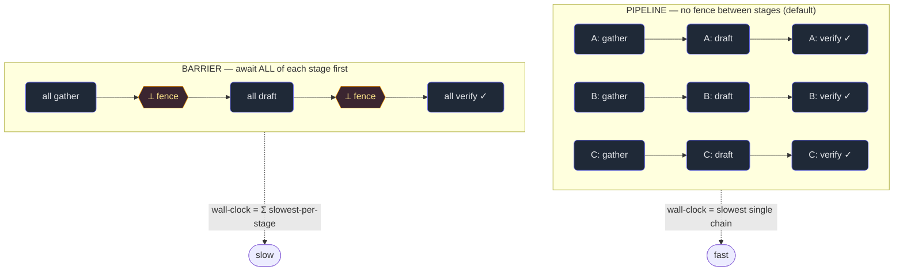

# 5. Orchestration patterns

## TL;DR

> Once you can spawn (Chapter 2), brief (Chapter 3), and fan out (Chapter 4) subagents, you compose
> them into **patterns** — named, reusable shapes of multi-agent work. The core five: **fan-out →
> synthesize** (N workers in parallel, then one combiner), **pipeline** (each item flows through *all*
> stages independently, **no fence between stages** — the default for multi-stage work), **parallel /
> barrier** (await *all* of stage N−1 before starting stage N — only when stage N truly needs the whole
> set), **loop-until-dry** (for unknown-size discovery, keep spawning finder rounds until K in a row
> find nothing new), and **verify-each** (every output independently re-checked, Chapter 7). The one
> insight to keep: **a pipeline beats a barrier when per-item times vary**, because a barrier idles the
> fast items waiting for the slowest. Default to the pipeline; reach for a barrier *only* when a stage
> genuinely needs all of the previous one (dedup, merge, early-exit).

## 1. Motivation

Chapter 4 gave you the raw move: spawn many subagents at once. But "spawn a bunch" is not yet a
*design*. Real work has *shape* — items move through stages, some stages need the whole batch and
some don't, the set of things to do is sometimes unknown until you go looking. Pick the wrong shape
and you pay for it in wall-clock: the most common multi-agent performance bug is **an accidental
barrier** — making every item wait at a fence between stages when nothing actually required them to.

Watch it happen with **this book**. The authoring loop is a real two-stage shape: **fan-out** (spawn
one subagent per chapter to *write* it) feeding **verify-each** (independently re-run every Python
block, Chapter 7). Now imagine running it as a *barrier*: "first, ALL chapters must finish drafting;
only then may verification begin." Chapter 4 (this one's neighbor) is a quick draft — done in minutes
— but under the barrier it sits idle, fully written, waiting for the one slow, sprawling chapter to
finish before *any* verification starts. The fast chapter's idle time is pure waste, because
verifying chapter 4 never needed chapter 2 to exist. The right shape is a **pipeline**: the instant a
chapter is drafted, *its* verifier starts — chapter 4 is being verified while chapter 2 is still being
written. No fence. The line drains as fast as the slowest single chapter's own write-then-verify
chain, not as the sum of "slowest draft" plus "slowest verify."

When *would* a barrier be right? If we needed to **dedup findings across all chapters** before acting
— say, collect every "broken link" each chapter's verifier found and remove duplicates globally — that
merge genuinely needs the *whole set*. It cannot start until the last verifier reports. That's a real
barrier, forced by the data, not a tax we chose. This chapter is about telling those two situations
apart, and naming the other shapes you'll reuse.

## 2. Intuition (Analogy)

Picture a **car wash** with three bays in a row: **soap → rinse → wax**.

The way every real car wash works is a **pipeline**. The moment car A leaves the soap bay it rolls
into rinse, and car B immediately takes the soap bay. The bays *never idle*: while A is being waxed, B
is rinsing and C is soaping. Throughput is continuous, and a quick car (clean already, fast soap)
sails through without waiting for a mud-caked truck two cars back. The line's pace is set by the
*slowest single vehicle's trip through all three bays*, not by forcing everyone to lockstep.

Now imagine running it as a **barrier**: *every* car must finish soaping before *any* car may rinse.
The whole lot soaps, then idles bumper-to-bumper until the slowest car finishes soap, then the whole
lot rinses, idles again, then waxes. It's absurd — and slower — because rinsing car A never needed car
B to be soaped. You'd only impose that fence if the next bay genuinely needed *all* the cars present
at once. (It doesn't here. But if "wax" were really "load all the clean cars onto one transport
truck," the truck *can't leave* until every car is washed — that step truly needs the whole batch.
*That's* the rare barrier.)

So: pipeline by default; barrier only for the one step that genuinely needs the whole batch.

| | **Pipeline** (default) | **Barrier** (parallel, await-all) |
|---|---|---|
| Between stages | No fence — items stream straight on | A fence: await *all* of stage N−1 before stage N |
| A fast item | Drains immediately; never waits for slow ones | Idles at every fence until the slowest catches up |
| Wall-clock | Slowest *single item's* whole chain | Sum over stages of the *slowest item per stage* |
| Bays/workers | Always busy; continuous throughput | Idle in lockstep between stages |
| Use when | Stages are independent per item (the common case) | Stage N genuinely needs the **whole set** from N−1 |
| Car-wash | Soap→rinse→wax, cars flowing | "Wait for all, then load the transport truck" |

## 3. Formal Definition

An **orchestration pattern** is a reusable arrangement of subagents and the *control flow* (what waits
on what) and *data flow* (what feeds what) between them. Here is the working catalog.

- **Fan-out → synthesize.** Spawn N independent workers in parallel (Chapter 4); when they return, one
  **synthesizer** agent combines their results into a single answer. The shape behind multi-agent
  research: many gatherers, one writer. The synthesize step is itself a *barrier* (it needs all N), but
  a deliberate, single one at the end.
- **Pipeline.** Each item flows through *all* stages **independently**, with **no barrier between
  stages**. Item A can be in stage 3 while item B is still in stage 1. Wall-clock is the **slowest
  single item's whole chain**, *not* the sum of per-stage maxes. This is the **default** for
  multi-stage work.
- **Parallel / barrier.** Await **all** of stage N−1 before starting stage N. Justified **only** when
  stage N genuinely needs the *full set* from N−1 — e.g. dedup/merge across all findings, or an
  early-exit ("0 found across the whole batch → skip the next stage entirely"). A barrier wastes the
  fast items' idle time, so don't reach for it just because stages *feel* separate.
- **Loop-until-dry.** For **unknown-size discovery** (find *all* the bugs / edge-cases), keep spawning
  finder rounds until **K consecutive rounds find nothing new**. A fixed counter (`while count < N`)
  guesses the set's size and **misses the tail**.
- **Verify-each.** Every finding/output is **independently checked** — often by a *fresh* agent that
  never saw the work being produced (Chapter 7). Pairs with every other pattern as the final stage.

| Term | Meaning |
|---|---|
| **Stage** | One step every item passes through (e.g. gather → draft → verify). |
| **Barrier (fence)** | A synchronization point: *nothing* past it starts until *everything* before it finishes. |
| **Pipeline** | Stages with **no** barrier between them; items stream stage-to-stage independently. |
| **Fan-out → synthesize** | N parallel workers, then one combiner that needs all N (a single end barrier). |
| **Loop-until-dry** | Repeat discovery rounds until **K consecutive** empty rounds; size is data-driven, not guessed. |
| **Verify-each** | Independent re-check of every output, typically by a fresh agent. |
| **Wall-clock** | Elapsed real time to finish — the number a barrier inflates and a pipeline minimizes. |

> The one line: **default to the pipeline; add a barrier only where a stage truly needs all of the
> prior stage.** Most stages are independent per item, so most fences are accidental — and every
> accidental fence makes your fast items sit and wait on your slowest.

## 4. Worked Example

Two shapes, same three stages (`gather → draft → verify`), contrasted. On the left, a **pipeline**:
no fence, each item streams straight through. On the right, a **barrier** after each stage: everyone
waits for the slowest item before the batch moves on.



**A worked timing.** Take four items with *varying* per-stage durations (units of time):

| item | gather | draft | verify | **chain (sum)** |
|---|---|---|---|---|
| ch-A | 3 | 2 | 1 | 6 |
| ch-B | 1 | **6** | 1 | 8 |
| ch-C | 2 | 1 | 2 | 5 |
| ch-D | 1 | 2 | 3 | 6 |

- **Barrier**: each stage costs its *slowest* item, and stages run in lockstep, so
  `total = max(gather) + max(draft) + max(verify) = 3 + 6 + 3 = `**`12`**.
- **Pipeline**: no fence, so each item drains in *its own* chain time; the line finishes when the
  slowest single chain does: `total = max(6, 8, 5, 6) = `**`8`**.

The pipeline finishes in **8** vs the barrier's **12** — a third less wall-clock — purely because the
barrier idled ch-A, ch-C, and ch-D at each fence waiting on ch-B's slow draft. Notice *what set the
times*: the barrier paid `max(draft)=6` **plus** `max(gather)=3` **plus** `max(verify)=3`, summing
three separate "slowest"s; the pipeline paid only the **single** worst chain (ch-B's 8). When per-item
times vary, those are very different numbers — and the gap only widens with more stages and more
spread. The next section computes all of this from scratch, draws the timeline, and shows the one case
where the barrier is *not* a choice.

## 5. Build It

This models pipeline vs barrier wall-clock arithmetically — **no real spawning, no sleep**, just the
durations. It also draws an ASCII timeline (so you can *see* there's no fence), then shows the case
where a final step needs the whole set (barrier forced), and finally contrasts a fixed counter with
loop-until-dry on unknown-size discovery.

```python run
"""Pipeline vs barrier wall-clock, deterministic — no real spawning, no sleep.

Each ITEM passes through STAGES. We compare two ways to run a multi-stage,
multi-item job, computing durations arithmetically (no timers).

  BARRIER  : finish ALL items at stage k before ANY item starts stage k+1.
             Each stage's wall-clock = the slowest item in that stage,
             so total = sum over stages of max(stage durations across items).
             Everyone idles waiting for the slowest at every stage.

  PIPELINE : each item flows through ALL its stages INDEPENDENTLY — there is
             NO barrier between stages. Item A can be in stage 3 while item B
             is still in stage 1, because each item runs in its own worker.
             So the line drains when the SLOWEST SINGLE ITEM finishes its whole
             chain: total = max over items of (that item's stage-sum).

Same total work either way; the only difference is whether the fast items have
to wait at a fence for the slow ones.
"""

STAGES = ["gather", "draft", "verify"]
ITEMS = {
    "ch-A": [3, 2, 1],   # gather-heavy
    "ch-B": [1, 6, 1],   # one slow drafter
    "ch-C": [2, 1, 2],   # quick
    "ch-D": [1, 2, 3],   # verify-heavy
}


def barrier_time(items, stages):
    """Sum over stages of the slowest item at that stage (a fence per stage)."""
    total = 0
    per_stage_max = []
    for s in range(len(stages)):
        slowest = max(dur[s] for dur in items.values())
        per_stage_max.append(slowest)
        total += slowest
    return total, per_stage_max


def pipeline_time(items):
    """No barrier between stages: each item runs its whole chain independently.

    The line drains when the slowest single item finishes — so the wall-clock
    is the MAX over items of that item's stage-sum, NOT the sum of per-stage
    maxes. Fast items never wait for slow ones.
    """
    chains = {name: sum(dur) for name, dur in items.items()}
    return max(chains.values()), chains


def sequential_time(items):
    """Naive baseline: one item fully done before the next even starts."""
    return sum(sum(dur) for dur in items.values())


def bar(value, scale=2, ch="#"):
    return ch * (value * scale)


print("=" * 62)
print("PIPELINE vs BARRIER  -  same work, different wall-clock")
print("=" * 62)
print()
print("Per-item stage durations (units):")
print("  item   " + "  ".join(f"{s:>7}" for s in STAGES) + "    chain")
for name, dur in ITEMS.items():
    cells = "  ".join(f"{d:>7}" for d in dur)
    print(f"  {name:<5}  {cells}    {sum(dur):>4}")
print()

seq = sequential_time(ITEMS)
b_total, per_stage = barrier_time(ITEMS, STAGES)
p_total, chains = pipeline_time(ITEMS)

print(f"sequential (one item at a time)      : {seq:>3} units")
print()
print("BARRIER  (await ALL of stage k before stage k+1):")
for s, mx in zip(STAGES, per_stage):
    print(f"    stage {s:<7}: everyone waits for slowest = {mx:>2}")
maxes = " + ".join(str(m) for m in per_stage)
print(f"    total = {maxes} (sum of per-stage maxes) : {b_total:>3} units  {bar(b_total)}")
print()
print("PIPELINE (each item streams through all stages, no fence):")
for name, c in chains.items():
    print(f"    {name} runs its own chain, finishes at t = {c:>2}")
print(f"    total = max single chain             : {p_total:>3} units  {bar(p_total)}")
print()

saved = b_total - p_total
pct = round(100 * saved / b_total)
print(f"--> PIPELINE beats BARRIER by {saved} units ({pct}% less wall-clock).")
print("    The barrier idled every fast item at each fence; the pipeline let")
print("    each item drain as fast as ITS OWN chain allowed.")
print()


def render_pipeline_timeline(items, stages):
    """ASCII Gantt: each item's stages laid end-to-end, plus idle '.' to the
    finish line. Shows visually that fast items finish early and sit idle while
    the slowest chain (ch-B) sets the wall-clock — no inter-stage fence."""
    glyph = {0: "g", 1: "d", 2: "v"}   # one letter per stage index
    end = max(sum(d) for d in items.values())
    print("    pipeline timeline (g=gather d=draft v=verify  .=done/idle):")
    for name, dur in items.items():
        row = ""
        for s, length in enumerate(dur):
            row += glyph[s] * length
        row += "." * (end - len(row))
        print(f"      {name} |{row}| t={sum(dur)}")
    ruler = "".join(str((i + 1) % 10) for i in range(end))
    print(f"           |{ruler}|")


render_pipeline_timeline(ITEMS, STAGES)
print()
print("    Read it across: there is NO vertical fence between stages — ch-C is")
print("    in 'verify' while ch-B is still mid-'draft'. The line drains at t=8,")
print("    set by ch-B's chain alone. A barrier would draw a fence after each")
print(f"    stage, pushing the finish out to {b_total}.")
print()

# ---------------------------------------------------------------------------
# Now a case where the LAST step genuinely needs ALL items at once
# (e.g. dedup/merge across every finding). Here a barrier is REQUIRED:
# the merge cannot begin until every item's finding exists.
# ---------------------------------------------------------------------------
print("=" * 62)
print("WHEN A BARRIER IS REQUIRED  -  the step needs the whole set")
print("=" * 62)
print()
FIND = {  # each item: gather -> find (independent, pipelined)
    "ch-A": [3, 2],
    "ch-B": [1, 6],
    "ch-C": [2, 1],
    "ch-D": [1, 2],
}
MERGE = 5  # one global 'dedup across ALL findings' step

# When is each item's finding ready? Pipelined: its own gather+find chain.
ready = {name: sum(dur) for name, dur in FIND.items()}
all_in = max(ready.values())          # the merge can't start before this
done = all_in + MERGE

print("Each item: gather -> find  (pipelined, independent).")
print("Then ONE global merge that must see EVERY item's finding (cross-item")
print("dedup) — a genuine barrier, because the merge needs the whole set.")
print()
for name, r in ready.items():
    print(f"    {name} finding ready at t = {r:>2}")
print(f"    earliest the merge can start  = max(ready) = {all_in}")
print(f"    + global merge ({MERGE})           -> done at t = {done}")
print()
print("Streaming buys the merge nothing: it CANNOT start until the whole set")
print("exists, so its earliest start IS the barrier point. The fence is not a")
print("tax you chose — the data dependency forces it.")
print()
print("Rule of thumb: DEFAULT to pipeline; reach for a barrier ONLY when a")
print("stage truly needs ALL of the previous stage (dedup / merge / early-exit).")
print()

# ---------------------------------------------------------------------------
# LOOP-UNTIL-DRY vs a fixed counter, for unknown-size discovery.
# We model "find all the bugs": the true set is unknown ahead of time, so a
# counter (run exactly N rounds) either stops too early (misses the tail) or
# wastes rounds. A drain loop runs until K CONSECUTIVE rounds find nothing new.
# Deterministic: each round's yield is fixed in DISCOVERY below.
# ---------------------------------------------------------------------------
print("=" * 62)
print("LOOP-UNTIL-DRY vs a fixed counter  -  unknown-size discovery")
print("=" * 62)
print()
# How many NEW bugs each successive finder round turns up (we don't know this
# shape in advance — that's the point). The tail is sparse: rounds can find
# nothing, then something, then nothing again.
DISCOVERY = [4, 3, 0, 1, 0, 0, 0]
TRUE_TOTAL = sum(DISCOVERY)
K_EMPTY = 3   # stop after this many consecutive empty rounds


def fixed_counter(discovery, n_rounds):
    """Run exactly n_rounds, no matter what — a 'while count < N' loop."""
    found = sum(discovery[:n_rounds])
    return found, n_rounds


def loop_until_dry(discovery, k_empty):
    """Keep spawning rounds until k_empty CONSECUTIVE rounds find nothing new."""
    found = 0
    consecutive_empty = 0
    rounds = 0
    for yield_ in discovery:
        rounds += 1
        found += yield_
        consecutive_empty = 0 if yield_ > 0 else consecutive_empty + 1
        if consecutive_empty >= k_empty:
            break
    return found, rounds


print(f"True bug count (unknown in advance): {TRUE_TOTAL}")
print(f"Per-round NEW finds                : {DISCOVERY}")
print()
fc_found, fc_rounds = fixed_counter(DISCOVERY, 3)   # a too-confident 'just 3 rounds'
print(f"fixed counter (N=3 rounds): found {fc_found}/{TRUE_TOTAL} in {fc_rounds} rounds")
print(f"    -> MISSED {TRUE_TOTAL - fc_found} (the late finds after the first 0-round)")
print()
ld_found, ld_rounds = loop_until_dry(DISCOVERY, K_EMPTY)
print(f"loop-until-dry (stop after {K_EMPTY} empty in a row): "
      f"found {ld_found}/{TRUE_TOTAL} in {ld_rounds} rounds")
status = "ALL found" if ld_found == TRUE_TOTAL else f"missed {TRUE_TOTAL - ld_found}"
print(f"    -> {status}: it kept going through the sparse tail until truly dry")
print()
print("A counter guesses the size of an unknown set and loses the tail; the")
print("drain loop lets the data tell it when to stop. Use loop-until-dry for")
print("open-ended discovery (find ALL bugs / edge-cases), not a fixed N.")
```

Running it prints `PIPELINE beats BARRIER by 4 units (33% less wall-clock)` — barrier `3+6+3 = 12`,
pipeline `max chain = 8`. The ASCII timeline shows ch-C reaching `verify` while ch-B is still mid-`draft`
(no fence). The second block shows the **forced** barrier: findings stream in, the last at `t=7`, and
the global merge — which needs them all — can only then run, finishing at `t=12`. The third shows a
fixed `N=3` counter finding `7/8` (it loses the find that arrives *after* the first empty round) while
loop-until-dry drains the sparse tail to `8/8`.

**Now break it.** Make the durations *uniform* — set every item to `[2, 2, 2]`. Re-derive by hand:
barrier `= 2+2+2 = 6`, pipeline `= max chain = 6`. They're **equal**: with no variance, the fence costs
nothing, because there's no fast item to idle. The pipeline's whole advantage *is* the spread in
per-item times — the more they vary, the more a barrier wastes. That's the precise condition: **vary
the durations and the pipeline pulls ahead; flatten them and the two converge.**

## 6. Trade-offs & Complexity

| Pattern | Wall-clock | Best when | Cost / failure mode |
|---|---|---|---|
| **Fan-out → synthesize** | `max(worker) + synth` | Many independent gathers, one combined answer | The single end-barrier (synth) waits on the slowest worker; one bad worker poisons the synthesis |
| **Pipeline** (default) | **Slowest single item's chain** | Multi-stage work where each item is independent per stage | Needs per-item workers / streaming; gives no global view mid-run |
| **Parallel / barrier** | **Σ slowest-per-stage** | Stage N genuinely needs *all* of N−1 (dedup, merge, early-exit) | Idles every fast item at each fence — pure waste when misapplied |
| **Loop-until-dry** | `(rounds-until-K-empty) × round` | Unknown-size discovery (find *all* X) | Can over-run the tail; needs a sane K and a hard round cap |
| **Verify-each** | `+1 stage` (parallel per item) | Any output you must not trust on self-report | Roughly doubles agent count; needs a *fresh* checker (Chapter 7) |

The headline trade is **pipeline vs barrier**, and it's not close in the common case: barrier cost is
`Σ max-per-stage` (you pay the slowest of *every* stage, added up), pipeline cost is `max single
chain` (you pay the worst *one* item, once). They coincide only when per-item times are uniform —
exactly when nothing is idling. So the barrier is never "free insurance"; it's a real bill you should
pay only when a stage's *data dependency* forces it. Verify-each is the one stage you almost always
*want* despite its cost, because an unverified result is a claim, not evidence (Chapters 1 and 7).

## 7. Edge Cases & Failure Modes

- **The accidental barrier.** By far the most common bug: stages "feel" separate, so you await all of
  one before starting the next — idling every fast item. Ask "does stage N need *all* of N−1, or just
  *its own* item's N−1 output?" If the latter, **delete the fence** and pipeline it.
- **A barrier you *can't* remove.** Cross-item dedup, a global merge, or an early-exit ("0 found across
  the whole batch → skip the rest") genuinely needs the full set. Here the fence isn't a choice — it's
  the data dependency. Don't fight it; just keep it to that one step.
- **Loop-until-dry with a counter.** Using `while count < N` for open-ended discovery **misses the
  tail** — the find that shows up after a quiet round (the model's `7/8`). Switch to "stop after K
  consecutive empty rounds," and always add a **hard cap** so a never-dry stream can't loop forever.
- **Synthesizer poisoned by one worker.** Fan-out → synthesize trusts its inputs; one confidently-wrong
  worker can corrupt the combined answer. Put **verify-each** *before* the synthesis, or have the
  synthesizer cross-check disagreements.
- **Unbounded fan-out inside a pattern.** A pipeline that spawns a fresh worker per item per stage can
  explode concurrency. Cap it (Chapter 4) — the pattern decides *control flow*, not *how many* run at
  once.
- **No verify stage at all.** Skipping verify-each because the workers "said they checked" is the
  classic multi-agent failure — a self-report is not evidence. Make the final stage an *independent*
  re-check by a fresh agent (Chapter 7).

## 8. Practice

> **Exercise 1 — Pipeline or barrier?** For each, say which shape fits and why: (a) "lint, then
> type-check, then test each of 40 *independent* files"; (b) "each of 12 sub-teams returns a list of
> security findings, and we must produce one **de-duplicated** master list across all of them"; (c)
> "scan a repo: if *zero* secrets are found across the whole codebase, skip the expensive remediation
> stage entirely."

<details>
<summary><strong>Answer</strong></summary>

The test (§3): **pipeline** unless stage N genuinely needs the *whole set* from N−1 — then **barrier**.

- **(a) 40 independent files, lint→type-check→test — PIPELINE.** Each file's type-check needs only
  *that file's* lint result, not all 40. So drop any fence: a fast file is being tested while a slow
  one is still linting. Wall-clock = the slowest single file's whole chain, not the sum of per-stage
  maxes.
- **(b) 12 finding-lists → one de-duplicated master — BARRIER (fan-out → synthesize).** The dedup
  *needs every list at once* (you can't remove a duplicate you haven't seen yet), so the merge can't
  start until the last sub-team reports. This is the rare forced fence — exactly the "load the
  transport truck" case from §2.
- **(c) Skip remediation iff zero secrets repo-wide — BARRIER (early-exit).** The "0 found?" decision
  is a property of the *whole* scan; you can't know it until every scanner finishes. The fence is the
  data dependency. (Note the contrast with (a): *most* multi-stage work is independent-per-item and
  should pipeline — (b) and (c) are the genuine exceptions.)

Throughline: independent per item → pipeline; needs-the-whole-set → barrier.

</details>

> **Exercise 2 — Do the wall-clock math.** Three items, two stages `[A, B]`: item-1 `[1, 5]`, item-2
> `[5, 1]`, item-3 `[2, 2]`. Compute the **barrier** total and the **pipeline** total, and say in one
> sentence what created the gap.

<details>
<summary><strong>Answer</strong></summary>

- **Barrier** = `max(stage A) + max(stage B)` = `max(1, 5, 2) + max(5, 1, 2)` = `5 + 5 = `**`10`**.
- **Pipeline** = `max single chain` = `max(1+5, 5+1, 2+2)` = `max(6, 6, 4) = `**`6`**.

The pipeline finishes in **6** vs the barrier's **10**. The gap exists because the barrier paid the
*slowest of each stage separately* — `5` for stage A (item-2) **plus** `5` for stage B (item-1),
summing two different "slowest"s — while the pipeline paid only the **single** worst chain (`6`). The
two slow halves live in *different* items, so the barrier double-counts them; the pipeline never makes
item-3 (chain `4`) wait for either. (Sanity check: this is exactly the `Σ max-per-stage` vs `max
single chain` formula from §6, and matches the Build-It model's shape.)

</details>

> **Exercise 3 — Why not just count?** A teammate writes an edge-case finder as "spawn exactly 5 finder
> rounds, collect everything." Using §3 and the §5 model, explain the bug and the fix, and name the two
> guardrails the fix still needs.

<details>
<summary><strong>Answer</strong></summary>

**The bug (loop-until-dry, §3):** a fixed count *guesses the size of an unknown set*. If the true
edge-cases are discovered as, say, `[4, 3, 0, 1, 0, 0, 0]`, a finder that stops at a low count — or
stops the instant a round returns `0` — **misses the tail**: in the §5 model, `N=3` rounds find only
`7/8`, losing the find that arrives *after* the first empty round. Discovery yield is lumpy; a quiet
round is not proof of "done."

**The fix:** **loop-until-dry** — keep spawning rounds until **K consecutive rounds find nothing new**
(the model uses `K=3` and reaches `8/8`). That makes the stopping condition *data-driven* instead of a
guess, and tolerates a single fluke empty round between real finds.

**Two guardrails it still needs:** (1) a sensible **K** (too small re-introduces the early-stop bug;
too large wastes rounds), and (2) a **hard round cap** so a stream that *never* goes K-empty (a noisy
or adversarial finder) can't loop forever. Loop-until-dry without a cap is an infinite loop waiting to
happen.

</details>

```quiz
{
  "prompt": "You have a multi-stage subagent job (each item: gather → draft → verify) where per-item durations vary a lot. Which orchestration shape minimizes wall-clock, and why?",
  "input": "Choose one:",
  "options": [
    "A pipeline (no barrier between stages): each item streams through all stages independently, so wall-clock is the slowest single item's whole chain — fast items never idle waiting for slow ones",
    "A barrier after every stage: await all items at each stage before the next, so the work stays neatly synchronized",
    "It makes no difference — pipeline and barrier always take the same wall-clock",
    "A loop-until-dry, because repeating the stages until nothing changes is always fastest"
  ],
  "answer": "A pipeline (no barrier between stages): each item streams through all stages independently, so wall-clock is the slowest single item's whole chain — fast items never idle waiting for slow ones"
}
```

## In the Wild

- **[Anthropic — How we built our multi-agent research system](https://www.anthropic.com/engineering/built-multi-agent-research-system)**
  — a production **fan-out → synthesize**: a lead agent spawns parallel subagent searchers, then
  combines their isolated results into one report. The §3 pattern at real scale.
- **[Anthropic — Building effective agents](https://www.anthropic.com/engineering/building-effective-agents)**
  — names the reusable workflow shapes (orchestrator-workers, parallelization, prompt-chaining/pipeline,
  evaluator-optimizer) and *when* each fits — the vocabulary this chapter applies to subagents.
- **[Claude Code — Subagents](https://docs.claude.com/en/docs/claude-code/sub-agents)** — the tool you
  compose these patterns out of; pair it with the next chapter's deterministic orchestration when the
  control flow needs to be scripted rather than reasoned.

---

**Next:** patterns are how *you* reason about control flow — but when the flow must be exact, repeatable,
and not left to a model's judgment, you script it. What is the tool that runs a deterministic
orchestration, and when should you reach for it over an agent? →
[6. The Workflow tool](/cortex/the-claude-stack/subagents-and-orchestration/the-workflow-tool)
