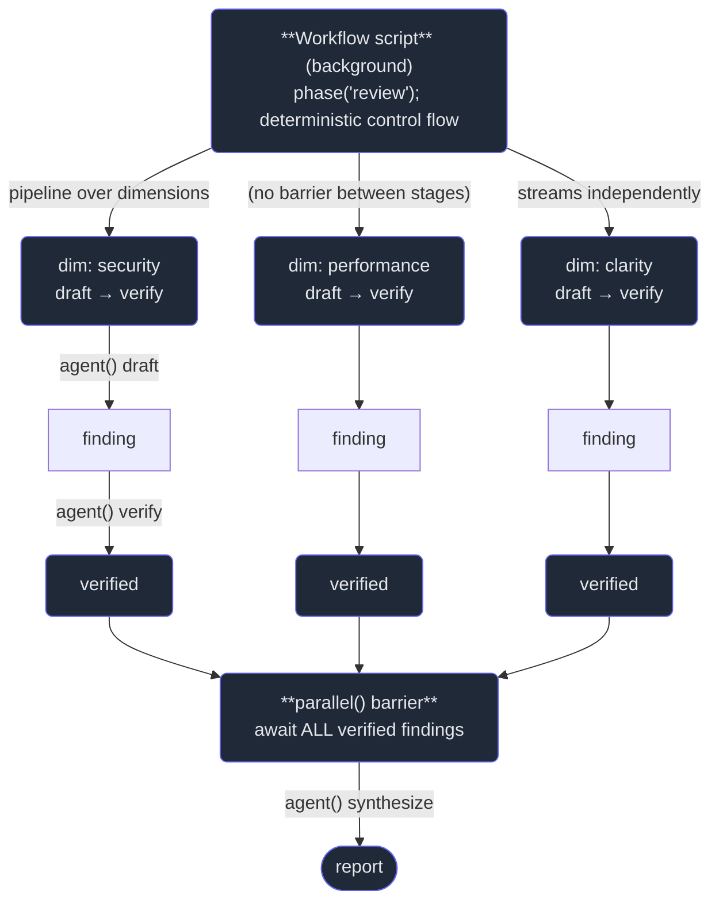

# 6. The Workflow tool

## TL;DR

> The **Workflow tool** runs a **deterministic orchestration script** (JavaScript) in the background
> that coordinates many subagents. Its primitives turn the Chapter-5 patterns into *code*:
> **`agent(prompt, opts)`** spawns one subagent and returns its text (or a validated object if you
> pass a `schema`); **`parallel(thunks)`** runs tasks concurrently and is a **barrier** (it awaits
> *all* of them); **`pipeline(items, stage1, stage2, …)`** streams each item through every stage
> **independently** (no barrier between stages); **`phase(title)`** / **`log(msg)`** report progress.
> Concurrency is capped automatically. You reach for a workflow when the **control flow itself should
> be deterministic and repeatable** — loops, conditionals, fan-out, verify-each, loop-until-budget —
> rather than improvised by the model turn-by-turn. For a quick one-off fan-out, ad-hoc Agent-tool
> spawning is fine; a workflow shines for the multi-phase pipeline you want to run **identically every
> time**.

## 1. Motivation

The last chapter gave you a vocabulary of orchestration *shapes* — pipeline, parallel, loop-until-dry,
verify-each. But where did those shapes *live*? In Chapters 1–5, they lived in the parent agent's head.
The parent read its instructions, *decided* turn-by-turn to spawn six children, *decided* to wait for
them, *decided* to verify each result. That works — it's exactly how this book was built. But notice
what it is: improvisation. The orchestration is reconstructed, from prose, every single run. Ask the
same parent to do the same job tomorrow and the control flow might come out subtly different — five
children instead of six, verify-then-synthesize instead of synthesize-then-verify, a loop that stops
one round early because the window got crowded.

For a one-off, who cares. But some orchestrations are *products* — you want to run them again and again
and get the *same* behavior each time. Imagine an "author-and-verify a chapter" system you'll invoke
fifty-eight times (once per file in this very book). You do **not** want the loop improvised fifty-eight
times. You want it written down: *draft each chapter, then run the verifier on each draft, deterministic
fan-out, capped concurrency, same steps every time.* That written-down orchestration is what the
**Workflow tool** is for. It runs a real **script** — JavaScript with `agent()`, `parallel()`,
`pipeline()`, `phase()`, `log()` — in the background, and the script *is* the control flow. Spawning,
waiting, looping, branching: all explicit code, not model improvisation.

Be honest about where we are. This book was built with **ad-hoc Agent-tool spawning** — a parent
spawned roughly six-to-ten chapter-agents per Part, then verified them (Chapter 1's `§4` diagram).
That was the right call for a one-shot authoring run. But the *production* version of "author + verify a
chapter" — the kind you'd ship and run on a schedule — is a textbook **workflow**: a pipeline of
`draft → verify`, fanned across chapters, run deterministically every time. That upgrade path is the
Part-6 capstone (Chapter 8), and the Workflow tool that makes it possible exists in this very
environment. This chapter is about the *judgment*: when to keep improvising, and when to write the
recipe down.

## 2. Intuition (Analogy)

You can cook a great meal **from memory**. A skilled cook eyeballs the salt, decides on the fly to sear
before they braise, tastes and adjusts. It's flexible and it's often brilliant — *for one meal*. But it
varies. Cook the same dish next week and the seasoning drifts, a step lands in a different order, the
result is *close* but not the *same*. That is ad-hoc spawning: the parent agent improvising the
orchestration, fresh, each run.

Now suppose you run a restaurant and this dish is on the menu every night. You don't want it
*reinvented* nightly — you want it *identical*. So you write a **recipe**: an assembly-line SOP. Step 1,
prep these in parallel. Step 2 (a barrier), wait until all the prep is done. Step 3, each plate goes
through the same stations in the same order. Same inputs, same steps, same result, every single service.
That written recipe is the **Workflow tool**. You write the recipe precisely *because* you'll cook the
dish often and need it to come out the same — the up-front effort of writing it down pays off across
many repeats. For a dinner you'll cook *once*, you'd never bother writing the SOP; you'd just cook.

| | Ad-hoc Agent-tool spawning | **The Workflow tool (a script)** |
|---|---|---|
| Metaphor | Cooking from memory | **A written recipe / assembly-line SOP** |
| Who decides control flow | The model, turn-by-turn, from prose | **The script — explicit code** |
| Run-to-run | Varies; reconstructed each time | **Identical; reproducible** |
| Best for | A quick one-off fan-out | **Repeatable multi-phase pipelines** |
| Loops / conditionals / verify-each | Improvised (may drift) | **Encoded once, runs the same** |
| Cost to set up | ~Zero — just spawn | **Heavier — you write the orchestration** |
| Concurrency control | You eyeball it | **Capped automatically by the runtime** |

## 3. Formal Definition

The **Workflow tool** executes a deterministic **orchestration script** in the background. The script is
ordinary JavaScript whose job is *coordination*: it decides what subagents to run, in what structure,
and how their results combine. It does the orchestrating; the subagents do the work. The runtime gives
the script a small set of **primitives**:

| Term | Meaning |
|---|---|
| **Workflow tool** | Runs a deterministic JS orchestration *script* in the background that coordinates many subagents. |
| **`agent(prompt, opts)`** | Spawn **one** subagent; returns its final text — **or** a validated object if `opts.schema` is given (structured output, Part 3). The atom of work. |
| **`parallel(thunks)`** | Run an array of thunks (zero-arg functions) **concurrently**, then **await all** of them — a **barrier**. Returns the array of results. Use when a later step needs *every* result. |
| **`pipeline(items, …stages)`** | Push each item through **all stages independently** — item *X* flows `stage1 → stage2 → …` on its own, with **no barrier** between stages. Returns the collected final results. |
| **`phase(title)` / `log(msg)`** | Progress reporting — mark a named phase, or log a line — so a long background run is observable. |
| **Concurrency cap** | The runtime automatically limits how many subagents run at once (you don't hand-tune it — Chapter 4's "runaway fan-out" guard, built in). |

Two distinctions carry their weight. First, **`parallel` is a barrier; `pipeline` is not.** `parallel`
fans out and then *stops the world* until the whole batch returns — exactly right before a step that
needs all of it (a synthesize). `pipeline` lets each item *stream* through the stages on its own
timeline — exactly right when items are independent and you don't want fast ones blocked behind slow
ones. Second, **`agent` with a `schema` returns a typed object, not prose** — so a workflow can branch
on a verifier's `{ ok: false }` deterministically, instead of grepping free text.

> The one line: **a workflow is your orchestration written down as code instead of improvised from
> prose.** Ad-hoc spawning reconstructs the control flow every run; a workflow *is* the control flow,
> fixed. You pay the cost of writing it precisely when the orchestration itself is the thing worth
> making reliable and repeatable.

## 4. Worked Example

A small, repeatable job: **review an artifact across several dimensions, and verify every finding.**
The shape is a `pipeline` (each dimension flows `draft → verify` on its own), with the *draft* and
*verify* stages each being a subagent call. Because it's a written workflow, it runs the same way every
time — same dimensions, same two stages, same verification, capped concurrency.



Here is the *script* that draws that shape — a **non-running sketch** (it would only execute inside the
Workflow tool, where `agent`/`parallel`/`pipeline`/`phase` are provided and real subagents exist). Read
it as the recipe, not as something you can run at your terminal:

```js
// review-and-verify.workflow.js  — a deterministic orchestration SCRIPT.
// Runs inside the Workflow tool; agent/parallel/pipeline/phase/log are injected.

const DIMENSIONS = ["security", "performance", "clarity"];

async function reviewAndVerify(artifact) {
  phase("review");

  // stage 1: one reviewer subagent drafts a finding for ONE dimension.
  const draft = (dimension) =>
    agent(`Review this artifact for ${dimension} ONLY. Return the single most
            important finding as JSON.\n\n${artifact}`,
          { schema: { finding: "string", severity: "low|med|high" } });

  // stage 2: an INDEPENDENT verifier subagent confirms or rejects a finding
  // (adversarial review — Chapter 7). Returns a typed object we can branch on.
  const verify = (f) =>
    agent(`Independently verify this finding against the artifact. Is it real?
            Return JSON.\n\nfinding: ${f.finding}\n\n${artifact}`,
          { schema: { ok: "boolean", reason: "string" } });

  // pipeline: each dimension streams draft -> verify on its OWN timeline.
  // No barrier between stages — clarity needn't wait on a slow security draft.
  const checked = await pipeline(DIMENSIONS, draft, verify);

  phase("synthesize");
  // parallel() is the BARRIER: nothing below proceeds until ALL are in.
  // (Here the work is already done; in a fan-out you'd gather agent() calls.)
  const confirmed = (await parallel(checked.map((c) => () => c)))
    .filter((c) => c.ok);                 // deterministic branch on the typed result

  log(`confirmed ${confirmed.length}/${DIMENSIONS.length} findings`);
  return agent(`Synthesize a review report from these confirmed findings:
                ${JSON.stringify(confirmed)}`);
}
```

Three things to notice — the same triangle as Chapter 1, now *encoded*. The **control flow is explicit
code**: the list of dimensions, the two stages, the verify-each, the filter. Run it tomorrow and it does
the *same* thing — that is the entire point of writing it down. **`pipeline` has no barrier** (clarity
streams ahead while security's draft is still cooking), while **`parallel` does** (synthesize cannot
start until every finding is confirmed). And **`agent(..., {schema})` returns a typed object**, so the
`filter(c => c.ok)` is a deterministic branch on data, not a guess parsed from prose.

## 5. Build It

We can't run real subagents offline, but we *can* build the part that makes a workflow valuable: the
**deterministic interpreter** for `pipeline` and `parallel`. The shapes are the same; we just swap the
"call a subagent" leaf for a pure function so we can *prove the control flow is reproducible*. Below,
`pipeline` streams three items through two stages (`draft → verify`) independently, then `parallel`
acts as a barrier feeding a synthesize step — and the same inputs produce identical output twice.

```python run
TRACE = []  # the execution log the workflow's log() hook would print


def log(msg):
    TRACE.append(msg)


# ---- the primitives an interpreter would expose ----------------------------

def pipeline(items, *stages):
    """Run EACH item through ALL stages INDEPENDENTLY (no barrier between
    stages): item X streams stage1 -> stage2 -> ... the moment it is ready,
    it does not wait for the other items. Order is deterministic per item."""
    results = []
    for item in items:
        value = item
        names = [item]
        for stage in stages:
            value = stage(value)
            names.append(value)
        log("item " + item + " -> " + " -> ".join(names[1:]))
        results.append(value)
    return results


def parallel(thunks):
    """A BARRIER: run every thunk, collect ALL results before returning.
    Nothing downstream proceeds until the whole batch is in."""
    collected = [thunk() for thunk in thunks]
    log("barrier: collected " + str(len(collected)) + " results")
    return collected


# ---- the two stages of our review-and-verify pipeline ----------------------

def draft(dimension):
    """stage1: a (modelled) reviewer agent emits a finding for one dimension."""
    return "finding(" + dimension + ")"


def verify(finding):
    """stage2: a (modelled) verifier agent confirms that finding."""
    return "verified[" + finding + "]"


# ---- run a 3-item, 2-stage pipeline: draft -> verify, per item -------------

DIMENSIONS = ["security", "performance", "clarity"]

print("=== pipeline: 3 items x 2 stages (draft -> verify), streamed independently ===")
final = pipeline(DIMENSIONS, draft, verify)
for line in TRACE:
    print("  " + line)
print("collected results:")
for r in final:
    print("  " + r)

# ---- then a parallel() BARRIER feeding one synthesize step -----------------

TRACE.clear()
print()
print("=== parallel: barrier collects all, THEN synthesize ===")
scores = parallel([lambda: 3, lambda: 1, lambda: 2])  # modelled per-dimension counts
for line in TRACE:
    print("  " + line)
synthesis = "report(total_findings=" + str(sum(scores)) + ")"
print("after barrier -> " + synthesis)

# ---- determinism check: same inputs -> identical output, every run ---------
print()
print("=== determinism: run the pipeline twice, compare ===")
run_a = pipeline(DIMENSIONS, draft, verify)
run_b = pipeline(DIMENSIONS, draft, verify)
print("run A == run B : " + str(run_a == run_b))
```

Running it prints, per dimension, `item security -> finding(security) -> verified[finding(security)]`
(and the same for `performance` and `clarity`), then the three collected `verified[…]` results. The
`parallel` section logs `barrier: collected 3 results` and synthesizes `report(total_findings=6)` —
proving nothing synthesized until the whole batch was in. The final check runs the pipeline twice and
prints `run A == run B : True`. **That `True` is the whole argument**: a scripted workflow's control
flow is *reproducible* — same inputs, same trace, same results, every run — which is exactly what ad-hoc
improvisation cannot promise. Swap the pure `draft`/`verify` leaves for real `agent()` calls and you
have the Worked-Example workflow; the *structure* you just ran is identical.

## 6. Trade-offs & Complexity

| Workflow tool (scripted orchestration) | Ad-hoc Agent-tool spawning |
|---|---|
| Deterministic, reproducible control flow | Reconstructed from prose each run; may drift |
| Encodes loops / conditionals / verify-each as code | Improvised turn-by-turn by the model |
| Ideal for repeatable, multi-phase pipelines | Ideal for a quick one-off fan-out |
| Concurrency capped automatically | You eyeball breadth yourself |
| Heavier: you must *write* the orchestration | ~Zero setup — just spawn |
| Less in-the-moment flexibility (it does what it says) | Adapts on the fly to whatever it sees |
| Observable via `phase`/`log` over a long background run | Visible in the live transcript |

A workflow is **opt-in, heavier machinery**. You pay an up-front cost — writing the script, getting the
`pipeline`/`parallel` structure right, defining each `agent`'s schema — and you trade away some
in-the-moment flexibility: the script does exactly what it says, no more. That cost is *worth it*
precisely when the orchestration is the thing you want to be reliable and repeatable: a multi-phase
pipeline you'll run identically many times, a verify-each loop you can't afford to have drift, a
fan-out whose breadth and budget must be controlled. For a single fan-out you'll do once and forget,
skip it — ad-hoc spawning (Chapters 2–4) is lighter and just as correct. The judgment is the same as
the recipe: **write it down when you'll cook it often.**

## 7. Edge Cases & Failure Modes

- **Scripting a one-off.** If you'll run the orchestration exactly once, writing a workflow is pure
  overhead — the recipe you never reuse. Just spawn ad-hoc. Reserve the workflow for *repeatable* jobs.
- **`pipeline` vs `parallel` confusion.** Using `pipeline` where a step needs *all* results (you wanted
  a barrier) lets a later stage run on partial data; using `parallel` where items are independent
  blocks fast items behind the slowest. Match the primitive to whether a barrier is required.
- **Unbounded fan-out inside the script.** A `parallel` over a huge list still respects the runtime cap,
  but generating thousands of `agent()` calls is cost you scripted in. Scope the breadth deliberately
  (Chapter 4's runaway-fan-out, now your code's responsibility).
- **Trusting `agent()` text instead of a schema.** Branching on free-form prose (`if result.includes("ok")`)
  is brittle. Pass a `schema` so the workflow branches on a *typed* object — the whole reason structured
  output exists (Part 3).
- **Determinism is in the control flow, not the model.** The script's *structure* is reproducible; each
  `agent()` is still a stochastic model call. A workflow makes *how you orchestrate* repeatable — it does
  not make the LLM's words identical. Verify the outputs (Chapter 7) regardless.
- **Hidden state across runs.** A workflow that reads/writes external state (files, a queue) is only as
  reproducible as that state. Keep the script's logic pure where you can; treat side effects as inputs.
- **Over-rigidity.** Some jobs genuinely need the parent to adapt to what it discovers mid-task. Forcing
  those into a fixed script fights the agent's strength. Script the *repeatable* skeleton; leave genuinely
  open-ended judgment to ad-hoc reasoning.

## 8. Practice

> **Exercise 1 — Workflow or ad-hoc?** For each, decide whether to write a Workflow script or just spawn
> ad-hoc, and say why: (a) "right now, summarize these 8 unfamiliar files so I can understand this PR";
> (b) "every night, draft a changelog entry for each merged PR, then verify each entry against the diff";
> (c) "explore the codebase and figure out where rate-limiting lives — I'm not sure what I'll find."

<details>
<summary><strong>Answer</strong></summary>

The test (§6): **script it when the orchestration is repeatable and you want it identical every run;
spawn ad-hoc for a one-off or for genuinely open-ended judgment.**

- **(a) Summarize 8 files for *this* PR — AD-HOC.** A one-shot fan-out you'll do once. Writing a workflow
  is overhead with no reuse. Spawn 8 children (Chapter 4), collect summaries, done.
- **(b) Nightly: draft a changelog entry per PR, then verify each — WORKFLOW.** Repeatable, multi-phase,
  runs *identically every night*: a `pipeline(prs, draft, verify)`. This is the canonical case — you do
  not want the loop improvised 365 times a year.
- **(c) Explore to find where rate-limiting lives — AD-HOC.** Open-ended discovery; the right next step
  depends on what each file reveals. An Explore agent (Chapter 2) adapting turn-by-turn beats a rigid
  script. Script the *repeatable* skeleton, not the genuinely exploratory.

Throughline: (b) is a repeatable SOP → write the recipe; (a) and (c) are one-off / adaptive → cook from
memory.

</details>

> **Exercise 2 — Barrier or stream?** In the §4 workflow, the review uses `pipeline(DIMENSIONS, draft,
> verify)` but the synthesize uses `parallel(...)`. (i) Why is `pipeline` (no barrier) right for the
> per-dimension draft→verify, and (ii) why must synthesize sit behind a `parallel` barrier?

<details>
<summary><strong>Answer</strong></summary>

- **(i) `pipeline` for draft→verify — because the dimensions are independent.** Each dimension's
  `draft → verify` chain has nothing to do with the others, so there's no reason to make them wait on
  each other. `pipeline` lets `clarity` stream through both stages while `security`'s draft is still
  running — fast items aren't blocked behind slow ones. No barrier needed *between* the stages either:
  a finding flows straight into its own verify.
- **(ii) `parallel` (a barrier) before synthesize — because synthesize needs ALL of them.** The report
  summarizes the *complete* set of confirmed findings. If synthesize started before every dimension was
  verified, it would write a report on partial data. `parallel` stops the world until the whole batch is
  in, then hands the complete set forward. **Barrier when a step needs everything; stream when items are
  independent.**

</details>

> **Exercise 3 — Promote the book's build to a workflow.** This book was authored by **ad-hoc** spawning
> (a parent spawned ~6–10 chapter-agents per Part, then verified). Sketch — in words or a one-line
> `pipeline(...)` — the *workflow* version of "author + verify a chapter," and name one concrete thing it
> would buy you that the ad-hoc run did not.

<details>
<summary><strong>Answer</strong></summary>

The workflow version is a two-stage pipeline fanned across chapters:

`pipeline(chapters, draft, verify)` — where `draft = ch => agent("write chapter " + ch + " from the
exemplar + spec ...")` and `verify = d => agent("check this draft: frontmatter, skeleton, one valid
quiz, balanced details, runnable block ...", { schema: { ok: "boolean", issues: "string" } })`.

Each chapter streams `draft → verify` independently; the runtime caps concurrency; you could then
`parallel`-gather the verified drafts before a final "build the index" step.

What it buys you over the ad-hoc run: **reproducibility.** The ad-hoc build improvised the fan-out and
the verification each Part — fine once, but not guaranteed identical if re-run. The workflow encodes
*draft-then-verify-each, every chapter, the same way*, so re-running it (after editing the exemplar, say)
produces the same orchestration every time, with the verify step never accidentally skipped. That's
exactly the Chapter-8 capstone, and the reason "author + verify a chapter" is a natural *workflow* rather
than a one-off spawn.

</details>

```quiz
{
  "prompt": "When should you reach for the Workflow tool (a deterministic script) instead of ad-hoc Agent-tool spawning?",
  "input": "Choose one:",
  "options": [
    "When the orchestration's control flow should be deterministic and repeatable — a multi-phase pipeline (e.g. draft → verify-each) you want to run identically every time",
    "Always — a scripted workflow is strictly better than ad-hoc spawning for every task, including one-off fan-outs",
    "Only when you want the model to improvise the control flow more freely than ad-hoc spawning allows",
    "Whenever you want to guarantee each subagent returns the exact same words on every run"
  ],
  "answer": "When the orchestration's control flow should be deterministic and repeatable — a multi-phase pipeline (e.g. draft → verify-each) you want to run identically every time"
}
```

## Your Turn

Before you move on, check your understanding with the coach — explain the idea, apply it, weigh the trade-offs, then defend your reasoning.

<div class="concept-coach"></div>

## In the Wild

- **[Anthropic — Building effective agents](https://www.anthropic.com/engineering/building-effective-agents)**
  — the distinction between *workflows* (predefined code paths orchestrating LLM calls) and *agents*
  (models directing their own process). The Workflow tool is the former, made concrete.
- **[Anthropic — How we built our multi-agent research system](https://www.anthropic.com/engineering/built-multi-agent-research-system)**
  — a production orchestrator that fans out to subagents; the kind of repeatable, multi-phase
  coordination a scripted workflow encodes.
- **[Claude Agent SDK — overview](https://docs.claude.com/en/api/agent-sdk/overview)** — the toolkit for
  building exactly these deterministic, subagent-coordinating orchestrations as code you can run again
  and again.

---

**Next:** a workflow can *verify each finding* — but how do you verify *well*? Independent re-checking,
adversarial review, and judge panels that don't trust the self-report. →
[7. Verification & adversarial review](/cortex/the-claude-stack/subagents-and-orchestration/verification-and-adversarial-review)
