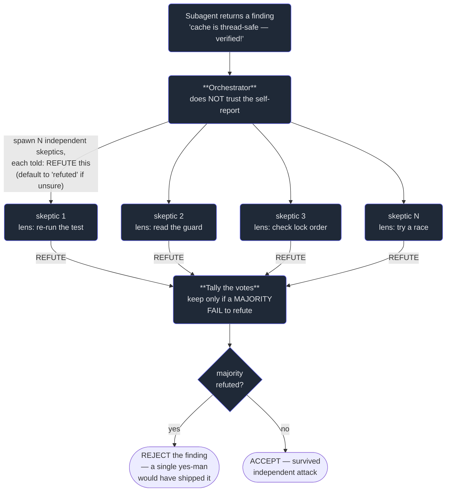

# 7. Verification & adversarial review

## TL;DR

> A subagent that reports **"done, all verified!"** has given you a **claim**, not **evidence**. The
> orchestrator's job is to **independently re-check the actual artifact** — run the code, open the
> structure, count the rows — never to trust the self-report (this is Part 1's **Discernment** and Part
> 2's verify-loop, now applied to *delegated* work). And a single confirmatory check is **weak**: it
> asks "can I see one way this is right?" and stops. The strong form is **adversarial**: for each
> finding, spawn **N independent skeptics** each told to *refute* it (defaulting to "refuted" when
> unsure), and keep it only if a **majority fail to refute**. Make the skeptics **perspective-diverse**
> — correctness, security, reproducibility — so diversity catches failure modes that redundancy can't.
> When the *solution* is uncertain (not just its verification), run a **judge panel**: many independent
> attempts, scored by independent judges, synthesize the winner. Independent + adversarial + diverse is
> what makes a multi-agent system you can actually believe.

## 1. Motivation

This book is the proof — and the cautionary tale. Every single chapter was written by a subagent, and
every single one of those subagents reported back the same cheerful thing: *"python exit 0, all
verified, structure clean."* If the parent (the orchestrator that built this book) had **believed**
those reports, the book would be riddled with broken code blocks. Because here is the thing about a
subagent's self-report: the subagent is **graded by the same model that did the work**, in the **same
context that produced it**, with every incentive to call its own output good. A confident "verified!"
from the worker is exactly as reliable as the worker — which is to say, not reliable enough to publish.

So the parent didn't trust it. The loop protocol in this book's own manifest says it in plain words:
*"VERIFY each chapter yourself — don't trust subagent self-reports."* The parent **re-ran every Python
block itself**, on its own, after the child claimed success — and caught the blocks that didn't
actually run, the outputs that didn't actually match the prose. The Scala Build-It blocks got the same
treatment: **byte-verified** through the go-judge image (`--network none`) rather than taken on faith,
and **scalafmt-gated** before any commit. None of that re-checking would exist if a self-report were
evidence. It isn't. It's a starting point for verification, not a substitute for it.

That is the discipline this chapter teaches, and it has two halves. **First**, never trust a
self-report — independently re-check the *artifact*. **Second**, when a single re-check might still be
fooled by a plausible-but-wrong result, go **adversarial**: have several independent reviewers *try to
break* the claim, and accept it only if a majority *can't*. This is "Discernment + Diligence" (Part 1)
lifted to the orchestration level — the capstone discipline that turns a pile of subagent output into
something trustworthy.

## 2. Intuition (Analogy)

Think about how science decides a claim is true. A researcher does **not** get to publish a finding
because they are *confident* in it — confidence is free, and everyone has it. The finding goes to
**peer review**, where independent reviewers who *don't share the author's stake* try to **break it**:
poke the method, re-derive the result, hunt for the flaw. The claim survives not because someone agreed
with it, but because skeptics **tried to refute it and failed**. One friendly colleague nodding along
proves almost nothing — they share your blind spots. Three independent skeptics who attack from
different angles and *still can't* knock it down? That's strong evidence.

A courtroom runs the same machine. We don't convict because the prosecutor is *sure*; we have an
**adversarial** process — a defense whose entire job is to refute — and a verdict only after the case
survives that attack. And a serious **newspaper** doesn't print "the reporter says it's true"; it has
a **fact-checker** independently confirm the reporter's story against the actual sources. In every
case the trustworthy answer comes from **independent attempts to disprove**, not from the author's
say-so.

A subagent's "all verified!" is the **reporter's say-so**. Your orchestration needs the
**fact-checker**, and for anything that could be plausibly-wrong, the **adversarial panel**: skeptics
told to refute, a verdict by majority. The whole shift is from *"can I find one reason to believe
this?"* (confirmatory, weak) to *"can a panel of independent skeptics fail to break it?"* (adversarial,
strong).

| | One confirmatory check | **Adversarial / diverse review** |
|---|---|---|
| Question asked | "Can I see *one* way it's right?" | "Can independent skeptics **fail to break** it?" |
| Who checks | The author, or one friendly reviewer | **N independent** reviewers, each trying to **refute** |
| Default when unsure | Accept (benefit of the doubt) | **Reject** (default-to-refuted) |
| Diversity | One lens (often the easy one) | **Distinct lenses** — correctness / security / reproduces |
| Plausible-but-wrong output | Often **passes** | Caught — a majority refute it |
| Real-world twin | "The reporter says it's true" | Peer review · courtroom · fact-checker |

## 3. Formal Definition

**Independent verification** is the orchestrator re-establishing a child's claim *from the artifact
itself* — running the code, inspecting the structure, recomputing the number — using a path that does
**not** depend on the child's word. The child's report is treated as a **hypothesis to test**, never as
a result to record.

**Adversarial verification** strengthens this. For a finding `F`, spawn `N` independent **refuters**,
each prompted to **disprove** `F` (and to **default to "refuted" when uncertain**). `F` is **accepted**
only if a **majority of refuters fail to refute** it. The asymmetry is the point: a self-confirming pass
asks for *one* supporting angle and a plausible-but-wrong answer can usually supply one; an adversarial
panel demands that the claim **survive attack from a majority**, which a wrong answer cannot fake.

| Term | Meaning |
|---|---|
| **Self-report** | A subagent's own "done / verified" message. A **claim**, not evidence. |
| **Independent verification** | The orchestrator re-checks the **artifact** directly, on a path not reliant on the child's word. |
| **Adversarial verify** | Spawn N skeptics each told to **refute** a finding; keep it only if a **majority fail** to. Default-to-refuted. |
| **Refuter / skeptic** | An independent verifier whose job is to **break** the claim, not confirm it. |
| **Refute-by-majority** | The decision rule: accept iff `keep > refute` across the panel. |
| **Perspective-diverse verify** | Give each verifier a **distinct lens** (correctness / security / reproduces), not N identical checks. |
| **Judge panel** | Generate N independent **attempts** (different angles), score with independent **judges**, synthesize the winner. |

> The one line: **a claim is trustworthy after independent skeptics try to break it and a majority
> can't.** Confirmation seeks a reason to believe; refutation seeks a reason to *dis*believe and reports
> failure. The second is strictly stronger, because the world is full of answers that *look* right under
> one friendly glance and fall apart under three hostile ones.

When is each tool right? Use **independent verification** always — it's the floor. Add **adversarial
refute-by-majority** when a finding could be **plausible-but-wrong** (a confident claim you can't cheaply
confirm). Use **perspective-diverse** lenses when the thing can **fail in multiple ways** (a security
hole *and* a correctness bug *and* a non-reproducible result). Use a **judge panel** when the
**solution space is wide** — when the hard part isn't checking one answer but finding a good one among
many, where one-attempt-iterated tends to get stuck in a local rut.

## 4. Worked Example

Here is the adversarial loop the orchestrator runs on a single finding — modeled on the FALSE finding
from §5: a subagent claims a cache "is thread-safe — verified!"



**Trace it on two findings.** The orchestrator holds two subagent claims, and runs the **same** panel
of five independent skeptics — each with a *distinct* lens — on each.

- **TRUE finding: "auth check is enforced on `/admin`."** Every skeptic attacks from its own angle —
  re-run the test, read the route guard, check the middleware order, try an unauthenticated request,
  grep for the decorator — and **every one fails to refute it**, because the claim is genuinely backed
  by the artifact. Tally: **KEEP=5, REFUTE=0**. A majority failed to refute → **ACCEPTED.** Good.

- **FALSE-but-plausible finding: "the cache is thread-safe — looks fine."** It *reads* fine if you
  merely eyeball it once. But every skeptic that actually **probes** — re-runs the test, traces the lock
  order, tries a race — **finds the race and refutes**. Tally: **KEEP=0, REFUTE=5**. A majority refuted
  → **REJECTED.**

Now the punchline. A **single confirmatory check** — one friendly reviewer asking "can I see *one* way
this is true?" — looks at the false finding, sees it "eyeballs fine," and says **ACCEPT**. That
yes-man would have **shipped a false finding into the artifact**. The adversarial majority-refute panel
**caught** exactly what the single check missed. That contrast — same false claim, opposite verdicts —
is the whole chapter, and §5 makes it run.

## 5. Build It

This models adversarial verification directly. A finding is **accepted only if a majority of N
independent refuters fail to refute it**. We encode a **TRUE** finding (no skeptic can break it →
accepted) and a **FALSE-but-plausible** one (a majority break it → rejected), then show that a
**single confirmatory check** (one yes-man) would have **accepted the false finding** while the
majority-refute panel correctly **rejects** it.

```python run
# Adversarial verification: accept a finding ONLY if a MAJORITY of independent
# refuters FAIL to refute it. Contrast with a single yes-man check.

# Each finding carries the EVIDENCE the skeptics get to inspect: the set of
# lenses (angles) under which the claim actually survives a hostile look.
# Default-to-refuted: a lens NOT in that set -> the skeptic REFUTES.
FINDINGS = {
    "TRUE  (auth check is enforced on /admin)": {
        "claim_holds_under": {
            "re-run the test", "read the route guard", "check the middleware order",
            "try an unauth request", "grep for the decorator",
        },
    },
    "FALSE (cache is thread-safe, 'looks fine')": {
        # Plausible-sounding, but only ONE shallow angle is fooled by it;
        # every skeptic that actually probes the code finds the race.
        "claim_holds_under": {"eyeball the code once"},
    },
}

# N independent skeptics, each given a DISTINCT lens (perspective-diverse).
SKEPTICS = ["re-run the test", "read the route guard", "check the middleware order",
            "try an unauth request", "grep for the decorator"]

def adversarial_verify(claim_holds_under, skeptics):
    """Each skeptic tries to REFUTE from its own lens. It votes KEEP only if
    its lens fails to break the claim; otherwise REFUTE. Default-to-refuted is
    baked in (a lens the claim does not survive -> REFUTE). Accept iff a
    MAJORITY fail to refute."""
    votes = {lens: ("KEEP" if lens in claim_holds_under else "REFUTE")
             for lens in skeptics}
    keeps = sum(1 for v in votes.values() if v == "KEEP")
    refutes = len(skeptics) - keeps
    accepted = keeps > refutes          # majority failed to refute
    return votes, keeps, refutes, accepted

def single_confirmatory_check(claim_holds_under):
    """One friendly reviewer asking 'can I see ONE way this is true?' and
    stopping there. Any single supporting angle is enough for it to sign off."""
    preference = ["eyeball the code once", "re-run the test", "read the route guard",
                  "check the middleware order", "try an unauth request",
                  "grep for the decorator"]
    for lens in preference:
        if lens in claim_holds_under:
            return lens, "ACCEPT"
    return "(no angle)", "ACCEPT"       # a true yes-man accepts regardless

bar = "-" * 64
for name, f in FINDINGS.items():
    votes, keeps, refutes, accepted = adversarial_verify(f["claim_holds_under"], SKEPTICS)
    print(bar)
    print("FINDING:", name)
    print("  panel of", len(SKEPTICS), "independent skeptics (distinct lenses):")
    for lens, v in votes.items():
        print("    [{}]  {}".format("  pass " if v == "KEEP" else "REFUTE", lens))
    print("  tally: KEEP={}  REFUTE={}".format(keeps, refutes))
    print("  PANEL VERDICT: {}  ({})".format(
        "ACCEPTED" if accepted else "REJECTED",
        "majority failed to refute" if accepted else "a majority refuted it"))
    lens, yesman = single_confirmatory_check(f["claim_holds_under"])
    print("  one yes-man  : looked at '{}' -> {}".format(lens, yesman))

print(bar)
print("SUMMARY")
print("  TRUE  finding: panel ACCEPTED, yes-man ACCEPTED  -> both fine.")
print("  FALSE finding: panel REJECTED, but yes-man ACCEPTED.")
print("  => the single confirmatory check would have shipped a false finding;")
print("     the adversarial majority-refute panel caught it.")
```

Running it prints, for the FALSE finding, **`KEEP=0  REFUTE=5 → REJECTED`** from the panel but
**`-> ACCEPT`** from the lone yes-man (which "looked at 'eyeball the code once'"). That single line is
the argument: a confirmatory check finds the one angle that's fooled and stops; the adversarial panel
makes the claim **survive attack from a majority**, which the false finding can't.

**Now break it.** Two instructive tweaks. (1) **Weaken the panel** to a single skeptic whose lens is
`"eyeball the code once"` — it now KEEPS the false finding, and you've rebuilt the yes-man. Verification
is only as strong as the panel is **independent and adversarial**. (2) **Flip the default**: make an
*uncertain* skeptic vote KEEP instead of REFUTE (drop "default-to-refuted") — borderline-plausible
garbage starts sneaking through, because "I'm not sure" should never mean "ship it." The two knobs that
matter most are **majority-not-unanimity** (one stubborn skeptic can't veto a true finding) and
**default-to-refuted** (the benefit of the doubt goes to *rejection*, not acceptance).

## 6. Trade-offs & Complexity

| Approach | Catches plausible-but-wrong? | Cost | Best when |
|---|---|---|---|
| **Trust the self-report** | No — it *is* the claim | ~0 | Never, for anything load-bearing |
| **One independent re-check** | Sometimes (misses what the one angle can't see) | 1 verify | Cheap floor; narrow, single-failure-mode claims |
| **Adversarial refute-by-majority (N skeptics)** | **Yes** — must survive a majority | N verifies | A finding could be confidently wrong |
| **Perspective-diverse panel** | **Yes**, across **different** failure modes | N verifies | The thing can fail many ways (correct / secure / reproduces) |
| **Judge panel (N attempts + judges)** | Yes, and also **finds** a better answer | N attempts + scoring | The *solution space is wide*, not just the check |

The cost is real: a panel of N is **N× the verification work** (and a judge panel is N attempts *plus*
scoring) — every skeptic is its own subagent with its own spawn cost and context. So **match the rigor
to the stakes and the failure-surface.** A trivial, easily-confirmed claim ("did the file get
created?") needs one cheap re-check, not a tribunal. A load-bearing, plausible-but-unconfirmed finding
("this refactor is behavior-preserving"; "this code is safe") earns the full adversarial panel — the
N× is cheap next to shipping a confident error. And **diversity beats redundancy at equal cost**: three
*identical* checks mostly re-confirm one blind spot, while three *distinct lenses* (correctness,
security, reproducibility) cover three different ways the thing dies. Same number of subagents, far more
coverage.

## 7. Edge Cases & Failure Modes

- **Trusting the self-report (the cardinal sin).** "Done, verified!" is a claim. If you record it
  without re-checking the artifact, you've verified *nothing* — you've transcribed the worker's
  optimism. This is the single most common multi-agent failure (Chapter 1 named it; this chapter is the
  cure).
- **Confirmatory-only checking.** Asking "can I see one way this is right?" finds the friendly angle and
  stops — exactly the angle a plausible-but-wrong output is built to satisfy. Ask the **refutation**
  question instead.
- **Redundant, not diverse, verifiers.** N copies of the *same* check share the same blind spot, so N of
  them is barely better than one. Give each a **distinct lens** or you paid N× for 1× of coverage.
- **Requiring unanimity.** If one stubborn or mis-prompted skeptic can veto, true findings die and the
  panel stalls. **Majority**, not consensus — that's why the rule is `keep > refute`.
- **Default-to-accept on uncertainty.** A skeptic that votes KEEP when unsure lets borderline garbage
  through. **Default-to-refuted**: "I couldn't confirm it" must count *against* the claim.
- **Correlated reviewers (illusory independence).** N skeptics that share a context, a prompt, or a
  cached premise aren't really independent — they'll agree on the same wrong thing. Vary the angle,
  the inputs, and the framing so the agreements are *earned*.
- **The verifier itself is wrong.** A buggy check or a hallucinated "I ran it" re-introduces the very
  problem. Prefer verification on a **mechanical, deterministic** path (run the code, diff the bytes,
  count the rows) over a verifier's prose — which is exactly why this book re-ran Python and
  byte-compared Scala rather than asking a model "did it pass?"
- **Over-verifying trivia.** A five-skeptic tribunal for "did the file save?" burns budget for no risk.
  Scale rigor to stakes.

## 8. Practice

> **Exercise 1 — Why isn't "all verified!" enough?** A teammate says: "My subagent already ran the
> tests and reported *python exit 0, all green* — re-running them in the parent is wasteful duplication."
> Using §1 and §3, give the one-sentence reason the parent must re-check anyway, and name the specific
> thing this book did to embody it.

<details>
<summary><strong>Answer</strong></summary>

Because the subagent's "exit 0, all green" is a **claim** produced by the same model, in the same
context, with every incentive to call its own work good — it's a hypothesis to test, not evidence to
record (§3). A self-report is exactly as trustworthy as the worker, which is not enough for anything
load-bearing; only **independent re-checking of the artifact** (re-running the tests yourself, on a path
that doesn't depend on the child's word) establishes the result.

What this book did: the orchestrator **re-ran every Python block itself** after each subagent claimed
success (the manifest's protocol literally says *"VERIFY each chapter yourself — don't trust subagent
self-reports"*), and **byte-verified** the Scala blocks through the go-judge image (`--network none`),
scalafmt-gated before commit. The "duplication" is the whole point — it's the difference between a claim
and a verified fact.

</details>

> **Exercise 2 — Single check vs. adversarial panel.** Using the §5 model, the FALSE finding ("cache is
> thread-safe") gets opposite verdicts from the lone yes-man and the five-skeptic panel. State both
> verdicts and the tally, and explain in one sentence the structural reason the panel catches what the
> single check misses.

<details>
<summary><strong>Answer</strong></summary>

From §5's output for the FALSE finding:

- **Lone yes-man:** looked at `"eyeball the code once"` → **ACCEPT** (it found the one shallow angle the
  false claim satisfies and stopped).
- **Five-skeptic panel:** **KEEP=0, REFUTE=5 → REJECTED** (every skeptic that actually probes — re-run
  the test, check the lock order, try a race — refutes it; default-to-refuted does the rest).

The structural reason: a **confirmatory** check asks "can I find *one* supporting angle?" and a
plausible-but-wrong output is, by construction, built to supply exactly one — so it passes. An
**adversarial** panel asks the opposite: it requires the claim to **survive refutation by a majority of
independent skeptics**, and a false finding can't survive attack from angles it was never designed to
fool. Confirmation needs one friendly look; refutation needs the claim to withstand many hostile ones.

</details>

> **Exercise 3 — Pick the verification design.** For each, choose the lightest sufficient design from §6
> (trust-report ✗ / one re-check / adversarial refute-by-majority / perspective-diverse panel / judge
> panel) and justify it: (a) a subagent reports "the index file was regenerated"; (b) a subagent claims
> "this 200-line refactor is behavior-preserving and has no security regression"; (c) you need the best
> possible algorithm for a gnarly problem and a single agent keeps iterating into the same dead end.

<details>
<summary><strong>Answer</strong></summary>

- **(a) Index file regenerated — one independent re-check.** Cheap, mechanical, single failure mode:
  the parent just **stats the file / diffs its contents** itself. Trusting the report is still wrong
  (verify the artifact), but a tribunal here is over-verifying trivia (§6/§7) — one deterministic check
  is sufficient.
- **(b) Behavior-preserving *and* no security regression — perspective-diverse panel.** This can fail in
  **two distinct ways**, so give verifiers **different lenses**: one checks **correctness** (run the
  test suite, diff behavior on cases), one checks **security** (look for an introduced injection / authz
  gap), and ideally one checks it **reproduces** on a clean checkout. Diversity covers failure modes
  redundancy can't (§6) — N identical checks would miss whichever mode they don't look at. (It's also a
  textbook plausible-but-wrong claim, so the refute-by-majority discipline applies within each lens.)
- **(c) Best algorithm, single agent stuck in a rut — judge panel.** The hard part isn't *checking* one
  answer, it's **finding a good one in a wide solution space**. Generate **N independent attempts from
  different angles**, score them with **independent judges**, and synthesize from the winner — this
  beats one-attempt-iterated precisely because diverse starts escape the local dead end a single chain
  keeps falling into (§3/§6).

Throughline: scale the design to the **failure surface** — trivial+single-mode → one re-check;
multi-mode → diverse lenses; wide-solution-space → judge panel. And never the "trust the report" column,
for anything that matters.

</details>

```quiz
{
  "prompt": "An orchestrator must decide whether to accept a subagent's plausible-sounding finding. Which procedure gives the STRONGEST evidence that it's actually correct?",
  "input": "Choose one:",
  "options": [
    "Spawn N independent skeptics, each prompted to REFUTE the finding and to default to 'refuted' when unsure; accept only if a MAJORITY fail to refute it",
    "Accept it, since the subagent already reported 'done, all verified!' and self-checked its own work",
    "Have one friendly reviewer confirm it by finding a single angle under which the finding looks right",
    "Spawn N identical verifiers that run the exact same check, and accept if any one of them confirms it"
  ],
  "answer": "Spawn N independent skeptics, each prompted to REFUTE the finding and to default to 'refuted' when unsure; accept only if a MAJORITY fail to refute it"
}
```

## Your Turn

Before you move on, check your understanding with the coach — explain the idea, apply it, weigh the trade-offs, then defend your reasoning.

<div class="concept-coach"></div>

## In the Wild

- **[Anthropic — How we built our multi-agent research system](https://www.anthropic.com/engineering/built-multi-agent-research-system)**
  — a production orchestrator that spawns subagents and **evaluates their output** rather than trusting
  it; the §3 "verify the artifact, don't trust the report" discipline at scale, plus LLM-as-judge for
  scoring agent results.
- **[Anthropic — Building effective agents](https://www.anthropic.com/engineering/building-effective-agents)**
  — the **evaluator–optimizer** loop (a generator paired with an independent evaluator) and the case for
  separating the *doer* from the *checker* — the structural backbone of independent verification.
- **[Claude Code — Subagents](https://docs.claude.com/en/docs/claude-code/sub-agents)** — the tool you
  use to spawn the **independent skeptics / judges** of an adversarial panel: separate agents, fresh
  contexts, distinct lenses — exactly what "independent" requires.

---

**Next:** you have the whole toolkit — why subagents exist, how to spawn and type them, how to brief
them, fan them out, orchestrate the patterns, script the deterministic ones, and now **verify them
adversarially**. Time to assemble it into one system that authors a chapter end-to-end. →
[8. Capstone — a multi-agent Cortex](/cortex/the-claude-stack/subagents-and-orchestration/capstone-multi-agent-cortex)
