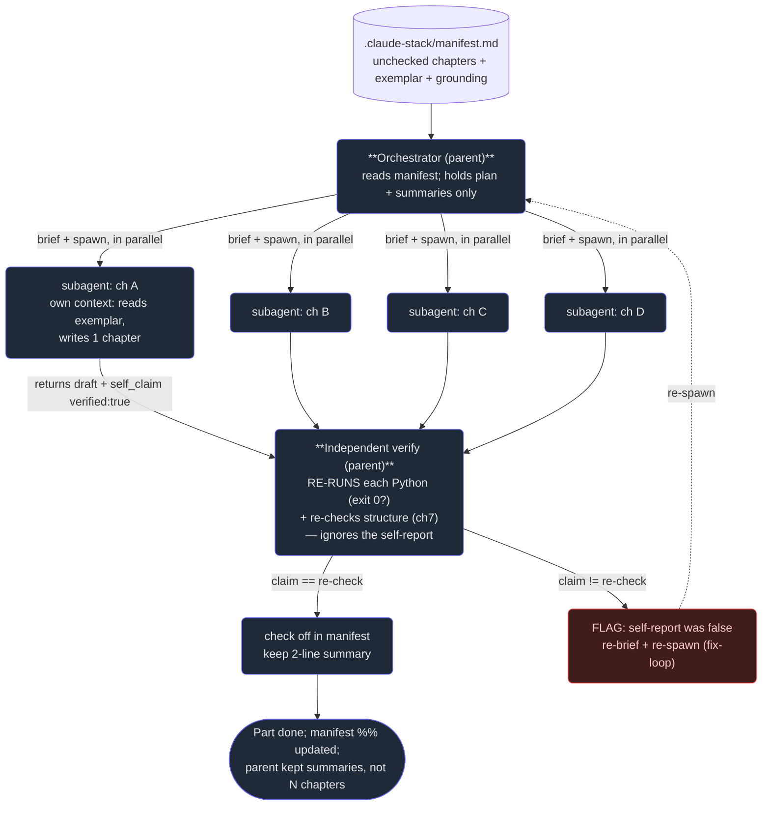

# 8. Capstone — a multi-agent Cortex

## TL;DR

> This chapter designs the system that **auto-authors and verifies a Cortex chapter** — and then
> admits the punchline: **that system is the loop that wrote this book.** An **orchestrator** reads a
> manifest of chapters to write, **fans out** (ch4) one general-purpose **subagent** (ch2) per chapter
> with a precise **brief** (ch3: role + exemplar + hard requirements + return contract). Each child
> writes one chapter in its own clean context and hands back a draft plus a self-claimed
> `verified: true`. The orchestrator does **not** trust that claim — it **independently re-runs** every
> chapter's Python and re-checks its structure (ch5, ch7), and flags any chapter whose self-report was
> false for a fix-loop. Underneath run **the 4 D's** (Part 1): **Delegation** (a child per chapter),
> **Description** (the brief), **Discernment** (independent verification), **Diligence** (the gates,
> honesty about GAPs, the host-`python3` caveat). And the *whole stack* composes — runnable code
> verified via go-judge (Part 3 / a future cortex MCP, Part 4), house conventions as a Skill (Part 5),
> a tutor as an MCP client (Part 3/4). **Parts 1→6 were never six topics. They are one system**, and
> you are holding its output. What we built was *ad-hoc Agent-tool orchestration*; we'll name what a
> production version still lacks.

## 1. Motivation

For seven chapters we've said the same disconcerting thing in passing: *this book was written by
subagents.* This is the chapter where we stop hand-waving and open the hood — because the system that
produced these pages is the single best worked example of the entire stack, and it's sitting right
here in the repository.

The artifact is real. At `.claude-stack/manifest.md` lives a plain Markdown file that is not a
chapter — it's the **backbone of a multi-session, autonomous build**. It lists every Part and every
chapter as a checkbox, names the gold-standard **exemplar** to imitate, pins the **grounding facts**
(this repo's `CLAUDE.md`, its hooks, its two MCP servers, its skill), and writes down the **loop
protocol** in five steps: *read the manifest → author the next unchecked chapters → verify → check
them off → report the percentage → reschedule until 100%.* Each session of that loop authored a Part,
re-verified it, ticked the boxes, and logged a one-line summary. Scroll to the bottom of the manifest
and you can read the session log: *S1 — Part 1 complete, 6/6 Python blocks Accepted; S2 — Part 2
complete; …* By the time this chapter is being written, the log reads **49/58 files (84%)** and this is
one of the last unchecked boxes.

So the capstone task isn't hypothetical. **Design a multi-agent system that auto-authors and verifies
a Cortex chapter** — and you are describing the very machine whose output you're reading, down to the
file it runs on. Everything you learned climbs into this one design: fluency decides *what to delegate*
and *how to judge it*; Claude Code is *where the agents run*; the API is *the engine inside each
agent*; MCP is *how they'd reach tools and content*; Skills are *how the house style would be packaged*;
subagents are *how the work goes wide and gets checked*. The book ends by becoming self-aware.

## 2. Intuition (Analogy)

Picture a **factory that builds factories** — or more precisely, a **print shop whose product is the
manual for the print shop.**

The **plant manager** (the orchestrator) never touches a press. They hold one thing: the **work order**
— the manifest of chapters to produce. They walk to the floor and hand each **writer** (a chapter
subagent) a **job ticket** (the brief): *here's the reference book to match, here are the
specifications it must meet, bring it back in this exact form.* Several writers work their own
benches in parallel; what each reads and drafts stays at *their* bench, never piling onto the
manager's desk. When a writer finishes, they don't get to stamp their own work "passed." The job
goes to a separate **inspector** — and crucially, *the manager re-runs the inspector's test
themselves*, because a writer who says "I checked it, it's perfect" is making a claim, not handing
over proof. One writer's part fails the re-inspection; it's pulled and re-issued. The rest ship. And
the bound stack of pages that rolls off the line at the end is the **operating manual for this exact
plant** — including the page describing the inspection step that just caught the bad part.

That last twist is the whole mood of this chapter. The output of the assembly line is the document
that explains the assembly line. The book is a self-printing book.

| | A lone author writes the book | **The multi-agent plant (this loop)** |
|---|---|---|
| Who holds the plan | The one author, drowning in 51 chapters at once | **Orchestrator holds the manifest only (clean desk)** |
| Who does the writing | The same one author, sequentially | **A subagent per chapter, in parallel (fan-out)** |
| What each writer is given | Everything in one head | **A brief: role + exemplar + hard requirements + return contract** |
| Who decides "done" | The author trusts their own read | **The orchestrator re-runs the check itself — claim ≠ proof** |
| When one part is wrong | Maybe noticed, maybe shipped | **Caught by independent re-verify; flagged for a fix-loop** |
| The output | A book | **A book describing the plant that printed it** |

## 3. Formal Definition

The **multi-agent Cortex author-and-verify system** is an **orchestrator pattern** (ch5) in which a
parent agent turns a manifest of chapters into verified Markdown by delegating each chapter to an
isolated subagent and then independently checking every result. Map each piece to the stack:

| Piece | What it is | Where in the stack |
|---|---|---|
| **Orchestrator** | The parent agent; reads `.claude-stack/manifest.md`, drives the loop, holds only the plan + summaries | Parent/orchestrator (ch1); the agentic loop (Part 2) |
| **Manifest** | The unchecked-chapter list + exemplar + grounding + protocol; lives *outside* `content/` so it never renders | The real `.claude-stack/manifest.md` |
| **Brief** | Per-chapter spawn prompt: **role** + **exemplar to read** + **hard requirements** + **return contract** | Prompting subagents well (ch3); Description (Part 1) |
| **Chapter-agent** | One **general-purpose subagent** per chapter, in its **own clean context**, writes one chapter | The Agent tool & types (ch2); Delegation (Part 1) |
| **Fan-out** | Spawning the chapter-agents **in parallel** (we ran nine at once on another book) | Parallel fan-out (ch4) |
| **Independent verify** | The orchestrator **re-runs each chapter's Python + re-checks structure** — ignores the self-report | Verify-each pattern (ch5); adversarial review (ch7); Discernment (Part 1) |
| **Fix-loop** | A chapter that fails re-verification is re-briefed and re-spawned | Loop-until-dry / verify (ch5) |
| **Gates** | Frontmatter present; skeleton intact; one valid quiz; balanced `<details>`; a runnable block that *actually runs* | Diligence (Part 1); the manifest's verify step |

The architecture is three nested ideas. **Context isolation** (ch1) makes authoring 51 chapters
*possible*: the parent never holds more than the manifest and a pile of two-line summaries, so it
never rots. **Fan-out** (ch4) makes it *fast*: independent chapters run concurrently, turning
sum-of-work wall-clock into max-of-work. **Independent verification** (ch7) makes it *correct*: the
parent's last act on each chapter is not to believe "verified!" but to *re-derive* pass/fail from the
artifact itself.

> The one line: **the orchestrator trusts the manifest and the artifact, never the report.** A
> subagent's `verified: true` is an input to be checked, not a conclusion to be accepted. Everything
> rigorous about this system — and about the book — flows from that single refusal to take a confident
> claim as evidence (Part 1's Discernment, mechanized into a gate).

And here is the composition the whole book has been building toward — **every Part shows up in one
design:**

- **Part 1 (the 4 D's) runs underneath the entire loop.** *Delegation*: a child per chapter.
  *Description*: the brief is a precise prompt (role + exemplar + requirements + return contract).
  *Discernment*: independent re-verification instead of trust. *Diligence*: the gates, the honesty
  about **GAPs**, and the caveat that with `/api/run` down we ran Python on **host `python3`** and
  noted it (the session log says exactly this).
- **Part 2 (Claude Code) is the floor it all runs on** — `CLAUDE.md` memory, the tool/permission
  model, and the real **PostToolUse hook** (`Write|Edit` → `tools/gen_cortex_index.py`) that
  deterministically rebuilds the book index every time a chapter file is written.
- **Part 3 (the API) is the engine inside every agent**, and the home of the headline **GAP**: Cortex's
  app code never calls the Claude API; the runnable code is checked by **go-judge** (`--network none`,
  `/api/run`), not an LLM. A *future* AI tutor / hint generator would slot in here as a real API caller.
- **Part 4 (MCP) is how this loop would reach tools and content cleanly** — `/api/run` exposed through a
  **`cortex-content` MCP server** (the Part 4 ch11 design), with the AI tutor (Part 3 ch10) as a
  *client* of that server.
- **Part 5 (Skills) is how the house style would be packaged** — the workbench/chapter conventions as a
  loadable **`workbench-author` skill** (the Part 5 ch6 build), so every chapter-agent inherits the
  format instead of re-reading it from the brief.
- **Part 6 (this Part) is the orchestration that binds them** — the patterns (ch5), optionally a
  deterministic **Workflow** (ch6) for repeatability, and the verification discipline (ch7).

## 4. Worked Example

Here is the full loop the orchestrator ran for each Part — read manifest, fan out one agent per
chapter, collect self-reporting drafts, **independently re-verify each**, flag liars, update the
manifest.



The shape is the heartbeat of every orchestration in this Part: **parent orchestrates, children labor,
parent verifies** — with a fix-loop closing the gap when a child's claim and the re-check disagree.

A **non-running sketch** of the orchestrator (illustrative pseudocode — the real agents, parallelism,
and network are omitted; the runnable model is in §5):

```js
// SKETCH — not executable. Shows the control flow, not the agents.
const manifest = readManifest(".claude-stack/manifest.md");      // Part 6 ch1
const todo = manifest.chapters.filter(c => !c.done);

// Fan out: one general-purpose subagent per chapter (ch2, ch4), in parallel.
const drafts = await Promise.all(todo.map(ch =>
  spawnSubagent({                                                // the Agent tool
    role:    "expert CS educator writing one Cortex chapter",     // ch3: role
    read:    manifest.exemplar,                                   // ch3: exemplar
    mustHave: ["frontmatter", "TL;DR", "Build It", "quiz", "Next"],// ch3: requirements
    returnContract: "{ draft, selfClaim:{verified}, exitCode }",  // ch3: contract
    grounding: manifest.groundingFacts,                          // real repo facts
    chapter: ch,
  })
));

// Independent verify (ch5, ch7): re-derive truth from the artifact, NOT the claim.
for (const d of drafts) {
  const reran   = runPython(d.buildItBlock);     // go-judge /api/run, or host py3
  const struct  = checkStructure(d.draft, d.mustHave);
  const trulyOk = reran.exit === 0 && struct.ok; // <-- the parent's own verdict

  if (trulyOk) { manifest.check(d.slug); keepSummary(d.summary); }
  else         { flagLiar(d, { reran, struct }); reBriefAndRespawn(d.slug); } // fix-loop
}
manifest.writePercent();   // report %, ScheduleWakeup until 100%
```

Notice the load-bearing line: `trulyOk` is computed from `reran.exit` and `struct.ok` — **never** from
`d.selfClaim.verified`. The self-claim is collected only so the system can *compare* it to the truth
and catch a false one.

## 5. Build It

Let's make the trust-nothing rule concrete. This is a deterministic, stdlib-only **model** of the whole
book loop over four mock chapters. (It is *not* a real agent system — no network, no LLM, no real
concurrency; `/api/run` is down, so it runs on host `python3` and is pure-stdlib so the result is
reproducible.) Each chapter-agent "writes" a draft and self-reports `verified: true`. **One agent's
Build-It block actually exits 1 but still claims success** — exactly the failure mode of a confident
self-report. The orchestrator re-runs every check itself and catches the liar.

```python run
"""A deterministic MODEL of the multi-agent loop that authored this book.
Not real agents: no network, no LLM, no concurrency. It dramatizes one rule:
the orchestrator re-verifies every chapter itself and ignores the self-report."""

from dataclasses import dataclass, field

# 1. The manifest the orchestrator reads (a tiny mock of .claude-stack/manifest.md).
MANIFEST = [
    {"slug": "01-why-subagents",    "title": "Why subagents"},
    {"slug": "02-the-agent-tool",   "title": "The Agent tool & types"},
    {"slug": "03-prompting",        "title": "Prompting subagents well"},
    {"slug": "04-parallel-fan-out", "title": "Parallel fan-out"},
]
EXEMPLAR = "01-ai-fluency/01-what-ai-fluency-is.md"          # the gold-standard voice
REQUIRED = ("frontmatter", "TL;DR", "Build It", "quiz", "Next")  # the structural gates

# 2. The brief handed to each subagent (ch3: role + exemplar + requirements + contract).
@dataclass(frozen=True)
class Brief:
    slug: str
    exemplar: str
    must_have: tuple
    return_contract: str

def make_brief(ch):
    return Brief(ch["slug"], EXEMPLAR, REQUIRED,
                 "{draft, self_claim:{verified}, exit_code}")

# 3. A chapter-agent: writes a draft, SELF-REPORTS verified. The self-report can LIE.
@dataclass
class AgentResult:
    slug: str
    sections: set
    real_exit_code: int          # what the Build-It block ACTUALLY does on re-run
    self_claim_verified: bool    # what the agent SAYS

def chapter_agent(b):
    sections, exit_code, claim = set(b.must_have), 0, True   # honest, complete draft
    if b.slug == "04-parallel-fan-out":
        exit_code = 1            # reality: its Python re-run FAILS...
        claim = True            # ...but the agent still claims "verified!" (a lie)
    return AgentResult(b.slug, sections, exit_code, claim)

# 4. Independent verification (ch5/ch7; Part 1 Discernment): truth from the ARTIFACT.
@dataclass
class Verdict:
    slug: str
    agent_said: bool
    independent_pass: bool
    reasons: list = field(default_factory=list)
    @property
    def agent_honest(self):
        return self.agent_said == self.independent_pass

def independent_verify(r, b):
    reasons = []
    missing = set(b.must_have) - r.sections                  # Gate A: structure
    if missing:
        reasons.append("missing: " + ", ".join(sorted(missing)))
    if r.real_exit_code != 0:                                # Gate B: re-run the code
        reasons.append("Build-It re-run exited %d (need 0)" % r.real_exit_code)
    return Verdict(r.slug, r.self_claim_verified, not reasons, reasons)

# 5. Orchestrate: brief+spawn each (fan-out) -> independently verify -> flag liars.
def orchestrate(manifest):
    briefs   = [make_brief(c) for c in manifest]             # Description
    results  = [chapter_agent(b) for b in briefs]            # Delegation (fan-out)
    verdicts = [independent_verify(r, b) for r, b in zip(results, briefs)]  # Discernment
    return results, verdicts

results, verdicts = orchestrate(MANIFEST)

print("MULTI-AGENT CORTEX - author + independent verify")
print("manifest: %d chapters | exemplar: %s" % (len(MANIFEST), EXEMPLAR))
print("%-20s %-13s %-12s %s" % ("chapter", "agent claim", "independent", "verdict"))
flagged = []
for v in verdicts:
    claim = "verified" if v.agent_said else "not-verified"
    indep = "PASS" if v.independent_pass else "FAIL"
    if v.agent_honest:
        verdict = "ok"
    else:
        verdict = "LIAR -> fix-loop"
        flagged.append(v)
    print("%-20s %-13s %-12s %s" % (v.slug, claim, indep, verdict))

authored = len(results)
passed   = sum(1 for v in verdicts if v.independent_pass)
print("summary: %d authored | %d passed independent verify | %d flagged"
      % (authored, passed, len(flagged)))
for v in flagged:
    print("  ! %s: self-reported 'verified' but re-check FAILED -> re-spawn" % v.slug)
    for reason in v.reasons:
        print("      - " + reason)
print("Lesson: a self-report is a CLAIM, not evidence; the re-check is the verdict.")

# Make the invariants crashable so a regression is loud (Diligence).
assert authored == 4 and passed == 3 and len(flagged) == 1
assert flagged[0].slug == "04-parallel-fan-out"
```

Run it and the table prints four chapters, three honest passes, and one row where the agent said
`verified` but the independent re-check said `FAIL` — flagged `04-parallel-fan-out`, sent back to a
fix-loop. **This mirrors exactly what really happened:** the chapter-agents reported their Python as
exit-0; the parent *re-ran* every block (host `python3`, since `/api/run` was down) to confirm, instead
of believing the report. Change the planted failure to a *missing section* instead of a bad exit code
and watch Gate A catch it for the same reason. The lesson is one line of code: `trulyOk` is computed
from the artifact, never read from the claim.

## 6. Trade-offs & Complexity

| This multi-agent loop | A single agent writing the whole book |
|---|---|
| Context isolation — parent holds only the manifest + summaries | One window holds all 51 chapters; context rot by ch20 |
| Fan-out — chapters authored in parallel (Part finishes in minutes) | Strictly sequential; a Part takes hours |
| Independent verify catches false self-reports | The author trusts its own read; bad chapters can ship |
| Briefs make each chapter reproducible and on-format | Style drifts as the single context fills |
| Coordination cost: briefs, spawns, a re-verify pass | Zero coordination — it's all one mind |
| Parent sees results, not each child's reasoning | Full visibility into every step |
| Ad-hoc Agent-tool orchestration — **not** a scripted Workflow (ch6) | N/A |
| Re-verification on host `python3`, not `/api/run` (it was down) — a noted caveat | N/A |

The system isn't free, and it isn't finished. The coordination overhead (writing briefs, spawning,
and running a whole second verification pass) is real, and you trade visibility into *how* each child
worked for a lean parent and a fast, checked result — a trade that only pays when the job is
**context-heavy** (51 chapters) and **wide** (independent chapters), which is precisely this job. The
honest verdict on *our* implementation: it was **ad-hoc Agent-tool orchestration**, not the
deterministic **Workflow** (ch6) a production pipeline would script for exact repeatability, and the
re-verification ran on host `python3` because `/api/run` was down — reproducible because the blocks are
pure stdlib, but a caveat we recorded rather than hid.

## 7. Edge Cases & Failure Modes

- **Trusting the self-report (the cardinal sin).** A chapter-agent says "verified!" and is wrong — the
  exact case the §5 model plants. If the parent believes it, a broken chapter ships. The whole design
  exists to *re-derive* the verdict from the artifact (ch7). This is the single most important failure
  mode in all of multi-agent work.
- **A weak brief yields confident, off-format work.** Drop the exemplar or the return contract from the
  brief and the child writes something plausible but wrong-shaped (Part 1's Description failing). The
  brief is everything (ch3).
- **Runaway fan-out.** Spawning a child for all 58 files at once can swamp rate limits and cost; cap
  concurrency and fan out a *Part* at a time, as the real loop did (ch4).
- **`/api/run` down — the host-`python3` caveat.** When the real verifier is unavailable, re-running on
  the host is only sound for **deterministic, stdlib-only** blocks (host == sandbox). Anything with
  network or non-stdlib deps must be re-checked on `/api/run` later — and you must *say so* (Diligence).
- **The fix-loop that never converges.** A flagged chapter that keeps failing re-verification can loop
  forever; bound the retries and escalate to a human, rather than spinning.
- **Manifest drift.** The manifest is the single source of truth; if a session checks a box without the
  artifact actually passing, the state lies. Tie the check-off to the *independent* verdict, never to
  the agent's claim — the same rule, applied to the ledger.
- **GAPs treated as built.** The biggest architectural failure is pretending the missing pieces exist.
  This loop had **no `cortex-content` MCP server, no published `workbench-author` skill, no Agent SDK
  service, and no Claude API call anywhere** in Cortex. Naming those honestly *is* the architecture.

## 8. Practice

> **Exercise 1 — Find the one line that makes it rigorous.** In the §5 model (and the §4 sketch), point
> to the precise place where the orchestrator decides a chapter passed, and explain why reading
> `self_claim_verified` there instead would collapse the entire design back to a single trusting agent.

<details>
<summary><strong>Answer</strong></summary>

The decision lives in `independent_verify`: a chapter passes iff `not reasons`, where `reasons` is built
**only** from the artifact — `set(must_have) - r.sections` (structure) and `r.real_exit_code != 0`
(re-running the Python). In the §4 sketch it's the line `const trulyOk = reran.exit === 0 &&
struct.ok;`. Neither ever reads the self-claim; the claim is collected solely so `agent_honest` can
*compare* it to the truth and flag a mismatch.

If you computed the verdict from `r.self_claim_verified` instead, the orchestrator would be *believing
the child* — and a confident-but-wrong agent (the planted `04-parallel-fan-out`, which claims
`verified: true` while its block exits 1) would sail through. At that point the second agent adds no
safety: you'd have a lone author trusting its own read, which is exactly the failure (context rot aside)
that the whole multi-agent design exists to prevent. Rigor is one rule: **the verdict comes from the
artifact, never the report** (Part 1's Discernment, ch7).

</details>

> **Exercise 2 — Place each Part in the design.** For each of these pieces of the auto-author system,
> name which Part of the book it draws on and one sentence why: (a) the per-chapter spawn prompt; (b)
> re-running each Build-It block to confirm exit 0; (c) the `PostToolUse` hook that rebuilds the index
> after a chapter is written; (d) packaging the house format as a `workbench-author` skill.

<details>
<summary><strong>Answer</strong></summary>

- **(a) The spawn prompt → Part 6 ch3 (prompting subagents well), resting on Part 1's *Description*.**
  It's the brief: role + exemplar + hard requirements + return contract; a precise spec is what makes a
  blank-slate child produce on-target, on-format work.
- **(b) Re-running each Build-It block → Part 6 ch5/ch7 (verify-each / adversarial review), resting on
  Part 1's *Discernment*.** The orchestrator re-derives pass/fail from the artifact instead of trusting
  the child's "verified!" — and uses the Part 3 runnable-code idea (go-judge `/api/run`, or host
  `python3` as the noted fallback).
- **(c) The `PostToolUse` hook → Part 2 ch4 (hooks).** It's deterministic Claude Code automation: writing
  a `content/cortex/` file fires `tools/gen_cortex_index.py` to rebuild the book index every time, no
  agent judgment involved.
- **(d) The `workbench-author` skill → Part 5 (Agent Skills, built in ch6).** It packages the
  house/workbench conventions as loadable expertise so every chapter-agent inherits the format via
  progressive disclosure rather than re-reading it from the brief each time.

The point of the exercise: the design isn't six topics bolted together — **each Part is a working part
of one machine.**

</details>

> **Exercise 3 — Name the GAPs and turn the loop production-grade.** Our real loop was *ad-hoc
> Agent-tool orchestration*. List at least three things a production version is **not** yet (the GAPs),
> and for each name the Part that would supply it.

<details>
<summary><strong>Answer</strong></summary>

The honest GAPs (from the manifest's grounding notes), each mapped to its Part:

1. **No deterministic Workflow.** The orchestration was Agent-tool fan-out, not a scripted, repeatable
   pipeline. A production version would script it as a **Workflow (Part 6 ch6)** for exact, re-runnable
   behavior — same inputs, same steps, every time.
2. **No `cortex-content` MCP server.** `/api/run` and the content store were reached ad hoc, not through
   a stable tool interface. Expose them as a **`cortex-content` MCP server (Part 4 ch11)** so any
   agent — author, verifier, or tutor — calls the same governed tools.
3. **No published `workbench-author` skill.** The house format lived in briefs and a human's head.
   Package it as a distributed **Skill (Part 5 ch6)** so format compliance is loadable, versioned, and
   shared.
4. **No Claude API call anywhere in Cortex, and no Agent SDK service.** The runnable code is checked by
   **go-judge**, not an LLM, and there's no AI tutor yet. A production system would add a **Claude
   API (Part 3 ch10)** tutor/hint generator — ideally a *client* of the `cortex-content` MCP — and could
   wrap the orchestrator itself as an **Agent SDK** service.

Stating these plainly *is* the architecture: knowing what you haven't built is half of designing the
thing (Part 1's Diligence). The loop that wrote this book was the honest, ad-hoc first version; the
production version is the same shape with the GAPs filled by the very Parts you just finished.

</details>

```quiz
{
  "prompt": "In the multi-agent author-and-verify loop (the one that wrote this book), how does the orchestrator decide whether an authored chapter actually passed?",
  "input": "Choose one:",
  "options": [
    "It independently re-runs each chapter's Python (demanding exit 0) and re-checks its structure, deciding from the artifact itself — it does not trust the subagent's self-reported 'verified: true'",
    "It accepts the chapter as soon as the chapter-agent returns 'verified: true', since each subagent checks its own work",
    "It asks a second language model whether the first one seemed confident, and passes the chapter if so",
    "It checks only that the file was written to disk; structure and runnable code are out of scope for the orchestrator"
  ],
  "answer": "It independently re-runs each chapter's Python (demanding exit 0) and re-checks its structure, deciding from the artifact itself — it does not trust the subagent's self-reported 'verified: true'"
}
```

## In the Wild

- **[Anthropic — How we built our multi-agent research system](https://www.anthropic.com/engineering/built-multi-agent-research-system)**
  — a production lead-agent-fans-out-to-subagents system in isolated contexts: the §4 loop at scale, with
  the same orchestrate / delegate / verify triangle.
- **[Anthropic — Building effective agents](https://www.anthropic.com/engineering/building-effective-agents)**
  — the orchestrator-workers and evaluator-optimizer patterns; the conceptual backbone for fan-out plus a
  verify/fix-loop.
- **[Claude Code — Subagents](https://docs.claude.com/en/docs/claude-code/sub-agents)** — the actual Agent
  tool this loop used to spawn each chapter-agent, and the agent types (Explore, Plan, general-purpose,
  custom) from ch2.

---

**Next:** you've finished the climb — revisit the whole map (and the CCA exam) → [The Claude Stack](/cortex/the-claude-stack)
