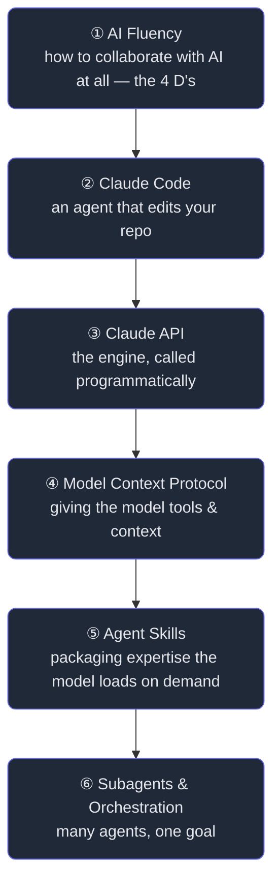

# The Claude Stack

> **You are reading this on a system built by the stack it teaches.** This site's content was
> written, refactored, and verified by an AI agent (Claude Code) running *in this repository* —
> using a `CLAUDE.md`, project hooks, two MCP servers, a skill, and fleets of subagents. That is
> not a coincidence; it is the curriculum. This book takes the six foundational courses of the
> Claude stack and re-teaches them **from first principles**, each idea grounded in real code and
> real workflows you can inspect right now — and where *we* haven't built something yet, we say so
> and design it. The destination: genuine fluency, and readiness for the **Claude Certified
> Architect (CCA)** exam.

## Why this book exists

Most "learn the AI stack" material is a tour of buttons: *here is the API, here is the config,
paste this.* You finish able to copy an example and stuck the moment reality differs. This book is
the opposite. Every chapter starts from a **problem** — *why does this thing exist at all?* — builds
the idea up from nothing, and only then shows the button. By the end you won't have memorised an
SDK; you'll understand the **shape of the whole stack** well enough to design with it.

And we have an unfair teaching advantage: **the textbook and the laboratory are the same object.**
When we explain Claude Code's permission model, we read *this repo's* `settings.json`. When we
explain MCP, we dissect *this repo's* two running MCP servers. When we explain subagents, we replay
the nine that wrote another book on this very site. Abstractions become concrete because you can
open the file.

## The arc

The stack is a ladder. Each rung assumes the one below it:

You *could* read these in any order, but the ladder is deliberate: fluency is the meta-skill that
makes the tools safe to use; Claude Code is the friendliest place to *see* an agent work; the API
is the engine underneath it; MCP is how that engine reaches the world; Skills are how you teach it;
and Subagents are how you scale it. Climb in order and each chapter pays off the last.

## What you'll be able to do

- **Collaborate** with Claude deliberately instead of hopefully — knowing *what* to delegate, *how*
  to describe it, how to *judge* the result, and how to stay *responsible* for it.
- **Drive Claude Code** as a power user: memory, tools, permissions, hooks, plan mode, worktrees,
  and the verify-everything loop.
- **Build on the Claude API**: messages, system prompts, structured output, tool use, streaming,
  caching, vision, and the token economics that decide your bill.
- **Extend any model with MCP**: design tools, resources, and prompts; choose a transport; build a
  server and a client; and secure them.
- **Package expertise as Skills** and know when a Skill beats an MCP server or a subagent.
- **Orchestrate Subagents** — fan-out, pipelines, verification panels — and reason about when *not* to.

## Mapping to the CCA exam

The **Claude Certified Architect — Foundations** exam tests whether you can *design and ship*
production Claude systems. Its weighted domains map cleanly onto this book:

| CCA domain (approx. weight) | Where it's covered |
|---|---|
| Agentic Architecture & Orchestration (~27%) | **Part 6** (Subagents), **Part 2** (Claude Code), **Part 1** (Delegation) |
| Prompt Engineering & Structured Output (~20%) | **Part 3** (API: system prompts, structured output, tools) |
| Tool Design & MCP Integration (~18%) | **Part 4** (MCP, end to end) |
| Context & Reliability (~15%) | **Part 3** (context, caching, errors), **Part 6** (verification) |
| Claude Code & developer workflows (remainder) | **Part 2** (Claude Code in Action) |

> The exam also covers the **Claude Agent SDK** and **deployment on Bedrock/Vertex**, which this
> edition treats as *further study* — flagged where relevant, with a pointer in the final capstone.
> Everything else you need for the Foundations exam is built here, from the ground up.

## How each chapter is built

The same skeleton every time, so you always know where you are: a one-line **TL;DR**, a real
**Motivation** story, an everyday **Analogy**, a precise **Formal** definition, a **Worked Example**
with diagrams, a hands-on **Build It**, **Trade-offs**, **Failure Modes**, **Practice** (with
collapsible answers), a **quiz**, and **In the Wild** links to the primary sources. Wherever the
stack touches our system, we read the real file. Wherever we haven't built it, we mark it
**GAP** and design it together — because knowing what you *haven't* done is half of architecture.

> 🚢 **Several GAPs are now closed.** When most of this book was written, Cortex used the Claude API
> nowhere, shipped no MCP server, and published no skill — each flagged as a **GAP** and designed as a
> capstone. Since then, the **[Cortex Tutor](/cortex/cortex-onboarding/cortex-tutor/what-the-tutor-is)** — a
> separate Socratic-coaching service — has *built* all three: it calls the **Claude API** for real (a Haiku
> gate + a streamed Sonnet coach), ships a real **MCP server** (`grounding_mcp`), and publishes a real
> **Agent Skill** (`socratic-tutor`). The GAP chapters keep their design-exercise value — and now each ends
> with a note on how the *real* thing turned out, which is the more honest lesson: you design, you build, and
> the building teaches you the design you actually needed.

---

**Begin:** before any tool, the meta-skill that makes every tool safe and productive — how to
collaborate with an intelligence that is neither a search engine nor a human. →
[Part 1 — AI Fluency](/cortex/the-claude-stack/ai-fluency)
